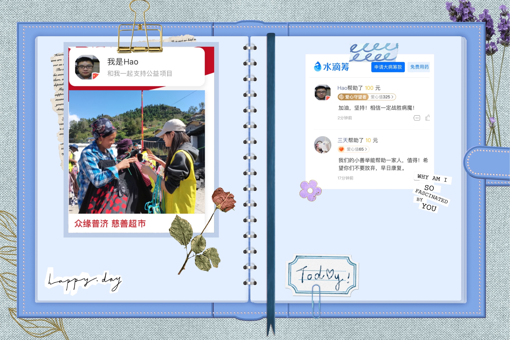
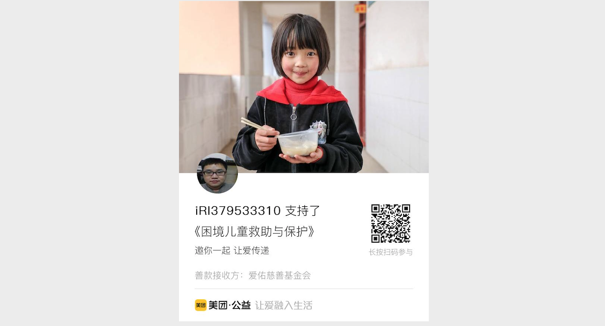
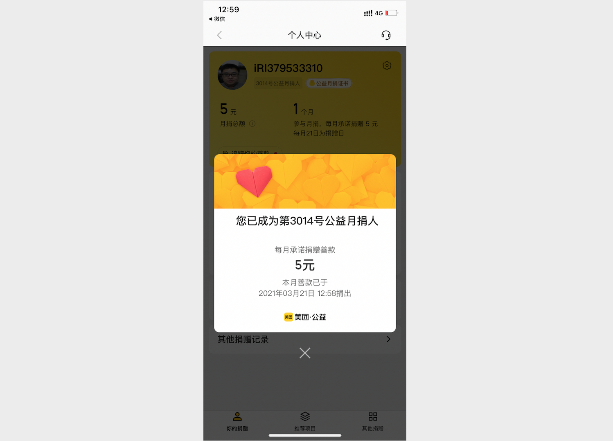
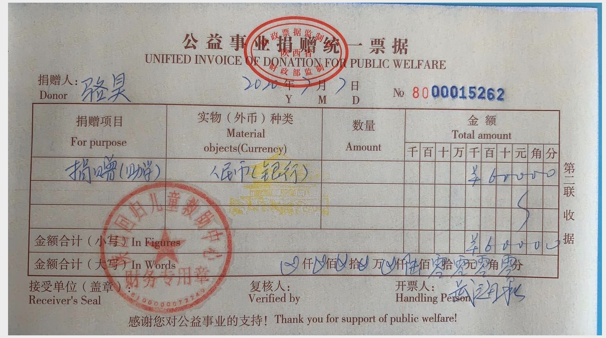
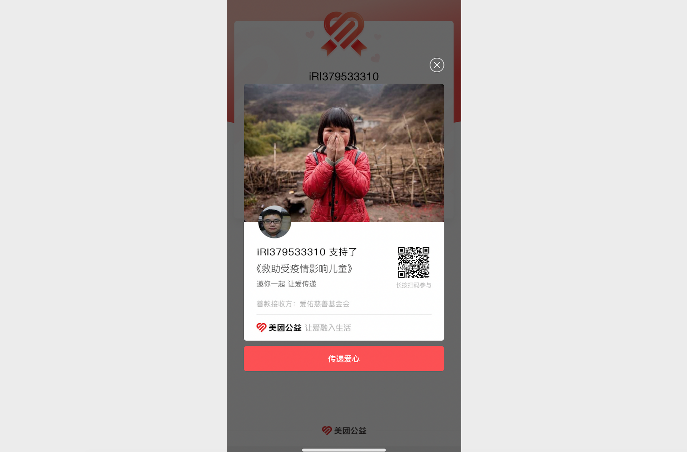
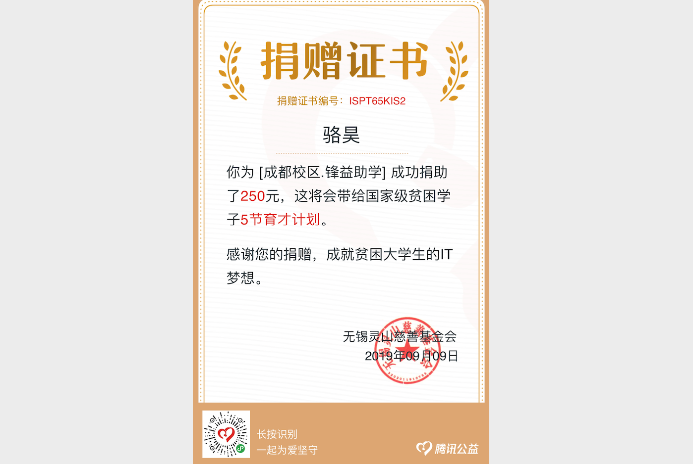
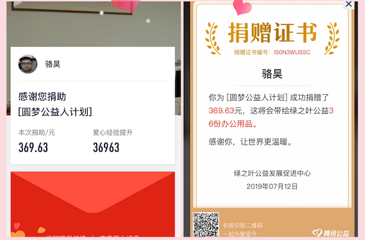

## Changelog

### January 11, 2022

1. Donate the recently received rewards to those in need through Shuidi Funding and Zhongyuan Puji Charity Promotion Association.

    

### November 22, 2021

1. Updated the documentation and code in the database section.
2. Fixed bugs in the documentation and code pointed out by netizens.
3. Updated the group information in the README file.

### October 7, 2021

1. Adjusted the project directory structure.
2. Updated the content of the data analysis section.

### March 28, 2021

1. I recently sorted out the data mining things, and I am ready to start writing documents.

2. The recently received tips will be donated to those in need through Meituan Public Welfare.

    

    

    

### October 3, 2020

1. Adjust the project directory structure.
2. Start the work of filling in the previous missing content and updating the last part.
3. Donate the recently received tips to those in need through platforms such as Shuidichou.

### July 12, 2020

1. Fixed some bugs in the documentation.

2. Updated the Django part of the documentation.

3. Donate the recently received tips to the Shaanxi Returned Children Relief Center.

    

### April 8, 2020

1. Re-created a repository named "Python-Core-50-Courses" with the content of the basic part (Day 1 to Day 15), and updated some of the content.

2. Updated README.md file.

3. Donate the recently received rewards through Tencent Charity to help "Children's Health Classroom".

   

### March 8, 2020

1. Updated some documents for the last 10 days.

2. Donate recent rewards to children affected by the epidemic through Meituan Public Welfare.

   

### March 1, 2020

1. Optimized some image resources in the project.
2. Updated some documents.

### September 23, 2019

1. It is planned to complete the update of the content from the 91st to the 100th day, including the latest Python interview question set, before the end of the National Day holiday.
2. Modified the content of the article "Strings and Common Data Structures" on day 7.

### September 15, 2019

1. Donate the income from WeChat rewards to national-level impoverished college students through Tencent Public Welfare.

   

2. Start updating and adjusting the content of Day 1 to Day 15.

3. Start sorting out the long-awaited "Python Interview Questions and Reference Answers".

### August 12, 2019

1. Published the article "Using Hexo to Build Your Own Blog".

### August 8, 2019

1. Recently, the company has arranged a lot of tasks, so this project has not been updated for a long time. Today, I finally updated the "Relational Database MySQL" that has been planned to be updated.
2. Yesterday, I received a tip for 48 consecutive days from the WeChat payment reminder. Thank you very much for your continued support.
3. Recently, I have been planning to record a supporting video for this project. Of course, it is conceivable that the workload is huge, but I still decided to start this project before the end of the year, so as to live up to so many hopes. This project for people who learn and understand Python.

### July 11, 2019

1. Today finally ended my business trip. When I came back, I donated all the tips I recently received to Green Leaf through the Tencent public welfare platform, and donated a total of 111 tips.

   

### July 9, 2019

1. Recently, the project has been in a state of suspension. Many beginners in the exchange group have reported that the content has been difficult since the 8th day. Recently, I planned to reorganize the basic part of the language and the crawler department. This time, I will try to make the text and cases more accessible and easier to understand. Practical, this matter has already started today, and the ultimate goal is to organize this part of the content into a book, I hope everyone can support it as always.
2. In the past week or so, I have received more than 60 tips, and I have received 14 tips in one day at most. I would like to thank you again for paying for knowledge. Of course, there is no need to pay for adding a communication group. You pay The fees will be used to support the education of children in the mountains.
3. Today I re-translated *Zen of Python*. I like this version myself, so I will share it with you.

### June 30, 2019

1. A total of 11 tips have been received in the last 2 days.
2. I finally updated the article "Separate Development of Front-End and Back-end" on the 48th day, but I feel a little suspicious of making up the numbers. I didn't bother to write the text description. You can refer to the code of the project to understand the separation of front-end and back-end development. Vue.js is used in the project, but no scaffolding tools are used, and front-end routing is not configured. Only Vue.js is used to render pages. After all, I am not a professional front-end.

### June 27, 2019

1. A total of 35 tips have been received in the last 3 days. Thank you for your continued attention.
2. There are a lot of things happening recently, and the update speed may be slowed down, please understand.
3. The information related to the open class tonight has been updated to the open class catalog.

### June 23, 2019

1. A total of 25 tips have been received in the past few days. Thank you for your support.
2. Updated the QQ exchange group and recreated a crowd of 2000.

### June 18, 2019

1. At the suggestion of a friend, I added a QR code to the homepage to see how many are willing to pay for knowledge. Today, I received a total of 7 tips from my friends. I would like to express my gratitude here. All the income from the tips will be donated through the Tencent public welfare platform.
2. The Django part (day 41 to day 55) was updated to day 47. The latest online part includes reports, logs, ORM query optimization and middleware-related content, and the completion code of the voting application is synchronized to github.