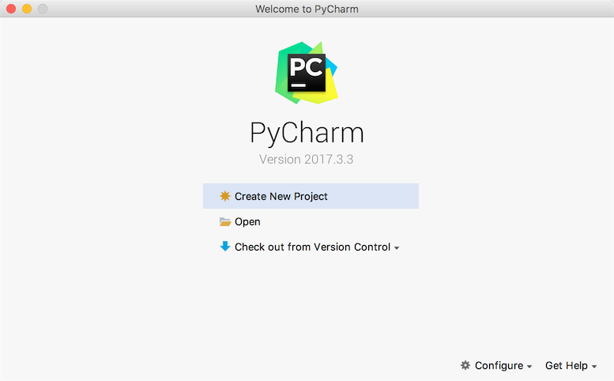

## Getting to know Python

### Introduction to Python

#### History of Python

1. Christmas 1989: Guido von Rossum started writing a compiler for the Python language.
2. February 1991: The first Python compiler (also an interpreter) was born, which was implemented in C language (later) and could call library functions in C language. In the earliest version, Python has provided support for building blocks such as "class", "function", "exception handling", as well as core data types such as lists and dictionaries, and supports building applications based on modules. .
3. January 1994: Python 1.0 was officially released.
4. October 16, 2000: Python 2.0 released, adding full [garbage collection](https://en.wikipedia.org/wiki/%E5%9E%83%E5%9C%BE%E5%9B %9E%E6%94%B6_(%E8%A8%88%E7%AE%97%E6%A9%9F%E7%A7%91%E5%AD%B8)), provides a reference to [Unicode](https ://en.wikipedia.org/wiki/Unicode) support. At the same time, the entire development process of Python is more transparent, the influence of the community on the development progress is gradually expanding, and the ecosystem is slowly forming.
5. December 3, 2008: Python 3.0 was released. It is not fully compatible with the previous Python code, but because many companies still use the Python 2.x version in their projects and operations, the Python 3.x Many new features were later ported to Python 2.6/2.7.

The version of Python 3.7.x I am currently using was released in 2018. The version number of Python is divided into three segments, like A.B.C. Among them, A represents the major version number. Generally, when the whole is rewritten, or there are changes that are not backward compatible, A is added; B is a function update, and B is added when new functions appear; C is a small change (for example: repairing a certain bug), and C is added whenever there is a modification. If you are interested in the history of Python, you can read an online article named ["A Brief History of Python"](http://www.cnblogs.com/vamei/archive/2013/02/06/2892628.html).

#### The pros and cons of Python

There are many advantages of Python, which can be summarized as follows.

1. Simple and clear, low learning curve, easier to use than many programming languages.
2. Open source, with a strong community and ecosystem, especially in the fields of data analysis and machine learning.
3. An interpreted language is inherently platform portable, and the code can work on different operating systems.
4. Both mainstream programming paradigms (object-oriented programming and functional programming) are supported.
5. The code is highly standardized and readable, suitable for people with code cleanliness and obsessive-compulsive disorder.

The shortcomings of Python are mainly concentrated in the following points.

1. The execution efficiency is slightly lower, and the parts that require high execution efficiency can be written in other languages ​​(such as C, C++).
2. The code cannot be encrypted, but now many companies do not sell software but sell services, this problem will be weakened.
3. There are too many frameworks to choose from during development (for example, there are more than 100 Web frameworks), and there are mistakes where there are choices.

#### Python application areas

Currently, Python is widely used in web application back-end development, cloud infrastructure construction, DevOps, network data collection (crawlers), automated testing, data analysis, machine learning and other fields.

### Install the Python interpreter

If you want to start your Python programming journey, you must first install the Python interpreter environment on your computer. The following will take installing the official Python interpreter as an example to explain how to install the Python environment on different operating systems. The official Python interpreter is implemented in C language and is the most widely used Python interpreter, usually called CPython. In addition, the Python interpreter also includes Jython implemented by Java language, IronPython implemented by C# language, and versions such as PyPy, Brython, and Pyston. Interested readers can understand by themselves.

#### Windows Environment

You can download the Python Windows installer (exe file) from the [Python official website](https://www.python.org). It should be noted that if you install Python 3.x in the Windows 7 environment, you need to install the Service first. Pack 1 patch package (can be installed through the function of automatically installing system patches through some tool software), it is recommended to check "Add Python 3.x to PATH" (add Python 3.x to the PATH environment variable) and select custom during the installation process Installation, in the "Optional Features" interface, it is best to check "pip", "tcl/tk", "Python test suite" and other items. It is strongly recommended to choose a custom installation path and ensure that there is no Chinese in the path. When the installation is complete, you will see a "Setup was successful" prompt. If the Python interpreter fails to work due to missing some dynamic link library files when running the Python program later, you can solve it according to the following methods.

If the system shows that the api-ms-win-crt\*.dll file is missing, you can refer to ["Analysis and Solutions for Missing api-ms-win-crt\*.dll"](<https://zhuanlan.zhihu. com/p/32087135>) or directly download the Visual C++ Redistributable for Visual Studio 2015 files for repair; if some dynamic link library files are missing after updating Windows DirectX, you can download a [DirectX Repair Tool](<https://dl.pconline.com.cn/download/360074 -1.html>) to fix.

#### Linux environment

The Linux environment comes with Python 2.x version, but if you want to update to the 3.x version, you can download the source code of Python at [Python's official website](https://www.python.org) and pass the source code Install by building and installing. The specific steps are as follows (take CentOS as an example).

1. Install dependent libraries (because without these dependent libraries, the source code component installation may fail due to missing underlying dependent libraries).

```Shell
yum -y install wget gcc zlib-devel bzip2-devel openssl-devel ncurses-devel sqlite-devel readline-devel tk-devel gdbm-devel db4-devel libpcap-devel xz-devel libffi-devel
````

2. Download the Python source code and extract it to the specified directory.

```Shell
wget https://www.python.org/ftp/python/3.7.6/Python-3.7.6.tar.xz
xz -d Python-3.7.6.tar.xz
tar -xvf Python-3.7.6.tar
````

3. Change to the Python source code directory and execute the following commands to configure and install.

```Shell
cd Python-3.7.6
./configure --prefix=/usr/local/python37 --enable-optimizations
make && make install
````

4. Modify the file named .bash_profile in the user's home directory, configure the PATH environment variable and make it effective.

```Shell
cd ~
vim.bash_profile
````

```Shell
# ... the above code is omitted here ...

export PATH=$PATH:/usr/local/python37/bin

# ... The following code is omitted here ...
````

5. Activate the environment variable.

```Shell
source .bash_profile
````

#### macOS environment

macOS also comes with Python 2.x version, you can install Python 3.x version through the installation file (pkg file) provided by [Python official website](https://www.python.org). After the default installation is complete, you can start the 2.x version of the Python interpreter by executing the `python` command in the terminal. To start the 3.x version of the Python interpreter, you need to execute the `python3` command.

### Run the Python program

#### Confirm the version of Python

You can type the following commands at the Windows command line prompt.

```Shell
python --version
````
Type the command below in a terminal on a Linux or macOS system.

```Shell
python3 --version
````

Of course, you can also enter `python` or `python3` to enter the interactive environment, and then execute the following code to check the version of Python.

````Python
import sys

print(sys.version_info)
print(sys.version)
````

#### Writing Python source code

You can use text editing tools (recommended to use advanced text editing tools such as [Sublime](<https://www.sublimetext.com/>), [Visual Studio Code](<https://code.visualstudio.com/>) ) to write the Python source code and save the file with py as the suffix. The content of the code is as follows.

````Python
print('hello, world!')
````

#### run the program

Change to the directory where the source code is located and execute the following command to see if "hello, world!" is printed on the screen.

```Shell
python hello.py
````

or

```Shell
python3 hello.py
````

#### Comments in code

Comments are an important part of programming languages. They are used to explain the function of the code in the source code to enhance the readability and maintainability of the program. Of course, the code segments in the source code that do not need to be run can also be removed through comments. , which is often used when debugging programs. Comments are removed when entering the preprocessor or compiling with the source code, they are not retained in the object code and do not affect the execution result of the program.

1. Single-line comments - sections beginning with # and a space
2. Multi-line comments - start with three quotes, end with three quotes

````Python
"""
First Python program - hello, world!
Tribute to the great Mr. Dennis M. Ritchie

Version: 0.1
Author: Luo Hao
"""
print('hello, world!')
# print("Hello, world!")
````

### Python Development Tools

#### IDLE - comes with integrated development tools

IDLE is an integrated development tool that comes with the Python environment installed, as shown in the following figure. But because IDLE's user experience is not so good, it is rarely adopted in actual development.


#### IPython - better interactive programming tool

IPython is a Python-based interactive interpreter. Compared with the native Python interactive environment, IPython provides more powerful editing and interaction functions. You can install IPython through the Python package management tool pip. The specific operations are as follows.

```Shell
pip install ipython
````

or

```Shell
pip3 install ipython
````

After the installation is successful, you can start IPython through the following ipython command, as shown in the following figure.


#### Sublime Text - Advanced Text Editor


- First you can install Sublime Text 3 or Sublime Text 2 by downloading the installer from the [official website](https://www.sublimetext.com/).

- Install package management tools.
  1. Open the console via the shortcut key Ctrl+` or select Show Console in the View menu, and enter the following code.

  -Sublime 3

  ````Python
  import urllib.request,os;pf='Package Control.sublime-package';ipp=sublime.installed_packages_path();urllib.request.install_opener(urllib.request.build_opener(urllib.request.ProxyHandler()));open( os.path.join(ipp,pf),'wb').write(urllib.request.urlopen('http://sublime.wbond.net/'+pf.replace(' ','%20')) .read())
  ````
  - Sublime 2

  ````Python
  import urllib2,os;pf='Package Control.sublime-package';ipp=sublime.installed_packages_path();os.makedirs(ipp)ifnotos.path.exists(ipp)elseNone;urllib2.install_opener(urllib2.build_opener(urllib2. ProxyHandler()));open(os.path.join(ipp,pf),'wb').write(urllib2.urlopen('http://sublime.wbond.net/'+pf.replace(' ', '%20')).read());print('Please restart Sublime Text to finish installation')
  ````
  2. Enter https://sublime.wbond.net/Package%20Control.sublime-package in the browser to download the installation package of the package management tool, and find the directory named &quot;Installed Packages&quot; under the installation Sublime directory, put the Add the downloaded file to this file, then restart Sublime Text and you're done.


- Install plugins. Open the command panel through the Package Control of the Preference menu or the shortcut key Ctrl+Shift+P, enter Install Package in the panel, you can find the tool to install the plug-in, and then find the required plug-in. We recommend that you install the following plugins:

  - SublimeCodeIntel - Code completion tool plugin.
  - Emmet - Front-end development code template plugin.
  - Git - Version control tool plugin.
  - Python PEP8 Autoformat - PEP8 specification autoformat plugin.
  - ConvertToUTF8 - Convert the local encoding to UTF-8.

> **Note**: Actually [Visual Studio Code](<https://code.visualstudio.com/>) may be a better choice, it costs nothing and provides more complete and powerful features, Interested readers can do their own research.

#### PyCharm - Python development artifact

The installation, configuration and use of PyCharm are introduced in ["Playing with PyCharm"] (../Extras/Playing with PyCharm.md), and interested readers can choose to read.



### practise

1. Enter the following code in the Python interactive environment and view the result, please try to translate what you see into Chinese.

    ````Python
    import this
    ````

    > **Description**: Enter the above code, you can see the ["Zen of Python"](../Zen of Python.md) written by Tim Peter in the interactive environment of Python, which tells not only the truth Works for Python, but also for other programming languages.

2. Learn to use turtle to draw graphics on the screen.

    > **Description**: turtle is a very interesting module built into Python, especially suitable for small partners who have first experience in computer programming. It was first part of the Logo language, which was invented by Wally Feurzig and Seymour Papert in 1966 programming language.

    ````Python
    import turtle
    
    turtle.pensize(4)
    turtle.pencolor('red')
    
    turtle.forward(100)
    turtle.right(90)
    turtle.forward(100)
    turtle.right(90)
    turtle.forward(100)
    turtle.right(90)
    turtle.forward(100)
    
    turtle.mainloop()
    ````

    > **Tips**: The code provided in this chapter also includes the code for drawing the national flag and drawing Peppa Pig. Interested readers should study it by themselves.
