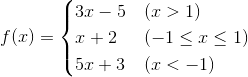

## branch structure

### Application scenarios

So far, the Python code we have written has been executed sequentially one by one, and this code structure is often referred to as a sequential structure. However, only the sequential structure can not solve all problems. For example, we design a game. The clearance condition of the first level of the game is that the player obtains 1000 points. After completing the game, we have to decide whether to enter the first stage according to the score obtained by the player. In the second level, tell the player "Game Over", there will be two branches, and only one of these two branches will be executed. There are many similar scenarios, we call this structure "branch structure" or "selection structure". Give everyone a minute, you should be able to think of at least 5 such examples, and give it a try.

### Use of if statement

In Python, the `if`, `elif` and `else` keywords can be used to construct branching structures. The so-called **keywords** are words with special meanings, such as `if` and `else` are keywords specially used to construct branch structures, obviously you can't use it as a variable name (in fact, used for other identifier is not allowed). The following example demonstrates how to construct a branch structure.

````Python
"""
User authentication

Version: 0.1
Author: Luo Hao
"""
username = input('Please enter username: ')
password = input('Please enter the password: ')
# If the username is admin and the password is 123456, the authentication is successful, otherwise the authentication fails
if username == 'admin' and password == '123456':
    print('Authentication successful!')
else:
    print('Authentication failed!')
````

It should be noted that unlike C/C++, Java and other languages, Python does not use curly braces to construct code blocks, but uses indentation to represent the code hierarchy**, if the `if` condition is true If you need to execute multiple statements, just keep multiple statements with the same indentation. In other words, if **continuous code maintains the same indentation, they belong to the same code block**, which is equivalent to a whole of execution. **Indentation** can use any number of spaces, but **usually use 4 spaces**, it is recommended that you **do not use the tab key** or **set your code editing tool to automatically change the tab key to into 4 spaces**.

Of course, if you want to construct more branches, you can use the `if...elif...else...` structure or the nested `if...else...` structure, the following code demonstrates how to use The multi-branch structure implements piecewise function evaluation.



````Python
"""
piecewise function evaluation

        3x - 5 (x > 1)
f(x) = x + 2 (-1 <= x <= 1)
        5x + 3 (x < -1)

Version: 0.1
Author: Luo Hao
"""

x = float(input('x = '))
if x > 1:
    y = 3 * x - 5
elif x >= -1:
    y = x + 2
else:
    y = 5 * x + 3
print('f(%.2f) = %.2f' % (x, y))
````

Of course, according to the actual development needs, the branch structure can be nested. For example, after judging whether to clear the customs, you should also give a grade to your performance according to the number of treasures or props you get (such as lighting up two or three stars), Then we need to construct a new branch structure inside `if`. Similarly, new branches can also be constructed in `elif` and `else`. We call it a nested branch structure, which means the above The code can also be written as follows.

````Python
"""
piecewise function evaluation
3x - 5 (x > 1)
f(x) = x + 2 (-1 <= x <= 1)
5x + 3 (x < -1)

Version: 0.1
Author: Luo Hao
"""

x = float(input('x = '))
if x > 1:
    y = 3 * x - 5
else:
    if x >= -1:
        y = x + 2
    else:
        y = 5 * x + 3
print('f(%.2f) = %.2f' % (x, y))
````

> **Description:** You can feel for yourself which of the two writing methods is better. In the Zen of Python we mentioned earlier, there is such a sentence "Flat is better than nested." The reason why the code is "flattened" is because the nested structure has more nesting levels, which will seriously affect the code availability. Readability, so don't use nesting when you can use a flat structure.

### practise

#### Exercise 1: Interchange the imperial units of inches with the metric units of centimeters.

Reference answer:

````Python
"""
Swap between imperial inches and metric centimeters

Version: 0.1
Author: Luo Hao
"""
value = float(input('Please enter the length: '))
unit = input('Please enter the unit: ')
if unit == 'in' or unit == 'inch':
    print('%f inches = %f cm' % (value, value * 2.54))
elif unit == 'cm' or unit == 'cm':
    print('%f cm = %f inches' % (value, value / 2.54))
else:
    print('Please enter a valid unit')
````
#### Exercise 2: Converting percentile grades to graded grades.

> **Requirements**: If the input score is above 90 points (including 90 points), output A; 80-90 points (excluding 90 points) output B; 70-80 points (excluding 80 points) output C ; 60-70 points (excluding 70 points) output D; 60 points or less output E.

Reference answer:

````Python
"""
Conversion of percentile grades to graded grades

Version: 0.1
Author: Luo Hao
"""
score = float(input('Please enter the score: '))
if score >= 90:
    grade = 'A'
elif score >= 80:
    grade = 'B'
elif score >= 70:
    grade = 'C'
elif score >= 60:
    grade = 'D'
else:
    grade = 'E'
print('The corresponding grade is:', grade)
````
#### Exercise 3: Enter the lengths of the three sides, and calculate the perimeter and area if they can form a triangle.

Reference answer:

````Python
"""
Determine whether the input side length can form a triangle, and if so, calculate the perimeter and area of ​​the triangle

Version: 0.1
Author: Luo Hao
"""
a = float(input('a = '))
b = float(input('b = '))
c = float(input('c = '))
if a + b > c and a + c > b and b + c > a:
    print('Perimeter: %f' % (a + b + c))
    p = (a + b + c) / 2
    area = (p * (p - a) * (p - b) * (p - c)) ** 0.5
    print('Area: %f' % (area))
else:
    print('Cannot form a triangle')
````
> **Note:** The formula used above to calculate the area of ​​a triangle by the length of its sides is called [Heron's formula](https://zh.wikipedia.org/zh-hans/Heron's formula).
