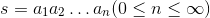

## Strings and common data structures

### Using strings

The Second World War prompted the birth of modern electronic computers. Initially, computers were used in the calculation of missile ballistics. For many years after the birth of computers, the information processed by computers was basically numerical information. The world's first electronic computer is called ENIAC (Electronic Numerical Integrator Computer), which was born at the University of Pennsylvania in the United States and can perform about 5,000 floating-point operations per second. Over time, although numerical operations are still one of the most important things in the day-to-day work of computers, more data processed by today's computers may exist in the form of text, if we want to manipulate these through Python programs Text information, you must first understand the string type and its related knowledge.

The so-called **string** is a finite sequence consisting of zero or more characters, generally recorded as . In a Python program, if we enclose single or multiple characters with single or double quotes, we can represent a string.

````Python
s1 = 'hello, world!'
s2 = "hello, world!"
# Strings starting with three double or single quotes can be wrapped
s3 = """
hello,
world!
"""
print(s1, s2, s3, end='')
````

You can use `\` (backslash) in a string to express escape, that is to say, the character after `\` is no longer its original meaning, for example: `\n` does not represent backslash and character n , but a newline; and `\t` does not represent a backslash and the character t, but a tab. So if you want to express `'` in a string, you should write it as `\'`, and the ideal expression `\` should be written as `\\`. You can run the code below to see what will be output.

````Python
s1 = '\'hello, world!\''
s2 = '\n\\hello, world!\\\n'
print(s1, s2, end='')
````

After `\`, it can also be followed by an octal or hexadecimal number to represent a character. For example, `\141` and `\x61` both represent the lowercase letter `a`, the former is octal notation, the latter is hexadecimal notation decimal notation. You can also use the Unicode character code after `\` to represent the character, for example `\u9a86\u660a` represents the Chinese "Luo Hao". Run the code below and see what's output.

````Python
s1 = '\141\142\143\x61\x62\x63'
s2 = '\u9a86\u660a'
print(s1, s2)
````

If we don't want the `\` in the string to mean escaping, we can explain it by prefixing the string with the letter `r`, and see what the following code outputs.

````Python
s1 = r'\'hello, world!\''
s2 = r'\n\\hello, world!\\\n'
print(s1, s2, end='')
````

Python provides a very rich set of operators for string types. We can use the `+` operator to concatenate strings, use the `*` operator to repeat the content of a string, and use `in` and ` not in` to determine whether a string contains another string (member operation), we can also use `[]` and `[:]` operators to extract a character or some characters from a string (slicing operation) , the code is shown below.

````Python
s1 = 'hello' * 3
print(s1) # hello hello hello
s2 = 'world'
s1 += s2
print(s1) # hello hello hello world
print('ll' in s1) # True
print('good' in s1) # False
str2 = 'abc123456'
# Extract the character at the specified position from the string (subscript operation)
print(str2[2]) # c
# String slice (from the specified start index to the specified end index)
print(str2[2:5]) # c12
print(str2[2:]) # c123456
print(str2[2::2]) # c246
print(str2[::2]) # ac246
print(str2[::-1]) # 654321cba
print(str2[-3:-1]) # 45
````

In Python, we can also complete the processing of strings through a series of methods, the code is as follows.

````Python
str1 = 'hello, world!'
# Calculate the length of the string using the built-in function len
print(len(str1)) #13
# get a capitalized copy of the first letter of the string
print(str1.capitalize()) # Hello, world!
# Get a capitalized copy of each word in the string
print(str1.title()) # Hello, World!
# Get the uppercase copy of the string
print(str1.upper()) # HELLO, WORLD!
# Find the position of the substring in the string
print(str1.find('or')) #8
print(str1.find('shit')) # -1
# Similar to find but throws an exception when no substring is found
# print(str1.index('or'))
# print(str1.index('shit'))
# Check if the string starts with the specified string
print(str1.startswith('He')) # False
print(str1.startswith('hel')) # True
# Check if the string ends with the specified string
print(str1.endswith('!')) # True
# Center the string with the specified width and pad the specified characters on both sides
print(str1.center(50, '*'))
# Place the string on the right with the specified width and pad the specified characters on the left
print(str1.rjust(50, ' '))
str2 = 'abc123456'
# Check if the string consists of numbers
print(str2.isdigit()) # False
# Check if the string consists of letters
print(str2.isalpha()) # False
# Check if the string consists of numbers and letters
print(str2.isalnum()) # True
str3 = 'jackfrued@126.com'
print(str3)
# Get a copy of the string after trimming left and right spaces
print(str3.strip())
````

As we said before, the output string can be formatted in the following way.

````Python
a, b = 5, 10
print('%d * %d = %d' % (a, b, a * b))
````

Of course, we can also use the methods provided by the string to complete the format of the string, the code is as follows.

````Python
a, b = 5, 10
print('{0} * {1} = {2}'.format(a, b, a * b))
````

After Python 3.6, there is a more concise way of writing format strings, which is to add the letter `f` before the string. We can use the following syntactic sugar to simplify the above code.

````Python
a, b = 5, 10
print(f'{a} * {b} = {a * b}')
````

In addition to strings, Python also has built-in various types of data structures. If you want to save and manipulate data in a program, you can use existing data structures to implement it in most cases. The most commonly used ones include lists, tuples, sets and dictionary.

### Using lists

I don't know if you have noticed that there are some differences between the string type (`str`) we talked about earlier and the numeric types (`int` and `float`) we talked about earlier. Numeric types are scalar types, which means that objects of this type have no internal structure that can be accessed; while string types are structured, non-scalar types, so they have a series of properties and methods. The list (`list`) that we will introduce next is also a structured, non-scalar type. It is an ordered sequence of values. Each value can be identified by an index. Defining a list can place the elements of the list in In `[]`, multiple elements are separated by `,`, you can use the `for` loop to traverse the list elements, or you can use the `[]` or `[:]` operator to take out one of the list or multiple elements.

The following code demonstrates how to define a list, how to traverse a list, and perform subscripting operations on lists.

````Python
list1 = [1, 3, 5, 7, 100]
print(list1) # [1, 3, 5, 7, 100]
# Multiplication sign indicates repetition of list elements
list2 = ['hello'] * 3
print(list2) # ['hello', 'hello', 'hello']
# Calculate the length of the list (number of elements)
print(len(list1)) #5
# Subscript (index) operation
print(list1[0]) # 1
print(list1[4]) # 100
# print(list1[5]) # IndexError: list index out of range
print(list1[-1]) # 100
print(list1[-3]) #5
list1[2] = 300
print(list1) # [1, 3, 300, 7, 100]
# Loop through list elements with subscripts
for index in range(len(list1)):
    print(list1[index])
# Loop through the list elements through a for loop
for elem in list1:
    print(elem)
# After processing the list through the enumerate function, then traversing can get the element index and value at the same time
for index, elem in enumerate(list1):
    print(index, elem)
````

The following code demonstrates how to add elements to a list and how to remove elements from a list.

````Python
list1 = [1, 3, 5, 7, 100]
# add element
list1.append(200)
list1.insert(1, 400)
# merge two lists
# list1.extend([1000, 2000])
list1 += [1000, 2000]
print(list1) # [1, 400, 3, 5, 7, 100, 200, 1000, 2000]
print(len(list1)) #9
# First judge whether the element is in the list by member operation, and delete the element if it exists
if 3 in list1:
list1.remove(3)
if 1234 in list1:
    list1.remove(1234)
print(list1) # [1, 400, 5, 7, 100, 200, 1000, 2000]
# remove element from specified position
list1.pop(0)
list1.pop(len(list1) - 1)
print(list1) # [400, 5, 7, 100, 200, 1000]
# clear list elements
list1.clear()
print(list1) # []
````

Like strings, lists can also be sliced. Through slice operations, we can copy the list or take a part of the list to create a new list. The code is as follows.

````Python
fruits = ['grape', 'apple', 'strawberry', 'waxberry']
fruits += ['pitaya', 'pear', 'mango']
# list slice
fruits2 = fruits[1:4]
print(fruits2) # apple strawberry waxberry
# The list can be copied by a full slicing operation
fruits3 = fruits[:]
print(fruits3) # ['grape', 'apple', 'strawberry', 'waxberry', 'pitaya', 'pear', 'mango']
fruits4 = fruits[-3:-1]
print(fruits4) # ['pitaya', 'pear']
# A copy of the reversed list can be obtained by reverse slicing
fruits5 = fruits[::-1]
print(fruits5) # ['mango', 'pear', 'pitaya', 'waxberry', 'strawberry', 'apple', 'grape']
````

The following code implements the sorting operation on the list.

````Python
list1 = ['orange', 'apple', 'zoo', 'internationalization', 'blueberry']
list2 = sorted(list1)
# The sorted function returns a sorted copy of the list without modifying the passed list
# The design of the function should be like the sorted function as much as possible without side effects
list3 = sorted(list1, reverse=True)
# Specify sorting by string length instead of the default alphabetical order via the key keyword argument
list4 = sorted(list1, key=len)
print(list1)
print(list2)
print(list3)
print(list4)
# Send a sort message to the list object to sort directly on the list object
list1.sort(reverse=True)
print(list1)
````

### Generations and generators

We can also use the generative syntax for lists to create lists as shown below.

````Python
f = [x for x in range(1, 10)]
print(f)
f = [x + y for x in 'ABCDE' for y in '1234567']
print(f)
# Create a list container using the make-expression syntax for lists
# After the list is created with this syntax, the elements are ready, so it takes more memory space
f = [x ** 2 for x in range(1, 1000)]
print(sys.getsizeof(f)) # View the number of bytes of memory occupied by the object
print(f)
# Note that the code below creates not a list but a generator object
# The data can be obtained through the generator but it does not take up extra space to store the data
# Get data through internal operations every time data is needed (it takes extra time)
f = (x ** 2 for x in range(1, 1000))
print(sys.getsizeof(f)) # Compared to generative generators, it does not take up space to store data
print(f)
for val in f:
    print(val)
````

In addition to the generator syntax mentioned above, there is another way to define generators in Python, which is to transform an ordinary function into a generator function through the `yield` keyword. The following code demonstrates how to implement a generation [Fibonacci sequence](https://en.wikipedia.org/wiki/%E6%96%90%E6%B3%A2%E9%82%A3%E5% A5%91%E6%95%B0%E5%88%97) generator. The so-called Fibonacci sequence can be defined by the following [recursion](https://zh.wikipedia.org/wiki/%E9%80%92%E5%BD%92) method:


````Python
def fib(n):
    a, b = 0, 1
    for _ in range(n):
        a, b = b, a + b
        yield a


def main():
    for val in fib(20):
        print(val)


if __name__ == '__main__':
    main()
````

### Using tuples

A tuple in Python is similar to a list and is also a container data type. A variable (object) can be used to store multiple data. The difference is that the elements of the tuple cannot be modified. We have used it more than once in the previous code. tuple too. As the name suggests, we combine multiple elements together to form a tuple, so it can hold multiple pieces of data just like a list. The following code demonstrates how to define and use tuples.

````Python
# define a tuple
t = ('Luo Hao', 38, True, 'Chengdu, Sichuan')
print(t)
# Get the elements in the tuple
print(t[0])
print(t[3])
# loop over the values ​​in the tuple
for member in t:
    print(member)
# reassign the tuple
# t[0] = 'The King's Hammer' # TypeError
# The variable t re-references the new tuple The original tuple will be garbage collected
t = ('Wang Dachui', 20, True, 'Yunnan Kunming')
print(t)
# Convert tuple to list
person = list(t)
print(person)
# A list can modify its elements
person[0] = 'Bruce Bruce'
person[1] = 25
print(person)
# Convert list to tuple
fruits_list = ['apple', 'banana', 'orange']
fruits_tuple = tuple(fruits_list)
print(fruits_tuple)
````

There is a very worthwhile question here. We already have a data structure like a list, why do we need a type like a tuple?

1. The elements in the tuple cannot be modified. In fact, we especially [multi-threading] in the project (https://zh.wikipedia.org/zh-hans/%E5%A4%9A%E7%BA% BF%E7%A8%8B) environment (which will be discussed later) may prefer to use those immutable objects (on the one hand, because the object state cannot be modified, it can avoid unnecessary program errors caused by it, simple It is said that an immutable object is easier to maintain than a mutable object; on the other hand, because no thread can modify the internal state of the immutable object, an immutable object is automatically thread-safe, which saves processing Synchronization overhead. An immutable object can easily be shared). So the conclusion is: if you don't need to add, delete, or modify elements, you can consider using tuples. Of course, if a method needs to return multiple values, using tuples is also a good choice.
2. Tuples are better than lists in terms of creation time and space. We can use the getsizeof function of the sys module to check how much memory each tuple and list store the same element occupies, which is easy to do. We can also use the magic command %timeit in ipython to analyze the time it takes to create tuples and lists of the same content. The following figure is the result of testing on my macOS system.


### Using collections

The set in Python is consistent with the mathematical set, no duplicate elements are allowed, and operations such as intersection, union, and difference can be performed.


Collections can be created and used as shown in the code below.

````Python
# Literal syntax for creating a collection
set1 = {1, 2, 3, 3, 3, 2}
print(set1)
print('Length =', len(set1))
# Constructor syntax for creating a collection (the object-oriented part will be explained in detail)
set2 = set(range(1, 10))
set3 = set((1, 2, 3, 3, 2, 1))
print(set2, set3)
# comprehension syntax for creating sets (comprehensions can also be used to deduce sets)
set4 = {num for num in range(1, 100) if num % 3 == 0 or num % 5 == 0}
print(set4)
````

Add elements to and remove elements from a collection.

````Python
set1.add(4)
set1.add(5)
set2.update([11, 12])
set2.discard(5)
if 4 in set2:
    set2.remove(4)
print(set1, set2)
print(set3.pop())
print(set3)
````

Operations such as membership, intersection, union, and difference of sets.

````Python
# Intersection, union, difference, and symmetric difference operations of sets
print(set1 & set2)
# print(set1.intersection(set2))
print(set1 | set2)
# print(set1.union(set2))
print(set1 - set2)
# print(set1.difference(set2))
print(set1^set2)
# print(set1.symmetric_difference(set2))
# Determine the subset and superset
print(set2 <= set1)
# print(set2.issubset(set1))
print(set3 <= set1)
# print(set3.issubset(set1))
print(set1 >= set2)
# print(set1.issuperset(set2))
print(set1 >= set3)
# print(set1.issuperset(set3))
````

> **Note:** Python allows some special methods to customize operators for a certain type or data structure (will be discussed in later chapters). In the above code, we can call when we operate on sets The method of the collection object can also directly use the corresponding operator. For example, the `&` operator has the same function as the intersection method, but using the operator makes the code more intuitive.

### Using a dictionary

The dictionary is another mutable container model. The dictionary in Python is the same as the dictionary we use in our lives. It can store objects of any type. Unlike lists and sets, each element of the dictionary is composed of a A "key-value pair" consisting of a key and a value, separated by a colon. The following code demonstrates how to define and use a dictionary.

````Python
# literal syntax for creating a dictionary
scores = {'Luo Hao': 95, 'Bai Yuanfang': 78, 'Di Renjie': 82}
print(scores)
# Constructor syntax for creating a dictionary
items1 = dict(one=1, two=2, three=3, four=4)
# Compress the two sequences into a dictionary with the zip function
items2 = dict(zip(['a', 'b', 'c'], '123'))
# Deductive syntax for creating a dictionary
items3 = {num: num ** 2 for num in range(1, 10)}
print(items1, items2, items3)
# Get the corresponding value in the dictionary by key
print(scores['Luo Hao'])
print(scores['Di Renjie'])
# Iterate over all key-value pairs in the dictionary
for key in scores:
    print(f'{key}: {scores[key]}')
# update the elements in the dictionary
scores['Bai Yuanfang'] = 65
scores['Zhuge Wanglang'] = 71
scores.update(cold noodles=67, Fang Qihe=85)
print(scores)
if 'Wu Zetian' in scores:
    print(scores['Wu Zetian'])
print(scores.get('Wu Zetian'))
# The get method also gets the corresponding value through the key but can set the default value
print(scores.get('Wu Zetian', 60))
# remove element from dictionary
print(scores.popitem())
print(scores.popitem())
print(scores.pop('Luo Hao', 100))
# clear the dictionary
scores.clear()
print(scores)
````

### practise

#### Exercise 1: Display the marquee text on the screen.

Reference answer:

````Python
import os
import time


def main():
    content = 'Beijing welcomes you to open up the world for you...'
    while True:
        # Clean up output on screen
        os.system('cls') # os.system('clear')
        print(content)
        # sleep for 200ms
        time.sleep(0.2)
        content = content[1:] + content[0]


if __name__ == '__main__':
    main()
````

#### Exercise 2: Design a function to generate a verification code of a specified length, which consists of uppercase and lowercase letters and numbers.

Reference answer:

````Python
import random


def generate_code(code_len=4):
    """
    Generate verification code of specified length

    :param code_len: the length of the verification code (default 4 characters)

    :return: A random verification code consisting of uppercase and lowercase English letters and numbers
    """
    all_chars = '0123456789abcdefghijklmnopqrstuvwxyzABCDEFGHIJKLMNOPQRSTUVWXYZ'
    last_pos = len(all_chars) - 1
    code = ''
    for _ in range(code_len):
        index = random.randint(0, last_pos)
        code += all_chars[index]
    return code
````

#### Exercise 3: Design a function that returns the suffix of a given filename.

Reference answer:

````Python
def get_suffix(filename, has_dot=False):
    """
    Get filename extension

    :param filename: filename
    :param has_dot: Whether the returned suffix name needs to have a dot
    :return: file extension
    """
    pos = filename.rfind('.')
    if 0 < pos < len(filename) - 1:
        index = pos if has_dot else pos + 1
        return filename[index:]
    else:
        return ''
````

#### Exercise 4: Design a function that returns the value of the largest and second largest element in the passed list.

Reference answer:

````Python
def max2(x):
    m1, m2 = (x[0], x[1]) if x[0] > x[1] else (x[1], x[0])
    for index in range(2, len(x)):
        if x[index] > m1:
            m2 = m1
            m1 = x[index]
        elif x[index] > m2:
            m2 = x[index]
    return m1, m2
````

#### Exercise 5: Calculate the day of the year for the specified year, month and day.

Reference answer:

````Python
def is_leap_year(year):
    """
    Check if the specified year is a leap year

    :param year: year
    :return: Leap year returns True, normal year returns False
    """
    return year % 4 == 0 and year % 100 != 0 or year % 400 == 0


def which_day(year, month, date):
    """
    Calculate the day of the year that the incoming date is

    :param year: year
    :param month: month
    :param date: day
    :return: Day of the week
    """
    days_of_month = [
        [31, 28, 31, 30, 31, 30, 31, 31, 30, 31, 30, 31],
        [31, 29, 31, 30, 31, 30, 31, 31, 30, 31, 30, 31]
    ][is_leap_year(year)]
    total = 0
    for index in range(month - 1):
        total += days_of_month[index]
    return total + date


def main():
    print(which_day(1980, 11, 28))
    print(which_day(1981, 12, 31))
    print(which_day(2018, 1, 1))
    print(which_day(2016, 3, 1))


if __name__ == '__main__':
    main()
````

#### Exercise 6: Printing [Yanghui Triangle](https://zh.wikipedia.org/wiki/%E6%9D%A8%E8%BE%89%E4%B8%89%E8%A7%92% E5%BD%A2).

Reference answer:

````Python
def main():
    num = int(input('Number of rows: '))
    yh = [[]] * num
    for row in range(len(yh)):
        yh[row] = [None] * (row + 1)
        for col in range(len(yh[row])):
            if col == 0 or col == row:
                yh[row][col] = 1
            else:
                yh[row][col] = yh[row - 1][col] + yh[row - 1][col - 1]
            print(yh[row][col], end='\t')
        print()


if __name__ == '__main__':
    main()
````

### Comprehensive case

#### Case 1: Two-color ball selection.

````Python
from random import randrange, randint, sample


def display(balls):
    """
    Output the two-color ball numbers in the list
    """
    for index, ball in enumerate(balls):
        if index == len(balls) - 1:
            print('|', end=' ')
        print('%02d' % ball, end=' ')
    print()


def random_select():
    """
    Randomly choose a set of numbers
    """
    red_balls = [x for x in range(1, 34)]
    selected_balls = []
    selected_balls = sample(red_balls, 6)
    selected_balls.sort()
    selected_balls.append(randint(1, 16))
    return selected_balls


def main():
    n = int(input('Machine selection: '))
    for _ in range(n):
        display(random_select())


if __name__ == '__main__':
    main()
````

> **Description:** The sample function of the random module is used above to select n unique elements from the list.

#### Comprehensive Case 2: [Joseph Ring Problem](https://en.wikipedia.org/wiki/%E7%BA%A6%E7%91%9F%E5%A4%AB%E6%96%AF %E9%97%AE%E9%A2%98).

````Python
"""
"Lucky Christian"
There were 15 Christians and 15 non-Christians in distress at sea. In order for some of them to survive, 15 of them had to be thrown into the sea. Start counting from 1, those who report to 9 are thrown into the sea, and the people behind him start counting from 1, and those who report to 9 continue to throw them into the sea until 15 people are thrown away. Thanks to God's blessing, 15 Christians were spared, and asked how these people stood in the first place, which positions were Christians and which positions were non-Christians.
"""


def main():
    persons = [True] * 30
    counter, index, number = 0, 0, 0
    while counter < 15:
        if persons[index]:
            number += 1
            if number == 9:
                persons[index] = False
                counter += 1
                number = 0
        index += 1
        index %= 30
    for person in persons:
        print('base' if person else 'non', end='')


if __name__ == '__main__':
    main()

````

#### Comprehensive Case 3: [Tic Tac Toe](https://zh.wikipedia.org/wiki/%E4%BA%95%E5%AD%97%E6%A3%8B) game.

````Python
import os


def print_board(board):
    print(board['TL'] + '|' + board['TM'] + '|' + board['TR'])
    print('-+-+-')
    print(board['ML'] + '|' + board['MM'] + '|' + board['MR'])
    print('-+-+-')
    print(board['BL'] + '|' + board['BM'] + '|' + board['BR'])


def main():
    init_board = {
        'TL': ' ', 'TM': ' ', 'TR': ' ',
        'ML': ' ', 'MM': ' ', 'MR': ' ',
        'BL': ' ', 'BM': ' ', 'BR': ' '
    }
    begin = True
    while begin:
        curr_board = init_board.copy()
        begin = False
        turn = 'x'
        counter = 0
        os.system('clear')
        print_board(curr_board)
        while counter < 9:
            move = input('It's %s' turn to move, please enter the position: ' % turn)
            if curr_board[move] == ' ':
                counter += 1
                curr_board[move] = turn
                if turn == 'x':
                    turn = 'o'
                else:
                    turn = 'x'
            os.system('clear')
            print_board(curr_board)
        choice = input('Play another game?(yes|no)')
        begin = choice == 'yes'


if __name__ == '__main__':
    main()
````

>**Description:** The last case comes from the book ["Getting Started with Python Programming: Automate Tedious Work"](https://item.jd.com/11943853.html) Still a good choice for people who are quickly using Python to automate their day-to-day tasks), with a little tweaking to the code.