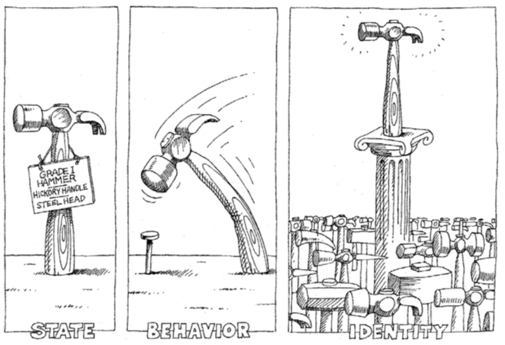

## Object Oriented Programming Fundamentals

Programmers living at the moment should have heard the term "object-oriented programming", and people often ask if they can explain what "object-oriented programming" is in one sentence, let's take a look at the more formal statement .

&quot;A group of data structures and methods for processing them are formed into objects, objects with the same behavior are classified into classes, internal details are hidden through class encapsulation, and class characteristics are realized through inheritance Specialization and generalization to achieve dynamic dispatch based on object type through polymorphism. &quot;

This is not even more understandable. So let's take a look at a more simple and easy-to-understand statement. The following content comes from [zhihu](https://www.zhihu.com/).


> **Note:** The above content comes from the Internet and does not represent the author's own views and opinions. It has nothing to do with the author's own position, and the author does not bear the relevant responsibility.

We said before that &quot;**Program is a collection of instructions**&quot;, the statements we write in the program will become one or more instructions when executed and then executed by the CPU. Of course, in order to simplify the design of the program, we introduced the concept of function, put relatively independent and frequently reused code into the function, and only need to call the function when these functions need to be used; if the function of a function is too complex and bloated , we can further divide the function into sub-functions to reduce the complexity of the system. But having said so much, I don't know if you have discovered that the so-called programming is that programmers control the computer to complete various tasks according to the way the computer works. However, the way the computer works is different from the way of thinking of normal human beings. If programming has to abandon the normal way of thinking of human beings to cater to the computer, the fun of programming will be much less, &quot;Everyone should learn to program&quot; like this The rhetoric can only be said. Of course, these are not the most important, the most important thing is that when we need to develop a complex system, the complexity of the code can make development and maintenance work difficult, so in the late 1960s, &quot;[software Crisis](https://en.wikipedia.org/wiki/%E8%BD%AF%E4%BB%B6%E5%8D%B1%E6%9C%BA)&quot;,&quot;[Software Engineering]( https://zh.wikipedia.org/wiki/%E8%BD%AF%E4%BB%B6%E5%B7%A5%E7%A8%8B)&quot; and a series of concepts began to appear in the industry.

Of course, everyone in the programmer circle knows that there is no "silver bullet" that solves the problems mentioned above in reality (https://zh.wikipedia.org/wiki/%E6%B2%A1%E6 %9C%89%E9%93%B6%E5%BC%B9)&quot;, what really gave software developers hope was [Smalltalk](https://zh.wikipedia.org/ wiki/Smalltalk) programming language introduced object-oriented programming ideas (the prototype of object-oriented programming can be traced back to the earlier [Simula](https://zh.wikipedia.org/wiki/Simula) language). According to this programming concept, the data in the program and the functions that operate the data are a logical whole, which we call "objects", and the way we solve the problem is to create the required objects and send out various Messages, the cooperative work of multiple objects can eventually allow us to construct complex systems to solve real-world problems.

> **Note:** Of course object-oriented is not the last "silver bullet" to solve all problems in software development, so today's high-level programming languages ​​almost all provide support for multiple programming paradigms, and Python is no exception.

### Classes and Objects

Simply put, classes are blueprints and templates for objects, and objects are instances of classes. Although this explanation is a bit like explaining concepts with concepts, we can at least see from this sentence that classes are abstract concepts, while objects are concrete things. In the world of object-oriented programming, everything is an object, objects have properties and behaviors, each object is unique, and an object must belong to a certain class (type). When we extract the static characteristics (attributes) and dynamic characteristics (behaviors) of a large number of objects with common characteristics, we can define something called a "class".



### define class

In Python, you can use the `class` keyword to define a class, and then use the previously learned functions to define methods in the class, so that the dynamic characteristics of the object can be described. The code is as follows.

````Python
class Student(object):

    # __init__ is a special method used to initialize objects when they are created
    # Through this method, we can bind the two properties of name and age to the student object
    def __init__(self, name, age):
        self.name = name
        self.age = age

    def study(self, course_name):
        print('%s is studying %s.' % (self.name, course_name))

    # PEP 8 requires identifier names to be in all lowercase with multiple words concatenated with underscores
    # But some programmers and companies prefer to use camelCase (CamelCase)
    def watch_movie(self):
        if self.age < 18:
            print('%s can only watch "Bears".' % self.name)
        else:
            print('%s is watching an island love movie.' % self.name)
````

> **Description:** The functions written in the class, we usually call (object's) methods, these methods are the messages that the object can receive.

### Creating and using objects

After we define a class, we can create objects and send messages to them in the following ways.

````Python
def main():
    # Create student object and specify name and age
    stu1 = Student('Luo Hao', 38)
    # Send a study message to the object
    stu1.study('Python programming')
    # Send a watch_av message to the object
    stu1.watch_movie()
    stu2 = Student('The King's Hammer', 15)
    stu2.study('ideological and moral')
    stu2.watch_movie()


if __name__ == '__main__':
    main()
````

### Access visibility issues

For the above code, programmers with programming experience in C++, Java, C#, etc. may ask, what access rights (also known as visibility) do we have to the `name` and `age` properties bound to the `Student` object. ). Because in many object-oriented programming languages, we usually set the properties of objects as private or protected, which simply means that no outside access is allowed, and the methods of objects are usually public ( public), because the public method is the message that the object can accept. In Python, there are only two types of access permissions for attributes and methods, namely public and private. If you want an attribute to be private, you can start with two underscores when naming the attribute. The following code can verify this.

````Python
class Test:

    def __init__(self, foo):
        self.__foo = foo

    def __bar(self):
        print(self.__foo)
        print('__bar')


def main():
    test = Test('hello')
    # AttributeError: 'Test' object has no attribute '__bar'
    test.__bar()
    # AttributeError: 'Test' object has no attribute '__foo'
    print(test.__foo)


if __name__ == "__main__":
    main()
````

However, Python does not strictly guarantee the privacy of private properties or methods syntactically. It just renames private properties and methods to prevent access to them. In fact, if you know the rules for changing names, you can still access them. They, the following code can verify this. The reason for this setting can be explained by the famous saying, "**We are all consenting adults here**". Because the vast majority of programmers believe that open is better than closed, and programmers are responsible for their own actions.

````Python
class Test:

    def __init__(self, foo):
        self.__foo = foo

    def __bar(self):
        print(self.__foo)
        print('__bar')


def main():
    test = Test('hello')
    test._Test__bar()
    print(test._Test__foo)


if __name__ == "__main__":
    main()
````

In actual development, we do not recommend making properties private, as this will make them inaccessible to subclasses (more on this later). So most Python programmers follow a naming convention of starting the property name with a single underscore to indicate that the property is protected, and code outside this class should be careful when accessing such properties. This practice is not a grammatical rule. Properties and methods starting with a single underscore are still accessible to the outside world, so more often it is a hint or metaphor. For this, see my ["Python - Those The pits we stepped on in the past year"](http://blog.csdn.net/jackfrued/article/details/79521404) The explanation in the article.

### Object-Oriented Pillars

Object orientation has three pillars: encapsulation, inheritance, and polymorphism. The latter two concepts are explained in detail in the next chapter, here we first talk about what encapsulation is. My own understanding of encapsulation is "hide all the implementation details that can be hidden, and only expose (provide) a simple programming interface to the outside world". The method we define in the class actually encapsulates the data and operations on the data. After we create the object, we only need to send a message (calling the method) to the object to execute the code in the method, that is to say we You only need to know the name of the method and the parameters passed in (the outer view of the method), not the implementation details inside the method (the inner view of the method).

### practise

#### Exercise 1: Define a class describing a digital clock.

Reference answer:

````Python
from time import sleep


class Clock(object):
    """Digital clock"""

    def __init__(self, hour=0, minute=0, second=0):
        """Initialization method

        :param hour: hour
        :param minute: minute
        :param second: seconds
        """
        self._hour = hour
        self._minute = minute
        self._second = second

    def run(self):
        """Go word"""
        self._second += 1
        if self._second == 60:
            self._second = 0
            self._minute += 1
            if self._minute == 60:
                self._minute = 0
                self._hour += 1
                if self._hour == 24:
                    self._hour = 0

    def show(self):
        """display time"""
        return '%02d:%02d:%02d' % \
               (self._hour, self._minute, self._second)


def main():
    clock = Clock(23, 59, 58)
    while True:
        print(clock.show())
        sleep(1)
        clock.run()


if __name__ == '__main__':
    main()
````

#### Exercise 2: Define a class that describes a point on a plane and provides methods for moving a point and calculating the distance to another point.

Reference answer:

````Python
from math import sqrt


class Point(object):

    def __init__(self, x=0, y=0):
        """Initialization method
        
        :param x: abscissa
        :param y: ordinate
        """
        self.x = x
        self.y = y

    def move_to(self, x, y):
        """Move to the specified position
        
        :param x: new abscissa
        "param y: new ordinate
        """
        self.x = x
        self.y = y

    def move_by(self, dx, dy):
        """Move the specified increment
        
        :param dx: Increment of abscissa
        "param dy: the increment of the ordinate
        """
        self.x += dx
        self.y += dy

    def distance_to(self, other):
        """Calculate the distance to another point
        
        :param other: another point
        """
        dx = self.x - other.x
        dy = self.y - other.y
        return sqrt(dx**2 + dy**2)

    def __str__(self):
        return '(%s, %s)' % (str(self.x), str(self.y))


def main():
    p1 = Point(3, 5)
    p2 = Point()
    print(p1)
    print(p2)
    p2.move_by(-1, 2)
    print(p2)
    print(p1.distance_to(p2))


if __name__ == '__main__':
    main()
````

> **Note:** The illustrations in this chapter are from the book [Object-Oriented Analysis and Design](https://item.jd.com/20476561918.html) by Grady Booch et al. The classic book of object programming, interested readers can buy and read this book to learn more about object-oriented knowledge.