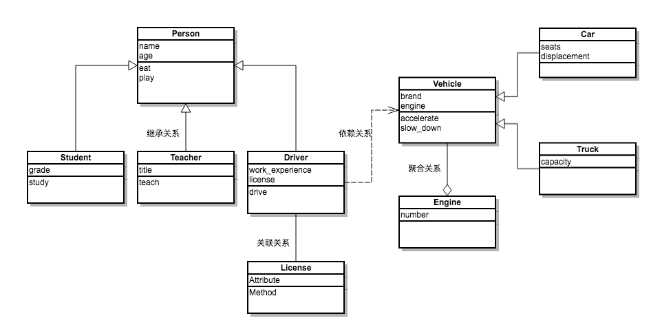

## Object-oriented advanced

In the previous chapters, we have learned about the introductory knowledge of object orientation, how to define classes, how to create objects and how to send messages to objects. In order to better use object-oriented programming ideas for program development, we also need to have a deeper understanding of object-oriented programming in Python.

### @property decorator

We discussed the issue of attribute and method access permissions in Python before. Although we do not recommend making attributes private, it is also problematic to expose attributes directly to the outside world. For example, we have no way to check whether the value assigned to the attribute is valid. . Our previous suggestion is to start the property name with a single underscore. In this way, it implies that the property is protected and is not recommended for direct access by the outside world. If you want to access the property, you can use the property's getter (accessor) and setter (modifier). ) method to perform the corresponding operation. If you want to do this, you can consider using a @property wrapper to wrap the getter and setter methods, making access to the property both safe and convenient, the code is shown below.

````Python
class Person(object):

    def __init__(self, name, age):
        self._name = name
        self._age = age

    # accessor - getter method
    @property
    def name(self):
        return self._name

    # accessor - getter method
    @property
    def age(self):
        return self._age

    # modifier - setter method
    @age.setter
    def age(self, age):
        self._age = age

    def play(self):
        if self._age <= 16:
            print('%s is playing Ludo.' % self._name)
        else:
            print('%s is playing Landlord.' % self._name)


def main():
    person = Person('The King's Hammer', 12)
    person.play()
    person.age = 22
    person.play()
    # person.name = 'Bai Yuanfang' # AttributeError: can't set attribute


if __name__ == '__main__':
    main()
````

### \_\_slots\_\_magic

We are here, I don’t know if you have realized that Python is a [dynamic language] (https://zh.wikipedia.org/wiki/%E5%8A%A8%E6%80%81%E8%AF %AD%E8%A8%80). Usually, dynamic languages ​​allow us to bind new properties or methods to objects while the program is running, and of course to unbind properties and methods that have already been bound. But if we need to limit the object of the custom type to only bind certain properties, we can limit it by defining the \_\_slots\_\_ variable in the class. It should be noted that the limitation of \_\_slots\_\_ only takes effect on objects of the current class, and has no effect on subclasses.

````Python
class Person(object):

    # Restrict the Person object to only bind the _name, _age and _gender properties
    __slots__ = ('_name', '_age', '_gender')

    def __init__(self, name, age):
        self._name = name
        self._age = age

    @property
    def name(self):
        return self._name

    @property
    def age(self):
        return self._age

    @age.setter
    def age(self, age):
        self._age = age

    def play(self):
        if self._age <= 16:
            print('%s is playing Ludo.' % self._name)
        else:
            print('%s is playing Landlord.' % self._name)


def main():
    person = Person('The King's Hammer', 22)
    person.play()
    person._gender = 'male'
    # AttributeError: 'Person' object has no attribute '_is_gay'
    # person._is_gay = True
````

### Static methods and class methods

Before, the methods we defined in the class were all object methods, which means that these methods were all messages sent to the object. In fact, the methods we write in the class do not need to be all object methods. For example, we define a "triangle" class, construct a triangle by passing in three side lengths, and provide methods for calculating perimeter and area, but passing in The length of the three sides may not be able to construct a triangle object, so we can first write a method to verify whether the three sides can form a triangle, this method is obviously not an object method, because the triangle object has not been created when this method is called (because I don't know if three sides can form a triangle), so this method belongs to the triangle class and not to the triangle object. We can use static method to solve this kind of problem, the code is shown below.

```Python
from math import sqrt


class Triangle(object):

    def __init__(self, a, b, c):
        self._a = a
        self._b = b
        self._c = c

    @staticmethod
    def is_valid(a, b, c):
        return a + b > c and b + c > a and a + c > b

    def perimeter(self):
        return self._a + self._b + self._c

    def area(self):
        half = self.perimeter() / 2
        return sqrt(half * (half - self._a) *
                    (half - self._b) * (half - self._c))


def main():
    a, b, c = 3, 4, 5
    # Both static methods and class methods are called by sending messages to the class
    if Triangle.is_valid(a, b, c):
        t = Triangle(a, b, c)
        print(t.perimeter())
        # You can also call object methods by sending a message to the class but pass in the object that receives the message as a parameter
        # print(Triangle.perimeter(t))
        print(t.area())
        # print(Triangle.area(t))
    else:
        print('Cannot form a triangle.')


if __name__ == '__main__':
    main()
````

Similar to static methods, Python can also define class methods in classes. The first parameter of class methods is named cls, which represents the object of current class-related information (the class itself is also an object, and in some places It is called the metadata object of the class). Through this parameter, we can obtain information related to the class and create an object of the class. The code is as follows.

````Python
from time import time, localtime, sleep


class Clock(object):
    """Digital clock"""

    def __init__(self, hour=0, minute=0, second=0):
        self._hour = hour
        self._minute = minute
        self._second = second

    @classmethod
    def now(cls):
        ctime = localtime(time())
        return cls(ctime.tm_hour, ctime.tm_min, ctime.tm_sec)

    def run(self):
        """Go word"""
        self._second += 1
        if self._second == 60:
            self._second = 0
            self._minute += 1
            if self._minute == 60:
                self._minute = 0
                self._hour += 1
                if self._hour == 24:
                    self._hour = 0

    def show(self):
        """display time"""
        return '%02d:%02d:%02d' % \
               (self._hour, self._minute, self._second)


def main():
    # Create object through class method and get system time
    clock = Clock.now()
    while True:
        print(clock.show())
        sleep(1)
        clock.run()


if __name__ == '__main__':
    main()
````

### Relationships between classes

Simply put, there are three types of relationships between classes: is-a, has-a and use-a relationships.

- The is-a relationship is also called inheritance or generalization. For example, the relationship between students and people, and the relationship between mobile phones and electronic products are all inheritance relationships.
- The has-a relationship is usually called an association, such as the relationship between a department and an employee, and the relationship between a car and an engine; if the association is a relationship between a whole and a part, then we call it an aggregation relationship; if the whole is further responsible for The life cycle of the part (the whole and the part are inseparable, and the coexistence also perishes at the same time), then this is the strongest association relationship, which we call the composite relationship.
- The use-a relationship is usually called a dependency. For example, the driver has a driving behavior (method), in which (the parameter) uses a car, then the relationship between the driver and the car is a dependency relationship.

We can use a method called [UML](https://en.wikipedia.org/wiki/%E7%BB%9F%E4%B8%80%E5%BB%BA%E6%A8%A1%E8%AF %AD%E8%A8%80) (Unified Modeling Language) for object-oriented modeling, one of the important tasks is to describe the relationship between classes and classes with standardized graphical symbols. We will not give a detailed introduction to UML here. Interested readers can read the book ["UML Object-Oriented Design Fundamentals"](https://e.jd.com/30392949.html).




Using these relationships between classes, we can perform certain operations on the basis of existing classes, or create new classes on the basis of existing classes, which are important means to realize code reuse. Reusing existing code can not only reduce the workload of development, but also facilitate the management and maintenance of code, which is a technical means we use in our daily work.

### Inheritance and Polymorphism

As we mentioned just now, new classes can be created on the basis of existing classes. One way of doing this is to let a class inherit properties and methods directly from another class, thereby reducing the writing of repetitive code. Those who provide inheritance information are called parent classes, also called superclasses or base classes; those who get inheritance information are called subclasses, also called derived classes or derived classes. In addition to inheriting the properties and methods provided by the parent class, the subclass can also define its own unique properties and methods, so the subclass has more capabilities than the parent class. In actual development, we often replace it with the subclass object. A parent class object, which is a common behavior in object-oriented programming, and the corresponding principle is called the Liskov substitution principle (https://zh.wikipedia.org/wiki/%E9%87%8C%E6% B0%8F%E6%9B%BF%E6%8D%A2%E5%8E%9F%E5%88%99). Let's first look at an example of inheritance.

````Python
class Person(object):
    """people"""

    def __init__(self, name, age):
        self._name = name
        self._age = age

    @property
    def name(self):
        return self._name

    @property
    def age(self):
        return self._age

    @age.setter
    def age(self, age):
        self._age = age

    def play(self):
        print('%s is having fun.' % self._name)

    def watch_av(self):
        if self._age >= 18:
            print('%s is watching a love action movie.' % self._name)
        else:
            print('%s can only watch "Bears".' % self._name)


class Student(Person):
    """student"""

    def __init__(self, name, age, grade):
        super().__init__(name, age)
        self._grade = grade

    @property
    def grade(self):
        return self._grade

    @grade.setter
    def grade(self, grade):
        self._grade = grade

    def study(self, course):
        print('%s of %s is learning %s.' % (self._grade, self._name, course))


class Teacher(Person):
    """teacher"""

    def __init__(self, name, age, title):
        super().__init__(name, age)
        self._title = title

    @property
    def title(self):
        return self._title

    @title.setter
    def title(self, title):
        self._title = title

    def teach(self, course):
        print('%s%s is speaking %s.' % (self._name, self._title, course))


def main():
    stu = Student('King Sledgehammer', 15, 'Junior Three')
    stu.study('Math')
    stu.watch_av()
    t = Teacher('Luo Hao', 38, 'Brick House')
    t.teach('Python programming')
    t.watch_av()


if __name__ == '__main__':
    main()
````

After the subclass inherits the method of the parent class, it can give a new implementation version to the existing method of the parent class. This action is called method override. Through method overriding, we can make the same behavior of the parent class have different implementation versions in the subclass. When we call the method overridden by the subclass, different subclass objects will show different behaviors. This is Polymorphism.

````Python
from abc import ABCMeta, abstractmethod


class Pet(object, metaclass=ABCMeta):
    """pet"""

    def __init__(self, nickname):
        self._nickname = nickname

    @abstractmethod
    def make_voice(self):
        """Make noise"""
        pass


class Dog(Pet):
    """狗"""

    def make_voice(self):
        print('%s: 汪汪汪...' % self._nickname)


class Cat(Pet):
    """cat"""

    def make_voice(self):
        print('%s: Meow...meow...' % self._nickname)


def main():
    pets = [Dog('Wang Cai'), Cat('Katie'), Dog('Rhubarb')]
    for pet in pets:
        pet.make_voice()


if __name__ == '__main__':
    main()
````

In the above code, we treat the `Pet` class as an abstract class. The so-called abstract class is a class that cannot create objects. The existence of this class is specifically for other classes to inherit it. Python does not provide support for abstract classes like Java or C# from the syntax level, but we can achieve the effect of abstract classes through the `ABCMeta` metaclass and `abstractmethod` wrapper of the `abc` module, if a class exists abstract method then the class cannot be instantiated (object created). In the above code, `Dog` and `Cat` subclasses respectively rewrite the `make_voice` abstract method in the `Pet` class and give different implementation versions, when we call in the `main` function This method exhibits polymorphic behavior (the same method does different things).

### Comprehensive case

#### Case 1: Ultraman fights little monsters.

````Python
from abc import ABCMeta, abstractmethod
from random import randint, randrange


class Fighter(object, metaclass=ABCMeta):
    """fighter"""

    # Through the __slots__ magic limit the member variables that the object can bind to
    __slots__ = ('_name', '_hp')

    def __init__(self, name, hp):
        """Initialization method

        :param name: name
        :param hp: health
        """
        self._name = name
        self._hp = hp

    @property
    def name(self):
        return self._name

    @property
    def hp(self):
        return self._hp

    @hp.setter
    def hp(self, hp):
        self._hp = hp if hp >= 0 else 0

    @property
    def alive(self):
        return self._hp > 0

    @abstractmethod
    def attack(self, other):
        """attack

        :param other: the attacked object
        """
        pass


class Ultraman(Fighter):
    """Ultraman"""

    __slots__ = ('_name', '_hp', '_mp')

    def __init__(self, name, hp, mp):
        """Initialization method

        :param name: name
        :param hp: health
        :param mp: magic value
        """
        super().__init__(name, hp)
        self._mp = mp

    def attack(self, other):
        other.hp -= randint(15, 25)

    def huge_attack(self, other):
        """Ultimate nirvana (destroy at least 50 points or three-quarters of the opponent's blood)

:param other: the attacked object

        :return: Use success to return True otherwise return False
        """
        if self._mp >= 50:
            self._mp -= 50
            injury = other.hp * 3 // 4
            injury = injury if injury >= 50 else 50
            other.hp -= injury
            return True
        else:
            self.attack(other)
            return False

    def magic_attack(self, others):
        """Magic attack

        :param others: the group being attacked

        :return: Use magic to return True if successful, otherwise return False
        """
        if self._mp >= 20:
            self._mp -= 20
            for temp in others:
                if temp.alive:
                    temp.hp -= randint(10, 15)
            return True
        else:
            return False

    def resume(self):
        """Restore mana"""
        incr_point = randint(1, 10)
        self._mp += incr_point
        return incr_point

    def __str__(self):
        return '~~~%s Ultraman~~~\n' % self._name + \
            'HP: %d\n' % self._hp + \
            'Magic value: %d\n' % self._mp


class Monster(Fighter):
    """Little Monster"""

    __slots__ = ('_name', '_hp')

    def attack(self, other):
        other.hp -= randint(10, 20)

    def __str__(self):
        return '~~~%s little monster~~~\n' % self._name + \
            'HP: %d\n' % self._hp


def is_any_alive(monsters):
    """Determine if there are any little monsters alive"""
    for monsters in monsters:
        if monster.alive > 0:
            return True
    return False


def select_alive_one(monsters):
    """Select a living monster"""
    monsters_len = len(monsters)
    while True:
        index = randrange(monsters_len)
        monster = monsters[index]
        if monster.alive > 0:
            return monster


def display_info(ultraman, monsters):
    """Display information about Ultraman and little monsters"""
    print(ultraman)
    for monsters in monsters:
        print(monster, end='')


def main():
    u = Ultraman('Luo Hao', 1000, 120)
    m1 = Monster('Di Renjie', 250)
    m2 = Monster('Bai Yuanfang', 500)
    m3 = Monster('The King's Hammer', 750)
    ms = [m1, m2, m3]
    fight_round = 1
    while u.alive and is_any_alive(ms):
        print('========%02d round ========' % fight_round)
        m = select_alive_one(ms) # select a small monster
        skill = randint(1, 10) # choose which skill to use by random number
        if skill <= 6: # 60% chance to use normal attack
            print('%s hit %s with normal attack.' % (u.name, m.name))
            u.attack(m)
            print('%s's magic value is restored by %d points.' % (u.name, u.resume()))
        elif skill <= 9: # 30% chance to use magic attack (may fail due to insufficient mana)
            if u.magic_attack(ms):
                print('%s used a magic attack.' % u.name)
            else:
                print('%s failed to use magic.' % u.name)
        else: # 10% chance to use the ultimate nirvana (if the magic value is insufficient, use the normal attack)
            if u.huge_attack(m):
                print('%s used the ultimate nirvana to abuse %s.' % (u.name, m.name))
            else:
                print('%s hit %s with normal attack.' % (u.name, m.name))
                print('%s's magic value is restored by %d points.' % (u.name, u.resume()))
        if m.alive > 0: # If the selected monster is not dead, hit back Ultraman
            print('%s returned %s.' % (m.name, u.name))
            m.attack(u)
        display_info(u, ms) # Display information about Ultraman and little monsters after each round
        fight_round += 1
    print('\n========The battle is over!========\n')
    if u.alive > 0:
        print('%s Ultraman victory!' % u.name)
    else:
        print('The little monster wins!')


if __name__ == '__main__':
    main()
````
#### 案例2：扑克游戏。

```Python
import random


class Card(object):
    """一张牌"""

    def __init__(self, suite, face):
        self._suite = suite
        self._face = face

    @property
    def face(self):
        return self._face

    @property
    def suite(self):
        return self._suite

    def __str__(self):
        if self._face == 1:
            face_str = 'A'
        elif self._face == 11:
            face_str = 'J'
        elif self._face == 12:
            face_str = 'Q'
        elif self._face == 13:
            face_str = 'K'
        else:
            face_str = str(self._face)
        return '%s%s' % (self._suite, face_str)
    
    def __repr__(self):
        return self.__str__()


class Poker(object):
    """一副牌"""

    def __init__(self):
        self._cards = [Card(suite, face) 
                       for suite in '♠♥♣♦'
                       for face in range(1, 14)]
        self._current = 0

    @property
    def cards(self):
        return self._cards

    def shuffle(self):
        """洗牌(随机乱序)"""
        self._current = 0
        random.shuffle(self._cards)

    @property
    def next(self):
        """发牌"""
        card = self._cards[self._current]
        self._current += 1
        return card

    @property
    def has_next(self):
        """还有没有牌"""
        return self._current < len(self._cards)


class Player(object):
    """玩家"""

    def __init__(self, name):
        self._name = name
        self._cards_on_hand = []

    @property
    def name(self):
        return self._name

    @property
    def cards_on_hand(self):
        return self._cards_on_hand

    def get(self, card):
        """摸牌"""
        self._cards_on_hand.append(card)

    def arrange(self, card_key):
        """玩家整理手上的牌"""
        self._cards_on_hand.sort(key=card_key)

# Sorting rules - first by suit and then by points
def get_key(card):
    return (card.suite, card.face)


def main():
    p = Poker()
    p.shuffle()
    players = [Player('East evil'), Player('West poison'), Player('South Emperor'), Player('North beggar')]
    for_in range(13):
        for player in players:
            player.get(p.next)
    for player in players:
        print(player.name + ':', end=' ')
        player.arrange(get_key)
        print(player.cards_on_hand)


if __name__ == '__main__':
    main()
````

>**Description:** You can try to write a simple poker game based on the above code, such as blackjack (Black Jack). You can find the rules of the game online.

#### Case 3: Payroll settlement system.

````Python
"""
A company has three types of employees: department managers, programmers, and salespeople
Need to design a salary settlement system to calculate monthly salary based on the provided employee information
The monthly salary of the department manager is fixed at 15,000 yuan per month
The monthly salary of the programmer is calculated according to the working hours of the month, 150 yuan per hour
The monthly salary of the salesperson is the basic salary of 1,200 yuan plus a 5% commission on sales
"""
from abc import ABCMeta, abstractmethod


class Employee(object, metaclass=ABCMeta):
    """Staff"""

    def __init__(self, name):
        """
        initialization method

        :param name: name
        """
        self._name = name

    @property
    def name(self):
        return self._name

    @abstractmethod
    def get_salary(self):
        """
        get monthly salary

        :return: monthly salary
        """
        pass


class Manager(Employee):
    """Department manager"""

    def get_salary(self):
        return 15000.0


class Programmer(Employee):
    """programmer"""

    def __init__(self, name, working_hour=0):
        super().__init__(name)
        self._working_hour = working_hour

    @property
    def working_hour(self):
        return self._working_hour

    @working_hour.setter
    def working_hour(self, working_hour):
        self._working_hour = working_hour if working_hour > 0 else 0

    def get_salary(self):
        return 150.0 * self._working_hour


class Salesman(Employee):
    """Seller"""

    def __init__(self, name, sales=0):
        super().__init__(name)
        self._sales = sales

    @property
    def sales(self):
        return self._sales

    @sales.setter
    def sales(self, sales):
        self._sales = sales if sales > 0 else 0

    def get_salary(self):
        return 1200.0 + self._sales * 0.05


def main():
    emps = [
        Manager('Liu Bei'), Programmer('Zhuge Liang'),
        Manager('Cao Cao'), Salesman('Xun Yu'),
        Salesman('Lu Bu'), Programmer('Zhang Liao'),
        Programmer('Zhao Yun')
    ]
    for emp in emps:
        if isinstance(emp, Programmer):
            emp.working_hour = int(input('Please enter %s working hours this month: ' % emp.name))
        elif isinstance(emp, Salesman):
            emp.sales = float(input('Please enter %s sales this month: ' % emp.name))
        # Also receive the get_salary message but different employees show different behaviors (polymorphism)
        print('%s this month's salary is: ￥%s yuan' %
              (emp.name, emp.get_salary()))


if __name__ == '__main__':
    main()
````

