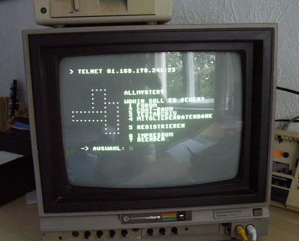
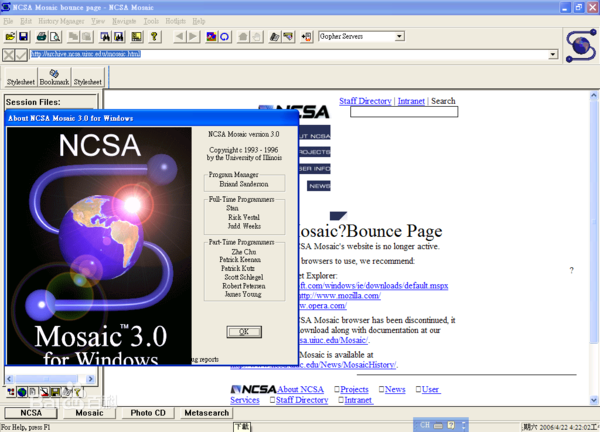

## Getting Started with Network Programming

### Computer Networking Fundamentals

A computer network is a general term for a system of interconnected independent computers. The main purpose of building a computer network is to realize communication and resource sharing among multiple computers. Today's computer network has too many devices and computer network users, and the computer network can also be called a "complex giant system". For such a system, it is impossible for us to explain it clearly in one or two articles. , Interested readers can read the classic "Computer Network" by Andrew S. Tanenbaum or "Computer Network: Top-Down Approach" co-authored by Kurose and Ross to understand the relevant knowledge of computer network.

#### The history of computer network development

1. 1960s - The U.S. Department of Defense ARPANET project came out, laying the foundation for packet-switched networks.

   

2. 1980s - The International Organization for Standardization (ISO) released OSI/RM, which laid the foundation for the standardization of network technology.

   

3. 1990s - British [Tim Berners-Lee](https://en.wikipedia.org/wiki/%E6%8F%90%E5%A7%86%C2%B7%E6%9F% 8F%E5%85%A7%E8%8C%B2-%E6%9D%8E) invented the graphical browser, and the simplicity and ease of use of the browser made the computer network rapidly popularized.

   In the age of no browser, surfing the Internet was like this.

   

   With a browser, the Internet is like this.

   

#### TCP/IP model

The basis for realizing network communication are network communication protocols, which are usually defined by the [Internet Engineering Task Force](https://en.wikipedia.org/wiki/%E4%BA%92%E8%81%94%E7%BD %91%E5%B7%A5%E7%A8%8B%E4%BB%BB%E5%8A%A1%E7%BB%84) (IETF). The so-called "protocol" is a set of conventions that both sides of the communication computer must comply with, such as how to establish a connection, how to identify each other, etc. The three elements of a network protocol are: syntax, semantics and timing. The foundation of the Internet we use today is the TCP/IP protocol family. The so-called protocol family is a series of protocols and the communication models they form. We usually call this set of things the TCP/IP model. Different from the seven-layer model of OSI/RM released by the International Organization for Standardization, TCP/IP is a four-layer model, that is to say, the model logically decomposes the network we use into four layers, from bottom to top: Network interface layer, network layer, transport layer and application layer, as shown in the following figure.


IP is usually translated as the Internet Protocol, which serves the network layer and mainly implements the functions of addressing and routing. Each host connected to the network needs to have its own IP address, and the IP address is the identity of the host on the computer network. Of course, due to the lack of IPv4 addresses, the IP address we usually get when surfing the Internet at home, office and other public areas that can access the network is not the only IP address in the world, but a [Local Area Network (LAN)](https:// zh.wikipedia.org/zh-hans/%E5%B1%80%E5%9F%9F%E7%BD%91), through the [Network Address Translation (NAT) service](https:// en.wikipedia.org/wiki/%E7%BD%91%E7%BB%9C%E5%9C%B0%E5%9D%80%E8%BD%AC%E6%8D%A2) we can also achieve access to the network. Computer networks have a large number of what we call "[routers](https://en.wikipedia.org/wiki/%E8%B7%AF%E7%94%B1%E5%99%A8)" Following devices, they store and forward the data packets we send to the network, so that the data from the source can finally find the way to the destination. This function is called routing.

The full name of TCP is Transmission Control Protocol. It is a protocol established based on the addressing and routing services provided by IP and is responsible for realizing end-to-end reliable transmission. The reason why TCP is called a reliable transmission protocol is that TCP promises the caller three things:

1. Data is not lost or wrongly transmitted (this can be achieved by using handshake, check and retransmission mechanisms).
2. Flow control (matching the transmission speed between the data sender and receiver through a sliding window).
3. Congestion control (relieves network congestion through RTT time and control of sliding windows).

#### Network Application Mode

1. C/S mode and B/S mode. Here C refers to Client (client), which is usually an application that needs to be installed on a host operating system; and B refers to Browser (browser), which is installed by default in almost all graphical operating systems. An application software developed; access to S (server) can be achieved through C or B. There are a lot of articles on the Internet about the comparison and discussion of the two, so we will not waste pen and ink here.
2. Decentralized network application model. Whether it is B/S or C/S, the existence of a server is required, and the server is the center of the entire application model, while decentralized network applications usually do not have a fixed server or fixed client, and users of all applications can be used as resources. Providers can also act as resource visitors.

### Network resource access based on HTTP protocol

#### HTTP (Hypertext Transfer Protocol)

HTTP is the abbreviation of Hyper-Text Transfer Protocol (Hyper-Text Transfer Protocol). The explanation of HTTP on Wikipedia is: Hyper-Text Transfer Protocol is an application layer protocol for distributed, collaborative and hypermedia information systems. Yes [World Wide Web](https://en.wikipedia.org/wiki/%E5%85%A8%E7%90%83%E8%B3%87%E8%A8%8A%E7%B6%B2) data communication The basis of , HTTP was originally designed to provide a way to publish and receive [HTML](https://en.wikipedia.org/wiki/HTML) pages over HTTP or [HTTPS](https://en .wikipedia.org/wiki/%E8%B6%85%E6%96%87%E6%9C%AC%E4%BC%A0%E8%BE%93%E5%AE%89%E5%85%A8% E5%8D%8F%E8%AE%AE) (Hypertext Transfer Security Protocol) The resource requested by the URI ([Uniform Resource Identifier](https://en.wikipedia.org/wiki/%E7%B5%B1 %E4%B8%80%E8%B3%87%E6%BA%90%E6%A8%99%E8%AD%98%E7%AC%A6)) to identify. For more information on HTTP, we recommend reading Ruan Yifeng's ["Introduction to HTTP Protocol"] (http://www.ruanyifeng.com/blog/2016/08/http.html), in short, through HTTP we You can obtain (character-based) resources on the network. The network API (also called network data interface in some places) that is often used in development is based on HTTP to realize data transmission.

#### JSON format

**JSON** (**J**ava**Script **O**bject **N**otation) is a lightweight data interchange language that Literal (plain text) based, used to transmit data objects consisting of attribute values ​​or serialized values. Although JSON was originally just a literal syntax for creating objects in Javascript, it is now a language-independent data format. Many programming languages ​​support the generation and parsing of JSON-formatted data. Python's built-in json module also This function is provided. Since JSON is plain text, it is suitable for data exchange between heterogeneous systems like [XML](https://zh.wikipedia.org/wiki/XML). Compared with XML, JSON is more lightweight and elegant. Below are XML and JSON that express the same information, and the advantages of JSON are fairly intuitive.

Example of XML:

````XML
<?xml version="1.0" encoding="UTF-8"?>
<message>
<from>Alice</from>
<to>Bob</to>
<content>Will you marry me?</content>
</message>
````

Example of JSON:

````JSON
{
    "from": "Alice",
    "to": "Bob",
    "content": "Will you marry me?"
}
````

#### requests library

requests is a third library based on the HTTP protocol to use the network, its [official website] (http://cn.python-requests.org/zh_CN/latest/) has such a sentence to introduce it: "Requests are the only A **non-GMO** Python HTTP library that humans can safely enjoy." Simply put, using the requests library makes it very convenient to use HTTP, avoiding security flaws, redundant code, and "reinventing the wheel" (industry slang, usually Used in software engineering to mean recreating an existing or already optimized basic method). We have used this library in the previous article. Next, we will use requests to implement an example program that accesses the network data interface and obtains the download link of beautiful pictures from it, and then downloads the beautiful pictures to the local example. The program uses [Tianxing data]( The web API provided by https://www.tianapi.com/).

We can first install requests and its dependent libraries through pip.

```Shell
pip install requests
````

If you use PyCharm as a development tool, you can write `import requests` directly in the code, and then automatically download and install requests through the code repair function.

```Python
from time import time
from threading import Thread

import requests


# Inherit the Thread class to create a custom thread class
class DownloadHanlder(Thread):

    def __init__(self, url):
        super().__init__()
        self.url = url

    def run(self):
        filename = self.url[self.url.rfind('/') + 1:]
        resp = requests.get(self.url)
        with open('/Users/Hao/' + filename, 'wb') as f:
            f.write(resp.content)


def main():
    # Obtain network resources through the get function of the requests module
    # The following code uses the network API provided by the Tianxing data interface
    # To use this data interface, you need to register on the website of Tianxing Data
    # Then replace the APIKey in the following code with your own Key
    resp = requests.get(
        'http://api.tianapi.com/meinv/?key=APIKey&num=10')
    # Parse the JSON format data returned by the server into a dictionary
    data_model = resp.json()
    for mm_dict in data_model['newslist']:
        url = mm_dict['picUrl']
        # Realize image download through multi-threading
        DownloadHanlder(url).start()


if __name__ == '__main__':
    main()
````

### Socket programming based on transport layer protocol

The word socket is very obscure and unfamiliar to many people who do not understand network programming. The application development library written by C%E8%AF%AD%E8%A8%80) is mainly used to realize inter-process communication and network programming, and is widely used in network application development. In Python, you can also use the transport services provided by the transport layer based on sockets, and develop your own network applications based on this. Sockets used in actual development can be divided into three categories: stream sockets (TCP sockets), datagram sockets and raw sockets.

#### TCP sockets

The so-called TCP socket is a programming interface that uses the transmission service provided by the TCP protocol to realize network communication. A TCP socket can be used in Python by creating a socket object and specifying the type attribute as SOCK_STREAM. Since a host may have multiple IP addresses, and it is very likely that multiple different services will be configured, as a server-side program, it needs to bind it to the specified IP address and port after creating the socket object. The port here is not a physical device but an extension of the IP address to distinguish different services. For example, we usually bind the HTTP service to port 80, while the MySQL database service is bound to port 3306 by default, so that when the server receives When a user requests, it can be determined according to the port number whether the user requests the service provided by the HTTP server or the database server. The value range of the port is 0~65535, and the ports below 1024 are usually called "famous ports" (ports reserved for "famous services" such as FTP, HTTP, SMTP, etc., which are also called "famous ports" in some places. Well-known ports"), custom services usually do not use these ports, unless the custom is a well-known service such as HTTP or FTP.

The following code implements a server that provides time and date.

````Python
from socket import socket, SOCK_STREAM, AF_INET
from datetime import datetime


def main():
    # 1. Create a socket object and specify which transport service to use
    # family=AF_INET - IPv4 address
    # family=AF_INET6 - IPv6 address
    # type=SOCK_STREAM - TCP socket
    # type=SOCK_DGRAM - UDP socket
    # type=SOCK_RAW - raw socket
    server = socket(family=AF_INET, type=SOCK_STREAM)
    # 2. Bind IP address and port (port is used to distinguish different services)
    # Only one service can be bound to the same port at the same time, otherwise an error will be reported
    server.bind(('192.168.1.2', 6789))
    # 3. Enable listening - listen for client connections to the server
    # Parameter 512 can be understood as the size of the connection queue
    server.listen(512)
    print('The server starts and starts listening...')
    while True:
        # 4. Receive the client's connection through the loop and make corresponding processing (provide service)
        # accept method is a blocking method if no client is connected to the server code will not execute down
        # The accept method returns a tuple where the first element is the client object
        # The second element is the address of the client connecting to the server (consisting of IP and port)
        client, addr = server.accept()
        print(str(addr) + 'Connected to the server.')
        # 5. Send data
        client.send(str(datetime.now()).encode('utf-8'))
        # 6. Disconnect
        client.close()


if __name__ == '__main__':
    main()
````

After running the server program, we can access the server through telnet of the Windows system, and the result is shown in the following figure.

```Shell
telnet 192.168.1.2 6789
````


Of course, we can also implement the function of the TCP client through the Python program. Compared with the implementation of the server program, it is much simpler to implement the client program. The code is as follows.

````Python
from socket import socket


def main():
    # 1. Create a socket object using IPv4 and TCP protocols by default
    client = socket()
    # 2. Connect to the server (need to specify IP address and port)
    client.connect(('192.168.1.2', 6789))
    # 3. Receive data from server
    print(client.recv(1024).decode('utf-8'))
    client.close()


if __name__ == '__main__':
    main()
````

It should be noted that the above server does not use multi-threading or asynchronous I/O processing, which means that when the server is in communication with one client, other clients can only wait in line. Obviously, such a server cannot meet our needs. The server we need is able to accept and process multiple user requests at the same time. Let's design a server that uses multithreading to handle multiple user requests. The server sends an image to a client connected to the server.

Server side code:

````Python
from socket import socket, SOCK_STREAM, AF_INET
from base64 import b64encode
from json import dumps
from threading import Thread


def main():
    
    # custom thread class
    class FileTransferHandler(Thread):

        def __init__(self, cclient):
            super().__init__()
            self.cclient = cclient

        def run(self):
            my_dict = {}
            my_dict['filename'] = 'guido.jpg'
            # JSON is plain text and cannot carry binary data
            # So the binary data of the picture should be processed into base64 encoding
            my_dict['filedata'] = data
            # Process the dictionary into a JSON string through the dumps function
            json_str = dumps(my_dict)
            # Send JSON string
            self.cclient.send(json_str.encode('utf-8'))
            self.cclient.close()

    # 1. Create a socket object and specify which transport service to use
    server = socket()
    # 2. Bind IP address and port (distinguish different services)
    server.bind(('192.168.1.2', 5566))
    # 3. Enable listening - listen for client connections to the server
    server.listen(512)
    print('The server starts and starts listening...')
    with open('guido.jpg', 'rb') as f:
        # Process the binary data into base64 and decode it into a string
        data = b64encode(f.read()).decode('utf-8')
    while True:
        client, addr = server.accept()
        # Start a thread to handle client requests
        FileTransferHandler(client).start()


if __name__ == '__main__':
    main()
````

Client code:

````Python
from socket import socket
from json import loads
from base64 import b64decode


def main():
    client = socket()
    client.connect(('192.168.1.2', 5566))
    # define an object that holds binary data
    in_data = bytes()
    # Because I don't know how big the data sent by the server is, it receives 1024 bytes each time
    data = client.recv(1024)
    while data:
        # Concatenate the received data
        in_data += data
        data = client.recv(1024)
    # Decode received binary data into JSON string and convert to dictionary
    # The role of the loads function is to convert the JSON string into a dictionary object
    my_dict = loads(in_data.decode('utf-8'))
    filename = my_dict['filename']
    filedata = my_dict['filedata'].encode('utf-8')
    with open('/Users/Hao/' + filename, 'wb') as f:
        # Decode data in base64 format into binary data and write to file
        f.write(b64decode(filedata))
    print('The picture has been saved.')


if __name__ == '__main__':
    main()
````

In this case, we use JSON as the data transmission format (the data transmitted is serialized and deserialized through JSON format), but JSON cannot carry binary data, so the binary data of the image is processed. Processing of Base64 encoding. Base64 is an encoding method that uses 64 characters to represent all binary data. By reorganizing the binary data in groups of 6 bits, numbers from 0 to 9, upper and lower case letters, and "+" and "/" can be used. A total of 64 characters represent 64 states from `000000` to `111111`. [Wikipedia](https://zh.wikipedia.org/wiki/Base64) There is a detailed explanation about Base64 encoding, readers who are not familiar with Base64 can read it by themselves.

> **Note:** The above code is mainly to explain the relevant content of network programming, so it does not deal with abnormal conditions. Please add exception handling code to enhance the robustness of the program.

#### UDP sockets

In addition to the reliable transport protocol TCP, the transport layer also has a very lightweight transport protocol called the User Datagram Protocol, or UDP for short. Both TCP and UDP are protocols that provide end-to-end transmission services. The difference between the two is like the difference between making a phone call and sending a text message. The latter does not make any commitment to the reliability and reachability of the transmission, thus avoiding the handshake and The overhead of retransmission, so in scenarios that emphasize performance and not data integrity (such as transmitting network audio and video data), UDP may be a better choice. You may notice a phenomenon, that is, when watching online videos, sometimes there will be stuttering, and sometimes there will be blurry screens, which is nothing more than the loss or wrong transmission of some data. UDP sockets can also be used to create network applications in Python. We will not go into details about this. Interested readers can study by themselves.

### Web Application Development

#### send email

Today, when instant messaging software is so developed, e-mail is still one of the most widely used applications on the Internet. Companies send employment notices to applicants, websites send users a link to activate an account, and banks promote their wealth management products to customers, etc. Almost all are done by email, and these tasks should be done automatically by the program.

Just like we can use HTTP (Hypertext Transfer Protocol) to access a website, we need to use SMTP (Simple Mail Transfer Protocol) to send emails. SMTP is also a reliable data transfer service based on TCP (Transmission Control Protocol). The smtplib module in Python simplifies these operations into a few simple functions.

The following code demonstrates how to send emails in Python.

````Python
from smtplib import SMTP
from email.header import Header
from email.mime.text import MIMEText


def main():
    # Please modify the sender and recipient of the email below
    sender = 'abcdefg@126.com'
    receivers = ['uvwxyz@qq.com', 'uvwxyz@126.com']
    message = MIMEText('Sample code for sending mail in Python.', 'plain', 'utf-8')
    message['From'] = Header('King Sledgehammer', 'utf-8')
    message['To'] = Header('Luo Hao', 'utf-8')
    message['Subject'] = Header('Example code experiment mail', 'utf-8')
    smtper = SMTP('smtp.126.com')
    # Please modify the login password below
    smtper.login(sender, 'secretpass')
    smtper.sendmail(sender, receivers, message.as_string())
    print('Mail sending completed!')


if __name__ == '__main__':
    main()
````

If you want to send emails with attachments, you can do it in the following way.

````Python
from smtplib import SMTP
from email.header import Header
from email.mime.text import MIMEText
from email.mime.image import MIMEImage
from email.mime.multipart import MIMEMultipart

import urllib


def main():
    # Create a mail message object with attachments
    message = MIMEMultipart()
    
    # create text content
    text_content = MIMEText('Please check this month's data in the attachment', 'plain', 'utf-8')
    message['Subject'] = Header('This month's data', 'utf-8')
    # Add the text content to the mail message object
    message.attach(text_content)

    # Read the file and add the file as an attachment to the mail message object
    with open('/Users/Hao/Desktop/hello.txt', 'rb') as f:
        txt = MIMEText(f.read(), 'base64', 'utf-8')
        txt['Content-Type'] = 'text/plain'
        txt['Content-Disposition'] = 'attachment; filename=hello.txt'
        message.attach(txt)
    # Read the file and add the file as an attachment to the mail message object
    with open('/Users/Hao/Desktop/summary data.xlsx', 'rb') as f:
        xls = MIMEText(f.read(), 'base64', 'utf-8')
        xls['Content-Type'] = 'application/vnd.ms-excel'
        xls['Content-Disposition'] = 'attachment; filename=month-data.xlsx'
        message.attach(xls)
    
    # Create SMTP object
    smtper = SMTP('smtp.126.com')
    # Enable secure connection
    # smtper.starttls()
    sender = 'abcdefg@126.com'
    receivers = ['uvwxyz@qq.com']
    # Log in to the SMTP server
    # Please note that this is not a password but a mail client authorization code to log in
    # Readers who have questions about this can contact the customer service of the mail server they use
    smtper.login(sender, 'secretpass')
    # send email
    smtper.sendmail(sender, receivers, message.as_string())
    # Disconnect from the mail server
    smtper.quit()
    print('Send completed!')


if __name__ == '__main__':
    main()
````

#### send messages

Sending SMS is also a common function in the project. The registration code, verification code and marketing information of the website are basically sent to users through SMS. In the following code, we use the [Huyi Wireless](http://www.ihuyi.com/) SMS platform (this platform provides 50 free SMS messages for registered users and a demo for sending SMS messages in common development languages, you can log in The API interface provided by the website and the configuration of SMS in the user's self-service page) realizes the service of sending SMS. Of course, there are many SMS platforms in China, and readers can choose according to their own needs (usually, the cost budget and SMS arrival rate will be considered. , the ease of use and other indicators), if you need to use the SMS service in a commercial project, it is recommended to purchase the package service provided by the SMS platform.

````Python
import urllib.parse
import http.client
import json


def main():
    host = "106.ihuyi.com"
    sms_send_uri = "/webservice/sms.php?method=Submit"
    # The following parameters need to be filled in with your registered account and corresponding password
    params = urllib.parse.urlencode({'account': 'your own account', 'password' : 'your own password', 'content': 'Your verification code is: 147258. Please do not disclose the verification code to others.', 'mobile': 'receiver's mobile number', 'format':'json' })
    print(params)
    headers = {'Content-type': 'application/x-www-form-urlencoded', 'Accept': 'text/plain'}
    conn = http.client.HTTPConnection(host, port=80, timeout=30)
    conn.request('POST', sms_send_uri, params, headers)
    response = conn.getresponse()
    response_str = response.read()
    jsonstr = response_str.decode('utf-8')
    print(json.loads(jsonstr))
    conn.close()


if __name__ == '__main__':
    main()
````