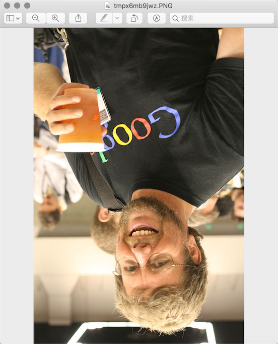

## Image and office document processing

Using programs to process images and office documents often occurs in actual development. Although there are no modules that directly support these operations in Python's standard library, we can complete these operations through third-party modules in the Python ecosystem.

### Manipulating images

#### Computer graphics related knowledge

1. Color. If you have the experience of painting with pigments, then you must know that mixing red, yellow, and blue can get other colors. In fact, these three colors are what we call the three primary colors of art, and they cannot be decomposed. Basic color. In the computer, we can superimpose the three colors of red, green and blue in different proportions to form other colors, so these three colors are the three primary colors of light, so we usually express a color as an RGB value or RGBA value (where A represents the alpha channel, which determines the pixels through which this image is passed, aka transparency).

   | name | RGBA value | name | RGBA value |
   | :---: | :--------------------------------: | :----: | :--------------- --: |
   | White | (255, 255, 255, 255) | Red | (255, 0, 0, 255) |
   | Green | (0, 255, 0, 255) | Blue | (0, 0, 255, 255) |
   | Gray | (128, 128, 128, 255) | Yellow | (255, 255, 0, 255) |
   | Black | (0, 0, 0, 255) | Purple | (128, 0, 128, 255) |

2. Pixels. For an image represented by a sequence of numbers, the smallest unit is a single-color square on the image. These small squares have a definite position and assigned color value, and the color and position of these small squares It determines the final appearance of the image. They are indivisible units, which we usually call pixels. Each image contains a certain number of pixels that determine how large the image will appear on the screen.

#### Manipulating images with Pillow

Pillow is a branch developed from the well-known Python image processing library PIL. Various operations such as image compression and image processing can be realized through Pillow. Pillow can be installed using the following command.

```Shell
pip install pillow
````

The most important thing in Pillow is the Image class, which is used to read and process images.

````Python
>>> from PIL import Image
>>>
>>> image = Image.open('./res/guido.jpg')
>>> image.format, image.size, image.mode
('JPEG', (500, 750), 'RGB')
>>> image.show()
````


1. Crop the image

   ````Python
   >>> image = Image.open('./res/guido.jpg')
   >>> rect = 80, 20, 310, 360
   >>> image.crop(rect).show()
   ````

   

2. Generate Thumbnails

   ````Python
   >>> image = Image.open('./res/guido.jpg')
   >>> size = 128, 128
   >>> image.thumbnail(size)
   >>> image.show()
   ````

   

3. Scaling and pasting images

   ````Python
   >>> image1 = Image.open('./res/luohao.png')
   >>> image2 = Image.open('./res/guido.jpg')
   >>> rect = 80, 20, 310, 360
   >>> guido_head = image2.crop(rect)
   >>> width, height = guido_head.size
   >>> image1.paste(guido_head.resize((int(width / 1.5), int(height / 1.5))), (172, 40))
   ````

   

4. Rotate and flip

   ````Python
   >>> image = Image.open('./res/guido.png')
   >>> image.rotate(180).show()
   >>> image.transpose(Image.FLIP_LEFT_RIGHT).show()
   ````

   

   

5. Manipulating Pixels

   ````Python
   >>> image = Image.open('./res/guido.jpg')
   >>> for x in range(80, 310):
   ...for y in range(20, 360):
   ...image.putpixel((x, y), (128, 128, 128))
   ...
   >>> image.show()
   ````

   

6. Filter effects

   ````Python
   >>> from PIL import Image, ImageFilter
   >>>
   >>> image = Image.open('./res/guido.jpg')
   >>> image.filter(ImageFilter.CONTOUR).show()
   ````

   

### Processing Excel Spreadsheets

Python's openpyxl module allows us to read and modify Excel spreadsheets in Python programs. Since Microsoft has used a new file format since Office 2007, this makes Office Excel fully compatible with LibreOffice Calc and OpenOffice Calc, which means The openpyxl module can also handle spreadsheets generated from these software.

````Python
import datetime

from openpyxl import Workbook

wb = Workbook()
ws = wb.active

ws['A1'] = 42
ws.append([1, 2, 3])
ws['A2'] = datetime.datetime.now()

wb.save("sample.xlsx")
````

### Processing Word documents

Using the python-docx module, Python can create and modify Word documents. Of course, Word documents here do not only refer to documents with the extension docx created by Microsoft Office software. LibreOffice Writer and OpenOffice Writer are both free word processing software.

````Python
from docx import Document
from docx.shared import Inches

document = Document()

document.add_heading('Document Title', 0)

p = document.add_paragraph('A plain paragraph having some ')
p.add_run('bold').bold = True
p.add_run(' and some ')
p.add_run('italic.').italic = True

document.add_heading('Heading, level 1', level=1)
document.add_paragraph('Intense quote', style='Intense Quote')

document.add_paragraph(
    'first item in unordered list', style='List Bullet'
)
document.add_paragraph(
    'first item in ordered list', style='List Number'
)

document.add_picture('monty-truth.png', width=Inches(1.25))

records = (
    (3, '101', 'Spam'),
    (7, '422', 'Eggs'),
    (4, '631', 'Spam, spam, eggs, and spam')
)

table = document.add_table(rows=1, cols=3)
hdr_cells = table.rows[0].cells
hdr_cells[0].text = 'Qty'
hdr_cells[1].text = 'Id'
hdr_cells[2].text = 'Desc'
for qty, id, desc in records:
    row_cells = table.add_row().cells
    row_cells[0].text = str(qty)
    row_cells[1].text = id
    row_cells[2].text = desc

document.add_page_break()

document.save('demo.docx')
````