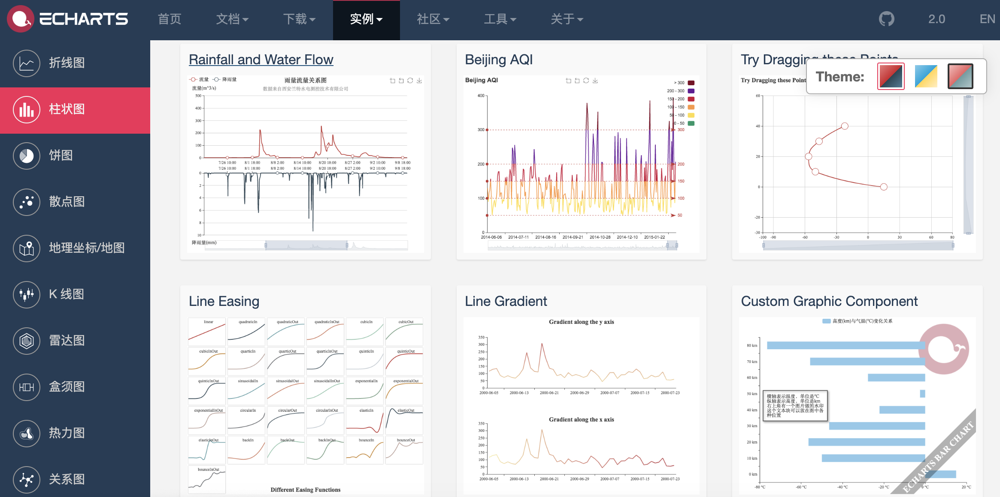

## Web Frontend Overview

> **Notes**: Some of the illustrations used in this article are from Mr. *Jon Duckett*'s*[HTML and CSS: Design and Build Websites](https://www.amazon.cn/dp/1118008189/ref=sr_1_5?__mk_zh_CN =%E4%BA%9A%E9%A9%AC%E9%80%8A%E7%BD%91%E7%AB%99&keywords=html+%26+css&qid=1554609325&s=gateway&sr=8-5)* book, This is a great front-end introductory book, and interested readers can find the purchase link of the book on Amazon or other websites.

HTML is a language used to describe web pages, the full name is Hyper-Text Markup Language, that is, hypertext markup language. The text, buttons, pictures, videos and other elements that we see when we browse the web are all written in HTML and rendered by the browser.

### A Brief History of HTML

1. October 1991: An informal CERN ([CERN](https://en.wikipedia.org/wiki/%E6%AD%90%E6%B4%B2%E6%A0%B8% E5%AD%90%E7%A0%94%E7%A9%B6%E7%B5%84%E7%B9%94)) document for the first time exposes 18 HTML tags, the author of this document is a physicist [Tim Berners-Lee](https://en.wikipedia.org/wiki/%E8%92%82%E5%A7%86%C2%B7%E4%BC%AF%E7%BA%B3%E6 %96%AF-%E6%9D%8E), so he is [World Wide Web](https://en.wikipedia.org/wiki/%E4%B8%87%E7%BB%B4%E7%BD%91 ) and the inventor of the [World Wide Web Consortium](https://en.wikipedia.org/wiki/%E4%B8%87%E7%BB%B4%E7%BD%91%E8%81%94%E7% 9B%9F) Chairman.
2. November 1995: HTML 2.0 standard published (RFC 1866).
3. January 1997: HTML 3.2 is published as a [W3C](https://en.wikipedia.org/wiki/W3C) Recommendation.
4. December 1997: HTML 4.0 released as a W3C Recommendation.
5. December 1999: HTML4.01 was released as a W3C Recommendation.
6. January 2008: HTML5 is published as a Working Draft by the W3C.
7. May 2011: W3C advances HTML5 to the "Last Call" stage.
8. December 2012: W3C designates HTML5 as a "Candidate Recommendation" stage.
9. October 2014: HTML5 was released as a stable W3C Recommendation, which means that the standardization of HTML5 is complete.

#### HTML5 new features

1. Introduce native multimedia support (audio and video tags)
2. Introduce programmable content (canvas tag)
3. Introduce Semantic Web (tags such as article, aside, details, figure, footer, header, nav, section, summary, etc.)
4. Introduce new form controls (calendar, mailbox, search, slider, etc.)
5. Introduce better support for offline storage (localStorage and sessionStorage)
6. Introduce support for positioning, drag and drop, WebSocket, background tasks, etc.

### Using tags to host content


#### structure

- html
  - head
    - title
    - meta
  - body

#### text

- headings and paragraphs
  - h1 ~ h6
  -p
- Superscript and subscript
  - sup
  - sub
- blank (white space folded)
- break and horizontal ruler
  -br
  - hr
- Semantic tags
  - Bold and underlined - strong
  -quote - blockquote
  - Abbreviations and acronyms - abbr / acronym
  - Citation - cite
  - owner contact information - address
  - Modification of content - ins / del

#### list

 - ordered list - ol / li
 - unordered list - ul / li
 - definition list - dl / dt / dd

#### link (anchor)

- page link
- Anchor links
- function link

#### image (image)

- Image storage location

  

- Image and its width and height

- Choose the correct image format
  - JPEG
  - GIF
  - PNG

- vector illustration

- Semantic labels - figure / figcaption

#### table

- Basic table structure - table/tr/td/th
- the title of the table - caption
- Across rows and columns - rowspan attribute / colspan attribute
- long form - thead / tbody / tfoot

#### form (form)
- Important properties - action / method / enctype
- Form controls (input) - type attribute
  - text box - `text` / password box - `password` / number box - `number`
  - email - `email` / phone - `tel` / date - `date` / slider - `range` / URL - `url` / search - `search`
  - radio buttons - `radio` / check buttons - `checkbox`
  - file upload - `file` / hidden fields - `hidden`
  - submit button - `submit` / image button - `image` / reset button - `reset`
- drop down list - select / option
- text area (multi-line text) - textarea
- Combine form elements - fieldset / legend

#### audio and video (audio / video)

- Video formats and players
- Video hosting service
- Preparations for adding videos
- video tags and attributes - autoplay/controls/loop/muted/preload/src
- audio tags and attributes - autoplay / controls / loop / muted / preload / src / width / height / poster

#### window (frame)

- frameset (obsolete, deprecated) - frameset / frame

- inline window - iframe

#### other

- Document type

  ````HTML
  <!doctype html>
  ````

  ````HTML
  <!DOCTYPE HTML PUBLIC "-//W3C//DTD HTML 4.01//EN" "http://www.w3.org/TR/html4/strict.dtd">
  ````

  ````HTML
  <!DOCTYPE HTML PUBLIC "-//W3C//DTD HTML 4.01 Transitional//EN" "http://www.w3.org/TR/html4/loose.dtd">
  ````

- Notes

  ````HTML
  <!-- This is a comment, comments cannot be nested -->
  ````

- Attributes
  - id: unique identifier
  - class: the class to which the element belongs, used to distinguish different elements
  - title: extra information for the element (tooltip text is displayed when the mouse is hovered)
  - tabindex: Tab key switch order
  - contenteditable: Whether the element is editable
  - draggable: Whether the element is draggable

- Block-level elements / Line-level elements

- Character entities (entity replacers)

  

### Rendering the page with CSS

#### Introduction

- The role of CSS

- How CSS works

- Rules, properties and values

  

- Common selectors

  

#### color

- How to specify colors
- Color terms and color contrast
- background color

#### text (text/font)

- Text size and font (font-size / font-family)

  

  

- Weight, style, stretch and decoration (font-weight / font-style / font-stretch / text-decoration)

  

- Line-height, letter-spacing and word-spacing

- Alignment (text-align) and indentation (text-ident)

- Link style (:link / :visited / :active / :hover)

- CSS3 new properties
  - shadow effect - text-shadow
  - First letter and first line of text (:first-letter / :first-line)
  - Respond to users
  
#### box model

- Control of box size (width/height)

  

- Box borders, margins and padding (border / margin / padding)

  

- Display and hide the box (display/visibility)

- CSS3 new properties
  - border-image
  - Shadow (border-shadow)
  - rounded corners (border-radius)

#### Lists, tables and forms

- Bullets for lists (list-style)
- table borders and backgrounds (border-collapse)
- Appearance of form controls
- Alignment of form controls
- Browser developer tools

#### images

- Control the size of the image (display: inline-block)
- align images
- Background image (background/background-image/background-repeat/background-position)

#### layout

- Control the position of the element (position/z-index)
  - normal stream
  - Relative positioning
  - Absolute positioning
  - Fixed positioning
  - Floating elements (float/clear)
- Website layout

  - HTML5 layout

    
- Adapt to screen size
  - Fixed width layout
  - Fluid layout
  - Layout grid

### Controlling behavior with JavaScript

#### JavaScript Basic Syntax

- Statements and comments
- Variables and data types
  - Declaration and assignment
  - Simple and complex data types
  - naming conventions for variables
- Expressions and operators
  - assignment operator
  - Arithmetic operators
  - comparison operators
  - Logical operators: `&&`, `||`, `!`
- branch structure
  - `if...else...`
  - `switch...cas...default...`
- Loop structure
  - `for` loop
  - `while` loop
  - `do...while` loop
- array
  - create array
  - Manipulate elements in an array
- function
  - declare function
  - Call functions
  - Parameters and return values
  - Anonymous functions
  - Immediately call the function

#### Object Oriented

 - the concept of objects
 - literal syntax for creating objects
 - access member operator
 - Constructor syntax for creating objects
    - `this` keyword
 - Add and remove properties
    - `delete` keyword
 - Standard objects
    - `Number` / `String` / `Boolean` / `Symbol` / `Array` / `Function`
    - `Date` / `Error` / `Math` / `RegExp` / `Object` / `Map` / `Set`
    - `JSON` / `Promise` / `Generator` / `Reflect` / `Proxy`

#### BOM

 - Properties and methods of the `window` object
 - `history` object
    - `forward()` / `back()` / `go()`
 - `location` object
 - `navigator` object
 - `screen` object

#### DOM

- DOM tree
 - access element
    - `getElementById()` / `querySelector()`
    - `getElementsByClassName()` / `getElementsByTagName()` / `querySelectorAll()`
    - `parentNode` / `previousSibling` / `nextSibling` / `children` / `firstChild` / `lastChild`
- Action elements
  - `nodeValue`
  - `innerHTML` / `textContent` / `createElement()` / `createTextNode()` / `appendChild()` / `insertBefore()` / `removeChild()`
  - `className` / `id` / `hasAttribute()` / `getAttribute()` / `setAttribute()` / `removeAttribute()`
- event handling
  - event type
    - UI events: `load` / `unload` / `error` / `resize` / `scroll`
    - Keyboard events: `keydown` / `keyup` / `keypress`
    - Mouse events: `click` / `dbclick` / `mousedown` / `mouseup` / `mousemove` / `mouseover` / `mouseout`
    - Focus events: `focus` / `blur`
    - Form events: `input` / `change` / `submit` / `reset` / `cut` / `copy` / `paste` / `select`
  - event binding
    - HTML event handlers (deprecated due to separation of tags and code)
    - traditional DOM event handlers (only one callback function can be attached)
    - Event listeners (not supported in older browsers)
  - Event Streaming: Event Capture / Event Bubbling
  - Event object (window.event in lower versions of IE)
    - `target` (some browsers use srcElement)
    - `type`
    - `cancelable`
    - `preventDefault()`
    - `stopPropagation()` (cancelBubble in lower versions of IE)
  - mouse event - where the event occurred
    - Screen position: `screenX` and `screenY`
    - page position: `pageX` and `pageY`
    - Client location: `clientX` and `clientY`
  - keyboard events - which key was pressed
    - `keyCode` property (some browsers use `which`)
    - `String.fromCharCode(event.keyCode)`
  - HTML5 events
    - `DOMContentLoaded`
    - `hashchange`
    - `beforeunload`

#### JavaScript API

- Client storage - `localStorage` and `sessionStorage`

  ````JavaScript
  localStorage.colorSetting = '#a4509b';
  localStorage['colorSetting'] = '#a4509b';
  localStorage.setItem('colorSetting', '#a4509b');
  ````

- Get location information - `geolocation`

  ````JavaScript
  navigator.geolocation.getCurrentPosition(function(pos) {
      console.log(pos.coords.latitude)
      console.log(pos.coords.longitude)
  })
  ````

- Fetch data from server - Fetch API
- Drawing graphics - API for `<canvas>`
- Audio Video - API for `<audio>` and `<video>`

### Using jQuery

#### jQuery overview

1. Write Less Do More (do more with less code)
2. Use CSS selectors to find elements (easier and more convenient)
3. Use jQuery methods to manipulate elements (solve browser compatibility issues, apply to all elements and impose multiple methods)

#### Introducing jQuery

- Download the development and zip versions of jQuery
- Load jQuery from CDN

````HTML
<script src="https://cdn.bootcss.com/jquery/3.3.1/jquery.min.js"></script>
<script>
    window.jQuery ||
        document.write('<script src="js/jquery-3.3.1.min.js"></script>')
</script>
````

#### find element

- Selector
  - \* / element / #id / .class / selector1, selector2
  - ancestor descendant / parent>child / previous+next / previous~siblings
- Filters
  - Basic filters: :not(selector) / :first / :last / :even / :odd / :eq(index) / :gt(index) / :lt(index) / :animated / :focus
  - Content filters: :contains('…') / :empty / :parent / :has(selector)
  - Visibility filters: :hidden / :visible
  - Child node filters: :nth-child(expr) / :first-child / :last-child / :only-child
  - Attribute filter: [attribute] / [attribute='value'] / [attribute!='value'] / [attribute^='value'] / [attribute$='value'] / [attribute|='value '] / [attribute~='value']
- Forms: :input / :text / :password / :radio / :checkbox / :submit / :image / :reset / :button / :file / :selected / :enabled / :disabled / :checked


#### Execute the action

- Content manipulation
  - Get/Modify content: `html()` / `text()` / `replaceWith()` / `remove()`
  - Get/Set element: `before()` / `after()` / `prepend()` / `append()` / `remove()` / `clone()` / `unwrap()` / `detach ()` / `empty()` / `add()`
  - Get/modify attributes: `attr()` / `removeAttr()` / `addClass()` / `removeClass()` / `css()`
  - get/set form value: `val()`
- Find action
  - Find methods: `find()` / `parent()` / `children()` / `siblings()` / `next()` / `nextAll()` / `prev()` / `prevAll() `
  - Filters: `filter()` / `not()` / `has()` / `is()` / `contains()`
  - Index number: `eq()`
- size and location
  - Size related: `height()` / `width()` / `innerHeight()` / `innerWidth()` / `outerWidth()` / `outerHeight()`
  - Position dependent: `offset()` / `position()` / `scrollLeft()` / `scrollTop()`
- special effects and animations
  - Basic animations: `show()` / `hide()` / `toggle()`
  - Disappears: `fadeIn()` / `fadeOut()` / `fadeTo()` / `fadeToggle()`
  - Slide effect: `slideDown()` / `slideUp()` / `slideToggle()`
  - Custom: `delay()` / `stop()` / `animate()`
- event
  - Document loading: `ready()` / `load()`
  - User interaction: `on()` / `off()`

#### chained operations

#### Check if the page is available

````HTML
<script>
    $(document).ready(function() {
        
    });
</script>
````

````HTML
<script>
    $(function() {
        
    });
</script>
````

#### jQuery plugin

- jQuery Validation
- jQuery Treeview
- jQuery Autocomplete
- jQuery UI

#### Avoid conflicts with other libraries

In the case of importing other libraries first and then importing jQuery.

````HTML
<script src="other.js"></script>
<script src="jquery.js"></script>
<script>
jQuery.noConflict();
    jQuery(function() {
        jQuery('div').hide();
    });
</script>
````

The situation where jQuery is imported first and then other libraries are imported.

````HTML

<script src="jquery.js"></script>
<script src="other.js"></script>
<script>
    jQuery(function() {
        jQuery('div').hide();
    });
</script>
````

#### Using Ajax

Ajax is a technique for updating parts of a web page without reloading the entire web page.

- Native Ajax
- jQuery based Ajax
  - load content
  - submit Form

### Front-end framework

#### Progressive Framework - [Vue.js](<https://cn.vuejs.org/>)

A mandatory framework for front-end and back-end development (front-end rendering).

##### Quick start

1. Introduce Vue's JavaScript file, we still recommend loading it from a CDN server.

   ````HTML
   <script src="https://cdn.jsdelivr.net/npm/vue"></script>
   ````

2. Data binding (declarative rendering).

   ````HTML
   <div id="app">
   <h1>{{ product }}Stock Information</h1>
   </div>
   
   <script src="https://cdn.jsdelivr.net/npm/vue"></script>
   <script>
   const app = new Vue({
   el: '#app',
   data: {
   product: 'iPhone X'
   }
   });
   </script>
   ````

3. Conditions and loops.

   ````HTML
   <div id="app">
   <h1>Inventory information</h1>
       <hr>
   <ul>
   <li v-for="product in products">
   {{ product.name }} - {{ product.quantity }}
   <span v-if="product.quantity === 0">
   sold out
   </span>
   </li>
   </ul>
   </div>
   
   <script src="https://cdn.jsdelivr.net/npm/vue"></script>
   <script>
   const app = new Vue({
   el: '#app',
   data: {
   products: [
   {"id": 1, "name": "iPhone X", "quantity": 20},
   {"id": 2, "name": "Huawei Mate20", "quantity": 0},
   {"id": 3, "name": "Xiaomi Mix3", "quantity": 50}
   ]
   }
   });
   </script>
   ````

4. Computed properties.

   ````HTML
   <div id="app">
   <h1>Inventory information</h1>
   <hr>
   <ul>
   <li v-for="product in products">
   {{ product.name }} - {{ product.quantity }}
   <span v-if="product.quantity === 0">
   sold out
   </span>
   </li>
   </ul>
   <h2>Total inventory: {{ totalQuantity }} units</h2>
   </div>
   
   <script src="https://cdn.jsdelivr.net/npm/vue"></script>
   <script>
   const app = new Vue({
   el: '#app',
   data: {
   products: [
   {"id": 1, "name": "iPhone X", "quantity": 20},
   {"id": 2, "name": "Huawei Mate20", "quantity": 0},
   {"id": 3, "name": "Xiaomi Mix3", "quantity": 50}
   ]
   },
   computed: {
   totalQuantity() {
   return this.products.reduce((sum, product) => {
   return sum + product.quantity
   }, 0);
   }
   }
   });
   </script>
   ````
   
5. Handle the event.

   ````HTML
   <div id="app">
   <h1>Inventory information</h1>
   <hr>
   <ul>
   <li v-for="product in products">
   {{ product.name }} - {{ product.quantity }}
   <span v-if="product.quantity === 0">
   sold out
   </span>
   <button @click="product.quantity += 1">
   increase inventory
   </button>
   </li>
   </ul>
   <h2>Total inventory: {{ totalQuantity }} units</h2>
   </div>
   
   <script src="https://cdn.jsdelivr.net/npm/vue"></script>
   <script>
   const app = new Vue({
   el: '#app',
   data: {
   products: [
   {"id": 1, "name": "iPhone X", "quantity": 20},
   {"id": 2, "name": "Huawei Mate20", "quantity": 0},
   {"id": 3, "name": "Xiaomi Mix3", "quantity": 50}
   ]
   },
   computed: {
   totalQuantity() {
   return this.products.reduce((sum, product) => {
   return sum + product.quantity
   }, 0);
   }
   }
   });
   </script>
   ````

6. User input.

   ````HTML
   <div id="app">
   <h1>Inventory information</h1>
   <hr>
   <ul>
   <li v-for="product in products">
   {{ product.name }} -
   <input type="number" v-model.number="product.quantity" min="0">
   <span v-if="product.quantity === 0">
   sold out
   </span>
   <button @click="product.quantity += 1">
   increase inventory
   </button>
   </li>
   </ul>
   <h2>Total inventory: {{ totalQuantity }} units</h2>
   </div>
   
   <script src="https://cdn.jsdelivr.net/npm/vue"></script>
   <script>
   const app = new Vue({
   el: '#app',
   data: {
   products: [
   {"id": 1, "name": "iPhone X", "quantity": 20},
   {"id": 2, "name": "Huawei Mate20", "quantity": 0},
   {"id": 3, "name": "Xiaomi Mix3", "quantity": 50}
   ]
   },
   computed: {
   totalQuantity() {
   return this.products.reduce((sum, product) => {
   return sum + product.quantity
   }, 0);
   }
   }
   });
   </script>
   ````
   
7. Load JSON data over the network.

   ````HTML
   <div id="app">
   <h2>Inventory information</h2>
   <ul>
   <li v-for="product in products">
   {{ product.name }} - {{ product.quantity }}
   <span v-if="product.quantity === 0">
   sold out
   </span>
   </li>
   </ul>
   </div>
   
   <script src="https://cdn.jsdelivr.net/npm/vue"></script>
   <script>
   const app = new Vue({
   el: '#app',
   data: {
   products: []
   },
   created() {
   fetch('https://jackfrued.top/api/products')
   .then(response => response.json())
   .then(json => {
   this.products = json
   });
   }
   });
   </script>
   ````

##### Using scaffolding - vue-cli

Vue provides a very convenient scaffolding tool vue-cli for commercial project development. The tool can save the steps of manually configuring the development environment, test environment and running environment, so that developers only need to focus on the problems to be solved.

1. Install the scaffolding.
2. Create a project.
3. Install the dependencies.
4. Run the project.


#### UI Framework - [Element](<http://element-cn.eleme.io/#/zh-CN>)

A desktop component library based on Vue 2.0 for constructing user interfaces and supporting responsive layouts.

1. Import CSS and JavaScript files of Element.

   ````HTML
   <!-- Import styles -->
   <link rel="stylesheet" href="https://unpkg.com/element-ui/lib/theme-chalk/index.css">
   <!-- Import component library -->
   <script src="https://unpkg.com/element-ui/lib/index.js"></script>
   ````

2. A simple example.

   ````HTML
   <!DOCTYPE html>
   <html>
   <head>
   <meta charset="UTF-8">
   <link rel="stylesheet" href="https://unpkg.com/element-ui/lib/theme-chalk/index.css">
   </head>
   <body>
   <div id="app">
   <el-button @click="visible = true">Click me</el-button>
   <el-dialog :visible.sync="visible" title="Hello world">
   <p>Get started with Element</p>
   </el-dialog>
               </div>
   </body>
   <script src="https://unpkg.com/vue/dist/vue.js"></script>
   <script src="https://unpkg.com/element-ui/lib/index.js"></script>
   <script>
   new Vue({
   el: '#app',
   data: {
   visible: false,
   }
   })
   </script>
   </html>
   ````

3. Use components.

   ````HTML
   <!DOCTYPE html>
   <html>
   <head>
   <meta charset="UTF-8">
   <link rel="stylesheet" href="https://unpkg.com/element-ui/lib/theme-chalk/index.css">
   </head>
   <body>
   <div id="app">
   <el-table :data="tableData" stripe style="width: 100%">
   <el-table-column prop="date" label="date" width="180">
   </el-table-column>
   <el-table-column prop="name" label="name" width="180">
   </el-table-column>
   <el-table-column prop="address" label="address">
   </el-table-column>
   </el-table>
   </div>
   </body>
   <script src="https://unpkg.com/vue/dist/vue.js"></script>
   <script src="https://unpkg.com/element-ui/lib/index.js"></script>
   <script>
   new Vue({
   el: '#app',
   data: {
   tableData: [
   {
   date: '2016-05-02',
   name: 'Wang Yiba',
   address: 'Lane 1518, Jinshajiang Road, Putuo District, Shanghai'
   },
   {
   date: '2016-05-04',
   name: 'Liu Ergou',
   address: 'Lane 1517, Jinshajiang Road, Putuo District, Shanghai'
   },
   {
   date: '2016-05-01',
   name: 'Yang Sanmeng',
   address: 'Lane 1519, Jinshajiang Road, Putuo District, Shanghai'
   },
   {
   date: '2016-05-03',
   name: 'Chen Sichui',
   address: 'Lane 1516, Jinshajiang Road, Putuo District, Shanghai'
   }
   ]
   }
   })
   </script>
   </html>
   ````
   

#### Report Framework - [ECharts](<https://echarts.baidu.com>)

The open source visualization library produced by Baidu is often used to generate various types of reports.



#### Flexbox-based CSS framework - [Bulma](<https://bulma.io/>)

Bulma is a modern CSS framework based on Flexbox. Its original intention is Mobile First, modular design, which can be easily used to implement various simple or complex content layouts. Even developers who do not understand CSS can use it. Customize beautiful pages.

````HTML
<!DOCTYPE html>
<html lang="en">
<head>
<meta charset="UTF-8">
<title>Bulma</title>
<link href="https://cdn.bootcss.com/bulma/0.7.4/css/bulma.min.css" rel="stylesheet">
<style type="text/css">
div { margin-top: 10px; }
.column { color: #fff; background-color: #063; margin: 10px 10px; text-align: center; }
</style>
</head>
<body>
<div class="columns">
<div class="column">1</div>
<div class="column">2</div>
<div class="column">3</div>
<div class="column">4</div>
</div>
<div>
<a class="button is-primary">Primary</a>
<a class="button is-link">Link</a>
<a class="button is-info">Info</a>
<a class="button is-success">Success</a>
<a class="button is-warning">Warning</a>
<a class="button is-danger">Danger</a>
</div>
<div>
<progress class="progress is-danger is-medium" max="100">60%</progress>
</div>
<div>
<table class="table is-hoverable">
<tr>
<th>One</th>
<th>Two</th>
</tr>
<tr>
<td>Three</td>
<td>Four</td>
</tr>
<tr>
<td>Five</td>
<td>Six</td>
</tr>
<tr>
<td>Seven</td>
<td>Eight</td>
</tr>
<tr>
<td>Nine</td>
<td>Ten</td>
</tr>
<tr>
<td>Eleven</td>
<td>Twelve</td>
</tr>
</table>
</div>
</body>
</html>
````

#### Responsive Layout Framework - [Bootstrap](<http://www.bootcss.com/>)

Front-end framework for rapid development of web applications with support for responsive layouts.

1. Features
   - Supports major browsers and mobile devices
   - easy to use
   - Responsive design

2. Content
   - Grid system
   - Encapsulated CSS
   - ready-made components
   - JavaScript plugin

3. Visualization

   