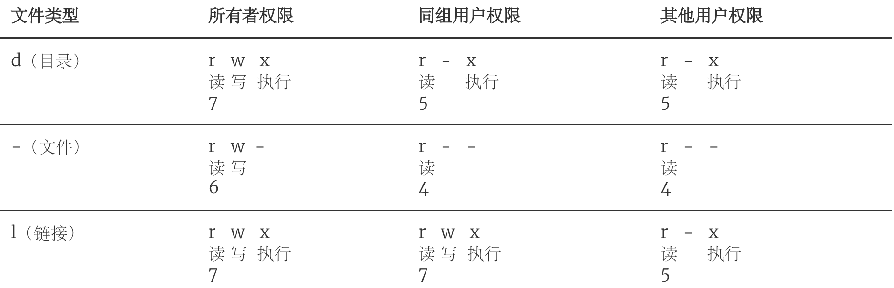
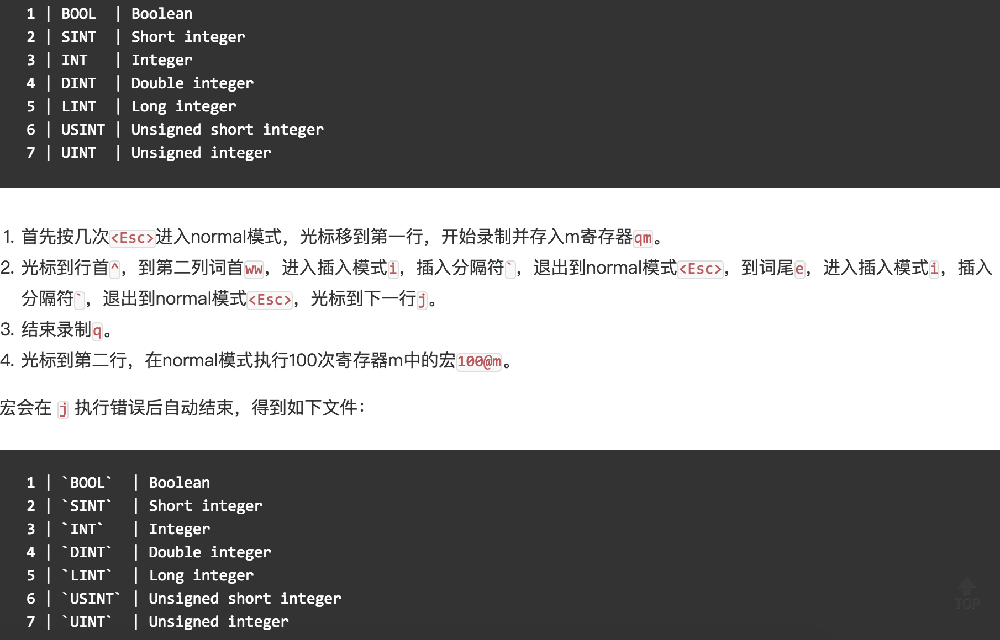

## Play with the Linux operating system

> **Description**: The explanations of Linux commands in this article are based on the Linux distribution called CentOS. I use Alibaba Cloud Server, and the system version is CentOS Linux release 7.6.1810. Different Linux distributions have some differences in Shell commands and utilities, but these differences are small.

### Operating System History

A computer system with only hardware and no software is called "bare metal". It is difficult for us to use "bare metal" to complete the daily work of the computer (such as storage and computing), so specific software must be used to control the work of the hardware. The software closest to computer hardware is system software, the most important of which is the "operating system". An "operating system" is a collection of programs that control and manage the entire computer hardware and software resources, implement resource allocation and task allocation, and provide an interface and environment for system users and other software.

#### No operating system (manual operation)

In the days when the computer was born without an operating system, people first put the program tape (or card) on the computer, then started the input machine to send the program into the computer, and then started the program through the console switch. When the program is executed, the printer outputs the result of the calculation, and the user removes and removes the paper tape (or card). The second user goes on the computer and repeats the same steps. During the whole process, the user monopolizes the machine, the CPU waits for manual operation, and the resource utilization rate is extremely low.

#### Batch system

First, a supervisory program on the computer is started. Under the control of the supervisory program, the computer can automatically and batch process the jobs of one or more users. After completing a batch of jobs, the supervisory level reads the jobs from the input machine and stores them on the tape drive. Repeat the processing task as above. The supervisory program continuously processes each operation, realizes the automatic transfer of the operation, reduces the establishment time and manual operation time of the operation, and improves the utilization rate of computer resources. Batch processing systems can be further divided into single batch processing systems, multi-channel batch processing systems, online batch processing systems, and offline batch processing systems.

#### Time-sharing system and real-time system

The time-sharing system divides the running time of the processor into very short time slices, and allocates the processor to each online job in turn according to the time slice. If a job cannot complete its computation within the time slice allocated to it, the job is temporarily interrupted, and the processor is given over to another job to continue its operation when it waits for the next round of scheduling. Because of the speed of the computer, the jobs are rotated quickly, giving each user the impression that he has a single computer. Each user can issue various operation control commands to the system through his own terminal, and complete the operation of the job under the condition of sufficient human-computer interaction. In order to solve the situation that the time-sharing system cannot respond to the user's instructions in a timely manner, a real-time system that can complete event processing within a strict time frame and respond to random external events in a timely manner has emerged.

#### Universal Operating System

1. 1960s: IBM's System/360 series of machines had a unified operating system OS/360.

2. 1965: AT&T's Bell Labs joined GE and MIT in a collaborative program to develop MULTICS.

3. 1969: The MULTICS project failed, Ken Tompson was out of work, and developed Unics in assembly language on the then-obsolete PDP-7 in order to play the "Space Travel" game.

   > Note: It is hard to imagine that such a great system as Unix is ​​actually developed by a programmer who is idle at home (the key is that his wife returned to her parents' house and brought her children) on a obsolete device to play games.

4. 1970~1971: Ken Tompson and Dennis Ritchie rewrote Unics on the PDP-11 in B and renamed it Unix at the suggestion of Brian Kernighan.

   

5. 1972~1973: Dennis Ritchie invented the C language to replace the less portable B language and started the work of rewriting Unix in C language.

6. 1974: Unix releases its landmark fifth edition, implemented almost entirely in C.

7. 1979: Beginning with Unix version 7, AT&T issues new terms of use, privatizing Unix.

8. 1987: Professor Andrew S. Tanenbaum decided to develop a Unix-compatible operating system without using any AT&T source code in order to explain the details of the operation of the operating system to the students in class to avoid copyright disputes , the system was named Minix.

   

9. 1991: When Linus Torvalds was studying at the University of Helsinki, Finland, he tried to do some development work on Minix, but because Minix was only used as an operating system for teaching purposes, the function was not powerful. In order to facilitate the school's newsgroup and mail system To read, write and download files, Linus wrote the disk driver and file system, which formed the prototype of the Linux system kernel.

   

The following figure is a map of the Unix operating system family.


### Linux overview

Linux is a general purpose operating system. An operating system is responsible for scheduling tasks, allocating memory, and handling peripheral I/O. The operating system usually consists of two parts: the kernel (the core program that runs other programs and manages hardware devices such as disks and printers) and the system program (device drivers, underlying libraries, shells, service programs, etc.).

The Linux kernel was developed by Finn Linus Torvalds and released in September 1991. As a product of the Internet era, the Linux operating system is jointly developed by many developers around the world and is a free operating system (note that freedom and free are not the same concept, if you want to know the difference between the two, you can [click here] ](https://www.debian.org/intro/free)).

### Linux system advantages

1. A general-purpose operating system, not bound to specific hardware.
2. Written in C language, with strong portability and a kernel programming interface.
3. Support multi-user and multi-tasking, support secure layered file system.
4. A large number of utilities, complete network functions and powerful supporting documents.
5. Reliable security and good stability, more friendly to developers.

### Linux system distribution

1. [Redhat](https://www.redhat.com/en)
2. [Ubuntu](https://www.ubuntu.com/)
3. [CentOS](https://www.centos.org/)
4. [Fedora](https://getfedora.org/)
5. [Debian](https://www.debian.org/)
6. [openSUSE](https://www.opensuse.org/)

### Basic commands

Commands in Linux systems are usually in the following format:

```Shell
command name [named arguments] [command object]
````

1. Get login information - **w** / **who** / **last**/ **lastb**.

   ```Shell
   [root ~]# w
    23:31:16 up 12:16, 2 users, load average: 0.00, 0.01, 0.05
   USER TTY FROM LOGIN@ IDLE JCPU PCPU WHAT
   root pts/0 182.139.66.250 23:03 4.00s 0.02s 0.00s w
   jackfrue pts/1 182.139.66.250 23:26 3:56 0.00s 0.00s -bash
   [root ~]# who
   root pts/0 2018-04-12 23:03 (182.139.66.250)
   jackfrued pts/1 2018-04-12 23:26 (182.139.66.250)
   [root ~]# who am i
   root pts/0 2018-04-12 23:03 (182.139.66.250)
   [root ~]# who mom likes
   root pts/0 2018-04-12 23:03 (182.139.66.250)
   [root ~]# last
   root pts/0 117.136.63.184 Sun May 26 18:57 still logged in
   reboot system boot 3.10.0-957.10.1. Mon May 27 02:52 - 19:10 (-7:-42)
   root pts/4 117.136.63.184 Sun May 26 18:51 - crash (08:01)
   root pts/4 117.136.63.184 Sun May 26 18:49 - 18:49 (00:00)
   root pts/3 117.136.63.183 Sun May 26 18:35 - crash (08:17)
   root pts/2 117.136.63.183 Sun May 26 18:34 - crash (08:17)
   root pts/0 117.136.63.183 Sun May 26 18:10 - crash (08:42)
   ````

2. Check the Shell you are using - **ps**.

   Shell, also known as "shell" or "shell program", is a translator for users to communicate with the operating system kernel. Simply put, it is the interface and interface for human-computer interaction. At present, the default shell of many Linux systems is bash (<u>B</u>ourne <u>A</u>gain <u>SH</u>ell), because it can use the tab key for commands and paths Completion, historical commands can be saved, environment variables can be easily configured, and batch operations can be performed.

   ```Shell
   [root ~]# ps
     PID TTY TIME CMD
    3531 pts/0 00:00:00 bash
    3553 pts/0 00:00:00 ps
   ````

3. View the description and location of the command - **whatis** / **which** / **whereis**.

   ```Shell
   [root ~]# whatis ps
   ps (1) - report a snapshot of the current processes.
   [root ~]# whatis python
   python (1) - an interpreted, interactive, object-oriented programming language
   [root ~]# whereis ps
   ps: /usr/bin/ps /usr/share/man/man1/ps.1.gz
   [root ~]# whereis python
   python: /usr/bin/python /usr/bin/python2.7 /usr/lib/python2.7 /usr/lib64/python2.7 /etc/python /usr/include/python2.7 /usr/share/man /man1/python.1.gz
   [root ~]# which ps
   /usr/bin/ps
   [root ~]# which python
   /usr/bin/python
   ````

4. Clear what is displayed on the screen - **clear**.

5. View help documentation - **man** / **info** / **--help** / **apropos**.
   ```Shell
   [root@izwz97tbgo9lkabnat2lo8z ~]# ps --help
   Usage:
    ps [options]
    Try 'ps --help <simple|list|output|threads|misc|all>'
     or 'ps --help <s|l|o|t|m|a>'
    for additional help text.
   For more details see ps(1).
   [root@izwz97tbgo9lkabnat2lo8z ~]# man ps
   PS(1) User Commands PS(1)
   NAME
          ps - report a snapshot of the current processes.
   SYNOPSIS
          ps [options]
   DESCRIPTION
   ...
   ````

6. View system and hostnames - **uname** / **hostname**.

   ```Shell
   [root@izwz97tbgo9lkabnat2lo8z ~]# uname
   Linux
   [root@izwz97tbgo9lkabnat2lo8z ~]# hostname
   izwz97tbgo9lkabnat2lo8z
   [root@iZwz97tbgo9lkabnat2lo8Z ~]# cat /etc/centos-release
   CentOS Linux release 7.6.1810 (Core)
   ````

   > Description: `cat` is a command to connect the contents of a file and print to standard output, which will be described later; `/etc` is a very important directory on Linux systems, which saves a lot of configuration files; `centos` -release` is a file in this directory, because the Linux distribution I use myself is CentOS 7.6, so there will be such a file here.

7. Time and Date - **date** / **cal**.

   ```Shell
   [root@iZwz97tbgo9lkabnat2lo8Z ~]# date
   Wed Jun 20 12:53:19 CST 2018
   [root@iZwz97tbgo9lkabnat2lo8Z ~]# cal
         June 2018
   Su Mo Tu We Th Fr Sa
                   1 2
    3 4 5 6 7 8 9
   10 11 12 13 14 15 16
   17 18 19 20 21 22 23
   24 25 26 27 28 29 30
   [root@iZwz97tbgo9lkabnat2lo8Z ~]# cal 5 2017
         May 2017
   Su Mo Tu We Th Fr Sa
       1 2 3 4 5 6
    7 8 9 10 11 12 13
   14 15 16 17 18 19 20
   21 22 23 24 25 26 27
   28 29 30 31
   ````
   
8. Reboot and Shutdown - **reboot** / **shutdown**.

   ```Shell
   [root ~]# shutdown -h +5
   Shutdown scheduled for Sun 2019-05-26 19:34:27 CST, use 'shutdown -c' to cancel.
   [root ~]#
   Broadcast message from root (Sun 2019-05-26 19:29:27 CST):
   
   The system is going down for power-off at Sun 2019-05-26 19:34:27 CST!
   [root ~]# shutdown -c
   
   Broadcast message from root (Sun 2019-05-26 19:30:22 CST):
   
   The system shutdown has been cancelled at Sun 2019-05-26 19:31:22 CST!
   [root ~]# shutdown -r 23:58
   Shutdown scheduled for Sun 2019-05-26 23:58:00 CST, use 'shutdown -c' to cancel.
   [root ~]# shutdown -c
   
   Broadcast message from root (Sun 2019-05-26 19:31:06 CST):
   
   The system shutdown has been cancelled at Sun 2019-05-26 19:32:06 CST!
   ````

   > Description: When executing the `shutdown` command, a warning will be issued to the user who logs in to the system. You can replace the default warning message with a warning message after the command, or you can use `now` after the `-h` parameter to indicate immediate Shut down.

9. To log out - **exit** / **logout**.

10. View history command - **history**.

  ```Shell
  [root@iZwz97tbgo9lkabnat2lo8Z ~]# history
  ...
  452 ls
  453 cd Python-3.6.5/
  454 clear
  455 history
  [root@iZwz97tbgo9lkabnat2lo8Z ~]# !454
  ````

  > **Note**: After viewing the history command, you can use `!History command number` to re-execute the command; `history -c` can clear the history command.

### Utilities

#### File and folder operations

1. Create/delete empty directories - **mkdir** / **rmdir**.

   ```Shell
   [root ~]# mkdir abc
   [root ~]# mkdir -p xyz/abc
   [root ~]# rmdir abc
   ````

2. Create/Delete files - **touch** / **rm**.

   ```Shell
   [root ~]# touch readme.txt
   [root ~]# touch error.txt
   [root ~]# rm error.txt
   rm: remove regular empty file ‘error.txt’? y
   [root ~]# rm -rf xyz
   ````

   - The `touch` command is used to create a blank file or modify the file time. There are three times for a file in a Linux system:
     - Time when the content was changed - mtime.
     - Time to change permissions - ctime.
     - Last access time - atime.
   - Several important parameters of `rm`:
     - `-i`: Interactive delete, interrogated for each delete item.
     - `-r`: delete directory and recursively delete files and directories in the directory.
     - `-f`: Force delete, ignore non-existing files, without any prompt.

3. Switch and view the current working directory - **cd** / **pwd**.

   > Description: The `cd` command can be followed by a relative path (using the current path as a reference) or an absolute path (starting with `/`) to switch to the specified directory, or you can use `cd ..` to return to the previous directory . Please think about it, if you want to return to the previous directory, what parameters should be added to the `cd` command?

4. View directory contents - **ls**.

   - `-l`: View files and directories in long format.
   - `-a`: Show files and directories starting with a dot (hidden files).
   - `-R`: recursively expand when encountering a directory (continue to list files and directories under the directory).
   - `-d`: List only directories, nothing else.
   - `-S` / `-t`: Sort by size/time.

5. View file content - **cat** / **tac** / **head** / **tail** / **more** / **less** / **rev** / ** od**.

   ```Shell
   [root ~]# wget http://www.sohu.com/ -O sohu.html
   --2018-06-20 18:42:34-- http://www.sohu.com/
   Resolving www.sohu.com (www.sohu.com)... 14.18.240.6
   Connecting to www.sohu.com (www.sohu.com)|14.18.240.6|:80... connected.
   HTTP request sent, awaiting response... 200 OK
   Length: 212527 (208K) [text/html]
   Saving to: ‘sohu.html’
   100%[================================================ ===>] 212,527 --.-K/s in 0.03s
   2018-06-20 18:42:34 (7.48 MB/s) - ‘sohu.html’ saved [212527/212527]
   [root ~]# cat sohu.html
   ...
   [root ~]# head -10 sohu.html
   <!DOCTYPE html>
   <html>
   <head>
   <title>Sohu</title>
   <meta name="Keywords" content="Sohu, portals, new media, online media, news, finance, sports, entertainment, fashion, cars, real estate, technology, pictures, forums, microblogs, blogs, videos, movies, TV series"/>
   <meta name="Description" content="Sohu.com provides users with 24-hour uninterrupted latest information, as well as network services such as search and email. The content includes global hot events, breaking news, current affairs reviews, popular TV dramas, sports Events, industry trends, life service information, and interactive spaces such as forums, blogs, Weibo, and My Sohu." />
   <meta name="shenma-site-verification" content="1237e4d02a3d8d73e96cbd97b699e9c3_1504254750">
   <meta charset="utf-8"/>
   <meta http-equiv="X-UA-Compatible" content="IE=Edge,chrome=1"/>
   [root ~]# tail -2 sohu.html
   </body>
   </html>
   [root ~]# less sohu.html
   ...
   [root ~]# cat -n sohu.html | more
   ...
   ````
   

> **Note**: The above uses a command named `wget`, which is a network downloader program that can download resources from a specified URL.

6. Copy/Move files - **cp** / **mv**.

   ```Shell
   [root ~]# mkdir backup
   [root ~]# cp sohu.html backup/
   [root ~]# cd backup
   [root backup]# ls
   sohu.html
   [root backup]# mv sohu.html sohu_index.html
   [root backup]# ls
   sohu_index.html
   ````

7. File Rename - **rename**.

  ```Shell
  [root@iZwz97tbgo9lkabnat2lo8Z ~]# rename .htm .html *.htm
  ````

8. Find files and find content - **find** / **grep**.

   ```Shell
   [root@iZwz97tbgo9lkabnat2lo8Z ~]# find / -name "*.html"
   /root/sohu.html
   /root/backup/sohu_index.html
   [root@izwz97tbgo9lkabnat2lo8z ~]# find . -atime 7 -type f -print
   [root@izwz97tbgo9lkabnat2lo8z ~]# find . -type f -size +2k
   [root@izwz97tbgo9lkabnat2lo8z ~]# find . -type f -name "*.swp" -delete
   [root@iZwz97tbgo9lkabnat2lo8Z ~]# grep "<script>" sohu.html -n
   20:<script>
   [root@iZwz97tbgo9lkabnat2lo8Z ~]# grep -E \<\/?script.*\> sohu.html -n
   20:<script>
   22:</script>
   24:<script src="//statics.itc.cn/web/v3/static/js/es5-shim-08e41cfc3e.min.js"></script>
   25:<script src="//statics.itc.cn/web/v3/static/js/es5-sham-1d5fa1124b.min.js"></script>
   26:<script src="//statics.itc.cn/web/v3/static/js/html5shiv-21fc8c2ba6.js"></script>
   29:<script type="text/javascript">
   52:</script>
   ...
   ````
   > **Note**: `grep` can use regular expressions when searching for strings. If you need to use regular expressions, you can use `grep -E` or use `egrep` directly.

9. Create Links and View Links - **ln** / **readlink**.

   ```Shell
   [root@iZwz97tbgo9lkabnat2lo8Z ~]# ls -l sohu.html
   -rw-r--r-- 1 root root 212131 Jun 20 19:15 sohu.html
   [root@iZwz97tbgo9lkabnat2lo8Z ~]# ln /root/sohu.html /root/backup/sohu_backup
   [root@iZwz97tbgo9lkabnat2lo8Z ~]# ls -l sohu.html
   -rw-r--r-- 2 root root 212131 Jun 20 19:15 sohu.html
   [root@iZwz97tbgo9lkabnat2lo8Z ~]# ln /root/sohu.html /root/backup/sohu_backup2
   [root@iZwz97tbgo9lkabnat2lo8Z ~]# ls -l sohu.html
   -rw-r--r-- 3 root root 212131 Jun 20 19:15 sohu.html
   [root@iZwz97tbgo9lkabnat2lo8Z ~]# ln -s /etc/centos-release sysinfo
   [root@iZwz97tbgo9lkabnat2lo8Z ~]# ls -l sysinfo
   lrwxrwxrwx 1 root root 19 Jun 20 19:21 sysinfo -> /etc/centos-release
   [root@iZwz97tbgo9lkabnat2lo8Z ~]# cat sysinfo
   CentOS Linux release 7.4.1708 (Core)
   [root@iZwz97tbgo9lkabnat2lo8Z ~]# cat /etc/centos-release
   CentOS Linux release 7.4.1708 (Core)
   ````

   > **Description**: Links can be divided into hard links and soft links (symbolic links). A hard link can be thought of as a pointer to file data, just like the reference count of an object in Python. Each time a hard link is added, the number of links corresponding to the file increases by 1. Only when the number of links to the file is 0, the number of links corresponding to the file is 0. The storage space may be overwritten by other files. When we usually delete files, we don't actually delete the data on the hard disk. What we delete is just a pointer, or a usage record of data, so software like "File Shredder" does not delete files when "shredding" files. The file pointer will also be filled with data in the storage area corresponding to the file to ensure that the file cannot be recovered. Soft links are similar to shortcuts in Windows. When the file linked by the soft link is deleted, the soft link will become invalid.

10. Compress/decompress and archive/dearchive - **gzip** / **gunzip** / **xz**.

  ```Shell
  [root@iZwz97tbgo9lkabnat2lo8Z ~]# wget http://download.redis.io/releases/redis-4.0.10.tar.gz
  --2018-06-20 19:29:59-- http://download.redis.io/releases/redis-4.0.10.tar.gz
  Resolving download.redis.io (download.redis.io)... 109.74.203.151
  Connecting to download.redis.io (download.redis.io)|109.74.203.151|:80... connected.
  HTTP request sent, awaiting response... 200 OK
  Length: 1738465 (1.7M) [application/x-gzip]
  Saving to: 'redis-4.0.10.tar.gz'
  100%[================================================ ===>] 1,738,465 70.1KB/s in 74s
  2018-06-20 19:31:14 (22.9 KB/s) - ‘redis-4.0.10.tar.gz’ saved [1738465/1738465]
  [root@iZwz97tbgo9lkabnat2lo8Z ~]# ls redis*
  redis-4.0.10.tar.gz
  [root@iZwz97tbgo9lkabnat2lo8Z ~]# gunzip redis-4.0.10.tar.gz
  [root@iZwz97tbgo9lkabnat2lo8Z ~]# ls redis*
  redis-4.0.10.tar
  ````

11. Archive and unarchive - **tar**.

   ```Shell
   [root@iZwz97tbgo9lkabnat2lo8Z ~]# tar -xvf redis-4.0.10.tar
   redis-4.0.10/
   redis-4.0.10/.gitignore
   redis-4.0.10/00-RELEASENOTES
   redis-4.0.10/BUGS
   redis-4.0.10/CONTRIBUTING
   redis-4.0.10/COPYING
   redis-4.0.10/INSTALL
   redis-4.0.10/MANIFESTO
   redis-4.0.10/Makefile
   redis-4.0.10/README.md
   redis-4.0.10/deps/
   redis-4.0.10/deps/Makefile
   redis-4.0.10/deps/README.md
   ...
   ````
   
> Description: Archive (also known as creating an archive) and dearchiving both use the `tar` command. Usually, creating an archive requires three parameters of `-cvf`, where `c` means create (create), and `v` means display the details of creating an archive (verbose), `f` indicates the specified archive file (file); unarchive needs to be added with the `-xvf` parameter, where `x` indicates extraction (extract), and the other two parameters are the same as creating an archive.

12. Convert standard input to command line arguments - **xargs**.

   The following command will search for html files in the current path, and then pass these files as parameters to the `rm` command through `xargs` to find and delete files.

   ```Shell
   [root@iZwz97tbgo9lkabnat2lo8Z ~]# find . -type f -name "*.html" | xargs rm -f
   ````

   The following command turns the multi-line content in the a.txt file into one line and outputs it to the b.txt file, where `<` means reading input from a.txt, `>` means outputting the execution result of the command to b .txt.

   ```Shell
   [root@iZwz97tbgo9lkabnat2lo8Z ~]# xargs < a.txt > b.txt
   ````

   > **Description**: This command is often used in pipe (a way to implement inter-process communication) and redirection (redesignate the location of input and output) operations as demonstrated above, which will be discussed in the following sections. to pipe operations and input and output redirection operations.

13. Display file or directory - **basename** / **dirname**.

14. Other related tools.

   - **sort** - sort content
   - **uniq** - remove adjacent duplicates
   - **tr** - replace the specified content with new content
   - **cut** / **paste** - cut/paste content
   - **split** - split file
   - **file** - determine the file type
   - **wc** - count file lines, words, bytes
   - **iconv** - encoding conversion

   ```Shell
   [root ~]# cat foo.txt
   grape
   apple
   pitaya
   [root ~]# cat bar.txt
   100
   200
   300
   400
   [root ~]# paste foo.txt bar.txt
   grape 100
   apple 200
   pitaya 300
           400
   [root ~]# paste foo.txt bar.txt > hello.txt
   [root ~]# cut -b 4-8 hello.txt
   pe 10
   le 20
   aya 3
   0
   [root ~]# cat hello.txt | tr '\t' ','
   grape, 100
   apple,200
   pitaya,300
   ,400
   [root ~]# split -l 100 sohu.html hello
   [root ~]# wget https://www.baidu.com/img/bd_logo1.png
   [root ~]# file bd_logo1.png
   bd_logo1.png: PNG image data, 540 x 258, 8-bit colormap, non-interlaced
   [root ~]# wc sohu.html
     2979 6355 212527 sohu.html
   [root ~]# wc -l sohu.html
   2979 sohu.html
   [root ~]# wget http://www.qq.com -O qq.html
   [root ~]# iconv -f gb2312 -t utf-8 qq.html
   ````

#### Pipes and redirects

1. Use of pipes - **\|**.

   Example: Find the number of files in the current directory.

   ```Shell
   [root ~]# find ./ | wc -l
   6152
   ````

   Example: List the files and folders in the current path, adding a number to each item.

   ```Shell
   [root ~]# ls | cat -n
        1 dump.rdb
        2 mongodb-3.6.5
        3 Python-3.6.5
        4 redis-3.2.11
        5 redis.conf
   ````

   Example: Find the total number of records in record.log that contain AAA but not BBB

   ```Shell
   [root ~]# cat record.log | grep AAA | grep -v BBB | wc -l
   ````

2. Output redirection and error redirection - **\>** / **>>** / **2\>**.

   ```Shell
   [root ~]# cat readme.txt
   banana
   apple
   grape
   apple
   grape
   watermelon
   pear
   pitaya
   [root ~]# cat readme.txt | sort | uniq > result.txt
   [root ~]# cat result.txt
   apple
   banana
   grape
   pear
   pitaya
   watermelon
   ````

3. Enter redirection - **\<**.

   ```Shell
   [root ~]# echo 'hello, world!' > hello.txt
   [root ~]# wall < hello.txt
   [root ~]#
   Broadcast message from root (Wed Jun 20 19:43:05 2018):
   hello world!
   [root ~]# echo 'I will show you some code.' >> hello.txt
   [root ~]# wall < hello.txt
   [root ~]#
   Broadcast message from root (Wed Jun 20 19:43:55 2018):
   hello world!
   I will show you some code.
   ````

4. Multiple redirects - **tee**.

   The following command will append output to the `ls.txt` file in addition to displaying the result of the command `ls` in the terminal.

   ```Shell
   [root ~]# ls | tee -a ls.txt
   ````

#### Aliases

1. **alias**

   ```Shell
   [root ~]# alias ll='ls -l'
   [root ~]# alias frm='rm -rf'
   [root ~]# ll
   ...
   drwxr-xr-x 2 root root 4096 Jun 20 12:52 abc
   ...
   [root ~]# frm abc
   ````

2. **unalias**

   ```Shell
   [root ~]# unalias frm
   [root ~]# frm sohu.html
   -bash: frm: command not found
   ````

#### Text processing

1. Character stream editor - **sed**.

   sed is a tool for manipulating, filtering, and transforming textual content. Suppose there is a file called fruit.txt with the following content.

   ```Shell
   [root ~]# cat -n fruit.txt
        1 banana
        2 grapes
        3 apples
        4 watermelon
        5 orange
   ````

   Next, we add a pitaya after line 2.

   ```Shell
   [root ~]# sed '2a pitaya' fruit.txt
   banana
   grape
   pitaya
   apple
   watermelon
   orange
   ````
   
> Note: The command just now, like many of the commands we have talked about before, does not change the fruit.txt file, but outputs the content with a new line added to the terminal. If you want to save it to fruit.txt, you can use the output reset Orientation operation.

   Insert a waxberry before line 2.

   ```Shell
   [root ~]# sed '2i waxberry' fruit.txt
   banana
   waxberry
   grape
   apple
   watermelon
   orange
   ````

   Delete line 3.

   ```Shell
   [root ~]# sed '3d' fruit.txt
   banana
   grape
   watermelon
   orange
   ````

   Delete lines 2 to 4.

   ```Shell
   [root ~]# sed '2,4d' fruit.txt
   banana
   orange
   ````

   Replace the character a in the text with @.

   ```Shell
   [root ~]# sed 's#a#@#' fruit.txt
   b@nana
   gr@pe
   @pple
   w@termelon
   or@nge
   ````

   Replace the character a in the text with @, using the glob pattern.

   ```Shell
   [root ~]# sed 's#a#@#g' fruit.txt
   b@n@n@
   gr@pe
   @pple
   w@termelon
   or@nge
   ````

2. Pattern matching and processing language - **awk**.

   Awk is a programming language and the most powerful tool for processing text in Linux systems. One of its authors and current maintainer is the aforementioned Brian Kernighan (ken and dmr's closest associate). Through this command, you can extract the specified column from the text, use regular expressions to extract the content we want from the text, display the specified line, and perform statistics and operations. In short, it is very powerful.

   Suppose there is a file called fruit2.txt with the following content.

   ```Shell
   [root ~]# cat fruit2.txt
   1 banana 120
   2 grapes 500
   3 apple 1230
   4 watermelon 80
   5 orange 400
   ````

   Display line 3 of the file.

   ```Shell
   [root ~]# awk 'NR==3' fruit2.txt
   3 apple 1230
   ````

   Displays column 2 of the file.

   ```Shell
   [root ~]# awk '{print $2}' fruit2.txt
   banana
   grape
   apple
   watermelon
   orange
   ````

   Displays the last column of the file.

   ```Shell
   [root ~]# awk '{print $NF}' fruit2.txt
   120
   500
   1230
   80
   400
   ````

   Output lines with numbers greater than or equal to 300 at the end.

   ```Shell
   [root ~]# awk '{if($3 >= 300) {print $0}}' fruit2.txt
   2 grapes 500
   3 apple 1230
   5 orange 400
   ````

   The above shows are just the tip of the iceberg of awk commands, and more content is left to the reader to explore in practice.
   
### User Management

1. Create and delete users - **useradd** / **userdel**.

   ```Shell
   [root home]# useradd hellokitty
   [root home]# userdel hellokitty
   ````

   - `-d` - Specify the user home directory for the user when creating the user
   - `-g` - When creating a user, specify the user group to which the user belongs

2. Create and delete user groups - **groupadd** / **groupdel**.

   > Description: User group is mainly for the convenience of management of all users in a group.

3. Change the password - **passwd**.

   ```Shell
   [root ~]# passwd hellokitty
   New password:
   Retype new password:
   passwd: all authentication tokens updated successfully.
   ````

   > Note: The input password and confirmation password are not echoed and must be entered in one go (the backspace key cannot be used). The password and confirmation password must be the same. If the `passwd` command is used without specifying the object of the command, it means that the current user's password is to be changed. If you want to change user passwords in batches, you can use the `chpasswd` command.

   - `-l` / `-u` - lock/unlock user.
   - `-d` - Clear user password.
   - `-e` - Set the password to expire immediately, and the user will be forced to change the password when logging in.
   - `-i` - Set how many days after the password expires to disable the user.

4. View and modify the password validity period - **chage**.

   After setting the hellokitty user for 100 days, the password must be changed, the user will be notified 15 days before the expiration, and the user will be disabled 7 days after the expiration.

   ```Shell
   chage -M 100 -W 15 -I 7 hellokitty
   ````

5. Switch user - **su**.

   ```Shell
   [root ~]# su hellokitty
   [hellokitty root]$
   ````

6. Execute the command as administrator - **sudo**.

   ```Shell
   [hellokitty ~]$ ls /root
   ls: cannot open directory /root: Permission denied
   [hellokitty ~]$ sudo ls /root
   [sudo] password for hellokitty:
   ````

   > **Note**: If you want the user to be able to execute commands as an administrator, the user must appear in the sudoers list. The sudoers file is in the `/etc` directory. If you want to edit the file directly, you can also use the following command.

7. Edit the sudoers file - **visudo**.

   The editor used here is vi, and the knowledge about vi will be explained later. Part of the file looks like this:

   ````
   ## Allow root to run any commands anywhere
   root ALL=(ALL) ALL
   
   ## Allows members of the 'sys' group to run networking, software,
   ## service management apps and more.
   # %sys ALL = NETWORKING, SOFTWARE, SERVICES, STORAGE, DELEGATING, PROCESSES, LOCATE, DRIVERS
   ## Allows people in group wheel to run all commands
   %wheel ALL=(ALL) ALL
   
   ## Same thing without a password
   # %wheel ALL=(ALL) NOPASSWD: ALL
   
   ## Allows members of the users group to mount and unmount the
   ## cdrom as root
   # %users ALL=/sbin/mount /mnt/cdrom, /sbin/umount /mnt/cdrom
   
   ## Allows members of the users group to shutdown this system
   # %users localhost=/sbin/shutdown -h now
   ````

8. Display user and user group information - **id**.

9. Message other users -**write** / **wall**.

   sender:

   ```Shell
   [root ~]# write hellokitty
   Dinner is on me.
   Call me at 6pm.
   ````

   receiver:

   ```Shell
   [hellokitty ~]$
   Message from root on pts/0 at 17:41 ...
   Dinner is on me.
   Call me at 6pm.
   EOF
   ````

10. View/set whether to receive messages from other users - **mesg**.

   ```Shell
   [hellokitty ~]$ mesg
   is y
   [hellokitty ~]$ mesg n
   [hellokitty ~]$ mesg
   is n
   ````

### File system

#### files and paths


1. Naming rules: The maximum length of the file name is related to the file system type. In general, the file name should not exceed 255 characters. Although most characters can be used for the file name, it is best to use English uppercase and lowercase letters. , numbers, underscores, dots and other symbols. Although spaces can be used in the file name, spaces should be avoided as much as possible, otherwise, when entering the file name, you need to put the file name in double quotes or escape the spaces with `\`.
2. Extension: The extension of the file is optional under the Linux system, but the use of the extension helps to understand the content of the file. Some applications need to identify files by extension, but more applications do not rely on file extensions, just as the `file` command does not rely on extensions to determine file types when identifying files.
3. Hidden files: Files starting with a dot are hidden files (invisible files) in Linux systems.

#### Directory Structure

1. /bin - Binaries for basic commands.
2. /boot - Static files for the boot loader.
3. /dev - Device file.
4. **/etc** - Configuration files.
5. /home - The parent directory of the normal user's home directory.
6. /lib - Shared library files.
7. /lib64 - Shared 64-bit library files.
8. /lost+found - Stores unlinked files.
9. /media - Automatically identifies the mount directory of the device.
10. /mnt - Mount point where the filesystem is temporarily mounted.
11. /opt - Optional plugin package installation location.
12. /proc - Kernel and process information.
13. **/root** - Super Admin user home directory.
14. /run - Stores things that the system needs to run.
15. /sbin - Superuser binaries.
16. /sys - Pseudo filesystem for the device.
17. /tmp - Temporary folder.
18. **/usr** - User application directory.
19. /var - Variable data directory.

#### access permission

1. **chmod** - Change the file mode bits.

   ```Shell
   [root ~]# ls -l
   ...
   -rw-r--r-- 1 root root 211878 Jun 19 16:06 sohu.html
   ...
   [root ~]# chmod g+w,o+w sohu.html
   [root ~]# ls -l
   ...
   -rw-rw-rw- 1 root root 211878 Jun 19 16:06 sohu.html
   ...
   [root ~]# chmod 644 sohu.html
   [root ~]# ls -l
   ...
   -rw-r--r-- 1 root root 211878 Jun 19 16:06 sohu.html
   ...
   ````
   > Explanation: As can be seen from the above example, there are two ways to use `chmod` to change the file mode bits: one is the character setting method, and the other is the numerical setting method. In addition to `chmod`, `umask` can be used to specify which permissions will be removed from the default permissions of new files.

   When viewing a directory or file in long format, the displayed results and the values ​​of the corresponding permissions are shown in the following table.

   

2. **chown** - Change the file owner.

    ```Shell
    [root ~]# ls -l
    ...
    -rw-r--r-- 1 root root 54 Jun 20 10:06 readme.txt
    ...
    [root ~]# chown hellokitty readme.txt
    [root ~]# ls -l
    ...
    -rw-r--r-- 1 hellokitty root 54 Jun 20 10:06 readme.txt
    ...
    ````

3. **chgrp** - Change user group.

#### Disk management

1. List the disk usage of the file system - **df**.

   ```Shell
   [root ~]# df -h
   Filesystem Size Used Avail Use% Mounted on
   /dev/vda1 40G 5.0G 33G 14% /
   devtmpfs 486M 0 486M 0% /dev
   tmpfs 497M 0 497M 0% /dev/shm
   tmpfs 497M 356K 496M 1% /run
   tmpfs 497M 0 497M 0% /sys/fs/cgroup
   tmpfs 100M 0 100M 0% /run/user/0
   ````

2. Disk partition table operation - **fdisk**.

   ```Shell
   [root ~]# fdisk -l
   Disk /dev/vda: 42.9 GB, 42949672960 bytes, 83886080 sectors
   Units = sectors of 1 * 512 = 512 bytes
   Sector size (logical/physical): 512 bytes / 512 bytes
   I/O size (minimum/optimal): 512 bytes / 512 bytes
   Disk label type: dos
   Disk identifier: 0x000a42f4
      Device Boot Start End Blocks Id System
   /dev/vda1 * 2048 83884031 41940992 83 Linux
   Disk /dev/vdb: 21.5 GB, 21474836480 bytes, 41943040 sectors
   Units = sectors of 1 * 512 = 512 bytes
   Sector size (logical/physical): 512 bytes / 512 bytes
   I/O size (minimum/optimal): 512 bytes / 512 bytes
   ````

3. Disk Partitioning Tool - **parted**.

4. Format the filesystem - **mkfs**.

   ```Shell
   [root ~]# mkfs -t ext4 -v /dev/sdb
   ````

   - `-t` - Specifies the type of filesystem.
   - `-c` - Check for disk corruption when creating a filesystem.
   - `-v` - Display detailed information.

5. File system check - **fsck**.

6. Convert or copy files - **dd**.

7. Mount/Unmount - **mount** / **umount**.

8. Create/Activate/Deactivate swap partition - **mkswap** / **swapon** / **swapoff**.

> **Notes**: Executing the above commands will carry certain risks. If you do not know the usage of these commands, it is best not to use them at will. In the process of using, it is best to refer to the reference materials. Confirm if you want to do this.

### Editor - vim

1. Start vim. You can start vim with the `vi` or `vim` command. You can specify a file name to open a file at startup. If you don't specify a file name, you can also specify a file name when saving.

   ```Shell
   [root ~]# vim guess.py
   ````

2. Command mode, edit mode and last line mode: Start vim to enter the command mode (also known as Normal mode), enter the English letter `i` in the command mode to enter the edit mode (Insert mode), and ` appears at the bottom of the screen -- INSERT --` Prompt; press `Esc` in edit mode to return to command mode. At this time, if you enter English `:`, it will enter the last line mode. In the last line mode, you can enter `q!` Forcibly exit vim under the condition of saving the current work; enter `v` in the command mode to enter the visual mode (Visual mode), you can use the cursor to select an area and then complete the corresponding operation.

3. Save and exit vim: enter `:` in command mode to enter the last line mode, enter `wq` to save and exit; if you want to give up the edited content, enter `q!` to force quit, which has been mentioned just now Now; in command mode, you can also directly input `ZZ` to save and exit. If you just want to save the file without exiting, you can enter `w` in the last line mode; you can enter a space after `w` and then specify the file name to be saved.

4. Cursor operation.

   - In the command mode, you can use `h`, `j`, `k`, `l` to control the cursor to move to the left, down, up, and right. You can enter numbers before the letters to indicate the moving distance, for example : `10h` means move 10 characters to the left.
   - In command mode, you can use `Ctrl+y` and `Ctrl+e` to scroll up and down a line of text, and you can use `Ctrl+f` and `Ctrl+b` to scroll forward and backward Page turning operation.
   - In command mode, the cursor can be moved to the end of the file by entering the English letter `G`, the cursor can be moved to the beginning of the file by `gg`, or the cursor can be moved to the specified number by entering a number before `G` line.

5. Text manipulation.

   - Delete: in command mode, you can use `dd` to delete the entire line; you can add a number before `dd` to specify the number of lines to delete; you can use `d$` to delete the operation from the cursor to the end of the line , you can also use `d0` to delete from the cursor to the beginning of the line; if you want to delete a word, you can use `dw`; if you want to delete the full text, you can enter `:%d` (where `:` use to enter last-line mode from command mode).
   - Copy and paste: In command mode, you can use `yy` to copy the entire line; you can specify the number of lines to be copied by adding a number before `yy`; you can use `p` to paste the copied content to the place where the cursor is.
   - Undo and redo: Enter `u` in command mode to undo the previous operation; use `Ctrl+r` to redo the undone operation.
   - Sort content: enter `%!sort` in command mode.

6. Find and replace.

   - The search operation needs to enter `/` to enter the last line mode and provide a regular expression to match the corresponding content, for example: `/doc.*\.`, enter `n` to search forward, you can also enter `N ` to search backwards.
   - The replacement operation needs to enter `:` to enter the last line mode and specify the search range, regular expression, replaced content and matching options, for example: `:1,$s/doc.*/hello/gice`, where:
     - `g` - global: global match.
     - `i` - ignore case: ignore case matching.
     - `c` - confirm: Require confirmation when replacing.
     - `e` - error: Ignore errors.
	 
7. Parameter setting: You can set vim after entering `:` to enter the last line mode.

   - Set the number of spaces in the Tab key: `set ts=4`

   - Set to show/not show line numbers: `set nu` / `set nonu`

   - Set to enable/disable syntax highlighting: `syntax on` / `syntax off`

   - Set the display ruler (row and column where the cursor is): `set ruler`

   - Set to enable/disable search result highlighting: `set hls` / `set nohls`

     > Note: If you want the above settings to take effect automatically every time you start vim, you need to write these settings to the .vimrc file in the user's home directory.

8. Advanced Techniques

   - Compare multiple files.

     ```Shell
     [root ~]# vim -d foo.txt bar.txt
     ````
     

   - Open multiple files.

     ```Shell
     [root ~]# vim foo.txt bar.txt hello.txt
     ````

     After starting vim, only one window displays foo.txt. You can enter `ls` in the last line mode to view the three open files, or you can enter `b <num>` in the last line mode to display another file. , for example, `:b 2` can be used to display bar.txt, and `:b 3` can be used to display hello.txt.

   - Split and switch windows.

     You can enter `sp` or `vs` in the last line mode to achieve horizontal or vertical splitting of the window, so that we can open multiple editing windows at the same time, and the editing window can be realized by pressing `Ctrl+w` twice Switching, executing the exit operation in one window will only close the corresponding window, and other windows will continue to remain.

     

   - Mapping shortcut keys: Some common operations can be mapped to shortcut keys under vim to improve work efficiency.
     - Example 1: Enter `F4` in command mode to delete 10000 lines of code from the first line.

       `:map <F4>gg10000dd`.

       Example 2: Entering `__main` in edit mode is directly completed as `if __name__ == '__main__':`.

       `:inoremap __main if __name__ == '__main__':`

     > Explanation: `i` in `inoremap` in example 2 above means that the mapped key is used in edit mode, `nore` means not recursive, this is very important, otherwise if the key itself appears in the content corresponding to the key, it will be Causes recursion (equivalent to entering an infinite loop). If you want the mapped shortcut keys to take effect every time you start vim, you need to write the mapping to the .vimrc file in the user's home directory.

   - Record macros.

     - Enter `qa` in command mode to start recording the macro (where `a` is the name of the register, it can also be other English letters or numbers 0-9).

     - Perform your actions (cursor actions, editing actions, etc.) and they will all be recorded.

     - If the recording operation has been completed, press `q` to end the recording.

     - Play the macro through `@a` (`a` is the name of the register just used), if you want to execute the macro multiple times, you can add a number in front, for example `100@a` means to play the macro 100 times.

     - You can try the following example to experience the operation of recording macros, the example comes from [Harttle Land website](https://harttle.land/tags.html#Vim), the website provides a lot about the use of vim Skills, if you are interested, you can learn about it.

       

### Software installation and configuration

#### Using package management tools

1. **yum** - Yellowdog Updater Modified.
   - `yum search`: Search for packages, e.g. `yum search nginx`.
   - `yum list installed`: List installed packages, e.g. `yum list installed | grep zlib`.
   - `yum install`: Install a package, eg `yum install nginx`.
   - `yum remove`: remove a package, e.g. `yum remove nginx`.
   - `yum update`: update packages, for example `yum update` can update all packages, while `yum update tar` will only update tar.
   - `yum check-update`: Check which packages are available for update.
   - `yum info`: Display information about packages, such as `yum info nginx`.
2. **rpm** - Redhat Package Manager.
   - Install the package: `rpm -ivh <packagename>.rpm`.
   - To remove a package: `rpm -e <packagename>`.
   - Query packages: `rpm -qa`, for example, you can use `rpm -qa | grep mysql` to check whether MySQL-related packages are installed.

The following uses Nginx as an example to demonstrate how to use yum to install software.

```Shell
[root ~]# yum -y install nginx
...
Installed:
  nginx.x86_64 1:1.12.2-2.el7
Dependency Installed:
  nginx-all-modules.noarch 1:1.12.2-2.el7
  nginx-mod-http-geoip.x86_64 1:1.12.2-2.el7
  nginx-mod-http-image-filter.x86_64 1:1.12.2-2.el7
  nginx-mod-http-perl.x86_64 1:1.12.2-2.el7
  nginx-mod-http-xslt-filter.x86_64 1:1.12.2-2.el7
  nginx-mod-mail.x86_64 1:1.12.2-2.el7
  nginx-mod-stream.x86_64 1:1.12.2-2.el7
Complete!
[root ~]# yum info nginx
Loaded plugins: fastestmirror
Loading mirror speeds from cached hostfile
Installed Packages
Name : nginx
Arch : x86_64
Epoch : 1
Version : 1.12.2
Release : 2.el7
Size : 1.5M
Repo : installed
From repo : epel
Summary : A high performance web server and reverse proxy server
URL : http://nginx.org/
License : BSD
Description : Nginx is a web server and a reverse proxy server for HTTP, SMTP, POP3 and
            : IMAP protocols, with a strong focus on high concurrency, performance and low
            : memory usage.
[root ~]# nginx -v
nginx version: nginx/1.12.2
````

Remove Nginx.

```Shell
[root ~]# yum -y remove nginx
````

The following uses MySQL as an example to demonstrate how to use rpm to install software. To install MySQL, you need to go to the [MySQL official website](https://www.mysql.com/) to download the corresponding [RPM file](https://dev.mysql.com/downloads/mysql/), of course, choose The version corresponding to the Linux system you are using. MySQL is now a product of Oracle Corporation. After MySQL was acquired, the author of MySQL remade a MySQL fork, MariaDB, which can be installed through yum.

```Shell
[root mysql]# ls
mysql-community-client-5.7.22-1.el7.x86_64.rpm
mysql-community-common-5.7.22-1.el7.x86_64.rpm
mysql-community-libs-5.7.22-1.el7.x86_64.rpm
mysql-community-server-5.7.22-1.el7.x86_64.rpm
[root mysql]# yum -y remove mariadb-libs
[root mysql]# yum -y install libaio
[root mysql]#rpm -ivh mysql-community-common-5.7.26-1.el7.x86_64.rpm
...
[root mysql]#rpm -ivh mysql-community-libs-5.7.26-1.el7.x86_64.rpm
...
[root mysql]#rpm -ivh mysql-community-client-5.7.26-1.el7.x86_64.rpm
...
[root mysql]#rpm -ivh mysql-community-server-5.7.26-1.el7.x86_64.rpm
...
````

> Note: Since the underlying dependencies of MySQL and [MariaDB](https://mariadb.org/) are in conflict, we first used `yum` to remove the dependency library named mariadb-libs and installed it A dependent library named libaio that supports asynchronous I/O operations. Regarding the relationship between MySQL and MariaDB, you can read the introduction about MariaDB on [Wikipedia](https://zh.wikipedia.org/wiki/MariaDB).

Remove the installed MySQL.

```Shell
[root ~]# rpm -qa | grep mysql | xargs rpm -e
````

#### Download and unzip the configuration environment variables

The following takes installing MongoDB as an example to demonstrate how this type of software should be installed.

```Shell
[root ~]# wget https://fastdl.mongodb.org/linux/mongodb-linux-x86_64-rhel70-3.6.5.tgz
--2018-06-21 18:32:53-- https://fastdl.mongodb.org/linux/mongodb-linux-x86_64-rhel70-3.6.5.tgz
Resolving fastdl.mongodb.org (fastdl.mongodb.org)... 52.85.83.16, 52.85.83.228, 52.85.83.186, ...
Connecting to fastdl.mongodb.org (fastdl.mongodb.org)|52.85.83.16|:443... connected.
HTTP request sent, awaiting response... 200 OK
Length: 100564462 (96M) [application/x-gzip]
Saving to: 'mongodb-linux-x86_64-rhel70-3.6.5.tgz'
100%[================================================ ===>] 100,564,462 630KB/s in 2m 9s
2018-06-21 18:35:04 (760 KB/s) - 'mongodb-linux-x86_64-rhel70-3.6.5.tgz' saved [100564462/100564462]
[root ~]# gunzip mongodb-linux-x86_64-rhel70-3.6.5.tgz
[root ~]# tar -xvf mongodb-linux-x86_64-rhel70-3.6.5.tar
mongodb-linux-x86_64-rhel70-3.6.5/README
mongodb-linux-x86_64-rhel70-3.6.5/THIRD-PARTY-NOTICES
mongodb-linux-x86_64-rhel70-3.6.5/MPL-2
mongodb-linux-x86_64-rhel70-3.6.5/GNU-AGPL-3.0
mongodb-linux-x86_64-rhel70-3.6.5/bin/mongodump
mongodb-linux-x86_64-rhel70-3.6.5/bin/mongorestore
mongodb-linux-x86_64-rhel70-3.6.5/bin/mongoexport
mongodb-linux-x86_64-rhel70-3.6.5/bin/mongoimport
mongodb-linux-x86_64-rhel70-3.6.5/bin/mongostat
mongodb-linux-x86_64-rhel70-3.6.5/bin/mongotop
mongodb-linux-x86_64-rhel70-3.6.5/bin/bsondump
mongodb-linux-x86_64-rhel70-3.6.5/bin/mongofiles
mongodb-linux-x86_64-rhel70-3.6.5/bin/mongoreplay
mongodb-linux-x86_64-rhel70-3.6.5/bin/mongoperf
mongodb-linux-x86_64-rhel70-3.6.5/bin/mongod
mongodb-linux-x86_64-rhel70-3.6.5/bin/mongos
mongodb-linux-x86_64-rhel70-3.6.5/bin/mongo
mongodb-linux-x86_64-rhel70-3.6.5/bin/install_compass
[root ~]# vim .bash_profile
...
PATH=$PATH:$HOME/bin:$HOME/mongodb-linux-x86_64-rhel70-3.6.5/bin
export PATH
...
[root ~]# source .bash_profile
[root ~]# mongod --version
db version v3.6.5
git version: a20ecd3e3a174162052ff99913bc2ca9a839d618
OpenSSL version: OpenSSL 1.0.1e-fips 11 Feb 2013
allocator: tcmalloc
modules: none
build environment:
    distmod: rhel70
    distance: x86_64
    target_arch: x86_64
[root ~]# mongo --version
MongoDB shell version v3.6.5
git version: a20ecd3e3a174162052ff99913bc2ca9a839d618
OpenSSL version: OpenSSL 1.0.1e-fips 11 Feb 2013
allocator: tcmalloc
modules: none
build environment:
    distmod: rhel70
    distance: x86_64
    target_arch: x86_64
````

> Description: Of course, you can also install MongoDB through yum. For details, please refer to the instructions given on the [official website](https://docs.mongodb.com/master/administration/install-on-linux/).

#### source code build installation

1. Install Python 3.6.

   ```Shell
   [root ~]# yum install gcc
   [root ~]# wget https://www.python.org/ftp/python/3.6.5/Python-3.6.5.tgz
   [root ~]# gunzip Python-3.6.5.tgz
   [root ~]# tar -xvf Python-3.6.5.tar
   [root ~]# cd Python-3.6.5
   [root ~]# ./configure --prefix=/usr/local/python36 --enable-optimizations
   [root ~]# yum -y install zlib-devel bzip2-devel openssl-devel ncurses-devel sqlite-devel readline-devel tk-devel gdbm-devel db4-devel libpcap-devel xz-devel
   [root ~]# make && make install
   ...
   [root ~]# ln -s /usr/local/python36/bin/python3.6 /usr/bin/python3
   [root ~]# python3 --version
   Python 3.6.5
   [root ~]# python3 -m pip install -U pip
   [root ~]# pip3 --version
   ````

   > Note: After installing Python, you also need to register the PATH environment variable, and register the absolute path of the bin folder in the Python installation path to the PATH environment variable. Registering environment variables can modify the .bash_profile in the user's home directory or the profile file in the /etc directory. The difference between the two is that the former is equivalent to a user environment variable, while the latter is equivalent to a system environment variable.

2. Install Redis-3.2.12.

   ```Shell
   [root ~]# wget http://download.redis.io/releases/redis-3.2.12.tar.gz
   [root ~]# gunzip redis-3.2.12.tar.gz
   [root ~]# tar -xvf redis-3.2.12.tar
   [root ~]# cd redis-3.2.12
   [root ~]# make && make install
   [root ~]# redis-server --version
   Redis server v=3.2.12 sha=00000000:0 malloc=jemalloc-4.0.3 bits=64 build=5bc5cd3c03d6ceb6
   [root ~]# redis-cli --version
   redis-cli 3.2.12
   ````

### Configure service

We can install and configure various services under the Linux system, which means that we can turn the Linux system into a database server, a web server, a cache server, a file server, a message queue server, and so on. Most services under Linux are set as daemons (running in the background of the system, but will not cause Linux to stop running because the service is still running), so the services we install usually have a letter `d after the name `, it is the abbreviation of the English word `daemon`, for example: the firewall service is called firewalld, the MySQL service we installed before is called mysqld, the Apache server is called httpd, etc. After the service is installed, you can use the `systemctl` command or the `service` command to start and stop the service. The specific operations are as follows.

1. Start the firewall service.

   ```Shell
   [root ~]# systemctl start firewalld
   ````

2. Terminate the firewall service.

   ```Shell
   [root ~]# systemctl stop firewalld
   ````

3. Restart the firewall service.

   ```Shell
   [root ~]# systemctl restart firewalld
   ````

4. Check the firewall service status.

    ```Shell
    [root ~]# systemctl status firewalld
    ````

5. Set/disable the firewall service to start automatically at boot.

   ```Shell
   [root ~]# systemctl enable firewalld
   Created symlink from /etc/systemd/system/dbus-org.fedoraproject.FirewallD1.service to /usr/lib/systemd/system/firewalld.service.
   Created symlink from /etc/systemd/system/multi-user.target.wants/firewalld.service to /usr/lib/systemd/system/firewalld.service.
   [root ~]# systemctl disable firewalld
   Removed symlink /etc/systemd/system/multi-user.target.wants/firewalld.service.
   Removed symlink /etc/systemd/system/dbus-org.fedoraproject.FirewallD1.service.
   ````

### Scheduled Tasks

1. Execute the command at the specified time.

   - **at** - Queue the task to execute at the specified time.
   - **atq** - View the queue of pending tasks.
   - **atrm** - removes pending tasks from the queue.

   Specify a task to be executed at 5pm after 3 days.

   ```Shell
   [root ~]# at 5pm+3days
   at> rm -f /root/*.html
   at> <EOT>
   job 9 at Wed Jun 5 17:00:00 2019
   ````

   View the queue of pending tasks.

   ```Shell
   [root ~]# atq
   9 Wed Jun 5 17:00:00 2019 a root
   ````

   Removes the specified task from the queue.

   ```Shell
   [root ~]$ atrm 9
   ````

2. Scheduled tasks table - **crontab**.

   ```Shell
   [root ~]# crontab -e
   * * * * * echo "hello, world!" >> /root/hello.txt
   59 23 * * * rm -f /root/*.log
   ````
   > Description: Entering the `crontab -e` command will open vim to edit the Cron expression and specify the triggered task. Above we have customized two scheduled tasks, one is to append the output to the hello.txt in the /root directory every minute` hello, world!`; the other is to delete the files with the log suffix in the /root directory at 23:59 every day. If you don't know how to write Cron expressions, you can refer to the tips in the /etc/crontab file (described below) or use a search engine to find "Cron Expression Online Generator" to generate Cron expressions.

   The files related to crontab are in the `/etc` directory. You can also customize the scheduled tasks by modifying the crontab file in the `/etc` directory.

   ```Shell
   [root ~]# cd /etc
   [root etc]# ls -l | grep cron
   -rw-------. 1 root root 541 Aug 3 2017 anacrontab
   drwxr-xr-x. 2 root root 4096 Mar 27 11:56 cron.d
   drwxr-xr-x. 2 root root 4096 Mar 27 11:51 cron.daily
   -rw-------. 1 root root 0 Aug 3 2017 cron.deny
   drwxr-xr-x. 2 root root 4096 Mar 27 11:50 cron.hourly
   drwxr-xr-x. 2 root root 4096 Jun 10 2014 cron.monthly
   -rw-r--r-- 1 root root 493 Jun 23 15:09 crontab
   drwxr-xr-x. 2 root root 4096 Jun 10 2014 cron.weekly
   [root etc]# vim crontab
     1 SHELL=/bin/bash
     2 PATH=/sbin:/bin:/usr/sbin:/usr/bin
     3 MAILTO=root
     4
     5 # For details see man 4 crontabs
     6
     7 # Example of job definition:
     8 # .---------------- minute (0 - 59)
     9 # | .------------- hour (0 - 23)
    10 # | | .---------- day of month (1 - 31)
    11 # | | | .------- month (1 - 12) OR jan,feb,mar,apr ...
    12 # | | | | .---- day of week (0 - 6) (Sunday=0 or 7) OR sun,mon,tue,wed,thu,fri,sat
    13 # | | | | |
    14 # * * * * * user-name command to be executed
   ````


### Network access and management

1. Secure Remote Connection - **ssh**.

    ```Shell
    [root ~]$ ssh root@120.77.222.217
    The authenticity of host '120.77.222.217 (120.77.222.217)' can't be established.
    ECDSA key fingerprint is SHA256: BhUhykv+FvnIL03I9cLRpWpaCxI91m9n7zBWrcXRa8w.
    ECDSA key fingerprint is MD5:cc:85:e9:f0:d7:07:1a:26:41:92:77:6b:7f:a0:92:65.
    Are you sure you want to continue connecting (yes/no)? yes
    Warning: Permanently added '120.77.222.217' (ECDSA) to the list of known hosts.
    root@120.77.222.217's password:
    ````

2. Get resources through the network - **wget**.

   - -b background download mode
   - -O Download to the specified directory
   - -r recursive download

3. Send and receive mail - **mail**.

4. Network Configuration Tool (Old) - **ifconfig**.

   ```Shell
   [root ~]# ifconfig eth0
   eth0: flags=4163<UP,BROADCAST,RUNNING,MULTICAST> mtu 1500
           inet 172.18.61.250 netmask 255.255.240.0 broadcast 172.18.63.255
           ether 00:16:3e:02:b6:46 txqueuelen 1000 (Ethernet)
           RX packets 1067841 bytes 1296732947 (1.2 GiB)
           RX errors 0 dropped 0 overruns 0 frame 0
           TX packets 409912 bytes 43569163 (41.5 MiB)
           TX errors 0 dropped 0 overruns 0 carrier 0 collisions
   ````

5. Network Configuration Tool (New) - **ip**.

   ```Shell
   [root ~]# ip address
   1: lo: <LOOPBACK,UP,LOWER_UP> mtu 65536 qdisc noqueue state UNKNOWN qlen 1
       link/loopback 00:00:00:00:00:00 brd 00:00:00:00:00:00
       inet 127.0.0.1/8 scope host lo
          valid_lft forever preferred_lft forever
   2: eth0: <BROADCAST,MULTICAST,UP,LOWER_UP> mtu 1500 qdisc pfifo_fast state UP qlen 1000
       link/ether 00:16:3e:02:b6:46 brd ff:ff:ff:ff:ff:ff
       inet 172.18.61.250/20 brd 172.18.63.255 scope global eth0
          valid_lft forever preferred_lft forever
   ````

6. Network reachability check - **ping**.

   ```Shell
   [root ~]# ping www.baidu.com -c 3
   PING www.a.shifen.com (220.181.111.188) 56(84) bytes of data.
   64 bytes from 220.181.111.188 (220.181.111.188): icmp_seq=1 ttl=51 time=36.3 ms
   64 bytes from 220.181.111.188 (220.181.111.188): icmp_seq=2 ttl=51 time=36.4 ms
   64 bytes from 220.181.111.188 (220.181.111.188): icmp_seq=3 ttl=51 time=36.4 ms
   --- www.a.shifen.com ping statistics ---
   3 packets transmitted, 3 received, 0% packet loss, time 2002ms
   rtt min/avg/max/mdev = 36.392/36.406/36.427/0.156 ms
   ````

7. Display or manage the routing table - **route**.

8. View network services and ports - **netstat** / **ss**.

   ```Shell
   [root ~]# netstat -nap | grep nginx
   ````

9. Network monitoring packet capture - **tcpdump**.

10. Secure File Copy - **scp**.

  ```Shell
  [root ~]# scp root@1.2.3.4:/root/guido.jpg hellokitty@4.3.2.1:/home/hellokitty/pic.jpg
  ````

11. File synchronization tool - **rsync**.

    > Description: Use `rsync` to automatically synchronize files, which is very important for file servers. Regarding the usage of this command, we will explain it in detail when we talk about project deployment later.

12. Secure File Transfer - **sftp**.

    ```Shell
    [root ~]# sftp root@1.2.3.4
    root@1.2.3.4's password:
    Connected to 1.2.3.4.
    sftp>
    ````

    - `help`: Display help information.

    - `ls`/`lls`: Display remote/local directory listings.

    - `cd`/`lcd`: switch remote/local path.

    - `mkdir`/`lmkdir`: create remote/local directories.

    - `pwd`/`lpwd`: Display the remote/local current working directory.

    - `get`: Download a file.

    - `put`: upload a file.

    - `rm`: delete the remote file.

    - `bye`/`exit`/`quit`: Quit sftp.

### Process management

1. View processes - **ps**.

   ```Shell
   [root ~]# ps -ef
   UID PID PPID C STIME TTY TIME CMD
   root 1 0 0 Jun23 ? 00:00:05 /usr/lib/systemd/systemd --switched-root --system --deserialize 21
   root 2 0 0 Jun23 ? 00:00:00 [kthreadd]
   ...
   [root ~]# ps -ef | grep mysqld
   root 4943 4581 0 22:45 pts/0 00:00:00 grep --color=auto mysqld
   mysql 25257 1 0 Jun25 ? 00:00:39 /usr/sbin/mysqld --daemonize --pid-file=/var/run/mysqld/mysqld.pid
   ````

2. Display the process status tree - **pstree**.

    ```Shell
    [root ~]# pstree
    systemd─┬─AliYunDun───18*[{AliYunDun}]
            ├─AliYunDunUpdate───3*[{AliYunDunUpdate}]
            ├─2*[agetty]
            ├─aliyun-service───2*[{aliyun-service}]
            ├─atd
            ├─auditd───{auditd}
            ├─dbus-daemon
            ├─dhclient
            ├─irqbalance
            ├─lvmetad
            ├─mysqld───28*[{mysqld}]
            ├─nginx───2*[nginx]
            ├─ntpd
            ├─polkitd───6*[{polkitd}]
            ├─rsyslogd───2*[{rsyslogd}]
            ├─sshd───sshd───bash───pstree
            ├─systemd-journal
            ├─systemd-logind
            ├─systemd-udevd
            └─tuned───4*[{tuned}]
    ````

3. Find processes matching specified criteria - **pgrep**.

   ```Shell
   [root ~]$ pgrep mysqld
   3584
   ````

4. 进程 进程 号 终止 进程 - ** kill **。

   `` `Shell
   [root ~] $ kill -l
    1) SIGHUP 2) SIGINT 3) SIGQUIT 4) SIGILL 5) SIGTRAP
    6) SIGABRT 7) SIGBUS 8) SIGFPE 9) SIGKILL 10) SIGUSR1
   11) SIGSEGV 12) SIGUSR2 13) SIGPIPE 14) SIGALRM 15) SIGTERM
   16) SIGSTKFLT 17) SIGCHLD 18) SIGCONT 19) SIGSTOP 20) SIGTSTP
   21) SIGTTIN 22) SIGTTOU 23) SIGURG 24) SIGXCPU 25) SIGXFSZ
   26) SIGVTALRM 27) SIGPROF 28) SIGWINCH 29) SIGIO 30) SIGPWR
   31) SIGSYS 34) SIGRTMIN 35) SIGRTMIN + 1 36) SIGRTMIN + 2 37) SIGRTMIN + 3
   38) SIGRTMIN + 4 39) SIGRTMIN + 5 40) SIGRTMIN + 6 41) SIGRTMIN + 7 42) SIGRTMIN + 8
   43) SIGRTMIN + 9 44) SIGRTMIN + 10 45) SIGRTMIN + 11 46) SIGRTMIN + 12 47) SIGRTMIN + 13
   48) SIGRTMIN + 14 49) SIGRTMIN + 15 50) SIGRTMAX-14 51) SIGRTMAX-13 52) SIGRTMAX-12
   53) SIGRTMAX-11 54) SIGRTMAX-10 55) SIGRTMAX-9 56) SIGRTMAX-8 57) SIGRTMAX-7
   58) SIGRTMAX-6 59) SIGRTMAX-5 60) SIGRTMAX-4 61) SIGRTMAX-3 62) SIGRTMAX-2
   63) SIGRTMAX-1 64) SIGRTMAX
   [root ~] # kill 1234
   [root ~] # kill -9 1234
   `` `

   This is a redesign made by Redis.

    `` `Shell
   ps -ef | grep redis | grep -v grep | awk '{print $ 2}' | xargs kill
    `` `

5. 进程 进程 名 终止 进程 - ** killall ** / ** pkill **。

    Mysqld is offline

    `` `Shell
    [root ~] # pkill mysqld
    `` `

    结束 hellokitty 的 的 所有 进程。

    `` `Shell
    [root ~] # pkill -u hellokitty
    `` `

    > 会让 ： 这样 的 会让 ok 会让 ok 会让 会让 会让 会让 会让 会让 会让 会让 会让

6. 进程 进程 置于 后台 运行。。

   - `Ctrl + Z` - tr tr ， 用于 用于 停止 进程 并 置于。。
   - `&` - & 进程 置于 置于 后台。。

   `` `Shell
   [root ~] # mongod &
   [root ~] # redis-server
   ...
   ^ Z
   [4] + Stopped redis server
   `` `

7. 后台 后台 进程 - ** jobs **。

   `` `Shell
   [root ~] # jobs
   [2] Running mongod &
   [3] - Stopped cat
   [4] + Stopped redis server
   `` `

8. 进程 进程 在 后台 继续 运行 ** - ** bg **。

   `` `Shell
   [root ~] # bg% 4
   [4] + redis-server &
   [root ~] # jobs
   [2] Running mongod &
   [3] + Stopped cat
   [4] - Running redis-server &
   `` `

9. 将 后台 进程 置于 前台 - ** fg **。

    `` `Shell
    [root ~] # fg% 4
    redis-server
    `` `

    > Press and hold the 'Ctrl + C` button.

10. nice 程序 / 进程 运行 时 优先 优先 ** - ** nice ** / ** renice **。

11. 登出 登出 后 进程 继续 继续 工作 - ** nohup **。

     `` `Shell
     [root ~] # nohup ping www.baidu.com> result.txt &
     `` `
	 
12. Trace process system calls - **strace**.

     ```Shell
     [root ~]# pgrep mysqld
     8803
     [root ~]# strace -c -p 8803
     strace: Process 8803 attached
     ^Cstrace: Process 8803 detached
     % time seconds usecs/call calls errors syscall
     ------ ----------- ----------- --------- --------- ---- ------------
      99.18 0.005719 5719 1 restart_syscall
       0.49 0.000028 28 1 mprotect
       0.24 0.000014 14 1 clone
       0.05 0.000003 3 1 mmap
       0.03 0.000002 2 1 accept
     ------ ----------- ----------- --------- --------- ---- ------------
     100.00 0.005766 5 total
     ````

     > Explanation: The usage and parameters of this command are relatively complicated. It is recommended that you understand it according to your actual needs when you actually use this command.

13. View the current runlevel - **runlevel**.

     ```Shell
     [root ~]# runlevel
     N 3
     ````

14. Real-time monitoring of process resource usage - **top**.

     ```Shell
     [root ~]# top
     top - 23:04:23 up 3 days, 14:10, 1 user, load average: 0.00, 0.01, 0.05
     Tasks: 65 total, 1 running, 64 sleeping, 0 stopped, 0 zombie
     %Cpu(s): 0.3 us, 0.3 sy, 0.0 ni, 99.3 id, 0.0 wa, 0.0 hi, 0.0 si, 0.0 st
     KiB Mem : 1016168 total, 191060 free, 324700 used, 500408 buff/cache
     KiB Swap: 0 total, 0 free, 0 used. 530944 avail Mem
     ...
     ````

     - `-c` - Display the entire path of the process.
     - `-d` - Specifies the interval (in seconds) between refreshes.
     - `-i` - Do not show idle or zombie processes.
     - `-p` - Display information about the specified process.

### System Diagnostics

1. System startup exception diagnosis - **dmesg**.

2. View system activity information - **sar**.

   ```Shell
   [root ~]# sar -u -r 5 10
   Linux 3.10.0-957.10.1.el7.x86_64 (izwz97tbgo9lkabnat2lo8z) 06/02/2019 _x86_64_ (2 CPUs)
   
   06:48:30 PM CPU %user %nice %system %iowait %steal %idle
   06:48:35 PM all 0.10 0.00 0.10 0.00 0.00 99.80
   
   06:48:30 PM kbmemfree kbmemused %memused kbbuffers kbcached kbcommit %commit kbactive kbinact kbdirty
   06:48:35 PM 1772012 2108392 54.33 102816 1634528 784940 20.23 793328 1164704 0
   ````

   - `-A` - Show the health of all devices (CPU, memory, disk).
   - `-u` - Display the load of all CPUs.
   - `-d` - Display the usage of all disks.
   - `-r` - Display memory usage.
   - `-n` - Display network health status.

3. Check memory usage - **free**.

   ```Shell
   [root ~]# free
                 total used free shared buff/cache available
   Mem: 1016168 323924 190452 356 501792 531800
   Swap: 0 0 0
   ````

4. Virtual Memory Statistics - **vmstat**.

   ```Shell
   [root ~]# vmstat
   procs -----------memory---------- ---swap-- -----io---- -system-- ------cpu -----
    r b swpd free buff cache si so bi bo in cs us sy id wa st
    2 0 0 204020 79036 667532 0 0 5 18 101 58 1 0 99 0 0
   ````

5. CPU statistics - **mpstat**.

   ```Shell
   [root ~]# mpstat
   Linux 3.10.0-957.5.1.el7.x86_64 (iZ8vba0s66jjlfmo601w4xZ) 05/30/2019 _x86_64_ (1 CPU)
   
   01:51:54 AM CPU %usr %nice %sys %iowait %irq %soft %steal %guest %gnice %idle
   01:51:54 AM all 0.71 0.00 0.17 0.04 0.00 0.00 0.00 0.00 0.00 99.07
   ````
6. View the memory usage of the process - **pmap**.

   ```Shell
   [root ~]# ps
     PID TTY TIME CMD
    4581 pts/0 00:00:00 bash
    5664 pts/0 00:00:00 ps
   [root ~]# pmap 4581
   4581: -bash
   0000000000400000 884K r-x--bash
   00000000006dc000 4K r---- bash
   00000000006dd000 36K rw---bash
   00000000006e6000 24K rw--- [ anon ]
   0000000001de0000 400K rw--- [ anon ]
   00007f82fe805000 48K r-x-- libnss_files-2.17.so
   00007f82fe811000 2044K ----- libnss_files-2.17.so
   ...
   ````

7. Report device CPU and I/O statistics - **iostat**.

   ```Shell
   [root ~]# iostat
   Linux 3.10.0-693.11.1.el7.x86_64 (iZwz97tbgo9lkabnat2lo8Z) 06/26/2018 _x86_64_ (1 CPU)
   avg-cpu: %user %nice %system %iowait %steal %idle
              0.79 0.00 0.20 0.04 0.00 98.97
   Device: tps kB_read/s kB_wrtn/s kB_read kB_wrtn
   vda 0.85 6.78 21.32 2106565 6623024
   vdb 0.00 0.01 0.00 2088 0
   ````

8. Show all PCI devices - **lspci**.

   ```Shell
   [root ~]# lspci
   00:00.0 Host bridge: Intel Corporation 440FX - 82441FX PMC [Natoma] (rev 02)
   00:01.0 ISA bridge: Intel Corporation 82371SB PIIX3 ISA [Natoma/Triton II]
   00:01.1 IDE interface: Intel Corporation 82371SB PIIX3 IDE [Natoma/Triton II]
   00:01.2 USB controller: Intel Corporation 82371SB PIIX3 USB [Natoma/Triton II] (rev 01)
   00:01.3 Bridge: Intel Corporation 82371AB/EB/MB PIIX4 ACPI (rev 03)
   00:02.0 VGA compatible controller: Cirrus Logic GD 5446
   00:03.0 Ethernet controller: Red Hat, Inc. Virtio network device
   00:04.0 Communication controller: Red Hat, Inc. Virtio console
   00:05.0 SCSI storage controller: Red Hat, Inc. Virtio block device
   00:06.0 SCSI storage controller: Red Hat, Inc. Virtio block device
   00:07.0 Unclassified device [00ff]: Red Hat, Inc. Virtio memory balloon
   ````

9. Display the status of the interprocess communication facility - **ipcs**.

   ```Shell
   [root ~]# ipcs
   
   ------ Message Queues --------
   key msqid owner perms used-bytes messages
   
   ------ Shared Memory Segments --------
   key shmid owner perms bytes nattch status
   
   ------ Semaphore Arrays --------
   key semid owner perms nsems
   ````

### Shell programming

As we mentioned before, Shell is an application that connects the user and the operating system. It provides an interface (interface) for human-computer interaction, and the user accesses the services of the operating system kernel through this interface. Shell script is a script program written for Shell. We can manage the system through Shell script, and can also perform file operations through it. In short, writing shell scripts should be a standard skill for those who use Linux systems.

There is a lot of knowledge about Shell scripting on the Internet. I do not intend to give a comprehensive and systematic explanation of Shell scripting. We can understand Shell scripting perceptually through the following code.

Example 1: Input two integers m and n, and calculate the result of summing the integers from m to n.

```Shell
#!/usr/bin/bash
printf 'm = '
read m
printf 'n = '
read n
a=$m
sum=0
while [ $a -le $n ]
do
    sum=$[ sum + a ]
    a=$[ a + 1 ]
done
echo 'result: '$sum
````

Example 2: Automatically create folders and specified number of files.

```Shell
#!/usr/bin/bash
printf 'Enter folder name: '
read dir
printf 'input filename: '
read file
printf 'Number of input files (<1000): '
read num
if [ $num -ge 1000 ]
then
    echo 'The number of files cannot exceed 1000'
else
    if [ -e $dir -a -d $dir ]
    then
        rm -rf $dir
    else
        if [ -e $dir -a -f $dir ]
        then
            rm -f $dir
        fi
    fi
    mkdir -p $dir
    index=1
    while [ $index -le $num ]
    do
        if [ $index -lt 10 ]
        then
            pre='00'
        elif [ $index -lt 100 ]
        then
            pre='0'
        else
            pre=''
        fi
        touch $dir'/'$file'_'$pre$index
        index=$[ index + 1 ]
    done
fi
````

Example 3: Automatically install the specified version of Redis.

```Shell
#!/usr/bin/bash
install_redis() {
    if ! which redis-server > /dev/null
    then
        cd /root
        wget $1$2'.tar.gz' >> install.log
        gunzip /root/$2'.tar.gz'
        tar -xf /root/$2'.tar'
        cd /root/$2
        make >> install.log
        make install >> install.log
        echo 'installation complete'
    else
        echo 'Redis has been installed'
    fi
}

install_redis 'http://download.redis.io/releases/' $1
````

### related resources

1. Common shortcut keys of Linux command line

   | Shortcut keys | Function description |
   | ---------- | -------------------------------------- ------ |
   | tab | Autocomplete command or path |
   | Ctrl+a | Move the cursor to the beginning of the command line |
   | Ctrl+e | Move cursor to end of command line |
   | Ctrl+f | Move cursor one character to the right |
   | Ctrl+b | Move the cursor one character to the left |
   | Ctrl+k | Cut characters from cursor to end of line |
   | Ctrl+u | Cut characters from cursor to start of line |
   | Ctrl+w | Cut a word before the cursor |
   | Ctrl+y | Copy Cut Named Cut Content |
   | Ctrl+c | Interrupt an ongoing task |
   | Ctrl+h | Delete a character before the cursor |
   | Ctrl+d | Exit the current command line |
   | Ctrl+r | Search history command |
   | Ctrl+g | Exit command history search |
   | Ctrl+l | Clear everything on the screen Open a new line at the top of the screen |
   | Ctrl+s | Lock the terminal so that it cannot be typed temporarily |
   | Ctrl+q | Exit terminal lock |
   | Ctrl+z | Stop the task being executed in the terminal and put it in the background |
   | !! | Execute the previous command |
   | !Number | Execute the historical command corresponding to the number |
   | !letter | Execute the most recent command starting with a letter |
   | !$ / Esc+. | Get the last parameter of the previous command |
   | Esc+b | Move to the beginning of the current word |
   | Esc+f | Move to the end of the current word |

2. man refers to the contents of the command manual

   | Title in the manual | Function description |
   | ------------ | ------------------------------------ ------------------------ |
   | NAME | Description and introduction of the command |
   | SYNOPSIS | Basic syntax for using this command |
   | DESCRIPTION | Use the detailed description of the command, the role of each parameter, and sometimes this information will appear in OPTIONS |
   | OPTIONS | Description of command-related parameter options |
   | EXAMPLES | Reference examples of using this command |
   | EXIT STATUS | The exit status code at the end of the command, usually 0 means successful execution |
   | SEE ALSO | Other commands or information related to the command |
   | BUGS | Description of bugs related to commands |
   | AUTHOR | About the author of the command |