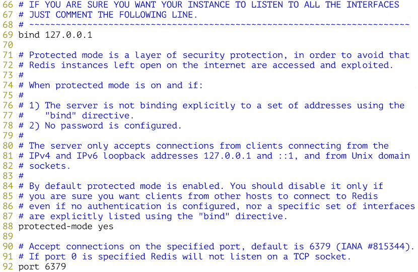
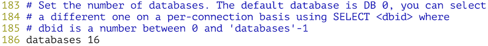
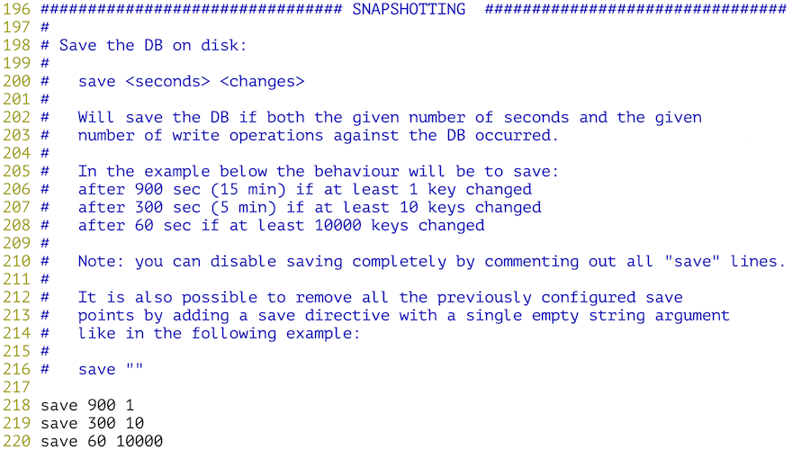
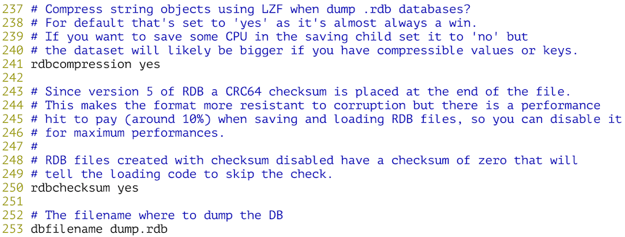
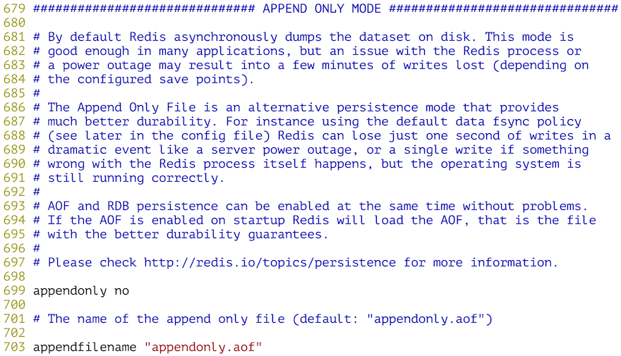
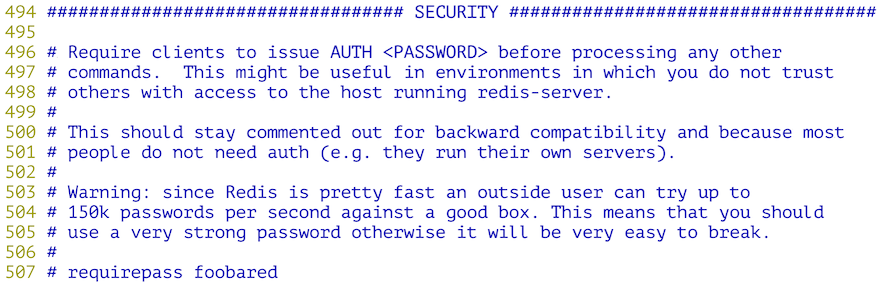
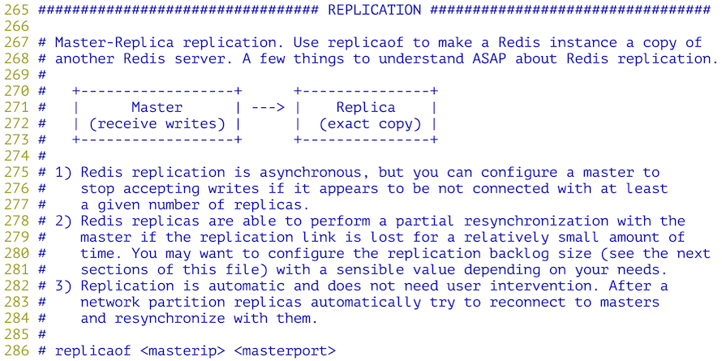
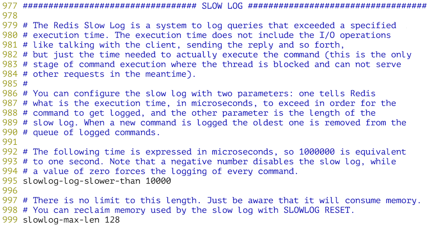
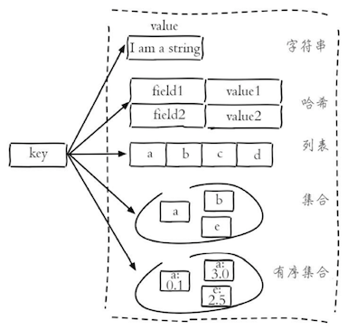

## Getting Started with NoSQL

### NoSQL overview

Today, most computer systems (including servers, PCs, mobile devices, etc.) generate huge amounts of data. In fact, as early as 2012, the amount of data generated every day in the world reached 2.5EB (exabytes, $$1EB\approx10^{18}B$$). A large part of this data is stored and managed by relational databases. As early as 1970, E.F. Codd published the famous paper "*A relational model of data for large shared data banks*" on relational databases, which laid the foundation of relational databases and continued to be used in the following decades. had a profound impact. Practice has proved that relational database is the most important way to achieve data persistence, and it is also the preferred technology for most applications when choosing a persistence scheme.

NoSQL is a brand-new revolutionary movement of databases. Although its history can be traced back to 1998, NoSQL has been deeply rooted and widely used after entering big data. The industry generally believes that NoSQL is more suitable for big data storage. The technical solution has made the development of NoSQL reach an unprecedented height. A 2012 New York Times column wrote that the era of big data has arrived, and in business, economics and other fields, decisions will no longer be based on experience and intuition, but on data and analysis. In fact, in many fields such as astronomy, meteorology, genomics, biology, sociology, Internet search engines, finance, medical care, social networks, e-commerce, etc., due to the dense and huge data, the analysis and processing of data is also difficult. Encountered unprecedented restrictions and obstacles, all of which have raised the research on big data processing technology to a new level, and also brought various NoSQL technical solutions into the public eye.

NoSQL databases can be roughly divided into the following categories according to their storage types:

| Type | Partial representation | Features |
| ---------- | ----------------------------------- | -- -------------------------------------------------- -------- |
| Column Family Database | HBase<br>Cassandra<br>Hypertable | As the name suggests, it stores data in columns. The biggest feature is that it is convenient to store structured and semi-structured data, and it is convenient to do data compression. It has a very large I/O advantage for queries against a certain column or a few columns, and is suitable for batch data processing and instant query. |
| Document Database | MongoDB<br>CouchDB<br>ElasticSearch | Document databases generally use JSON-like format to store data, and the stored content is document type. This also gives the opportunity to index certain fields and implement some functions of a relational database, but does not provide support for referential integrity and distributed transactions. |
| KV database | DynamoDB<br>Redis<br>LevelDB | The value can be quickly queried by key, and there are two implementation schemes based on memory and based on disk. |
| Graph Database | Neo4J<br>FlockDB<br>JanusGraph | A database for semantic queries using a graph structure, which uses nodes, edges, and attributes to represent and store data. Graph databases are designed to easily and quickly retrieve complex hierarchies that are difficult to model in relational systems. |
| Object Database | db4o<br>Versant | Operate the database through a syntax similar to an object-oriented language, and access data through objects. |

> **Note**: To learn more about NoSQL databases, visit <http://nosql-database.org/>.

### Redis overview

Redis is a NoSQL database based on key-value pairs. It provides support for multiple data types (strings, hashes, lists, sets, ordered sets, bitmaps, etc.), which can meet the needs of many application scenarios. Redis keeps data in memory, so read and write performance is amazing. At the same time, Redis also provides a persistence mechanism, which can save the data in memory to the hard disk, and the data will not be lost in the event of an unexpected situation. In addition, Redis also supports functions such as key expiration, geographic information operations, publish and subscribe, transactions, pipelines, Lua script extensions, etc. All in all, Redis has very powerful functions and performance. If you want to implement services such as cache and message queue in the project, Just hand it over to Redis. At present, many well-known enterprises and commercial projects at home and abroad have used Redis, including: Twitter, Github, StackOverflow, Sina Weibo, Baidu, Youku Tudou, Meituan, Xiaomi, Vipshop, etc.


#### Introduction to Redis

In 2008, a programmer named Salvatore Sanfilippo customized an exclusive database for the LLOOGG project he developed (because no matter how he optimized MySQL before, the system performance could no longer be improved), and the result of this work was the initial version of Redis. . Later, he put the code of Redis on the world's largest code hosting platform [Github](<https://github.com/antirez/redis>). Since then, Redis has attracted a lot of praise and attention from developers, and then several Hundreds of people participated in the development and maintenance of Redis, which makes Redis more and more powerful and better in performance.

Redis is the abbreviation of REmote DIctionary Server. It is a high-performance key-value storage system written in ANSI C. Compared with other key-value storage systems, Redis has the following features (and advantages):

- Redis has extremely high read and write performance and has rich features (publish/subscribe, transactions, notifications, etc.).
- Redis supports data persistence (RDB and AOF), which can save data in memory to disk, and can be loaded again for use when restarting.
- Redis supports a variety of data types, including: string, hash, list, set, zset, bitmap, hyperloglog, etc.
- Redis supports master-slave replication (to implement read-write analysis) and sentinel mode (to monitor whether the master is down and automatically adjust the configuration).
- Redis supports distributed clusters, which can easily improve the overall performance of the system through horizontal expansion.
- Redis communicates based on the reliable transmission service provided by TCP, and many programming languages ​​provide Redis client support.

#### Redis application scenarios

1. Cache - Putting hot data that changes infrequently but is frequently accessed into the Redis database can greatly reduce the pressure on the relational database, thereby improving the response performance of the system.
2. Leaderboards - Many websites have a leaderboard function, and it is very convenient to construct various leaderboard systems using lists and ordered collections in Redis.
3. Product seckill/vote like - Redis provides support for counting operations. Common seckill, likes and other functions on the website can be realized by using the Redis counter through +1 or -1 operations, thus avoiding the usage relationship `update` operation on type data.
4. Distributed locks - Using Redis can implement distributed locks (similar to thread locks, but can be shared by multiple threads or processes on multiple machines) across multiple servers to implement a blocking operation.
5. Message Queue - Like cache, message queue is an indispensable basic service for a large website, which can realize business decoupling and non-real-time business peak shaving, which we will show you in later projects.

#### Redis installation and configuration

You can use the package management tool of Linux system (such as yum) to install Redis, or you can download the source code of Redis from Redis's [official website] (https://redis.io/), decompress and decompress the archive and use the make tool Build and install the source code. When updating this document, the latest stable version officially provided by Redis is [Redis 5.0.10](https://download.redis.io/releases/redis-5.0.10.tar. gz).

download:

````Bash
wget https://download.redis.io/releases/redis-5.0.10.tar.gz
````

Unzip and unarchive:

````Bash
tar -zxf redis-5.0.10.tar.gz
````

Enter the Redis source code directory:

````Bash
cd redis-5.0.10
````

Build and install:

````Bash
make && make install
````

There is a configuration file named redis.conf in the redis source code directory, we can check this file first.

````Bash
vim redis.conf
````

Below we give a brief introduction to the Redis configuration file.

Configure the IP address and port of the Redis service:



Configure how many databases there are at the bottom:



Configure the persistence mechanism of Redis - RDB.





Configure the persistence mechanism of Redis - AOF:




Configure the password to access the Redis server:



Configure Redis master-slave replication (read-write separation can be achieved through master-slave replication):



Configure slow query:



The above content is the basic configuration of Redis. It doesn't matter if you are confused about the above content, just use Redis first and then go back and scrutinize these content. If you want to find some reference books, ["Redis Development and Operation and Maintenance"](https://item.jd.com/12121730.html) is a good primer, and ["Redis combat"](https:/ /item.jd.com/11791607.html) is a good advanced reading.

#### Redis server and client

Next, start the Redis server. The following method will start the Redis service with the default configuration.

````Bash
redis-server
````

If you want to modify the configuration of Redis (such as port, authentication password, persistence method, etc.), you can use the following two methods.

**Method 1**: Specify the authentication password and AOF persistence method through parameters.

````Bash
redis-server --requirepass yourpass --appendonly yes
````

**Method 2**: Modify the Redis configuration through the specified configuration file.

````Bash
redis-server /root/redis-5.0.10/redis.conf
````

Below we use the first method to start Redis and run it in the background, redirecting the output produced by Redis to a file named redis.log.

````Bash
redis-server --requirepass yourpass > redis.log &
````

You can use `ps` or `netstat` to check whether the Redis server started successfully.

````Bash
ps -ef | grep redis-server
netstat -nap | grep redis-server
````

Next, we try to use the Redis command line tool `redis-cli` to connect to the server, which connects to the local `6379` port by default. If you need to specify the Redis server and port, you can use `-h` and `-p` Parameters are specified separately.

````Bash
redis-cli
````

After entering the command line tool, you can operate the Redis server through Redis commands, as shown below.

````Bash
127.0.0.1:6379>auth yourpass
OK
127.0.0.1:6379>ping
PONG
127.0.0.1:6379>
````

Redis has very rich data types, and there are many commands to manipulate these data. For details, please refer to [Redis Command Reference](http://redisdoc.com/). On this website, in addition to the Redis command reference, there are also There are detailed documentation for Redis, including notifications, transactions, master-slave replication, persistence, sentinels, clusters, and more.



> **Note**: The above illustration is from the book "Redis Development and Operation and Maintenance" edited by Fu Lei and Zhang Yijun.

````Bash
127.0.0.1:6379> set username admin
OK
127.0.0.1:6379> get username
"admin"
127.0.0.1:6379> set password "123456" ex 300
OK
127.0.0.1:6379> get password
"123456"
127.0.0.1:6379>ttl username
(integer) -1
127.0.0.1:6379>ttl password
(integer) 286
127.0.0.1:6379> hset stu1 name hao
(integer) 0
127.0.0.1:6379> hset stu1 age 38
(integer) 1
127.0.0.1:6379> hset stu1 gender male
(integer) 1
127.0.0.1:6379> hgetall stu1
1) "name"
2) "hao"
3) "age"
4) "38"
5) "gender"
6) "male"
127.0.0.1:6379 > hvals stu1
1) "hao"
2) "38"
3) "male"
127.0.0.1:6379> hmset stu2 name wang age 18 gender female tel 13566778899
OK
127.0.0.1:6379> hgetall stu2
1) "name"
2) "wang"
3) "age"
4) "18"
5) "gender"
6) "female"
7) "tel"
8) "13566778899"
127.0.0.1:6379>lpush nums 1 2 3 4 5
(integer) 5
127.0.0.1:6379 > lrange nums 0 -1
1) "5"
twenty four"
3) "3"
4) "2"
5) "1"
127.0.0.1:6379 > lpop nums
"5"
127.0.0.1:6379 > lpop nums
"4"
127.0.0.1:6379>rpop nums
"1"
127.0.0.1:6379>rpop nums
"2"
127.0.0.1:6379> sadd fruits apple banana orange apple grape grape
(integer) 4
127.0.0.1:6379> scard fruits
(integer) 4
127.0.0.1:6379> smembers fruits
1) "grape"
2) "orange"
3) "banana"
4) "apple"
127.0.0.1:6379> sismember fruits apple
(integer) 1
127.0.0.1:6379> sismember fruits durian
(integer) 0
127.0.0.1:6379> sadd nums1 1 2 3 4 5
(integer) 5
127.0.0.1:6379> sadd nums2 2 4 6 8
(integer) 4
127.0.0.1:6379> sinter nums1 nums2
1) "2"
twenty four"
127.0.0.1:6379> sunion nums1 nums2
1) "1"
twenty two"
3) "3"
4) "4"
5) "5"
6) "6"
7) "8"
127.0.0.1:6379>sdiff nums1 nums2
1) "1"
twenty three"
3) "5"
127.0.0.1:6379> zadd topsinger 5234 zhangxy 1978 chenyx 2235 zhoujl 3520 xuezq
(integer) 4
127.0.0.1:6379> zrange topsinger 0 -1 withscores
1) "chenyx"
2) "1978"
3) "zhoujl"
4) "2235"
5) "xuezq"
6) "3520"
7) "zhangxy"
8) "5234"
127.0.0.1:6379> zrevrange topsinger 0 -1
1) "zhangxy"
2) "xuezq"
3) "zhoujl"
4) "chenyx"
127.0.0.1:6379> zrevrank topsinger zhoujl
(integer) 2
127.0.0.1:6379> geoadd pois 116.39738549206541 39.90862689286386 tiananmen
(integer) 1
127.0.0.1:6379> geoadd pois 116.27172936413572 39.99135172904494 yiheyuan
(integer) 1
127.0.0.1:6379> geoadd pois 117.27766503308104 40.65332064313784 gubeishuizhen
(integer) 1
127.0.0.1:6379> geodist pois tiananmen gubeishuizhen km
"111.5333"
127.0.0.1:6379> geodist pois tiananmen yiheyuan km
"14.1230"
127.0.0.1:6379> georadius pois 116.86499108288572 40.40149669363615 50 km withdist
1) 1) "gubeishuizhen"
   2) "44.7408"
````

#### Using Redis in Python programs

You can use pip to install a third-party library named `redis`. The core of the third-party library is a class named `Redis`. The `Redis` object represents a Redis client, through which you can send commands to the Redis server and get result of execution. The commands we used in the Redis client above are basically the messages that the `Redis` object can receive, so if you understand the Redis commands, you can play with Redis in Python.

````Bash
pip3 install redis
````

Enter the Python interactive environment and use the `redis` tripartite library to operate Redis.

````Bash
>>> import redis
>>>
>>> client = redis.Redis(host='127.0.0.1', port=6379, password='yourpass')
>>>
>>> client.set('username', 'admin')
True
>>> client.hset('student', 'name', 'luohao')
1
>>> client.hset('student', 'age', 40)
1
>>> client.keys('*')
[b'username', b'student']
>>> client.get('username')
b'admin'
>>> client.hgetall('student')
{b'name': b'luohao', b'age': b'40'}
````

### MongoDB Overview

#### MongoDB Introduction

MongoDB is a document-oriented database management system that came out in 2009. It is written in C++ and aims to provide a scalable, high-performance data storage solution for web applications. Although MongoDB is considered a NoSQL product when it is divided into categories, it is more like a product between relational databases and non-relational databases. Among non-relational databases, it is the most feature-rich and most like relational databases.

MongoDB stores data as a document, and a document consists of a series of "key-value pairs". Its document is similar to a JSON object, but MongoDB processes JSON in binary (which can locate keys and values ​​faster), so its document The storage format is called BSON. For the difference between JSON and BSON, you can read the article on the official website of MongoDB ["JSON and BSON"](https://www.mongodb.com/json-and-bson).

At present, MongoDB has provided support for multiple platforms such as Windows, macOS, Linux, Solaris, etc., and also provides drivers for multiple development languages, of which Python is of course one of them.

#### MongoDB installation and startup

You can download MongoDB from MongoDB's [official download link] (https://www.mongodb.com/try/download/community). The official installation packages for Windows, macOS and various Linux versions are provided. Let's take CentOS as an example to briefly talk about how to install and start MongoDB.

Download the RPM installation package for the server and command line.

````Bash
wget https://repo.mongodb.org/yum/redhat/7/mongodb-org/4.4/x86_64/RPMS/mongodb-org-server-4.4.2-1.el7.x86_64.rpm
rpm -ivh mongodb-org-server-4.4.2-1.el7.x86_64.rpm
wget https://repo.mongodb.org/yum/redhat/7/mongodb-org/4.4/x86_64/RPMS/mongodb-org-shell-4.4.2-1.el7.x86_64.rpm
rpm -ivh mongodb-org-shell-4.4.2-1.el7.x86_64.rpm
````

To start the MongoDB server, you need to create a folder to save the data first.

````Bash
mkdir -p /data/db
````

Modify the MongoDB configuration file and change the value of the `bindIp` option to the local IP address instead of the default `127.0.0.1`. The local IP address can be viewed through the `ifconfig` command.

````Bash
vim /etc/mongod.conf
````

Use the `systemctl` command to start the service.

````Bash
systemctl start mongod
````

#### MongoDB basic concepts

We illustrate some concepts in MongoDB by comparing it with relational databases.

| SQL | MongoDB |
| --------------------- | ------------------ |
| database | database |
| table | collection |
| row | document |
| column | field |
| index | index |
| table joins | (nested documents) |
| primary key | primary key |

#### Operating MongoDB through Shell

0. Start the command line tool to enter the interactive environment.

    ````Bash
    mongo
    ````

    > **Description**:

1. View, create, and delete databases.

   ````JavaScript
   > // show all databases
   > show dbs
   admin 0.000GB
   config 0.000GB
   local 0.000GB
   > // Create and switch to school database
   > use school
   switched to db school
   > // delete the current database
   > db.dropDatabase()
   { "ok" : 1 }
   ````
   
2. Create, delete, and view collections.

   ````JavaScript
   > // Create and switch to school database
   > use school
   switched to db school
   > // Create the colleges collection
   > db.createCollection('colleges')
   { "ok" : 1 }
   > // Create the students collection
   > db.createCollection('students')
   { "ok" : 1 }
   > // view all collections
   > show collections
   colleges
   students
   > // delete the colleges collection
   > db.colleges.drop()
   true
   ````

   > **Note**: When inserting a document in MongoDB, a collection will be created automatically if the collection does not exist, so you can also create a collection by inserting a document in the following way.

3. CRUD operations on documents.

   ````JavaScript
   > // Insert the document into the students collection
   > db.students.insert({stuid: 1001, name: 'Luo Hao', age: 40})
   WriteResult({ "nInserted" : 1 })
   > // Insert the document into the students collection
   > db.students.save({stuid: 1002, name: 'King Sledgehammer', tel: '13012345678', gender: 'male'})
   WriteResult({ "nInserted" : 1 })
   > // view all documents
   > db.students.find()
   { "_id" : ObjectId("5b13c72e006ad854460ee70b"), "stuid" : 1001, "name" : "Luo Hao", "age" : 38 }
   { "_id" : ObjectId("5b13c790006ad854460ee70c"), "stuid" : 1002, "name" : "King Sledgehammer", "tel" : "13012345678", "gender" : "Male" }
   > // Update the document with stuid 1001
   > db.students.update({stuid: 1001}, {'$set': {tel: '13566778899', gender: 'male'}})
   WriteResult({ "nMatched" : 1, "nUpserted" : 0, "nModified" : 1 })
   > // Insert or update the document with stuid 1003
   > db.students.update({stuid: 1003}, {'$set': {name: 'Bai Yuanfang', tel: '13022223333', gender: 'male'}}, upsert=true)
   WriteResult({
           "nMatched" : 0,
           "nUpserted" : 1,
           "nModified" : 0,
           "_id" : ObjectId("5b13c92dd185894d7283efab")
   })
   > // Query all documents
   > db.students.find().pretty()
   {
           "_id" : ObjectId("5b13c72e006ad854460ee70b"),
           "stuid" : 1001,
           "name" : "Luo Hao",
           "age" : 38,
           "gender" : "male",
           "tel" : "13566778899"
   }
   {
           "_id" : ObjectId("5b13c790006ad854460ee70c"),
           "stuid" : 1002,
           "name" : "King Sledgehammer",
           "tel" : "13012345678",
           "gender" : "male"
   }
   {
           "_id" : ObjectId("5b13c92dd185894d7283efab"),
           "stuid" : 1003,
           "gender" : "male",
           "name" : "Bai Yuanfang",
           "tel" : "13022223333"
   }
   > // Query documents with stuid greater than 1001
   > db.students.find({stuid: {'$gt': 1001}}).pretty()
   {
           "_id" : ObjectId("5b13c790006ad854460ee70c"),
           "stuid" : 1002,
           "name" : "King Sledgehammer",
           "tel" : "13012345678",
           "gender" : "male"
   }
   {
           "_id" : ObjectId("5b13c92dd185894d7283efab"),
           "stuid" : 1003,
           "gender" : "male",
           "name" : "Bai Yuanfang",
           "tel" : "13022223333"
   }
   > // Querying documents with stuid greater than 1001 only displays name and tel fields
   > db.students.find({stuid: {'$gt': 1001}}, {_id: 0, name: 1, tel: 1}).pretty()
   { "name" : "King Sledgehammer", "tel" : "13012345678" }
   { "name" : "Bai Yuanfang", "tel" : "13022223333" }
   > // Query the document whose name is "Luo Hao" or tel is "13022223333"
   > db.students.find({'$or': [{name: 'Luo Hao'}, {tel: '13022223333'}]}, {_id: 0, name: 1, tel: 1}).pretty( )
   { "name" : "Luo Hao", "tel" : "13566778899" }
   { "name" : "Bai Yuanfang", "tel" : "13022223333" }
   > // Query student documents skip the 1st document and only check 1 document
   > db.students.find().skip(1).limit(1).pretty()
   {
           "_id" : ObjectId("5b13c790006ad854460ee70c"),
           "stuid" : 1002,
           "name" : "King Sledgehammer",
           "tel" : "13012345678",
           "gender" : "male"
   }
   > // Sort the query results (1 means ascending order, -1 means descending order)
   > db.students.find({}, {_id: 0, stuid: 1, name: 1}).sort({stuid: -1})
   { "stuid" : 1003, "name" : "Bai Yuanfang" }
   { "stuid" : 1002, "name" : "The King's Hammer" }
   { "stuid" : 1001, "name" : "Luo Hao" }
   > // create an index on the specified field or fields
   > db.students.ensureIndex({name: 1})
   {
           "createdCollectionAutomatically" : false,
           "numIndexesBefore" : 1,
           "numIndexesAfter" : 2,
           "ok" : 1
   }
   ````
   
Using MongoDB, it is very convenient to configure data replication, realize high availability and disaster recovery of data through redundant data, and also meet the needs of rapidly growing data volume through data sharding. For more operations on MongoDB, you can refer to the [official document](https://mongodb-documentation.readthedocs.io/en/latest/), and recommend everyone to read the ["MongoDB Authoritative Guide"](http:/ /www.ituring.com.cn/book/1172).

#### Manipulating MongoDB in a Python program

MongoDB operations can be achieved by installing `pymongo` via pip.

```Shell
pip install pymongo
````

Enter the Python interactive environment, you can perform the following operations.

````Python
>>> from pymongo import MongoClient
>>>
>>> client = MongoClient('mongodb://127.0.0.1:27017')
>>> db=client.school
>>> for students in db.students.find():
... print('student number:', student['stuid'])
... print('name:', student['name'])
... print('tel:', student['tel'])
...
Student ID: 1001.0
Name: Luo Hao
Tel: 13566778899
Student ID: 1002.0
Name: Wang Dachui
Tel: 13012345678
Student ID: 1003.0
Name: Bai Yuanfang
Tel: 13022223333
>>> db.students.find().count()
3
>>> db.students.remove()
{'n': 3, 'ok': 1.0}
>>> db.students.find().count()
0
>>> from pymongo import ASCENDING
>>>
>>> coll = db.students
>>> coll.create_index([('name', ASCENDING)], unique=True)
'name_1'
>>> coll.insert_one({'stuid': int(1001), 'name': 'Luo Hao', 'gender': True})
<pymongo.results.InsertOneResult object at 0x1050cc6c8>
>>> coll.insert_many([{'stuid': int(1002), 'name': 'Wang Dahui', 'gender': False}, {'stuid': int(1003), 'name': 'Bai Yuanfang' , 'gender': True}])
<pymongo.results.InsertManyResult object at 0x1050cc8c8>
>>> for student in coll.find({'gender': True}):
... print('student number:', student['stuid'])
... print('name:', student['name'])
... print('gender:', 'male' if student['gender'] else 'female')
...
Student ID: 1001
Name: Luo Hao
Sex: Male
Student ID: 1003
Name: Bai Yuanfang
Sex: Male
````

More knowledge about [`pymongo`](https://api.mongodb.com/python/current/tutorial.html) can be learned through its official documentation, or you can use [`MongoEngine`](<https: //pypi.org/project/mongoengine/>) to simplify the operation of Python programs on MongoDB, in addition, there is also a three-party library [`motor`](<https ://pypi.org/project/motor/>) are good choices.