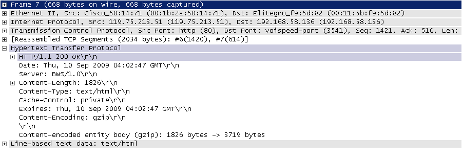
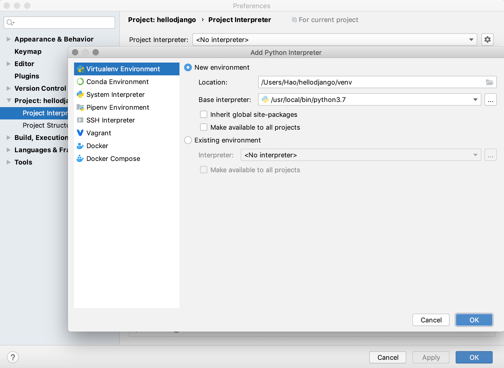
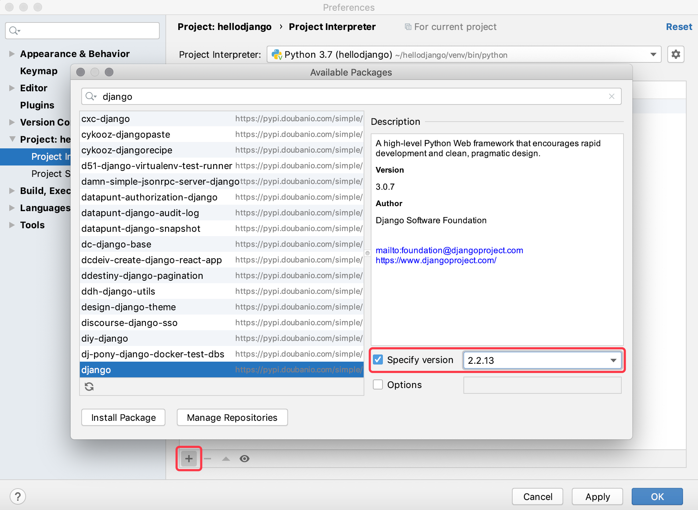
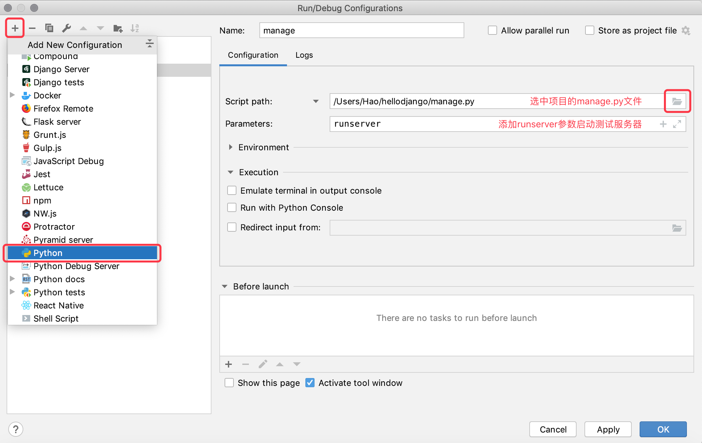

## Getting started with Django

In the early stages of web development, developers need to manually write each page, such as a news portal, and modify its HTML pages every day, which must be very bad as the site grows in size and volume. In order to solve this problem, developers have thought of using a program to generate dynamic content for the Web server, that is to say, the dynamic content in the webpage is no longer manually written but automatically generated by the program. At the earliest time, this technology was called CGI (Common Gateway Interface), of course, over time, CGI exposed more and more problems, such as a lot of repeated boilerplate code, the overall performance is relatively low and so on. Under the background that the times call for new heroes, web application development technologies such as PHP, ASP, and JSP have sprung up in the mid-to-late 1990s. Usually we say Web application refers to the application program that accesses network resources through the browser. Because of the popularity and ease of use of the browser, the Web application is convenient and simple to use, eliminating the trouble of installing and updating the application program; From the developer's point of view, there is no need to care what operating system the user uses, or even to distinguish between the PC side and the mobile side.

### Web Application Mechanisms and Terminology

The figure below shows us the workflow of a web application, and the terms involved are shown in the table below.


> Note: I believe experienced readers will find that there are actually a lot of things missing in this picture, such as reverse proxy servers, database servers, firewalls, etc., and each node in the picture may be a group of nodes when the actual project is deployed. the cluster. Of course, it doesn’t matter if you don’t have any concepts about these, just keep going, and I will explain them to you one by one later.

| Terminology | Explanation |
| ------------- | ----------------------------------- ------------------------- |
| **URL/URI** | Uniform Resource Locator/Uniform Resource Identifier, a unique identifier for a network resource |
| **domain name** | an easy-to-remember string name corresponding to the web server address |
| **DNS** | Domain name resolution service, which can convert domain names into corresponding IP addresses |
| **IP address** | The identity of the host on the network, different hosts can be distinguished by IP address |
| **HTTP** | Hypertext Transfer Protocol, an application-level protocol built on top of TCP, the basis for data communications on the World Wide Web |
| **Reverse proxy** | The proxy client makes a request to the server, and then returns the resource returned by the server to the client |
| **Web Server** | Accept HTTP requests, and then return HTML files, plain text files, images and other resources to the requester |
| **Nginx** | A high-performance web server that can also be used as a [reverse proxy](https://zh.wikipedia.org/wiki/%E5%8F%8D%E5%90%91%E4% BB%A3%E7%90%86), [Load Balancing](https://zh.wikipedia.org/wiki/%E8%B4%9F%E8%BD%BD%E5%9D%87%E8%A1 %A1) and [HTTP Cache](https://en.wikipedia.org/wiki/HTTP%E7%BC%93%E5%AD%98) |

#### HTTP protocol

Here we will spend some pen and ink to talk about the HTTP protocol. HTTP (Hypertext Transfer Protocol) is an application-level protocol built on top of TCP (Transmission Control Protocol), which utilizes the reliable transmission services provided by TCP to realize data exchange in Web applications. According to the introduction on Wikipedia, the original purpose of designing HTTP is to provide a way to publish and receive [HTML](https://zh.wikipedia.org/wiki/HTML) pages, which means that this protocol is a browser The carrier of data transmitted between it and the web server. For more information about this protocol and its current development status, you can read ["Introduction to HTTP Protocol"](http://www.ruanyifeng.com/blog/2016/08/http.html), ["Introduction to Internet Protocol"] ](http://www.ruanyifeng.com/blog/2012/05/internet_protocol_suite_part_i.html) series and ["Illustration HTTPS Protocol"](http://www.ruanyifeng.com/blog/2014/09/illustration- ssl.html) to learn more about these articles. The picture below shows the HTTP request and response messages (protocol data) intercepted by the open source protocol analysis tool Ethereal (the predecessor of the packet capture tool WireShark) when I was studying and working in the Sichuan Key Laboratory of Network Communication Technology. Since Ethereal intercepts the data passing through the network adapter, the protocol data from the physical link layer to the application layer can be clearly seen.

HTTP request (request line + request header + blank line + [message body]):


HTTP response (response line + response header + blank line + message body):



> **Notes**: These two pictures were taken in the early morning of September 10, 2009, I hope these two screenshots like yellowed photos can help you understand what HTTP really looks like. Of course, if there is no professional packet capture tool, you can also use the "developer tools" provided by the browser to view the data format of HTTP requests and responses.

### Django overview

There are hundreds of web frameworks for Python, more than its keywords. The so-called Web framework is the infrastructure used to develop Web server-side applications. In layman's terms, it is a series of encapsulated modules and tools. In fact, even without a web framework, we can still use sockets or [CGI](https://en.wikipedia.org/wiki/%E9%80%9A%E7%94%A8%E7%BD%91%E5 %85%B3%E6%8E%A5%E5%8F%A3) to develop Web server-side applications, but the cost and expense of doing so are usually unacceptable in commercial projects. Through web frameworks, we can simplify the complexity and reduce the workload of creating, updating, and extending applications. We just mentioned that Python has hundreds of web frameworks, including Django, Flask, Tornado, Sanic, Pyramid, Bottle, Web2py, web.py, etc.

Among the above-mentioned Python web frameworks, Django is undoubtedly the most representative heavyweight player. Developers can quickly develop reliable web applications based on Django, because it reduces unnecessary overhead in web development. It encapsulates the development mode and provides support for the MVC architecture (called the MTV architecture in Django). MVC is a universal architecture in the field of software system development. It divides the components in the system into three parts: Model, View and Controller, and implements the Model ( data) and decoupling of views (display). Since the model and view are separated, a middleman is needed to connect the decoupled model and view, and the controller plays this role. Small-scale software systems will use the MVC architecture (or other architectures evolved from MVC). In the Django project, we call it MTV. The M in MTV is no different from the M in MVC. It is the model representing the data, T Represents the page template (the view that displays the data), and V represents the view function. In the Django framework, the view function and the Django framework itself play the role of C in MVC.


The Django framework was born in 2003. It is a project that has grown up in real applications. It was developed by the content management system (CMS) R&D team (mainly Adrian Holovaty and Simon Willison) of the online news website of the Lawrence Publishing Group, and is based in Belgium. Gypsy jazz guitarist Django Reinhardt. The Django framework was released as an open source framework in the summer of 2005. Using the Django framework can build a fully functional website in a very short time, because it replaces the programmer to complete those repetitive and tedious work, leaving the truly meaningful core business to the program. This is the best practice of the DRY (Don't Repeat Yourself) concept. Many successful websites and applications are developed based on the Python language. The representative websites in China include: Zhihu, Douban.com, Guoke.com, Sohu Lightning Mailbox, 101 Go Network, Poster Fashion Network, Endorsement Bar, Dui Sugar, Mobile Sohu, Gudong, Aifuwo, Guoku, etc., many of which use the Django framework.

### Quick start

#### First Django project

1. Check the Python environment: Django 1.11 requires Python 2.7 or Python 3.4 or higher; Django 2.0 requires Python 3.4 or higher; Django 2.1 and 2.2 requires Python 3.5 or higher; Django 3.0 requires Python 3.6 or higher.

   > **Description**: The Python interpreter environment required by different versions of the Django framework can be found in the [FAQ](https://docs.djangoproject.com/zh-hans/3.0/faq/install/# faq-python-version-support).

   You can check the Python interpreter version by entering the following command in the terminal on macOS, or `python --version` in the command line prompt on Windows.
   
   ````Bash
python3 --version
   ````
   
   You can also execute the following code in Python's interactive environment to see the version of the Python interpreter.
   
   ```Shell
   import sys
   sys.version
   sys.version_info
   ````
   
2. Update the package management tools and install the Django environment (for creating Django projects).

   > **Note**: When updating this document, the latest official version of Django is 3.0.7, Django 3.0 provides support for ASGI, which can realize full-duplex asynchronous communication, but the current experience is general, so temporarily Django 3.0 is not recommended for everyone. Below we install Django 2.2.13. When using `pip` to install third-party libraries and tools, you can use `==` to specify the installed version.
   
   ````Bash
   pip3 install -U pip
   pip3 install django==2.2.13
   ````
   
3. Check the Django environment and use the `django-admin` command to create a Django project (project name is hellodjango).

   ```Shell
   django-admin --version
   django-admin startproject hellodjango
   ````

4. Open the created Django project with PyCharm and add a virtual environment to it.

   

   As shown in the figure above, in the project browser of PyCharm, the top-level folder `hellodjango` is the Python project folder. The name of this folder is not important, and the Django project does not care what the name of this folder is. There is a folder with the same name under this folder, which is the Django project folder, which contains `__init__.py`, `settings.py`, `urls.py`, `wsgi.py` four files, with the name There is also a file called `manage.py` at the same level as the Django project folder of `hellodjango`, and the functions of these files are as follows:

   - `hellodjango/__init__.py`: empty file, telling the Python interpreter that this directory should be treated as a Python package.
   - `hellodjango/settings.py`: The configuration file for the Django project.
   - `hellodjango/urls.py`: The URL mapping declaration for the Django project, like the "directory" of the website.
   - `hellodjango/wsgi.py`: The entry file for the project to run on a WSGI compatible web server.
   - `manage.py`: Script for managing Django projects.

   > Description: The full name of WSGI is Web Server Gateway Interface, and the explanation given on Wikipedia is "[Web server] defined for the Python language (https://zh.wikipedia.org/wiki/%E7%B6%B2%E9 %A0%81%E4%BC%BA%E6%9C%8D%E5%99%A8) and [Web Application](https://en.wikipedia.org/wiki/%E7%BD%91%E7 %BB%9C%E5%BA%94%E7%94%A8%E7%A8%8B%E5%BA%8F) or a simple and general interface between frameworks".

   The interface for creating a virtual environment is shown in the following figure.

   

5. Install project dependencies.

   Method 1: Open the terminal of PyCharm and install the dependencies of the Django project through the `pip` command in the terminal.

   > **Note**: Since a virtual environment has been created for the project based on the Python 3 interpreter environment, the `python` command in the virtual environment corresponds to the Python 3 interpreter, and the `pip` command corresponds to Python 3 package management tool.

   ```Shell
   pip install django==2.2.13
   ````

   Method 2: In PyCharm's preferences, you can find the project's interpreter environment and installed third-party libraries. You can install new dependencies by clicking the Add button. You need to be reminded that when installing Django dependencies, you need to specify The version number, otherwise the latest version 3.0.7 at the time of updating this article will be installed by default.

   

   The figure below shows the correspondence between the Django version and the Python version. Please take your own seat.

   | Django version | Python version |
   | ---------- | -------------------------------------- --- |
   | 1.8 | 2.7, 3.2, 3.3, 3.4, 3.5 |
   | 1.9, 1.10 | 2.7, 3.4, 3.5 |
   | 1.11 | 2.7, 3.4, 3.5, 3.6, 3.7 (Django 1.11.17) |
   | 2.0 | 3.4, 3.5, 3.6, 3.7 |
   | 2.1 | 3.5, 3.6, 3.7 |
   | 2.2 | 3.5, 3.6, 3.7, 3.8 (Django 2.2.8) |
   | 3.0 | 3.6, 3.7, 3.8 |

6. Start the server running project that comes with Django.

   Method 1: Select "Edit Configuration" in the "Run" menu, and configure the "Django server" to run the project (applicable to the professional version of PyCharm).

   

   Method 2: Select "Edit Configuration" in the "Run" menu to configure the "Python" program to run the project (applicable to the professional and community versions of PyCharm).

   

   Method 3: Run the project by command in PyCharm's Terminal (Applicable to Professional and Community Editions of PyCharm).

   ```Shell
   python manage.py runserver
   ````
   
7. Check the running effect.

  Enter `http://127.0.0.1:8000` in the browser to access our server, the effect is shown in the following figure.

   

   > **Description**:
   >
   > 1. The server that comes with Django just started can only be used in development and testing environments, because this server is a lightweight web server written in pure Python and is not suitable for use in production environments.
   > 2. If you modify the code, you do not need to restart the server that comes with Django in order for the modified code to take effect. However, when adding a new project file, the server will not be automatically reloaded, and the server has to be restarted manually.
   > 3. You can use the `python manage.py help` command in the terminal to view the command parameters available to the Django management script.
   > 4. When using `python manage.py runserver` to start the server, you can add parameters to specify the IP address and port number. By default, the started server will run on the `8000` port of the local machine.
   > 5. The server running in the terminal can be stopped by pressing Ctrl+C. The server running through PyCharm's "Run Configuration" can simply click the close button on the window to terminate the server's operation.
   > 6. Do not start multiple servers on the same port, because it will cause address conflict (port is an extension of IP address, and is also part of the computer's network address).
8. Modify the project's configuration file `settings.py`.

   Django is a framework that supports internationalization and localization, so the default homepage of the Django project we just saw also supports internationalization. We can change the default language to Chinese by modifying the configuration file, and set the time zone to East Eighth District.

   Find the pre-modified configuration (after line 100 of the `settings.py` file).

   ````Python
   LANGUAGE_CODE = 'en-us'
   TIME_ZONE = 'UTC'
   ````

   Modified to the following.

   ````Python
   LANGUAGE_CODE = 'zh-hans'
   TIME_ZONE = 'Asia/Chongqing'
   ````

   Refresh the page just now, you can see the results after modifying the language code and time zone.

   

#### Create your own app

If you want to develop your own web application, you need to create an "application" in the Django project. A Django project can contain one or more applications.

1. Execute the following command in PyCharm's terminal to create an application named `first`.

   ```Shell
   python manage.py startapp first
   ````

   Executing the above command will create the `first` directory in the current path, and its directory structure is as follows:

   - `__init__.py`: an empty file that tells the Python interpreter that this directory should be treated as a Python package.
   - `admin.py`: Can be used to register models for managing models in the management background that comes with the Django framework.
   - `apps.py`: The configuration file for the current application.
   - `migrations`: Store database migration information related to the model.
     - `__init__.py`: An empty file that tells the Python interpreter that this directory should be treated as a Python package.
   - `models.py`: Stores the data model of the application (M in MTV).
   - `tests.py`: Contains test classes and test functions to test the various functions of the application.
   - `views.py`: A function or class that handles user HTTP requests and returns HTTP responses (V in MTV).

2. Modify the view file `views.py` in the application directory.

   ````Python
   from django.http import HttpResponse
   

   def show_index(request):
       return HttpResponse('<h1>Hello, Django!</h1>')
   ````
   
4. Modify the `urls.py` file in the Django project directory to match the view function with the path requested by the user in the browser.

   ````Python
   from django.contrib import admin
   from django.urls import path, include

   from first.views import show_index
   
   urlpatterns = [
       path('admin/', admin.site.urls),
       path('hello/', show_index),
   ]
   ````
   
5. Rerun the project and open a browser to visit `http://127.0.0.1:8000/hello/`.

5. Above we generated content for the browser through code, but it is still static content. If you want to generate dynamic content, you can modify the `views.py` file and add the code as shown below.

   ````Python
   from random import sample
   
   from django.http import HttpResponse
   
   
   def show_index(request):
       fruits = [
           'Apple', 'Orange', 'Pitaya', 'Durian', 'Waxberry', 'Blueberry',
           'Grape', 'Peach', 'Pear', 'Banana', 'Watermelon', 'Mango'
       ]
       selected_fruits = sample(fruits, 3)
       content = '<h3>Today's recommended fruit is:</h3>'
       content += '<hr>'
       content += '<ul>'
       for fruit in selected_fruits:
           content += f'<li>{fruit}</li>'
       content += '</ul>'
       return HttpResponse(content)
   ````
   
6. Refresh the page to view the running result of the program, and see if you can see different content every time you refresh the page.


#### Using templates

The above method of generating dynamic content for the browser by splicing HTML code is unacceptable in actual development, because the front-end page in the actual project may be very complicated and cannot be completed by this method of splicing dynamic content. Must be able to think of it. To solve this problem, we can prepare a template page (T in MTV) in advance. The so-called template page is an HTML page with placeholders and template instructions.

There is a convenience function in the Django framework called `render` that does the job of rendering templates. The so-called rendering is to replace the template instructions and placeholders in the template page with data. Of course, the rendering here is called back-end rendering, that is, the rendering of the page is completed on the server side and then output to the browser. The back-end rendering method will put a greater burden on the server when the web application has a large number of visits, so more and more web applications will choose the front-end rendering method, that is, the server only provides the data required by the page (usually is in JSON format), get this data through JavaScript code in the browser and render it on the page. Regarding the content of front-end rendering, we will explain it to you in subsequent courses. Currently, we use the practice of back-end rendering through template pages. The specific steps are as follows.

The steps to use a template page are as follows.

1. Create a folder named templates in the project directory.

   

2. Add the template page `index.html`.

   > **Note**: In actual project development, the static page is provided by the front-end developer, and the back-end developer needs to modify the static page into a template page so that it can be rendered by the Python program. This approach is mentioned above. Backend rendering.

   ````HTML
   <!DOCTYPE html>
   <html lang="en">
       <head>
           <meta charset="UTF-8">
           <title>Home</title>
           <style>
               #fruits {
                   font-size: 1.25em;
               }
           </style>
       </head>
       <body>
           <h1>Today's recommended fruits are:</h1>
           <hr>
           <ul id="fruits">
               
               <li>{{ fruit }}</li>
               
           </ul>
       </body>
   </html>
   ````
   In the template page above we used template placeholder syntax like `{{ fruit }}` and also template directives like ``, which are part of the Django Template Language (DTL) . Regarding template syntax and instructions, you can take a look at the official documentation. I believe these contents are easy to understand and do not need to be repeated. You can also refer to [Official Documentation]() to learn about template instructions and syntax.

3. Modify the `views.py` file and call the `render` function to render the template page.

   ````Python
   from random import sample
   
   from django.shortcuts import render
   
   
   def show_index(request):
       fruits = [
           'Apple', 'Orange', 'Pitaya', 'Durian', 'Waxberry', 'Blueberry',
           'Grape', 'Peach', 'Pear', 'Banana', 'Watermelon', 'Mango'
       ]
       selected_fruits = sample(fruits, 3)
       return render(request, 'index.html', {'fruits': selected_fruits})
   ````

   The first parameter of the `render` function is the request object request, the second parameter is the name of the template page we want to render, and the third parameter is the data to be rendered on the page, we pass the data to the template through a dictionary page, the keys in the dictionary are the template directives used in the template page or the variable names in the placeholders.

4. So far, the `render` in the view function cannot find the template file `index.html`, you need to modify the `settings.py` file and configure the path where the template file is located. Modify the `settings.py` file, find the `TEMPLATES` configuration, and modify the `DIRS` configuration in it.

   ````Python
   TEMPLATES = [
       {
           'BACKEND': 'django.template.backends.django.DjangoTemplates',
           'DIRS': [os.path.join(BASE_DIR, 'templates'), ],
           'APP_DIRS': True,
           'OPTIONS': {
               'context_processors': [
                   'django.template.context_processors.debug',
                   'django.template.context_processors.request',
                   'django.contrib.auth.context_processors.auth',
                   'django.contrib.messages.context_processors.messages',
               ],
           },
       },
   ]
   ````

5. Rerun the project or simply refresh the page to see the results.

### Summarize

So far, we have completed a very small web application using the Django framework. Although it has no practical value, we can have a perceptual understanding of the Django framework through this project. The best information for learning Django is definitely its [official documentation] (https://docs.djangoproject.com/zh-hans/2.0/), the official documentation provides support for multiple languages, and there are novice tutorials to guide beginners To learn to use the Django framework, it is recommended that you learn and use this framework by reading the official documentation of Django. Of course, the ["Django Basics Tutorial"] (http://www.ituring.com.cn/book/2630) published by the Turing community is also an entry-level book that is very suitable for beginners. Interested readers can click the link to purchase.
