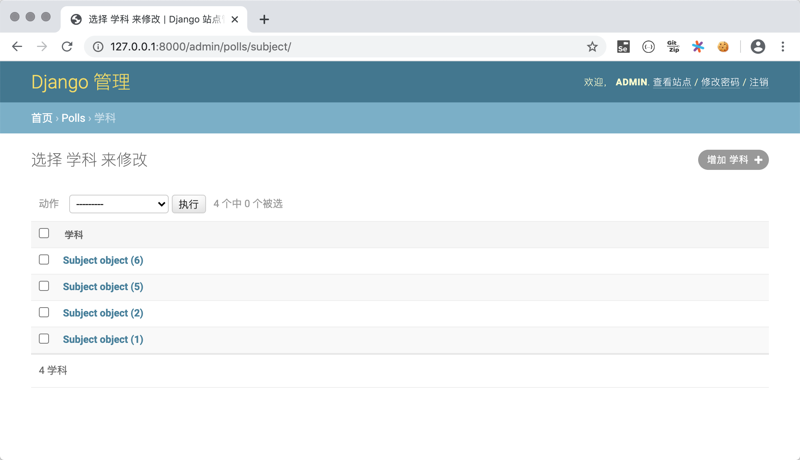
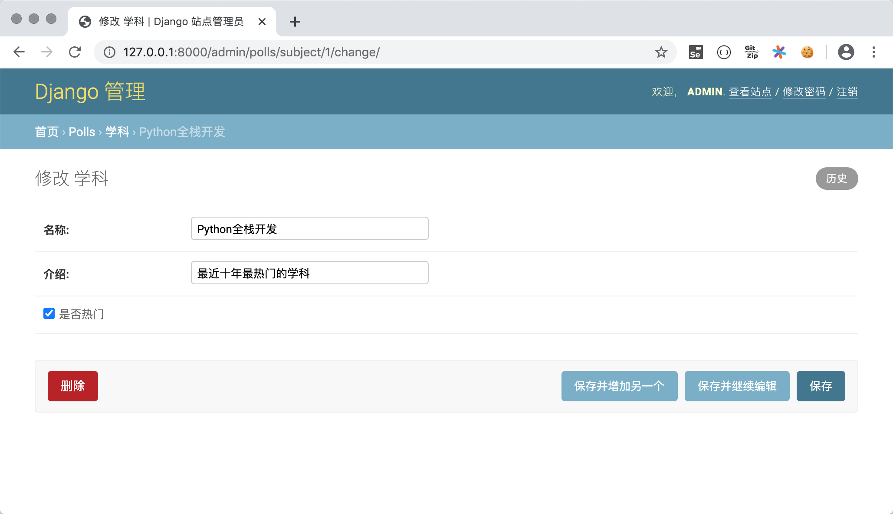
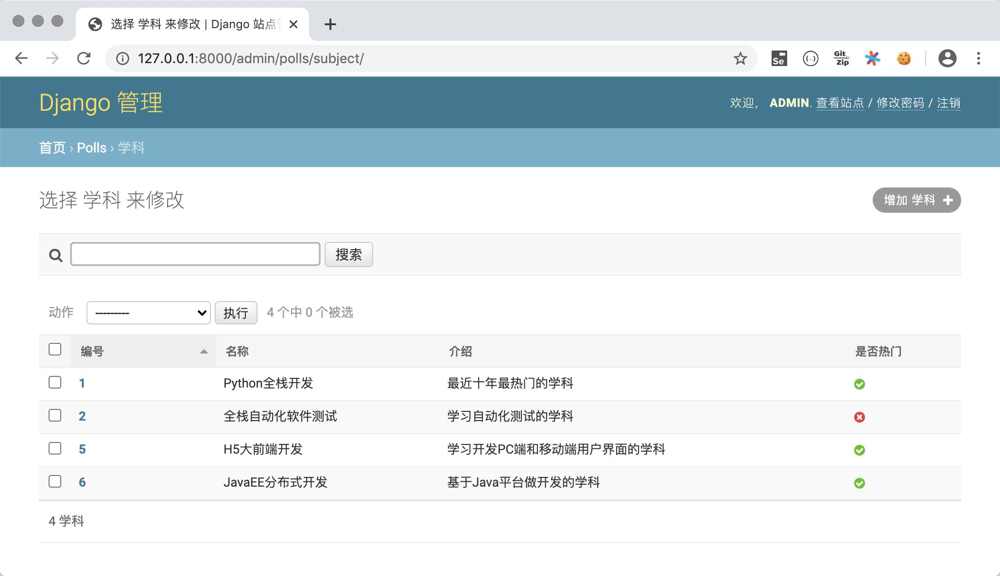

## Dive into the model

In the previous chapter, we mentioned that Django is a web framework based on the MVC architecture, which pursues the decoupling of "model" and "view". The so-called "model" is more bluntly the (representation of) data, so it is often called "data model". In actual projects, data models are usually persisted through databases, and relational databases have been the preferred solution for persistence in the past and present. Let us explain the knowledge points related to models by completing a voting project. The home page of the voting project will display all the subjects of an online education platform; click on the subject to view the teachers and their information of the subject; after logging in, users can vote for teachers on the teacher viewing page, and they can vote for and against; Users can log in through the login page; users who have not registered can enter personal information through the registration page to register. In this project, we use MySQL database to implement data persistence operations.

### Create project and application

We start by creating the Django project `vote` and adding a virtual environment and dependencies to it. Next, create an application named `polls` under the project and a folder `tempaltes` to save the template pages. The structure of the project folder is shown below.


According to the project requirements described above, we have prepared four static pages, namely the page `subjects.html` for displaying subjects, the page `teachers.html` for displaying subject teachers, the login page `login.html`, and the registration page `register .html`, later we will modify the static page to the template page required by the Django project.

### Configure relational database MySQL

1. Create a database in MySQL, create a user, and authorize the user to access the database.

   ````SQL
   create database vote default charset utf8;
   create user 'hellokitty'@'%' identified by 'Hellokitty.618';
   grant all privileges on vote.* to 'hellokitty'@'%';
   flush privileges;
   ````

2. Create a two-dimensional table in MySQL that holds subject and teacher information (the table holding user information will be processed later).

   ````SQL
   use vote;
   
   -- create subject table
   create table `tb_subject`
   (
   `no` integer auto_increment comment 'Subject number',
       `name` varchar(50) not null comment 'Discipline name',
       `intro` varchar(1000) not null default '' comment 'Introduction to the subject',
       `is_hot` boolean not null default 0 comment 'is it a hot subject',
       primary key (`no`)
   );
   -- create teacher table
   create table `tb_teacher`
   (
       `no` integer auto_increment comment 'Teacher number',
       `name` varchar(20) not null comment 'Teacher's name',
       `sex` boolean not null default 1 comment 'Teacher gender',
       `birth` date not null comment 'birth date',
       `intro` varchar(1000) not null default '' comment 'Teacher's introduction',
       `photo` varchar(255) not null default '' comment 'Teacher photo',
       `gcount` integer not null default 0 comment 'Number of positive reviews',
       `bcount` integer not null default 0 comment 'Bad rating',
       `sno` integer not null comment 'Subject to',
       primary key (`no`),
       foreign key (`sno`) references `tb_subject` (`no`)
   );
   ````

3. Install the dependencies required to connect to the MySQL database in the virtual environment.

   ````Bash
   pip install mysqlclient
   ````

   > **Note**: If you cannot install the `mysqlclient` tripartite library for some reason, you can use its alternative `pymysql`. `pymysql` is a Python library developed in pure Python to connect to MySQL, and the installation is easier and more successful. But need to add code like below in `__init__.py` of Django project folder.
   >
   > ````Python
   > import pymysql
   >
   > pymysql.install_as_MySQLdb()
   > ````
   >
   > If you use Django 2.2 and above, you will also encounter compatibility issues between PyMySQL and the Django framework. Compatibility issues will cause the project to fail to run. You need to follow the PyMySQL repository on GitHub [Issues](https://github.com/PyMySQL /PyMySQL/issues/790) for processing. In general, using `pymysql` will be more troublesome, and it is strongly recommended that you install `mysqlclient` first.
   

4. Modify the settings.py file of the project, first add the application `polls` we created to the installed project (`INSTALLED_APPS`), and then configure MySQL as the persistence scheme.

   ````Python
   INSTALLED_APPS = [
       'django.contrib.admin',
       'django.contrib.auth',
       'django.contrib.contenttypes',
       'django.contrib.sessions',
       'django.contrib.messages',
       'django.contrib.staticfiles',
       'polls',
   ]
   
   DATABASES = {
       'default': {
           # Database engine configuration
           'ENGINE': 'django.db.backends.mysql',
           # database name
           'NAME': 'vote',
           # The IP address of the database server (this machine can write localhost or 127.0.0.1)
           'HOST': 'localhost',
           # Start the port number of the MySQL service
           'PORT': 3306,
           # Database username and password
           'USER': 'hellokitty',
           'PASSWORD': 'Hellokitty.618',
           # The character set used by the database
           'CHARSET': 'utf8',
           # The time zone setting of the database date and time
           'TIME_ZONE': 'Asia/Chongqing',
       }
   }
   ````

   When configuring ENGINE properties, commonly used optional values ​​include:

   - `'django.db.backends.sqlite3'`: SQLite embedded database.
   - `'django.db.backends.postgresql'`: an open source relational database product released under the BSD license.
   - `'django.db.backends.mysql'`: Oracle's cost-effective database product.
   - `'django.db.backends.oracle'`: Oracle's flagship relational database product.

   For other configurations, please refer to the [Database Configuration](https://docs.djangoproject.com/zh-hans/2.0/ref/databases/#third-party-notes) section in the official documentation.

5. The Django framework provides ORM to solve the problem of data persistence. ORM translated into Chinese is called "object-relational mapping". Because Python is an object-oriented programming language, we use an object model to store data in Python programs, while a relational database uses a relational model to store data in two-dimensional tables. The two models do not match. The purpose of using ORM is to realize the **bidirectional conversion** from the object model to the relational model, so that there is no need to write SQL statements and cursor operations in the Python code, because these will be done automatically by the ORM. Using Django's ORM, we can directly turn the subject table and teacher table we just created into model classes in Django.

   ````Bash
   python manage.py inspectdb > polls/models.py
   ````

   We can tweak the auto-generated model class a bit, the code is shown below.

   ````Python
   from django.db import models
   
   
   class Subject(models.Model):
       no = models.AutoField(primary_key=True, verbose_name='number')
       name = models.CharField(max_length=50, verbose_name='name')
       intro = models.CharField(max_length=1000, verbose_name='introduction')
       is_hot = models.BooleanField(verbose_name='is it hot')
   
       class Meta:
           managed = False
           db_table = 'tb_subject'
   
   
   class Teacher(models.Model):
       no = models.AutoField(primary_key=True, verbose_name='number')
       name = models.CharField(max_length=20, verbose_name='name')
       sex = models.BooleanField(default=True, verbose_name='sex')
       birth = models.DateField(verbose_name='date of birth')
       intro = models.CharField(max_length=1000, verbose_name='personal introduction')
       photo = models.ImageField(max_length=255, verbose_name='photo')
       good_count = models.IntegerField(default=0, db_column='gcount', verbose_name='Number of good reviews')
       bad_count = models.IntegerField(default=0, db_column='bcount', verbose_name='bad rating')
       subject = models.ForeignKey(Subject, models.DO_NOTHING, db_column='sno')
   
       class Meta:
           managed = False
           db_table = 'tb_teacher'
   ````
   
   > **Note**: Model classes are directly or indirectly inherited from the `Model` class. Model classes correspond to two-dimensional tables in relational databases, model objects correspond to records in the table, and attributes of model objects correspond to fields in the table. correspond. If you don't have a special understanding of the attribute definitions of the above model classes, you can take a look at the contents of the "Model Definition Reference" section provided later in this article.


### Use ORM to complete the CRUD operation of the model

With the ORM of the Django framework, we can directly use object-oriented methods to implement CRUD (add, delete, modify, and search) operations on data. We can enter the following command in the terminal of PyCharm to enter the interactive environment of the Django project, and then try to operate the model.

````Bash
python manage.py shell
````

#### new

````Python
from polls.models import Subject

subject1 = Subject(name='Python full stack development', intro='The most popular subject at the moment', is_hot=True)
subject1.save()
subject2 = Subject(name='full stack software testing', intro='subject to learning automated testing', is_hot=False)
subject2.save()
subject3 = Subject(name='JavaEE distributed development', intro='Java-based server application development', is_hot=True)
````

#### delete

````Python
subject = Subject.objects.get(no=2)
subject.delete()
````

#### renew

```Shell
subject = Subject.objects.get(no=1)
subject.name = 'Python full stack + artificial intelligence'
subject.save()
````

#### Inquire

1. Query all objects.

```Shell
Subjects.objects.all()
````

2. Filter the data.

```Shell
# Query the subject named "Python full stack + artificial intelligence"
Subject.objects.filter(name='Python full stack + artificial intelligence')

# Query for disciplines whose names contain "full stack" (fuzzy query)
Subject.objects.filter(name__contains='full stack')
Subject.objects.filter(name__startswith='full stack')
Subject.objects.filter(name__endswith='full stack')

# Query all popular subjects
Subject.objects.filter(is_hot=True)

# Query subjects whose numbers are greater than 3 and less than 10
Subject.objects.filter(no__gt=3).filter(no__lt=10)
Subject.objects.filter(no__gt=3, no__lt=10)

# Query subjects with numbers between 3 and 7
Subject.objects.filter(no__ge=3, no__le=7)
Subject.objects.filter(no__range=(3, 7))
````

3. Query a single object.

```Shell
# Query subjects whose primary key is 1
Subject.objects.get(pk=1)
Subject.objects.get(no=1)
Subject.objects.filter(no=1).first()
Subject.objects.filter(no=1).last()
````

4. Sort.

```Shell
# Query all subjects in ascending order by number
Subject.objects.order_by('no')
# Query all departments in descending order by department number
Subject.objects.order_by('-no')
````

5. Slicing (paged query).

```Shell
# Query the top 3 subjects by number from small to large
Subject.objects.order_by('no')[:3]
````

6. Count.

````Python
# Query how many subjects there are
Subject.objects.count()
````

7. Advanced Query.

```Shell
# Query the teacher of subject number 1
Teacher.objects.filter(subject__no=1)
Subject.objects.get(pk=1).teacher_set.all()

# Query the teacher of the subject whose subject name has the word "full stack"
Teacher.objects.filter(subject__name__contains='full stack')
````

> **Note 1**: Since there is a many-to-one foreign key association between teachers and subjects, the teachers of the subject can be reversely queried through the subject (query "many" from the "one" side of the one-to-many relationship The default name of the reverse query attribute is `class name lowercase_set` (such as `teacher_set` in the above example), of course, you can also specify the reverse query through the `related_name` attribute of `ForeingKey` when creating a model The name of the property. If you don't want to perform a reverse lookup, you can set the `related_name` property to `'+'` or a string starting with `'+'`.

> **Note 2**: When the ORM queries multiple objects, it will return the QuerySet object. QuerySet uses lazy query, that is, no database activity is involved in the process of creating the QuerySet object, and when the object is actually used (evaluate the QuerySet ) to send SQL statements to the database and get the corresponding results, which needs attention in actual development!

> **Note 3**: If you want to update multiple pieces of data, you can directly use the `update()` method of the QuerySet object to update multiple pieces of data at one time without first obtaining the model objects one by one and then modifying the object properties.


### Using Django to manage models in the background

After creating the model class, you can manage the model through the background management application (`admin` application) that comes with the Django framework. Although this background may not meet our needs in practical applications, when learning the Django framework, we can use the `admin` application to manage our models, and also use it to understand what functions a project's background management system needs . The steps to use the `admin` application that comes with Django are as follows.

1. Migrate the tables required by the `admin` application to the database. The `admin` application itself also needs the support of the database, and the relevant data model classes have been defined in the `admin` application. We only need to migrate the model to automatically generate the required two-dimensional tables in the database.

   ````Bash
   python manage.py migrate
   ````
   
2. Create a super user account to access the `admin` application, where you need to enter the username, email and password.

   ```Shell
   python manage.py createsuperuser
   ````

   > **Description**: When entering the password, there is no echo or backspace, and the input needs to be completed in one go.

3. Run the project, visit `http://127.0.0.1:8000/admin` in the browser, and enter the super user account and password you just created to log in.

   

   After logging in, enter the administrator operating platform.

   

   Note that we haven't been able to see the previously created model classes in the `admin` application, so you need to register the models that need to be managed in the `admin.py` file of the `polls` application.

4. Register the model class.

   ````Python
   from django.contrib import admin
   
   from polls.models import Subject, Teacher

   admin.site.register(Subject)
   admin.site.register(Teacher)
   ````
   
   After you register your model classes, you can see them in the backend management system.
   
   

5. Perform CRUD operations on the model.

   You can perform C (add), R (view), U (update), and D (delete) operations on the model on the administrator platform, as shown in the following figure.

   - Add subjects.

       

   - View all disciplines.

       

   - Delete and update disciplines.

       
	   
6. Register the model management class.

   You may have noticed that when you viewed the department information in the background just now, the displayed department information was not intuitive. For this reason, we will modify the `admin.py` file and register the model management class to better manage the system in the background. management model.

   ````Python
   from django.contrib import admin

   from polls.models import Subject, Teacher
   
   
   class SubjectModelAdmin(admin.ModelAdmin):
       list_display = ('no', 'name', 'intro', 'is_hot')
       search_fields = ('name', )
       ordering = ('no', )
   
   
   class TeacherModelAdmin(admin.ModelAdmin):
       list_display = ('no', 'name', 'sex', 'birth', 'good_count', 'bad_count', 'subject')
       search_fields = ('name', )
       ordering = ('no', )
   
   
   admin.site.register(Subject, SubjectModelAdmin)
   admin.site.register(Teacher, TeacherModelAdmin)
   ````
   
   
   
   
   
   For a better view of the model, we add the `__str__` magic method to the `Subject` class and return the subject name in this method. In this way, when the subject to which the teacher belongs is displayed on the teacher viewing page as shown in the figure above, it is no longer obscure information such as `Subject object(1)`, but the name of the subject.

### Realize the effect of subject page and teacher page

1. Modify the `polls/views.py` file and write view functions to render the subject page and teacher page.

    ````Python
    from django.shortcuts import render, redirect
    
    from polls.models import Subject, Teacher
    
    
    def show_subjects(request):
        subjects = Subject.objects.all().order_by('no')
        return render(request, 'subjects.html', {'subjects': subjects})
    
    
    def show_teachers(request):
        try:
            sno = int(request.GET.get('sno'))
            teachers = []
            if sno:
                subject = Subject.objects.only('name').get(no=sno)
                teachers = Teacher.objects.filter(subject=subject).order_by('no')
            return render(request, 'teachers.html', {
                'subject': subject,
                'teachers': teachers
            })
        except (ValueError, Subject.DoesNotExist):
            return redirect('/')
   ````

2. Modify the `templates/subjects.html` and `templates/teachers.html` template pages.

    `subjects.html`

     ````HTML
    <!DOCTYPE html>
    <html lang="en">
    <head>
        <meta charset="UTF-8">
        <title>Discipline Information</title>
        <style>
            #container {
                width: 80%;
                margin: 10px auto;
            }
            .user {
                float: right;
                margin-right: 10px;
            }
            .user>a {
                margin-right: 10px;
            }
            #main>dl>dt {
                font-size: 1.5em;
                font-weight: bold;
            }
            #main>dl>dd {
                font-size: 1.2em;
            }
            a {
                text-decoration: none;
                color: darkcyan;
            }
        </style>
    </head>
    <body>
        <div id="container">
            <div class="user">
                <a href="login.html">User login</a>
                <a href="register.html">Quick Registration</a>
            </div>
            <h1>All subjects of Kouding Academy</h1>
            <hr>
            <div id="main">
                
                <dl>
                    <dt>
                        <a href="/teachers/?sno={{ subject.no }}">{{ subject.name }}</a>
                        
                        
                        
                    </dt>
                    <dd>{{ subject.intro }}</dd>
                </dl>
                
            </div>
        </div>
    </body>
    </html>
     ````
	 
`teachers.html`

    ```HTML
    <!DOCTYPE html>
    <html lang="en">
    <head>
        <meta charset="UTF-8">
        <title>老师信息</title>
        <style>
            #container {
                width: 80%;
                margin: 10px auto;
            }
            .teacher {
                width: 100%;
                margin: 0 auto;
                padding: 10px 0;
                border-bottom: 1px dashed gray;
                overflow: auto;
            }
            .teacher>div {
                float: left;
            }
            .photo {
                height: 140px;
                border-radius: 75px;
                overflow: hidden;
                margin-left: 20px;
            }
            .info {
                width: 75%;
                margin-left: 30px;
            }
            .info div {
                clear: both;
                margin: 5px 10px;
            }
            .info span {
                margin-right: 25px;
            }
            .info a {
                text-decoration: none;
                color: darkcyan;
            }
        </style>
    </head>
    <body>
        <div id="container">
            <h1>{{ subject.name }}学科的老师信息</h1>
            <hr>
            
                <h2>暂无该学科老师信息</h2>
            
            
            <div class="teacher">
                <div class="photo">
                    
                </div>
                <div class="info">
                    <div>
                        <span><strong>姓名：{{ teacher.name }}</strong></span>
                        <span>性别：{{ teacher.sex | yesno:'男,女' }}</span>
                        <span>出生日期：{{ teacher.birth | date:'Y年n月j日'}}</span>
                    </div>
                    <div class="intro">{{ teacher.intro }}</div>
                    <div class="comment">
                        <a href="">好评</a>&nbsp;(<strong>{{ teacher.good_count }}</strong>)
                        &nbsp;&nbsp;&nbsp;&nbsp;
                        <a href="">差评</a>&nbsp;<strong>{{ teacher.bad_count }}</strong>)
                    </div>
                </div>
            </div>
            
            <a href="/">返回首页</a>
        </div>
    </body>
    </html>
    ```

3. 修改`vote/urls.py`文件，实现映射URL。

    ```Python
    from django.contrib import admin
    from django.urls import path
    
    from polls.views import show_subjects, show_teachers
    
    urlpatterns = [
        path('admin/', admin.site.urls),
        path('', show_subjects),
        path('teachers/', show_teachers),
    ]
    ```
	
So far, the required images (static resources) on the page have not been displayed normally. In the next chapter, we will introduce how to deal with the required static resources on the template page.

### to add on

#### Django Model Best Practices

1. Name the model and relational fields correctly.
2. Set the appropriate `related_name` property.
3. Replace `ForeignKeyField(unique=True)` with `OneToOneField`.
4. Add the model via the "migrate" operation.
5. Use NoSQL for scenarios that require a lower paradigm level.
6. Use `NullBooleanField` if the boolean type is nullable.
7. Place business logic in the model.
8. Replace `ObjectDoesNotExists` with `<ModelName>.DoesNotExists`.
9. Do not have invalid data in the database.
10. Do not call the `len()` function on a `QuerySet`.
11. Use the return value of the `exists()` method of `QuerySet` for the `if` condition.
12. Use `DecimalField` to store currency related data instead of `FloatField`.
13. Define the `__str__` method.
14. Do not place data files in the same directory.

> **Notes**: The above content comes from [*Best Practice working with Django models in Python*] on the STEELKIWI website (https://steelkiwi.com/blog/best-practices-working-django-models-python/) , interested friends can read the original text.

#### Model Definition Reference

##### Fields

Restrictions on Field Names

- The field name cannot be a reserved word of Python, otherwise it will cause a syntax error
- The field name cannot have multiple consecutive underscores, otherwise it will affect the ORM query operation

Django model field classes

| Field Class | Description |
| ----------------------- | ------------------------- ----------------------------------- |
| `AutoField` | Auto-increment ID field |
| `BigIntegerField` | 64-bit signed integer |
| `BinaryField` | Field to store binary data, corresponding to Python's `bytes` type |
| `BooleanField` | Stores `True` or `False` |
| `CharField` | String of smaller length |
| `DateField` | Stores date, has `auto_now` and `auto_now_add` attributes |
| `DateTimeField` | Stores date and date, two additional properties as above |
| `DecimalField` | Stores fixed-precision decimals, with `max_digits` (significant digits) and `decimal_places` (after the decimal point) two necessary parameters |
| `DurationField` | Stores the time span |
| `EmailField` | Same as `CharField`, can be validated with `EmailValidator` |
| `FileField` | File upload field |
| `FloatField` | Stores floating point numbers |
| `ImageField` | Others are the same as `FileFiled`, to verify whether the uploaded image is a valid image |
| `IntegerField` | Stores a 32-bit signed integer. |
| `GenericIPAddressField` | Stores IPv4 or IPv6 addresses |
| `NullBooleanField` | Stores a `True`, `False` or `null` value |
| `PositiveIntegerField` | Stores unsigned integers (only positive numbers) |
| `SlugField` | Store slug (short label) |
| `SmallIntegerField` | Stores a 16-bit signed integer |
| `TextField` | Stores large amounts of text |
| `TimeField` | Store time |
| `URLField` | `CharField` to store URLs |
| `UUIDField` | Stores a globally unique identifier |

##### Field Properties

Common Field Properties

| Options | Description |
| ---------------- | -------------------------------- ---------------------------- |
| `null` | Whether the corresponding field in the database is allowed to be `NULL`, the default is `False` |
| `blank` | When verifying data in the background model management, whether to allow `NULL`, the default is `False` |
| `choices` | options for setting fields, the first value in each tuple is the value set on the model, the second value is the human readable value |
| `db_column` | The field corresponds to the column name in the database table, if not specified, use the field name directly |
| `db_index` | When set to `True` will create an index on this field |
| `db_tablespace` | Set the tablespace used for indexed fields, default is `DEFAULT_INDEX_TABLESPACE` |
| `default` | The default value of the field |
| `editable` | Whether the field is displayed in the background model management or `ModelForm`, the default is `True` |
| `error_messages` | A dictionary setting the default messages for fields throwing exceptions, the keys include `null`, `blank`, `invalid`, `invalid_choice`, `unique` and `unique_for_date` |
| `help_text` | Additional help text to display next to the form widget. |
| `primary_key` | Specify the field as the primary key of the model, if not specified, `AutoField` will be automatically added for the primary key, read-only. |
| `unique` | When set to `True`, the value of the field in the table must be unique |
| `verbose_name` | The name of the field displayed in the background model management, if not specified, the field name is used |

`ForeignKey` property

1. `limit_choices_to`: The value is a Q object or returns a Q object to limit which objects are displayed in the background.
2. `related_name`: The relationship manager object used to get the related object (reverse query), if reverse is not allowed, this property should be set to `'+'`, or end with `'+'`.
3. `to_field`: Specifies the associated field, the default primary key field of the associated object.
4. `db_constraint`: Whether to create constraints for foreign keys, the default value is `True`.
5. `on_delete`: The corresponding action when the object associated with the foreign key is deleted. The possible values ​​include those defined in `django.db.models`:
   - `CASCADE`: Cascading delete.
   - `PROTECT`: Throws a `ProtectedError` exception, preventing deletion of the referenced object.
   - `SET_NULL`: Set the foreign key to `null`, which can only be done when the `null` property is set to `True`.
   - `SET_DEFAULT`: Set the foreign key to the default value, which can only be done by providing a default value.

`ManyToManyField` property

1. `symmetrical`: Whether to establish a symmetric many-to-many relationship.
2. `through`: Specifies the Django model of the intermediate table that maintains the many-to-many relationship.
3. `throughfields`: When defining an intermediate model, you can specify the fields for establishing a many-to-many relationship.
4. `db_table`: Specifies the table name of the intermediate table that maintains the many-to-many relationship.


##### Model metadata options

| Options | Description |
| ----------------------- | ------------------------- ----------------------------------- |
| `abstract` | When set to True, the model is an abstract parent |
| `app_label` | This property can be used if the application that defines the model is not in INSTALLED_APPS |
| `db_table` | The name of the data table used by the model |
| `db_tablespace` | The data tablespace used by the model |
| `default_related_name` | The default name used when the related object refers back to this model, the default is <model_name>_set |
| `get_latest_by` | The name of the sortable field in the model. |
| `managed` | When set to True, Django creates the data table in the migration and removes the table when the flush management command is executed |
| `order_with_respect_to` | Marks an object as sortable |
| `ordering` | default ordering of objects |
| `permissions` | Additional permissions to write to the permission table when creating objects |
| `default_permissions` | Default is `('add', 'change', 'delete')` |
| `unique_together` | Set field names that must be unique when grouped together |
| `index_together` | Set multiple field names to be indexed together |
| `verbose_name` | Set a human-readable name for the object |
| `verbose_name_plural` | Set the plural name of the object |

#### query reference

##### Find available conditions by field

1. `exact` / `iexact`: exact match/case-ignoring exact match query
2. `contains` / `icontains` / `startswith` / `istartswith` / `endswith` / `iendswith`: fuzzy query based on `like`
3. `in` : set operation
4. `gt` / `gte` / `lt` / `lte`: greater than/greater than equal/less than/less than or equal relational operations
5. `range`: Specify a range query (`between...and...` in SQL)
6. `year` / `month` / `day` / `week_day` / `hour` / `minute` / `second`: query time and date
7. `isnull`: Query for a null value (True) or a non-null value (False)
8. `search`: full-text search based on full-text index (generally rarely used)
9. `regex` / `iregex`: fuzzy matching query based on regular expressions