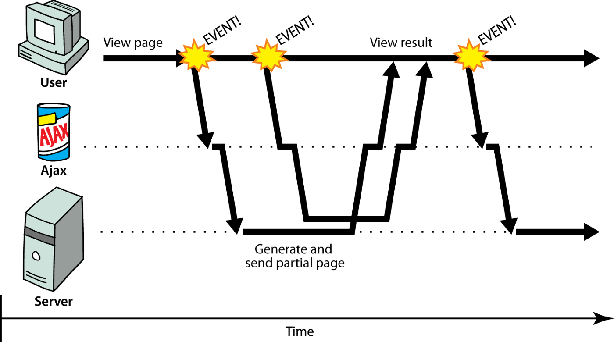

## Static resources and Ajax requests

### Load static resources

If you want to use static resources in your Django project, you can first create a directory for saving static resources. In the `vote` project, we put static resources in a folder named `static`, which contains three subfolders: css, js and images, which are used to save external CSS files, external JavaScript file and image resources, as shown in the following figure.


To be able to find the folder where the static resources are saved, we also need to modify the Django project's configuration file `settings.py` as follows:

````Python
STATICFILES_DIRS = [os.path.join(BASE_DIR, 'static'), ]
STATIC_URL = '/static/'
````

After configuring the static resources, you can run the project and see if the pictures on the page we wrote earlier can be loaded normally. It should be noted that after the project is officially deployed to the online environment, we usually hand over static resources to a dedicated static resource server (such as Nginx, Apache) for processing, rather than having a server running Python code to manage static resources. Therefore, the above configuration is not applicable to the production environment and is only used for testing in the project development phase. The correct posture for using static resources will be explained to you in the following chapters.

### Ajax overview

Next, we can implement the functions of "good" and "bad". Obviously, if these two functions can be implemented without refreshing the page, it will bring a better user experience, so we consider using [Ajax]( https://en.wikipedia.org/wiki/AJAX) technology to achieve "good" and "bad". Ajax is the abbreviation of Asynchronous Javascript And XML. Simply put, using Ajax technology can partially refresh the page without reloading the entire page.

For traditional web applications, every time new content needs to be loaded on the page, the server needs to be re-requested and the entire page needs to be refreshed. If the server cannot respond in a short time or the network condition is not ideal, the browser may be blank for a long time. And make the user in a waiting state, during which the user can do nothing, as shown in the following figure. Obviously, such a Web application does not bring a good user experience.


For web applications using Ajax technology, the browser can initiate an asynchronous request to the server to obtain data. Asynchronous requests will not interrupt the user experience. When the server returns new data, we can partially refresh the page by performing DOM operations with JavaScript code, which is equivalent to updating the content of the page without refreshing the entire page. As shown below.



When using Ajax technology, the browser and the server usually exchange data in XML or JSON format. XML is a data format that was used a lot in the past. In recent years, it has been almost completely replaced by JSON. The following is a comparison of the two data formats .

XML format:

````XML
<?xml version="1.0" encoding="utf-8"?>
<message>
<from>Alice</from>
    <to>Bob</to>
    <content>Dinner is on me!</content>
</message>
````

JSON format:

````JSON
{
    "from": "Alice",
    "to": "Bob",
    "content": "Dinner is on me!"
}
````

Through the above comparison, it is obvious that the data in JSON format is much more compact, so the transmission efficiency is higher, and JSON itself is also an object expression syntax in JavaScript, so it is more convenient to process data in JSON format in JavaScript code.

### Implement voting function with Ajax

Next, we use Ajax technology to implement the voting function. First, modify the `urls.py` file of the project to map the corresponding URLs for the "good" and "bad" functions.

````Python
from django.contrib import admin
from django.urls import path

from vote import views

urlpatterns = [
    path('', views.show_subjects),
    path('teachers/', views.show_teachers),
    path('praise/', views.praise_or_criticize),
    path('criticize/', views.praise_or_criticize),
    path('admin/', admin.site.urls),
]
````

The view function `praise_or_criticize` is designed to support the "good" and "bad" functions. The view function serializes the dictionary into a JSON string through the JsonResponse class encapsulated by Django as the response content returned to the browser.

````Python
def praise_or_criticize(request):
    """Praise"""
    try:
        tno = int(request.GET.get('tno'))
        teacher = Teacher.objects.get(no=tno)
        if request.path.startswith('/praise'):
            teacher.good_count += 1
            count = teacher.good_count
        else:
            teacher.bad_count += 1
            count = teacher.bad_count
        teacher.save()
        data = {'code': 20000, 'mesg': 'Operation successful', 'count': count}
    except (ValueError, Teacher.DoseNotExist):
        data = {'code': 20001, 'mesg': 'Operation failed'}
    return JsonResponse(data)
````

Modify the template page that displays teacher information, and introduce jQuery library to implement event processing, Ajax request and DOM manipulation.

````HTML
<!DOCTYPE html>
<html lang="en">
<head>
    <meta charset="UTF-8">
    <title>Teacher Information</title>
    <style>
        #container {
            width: 80%;
            margin: 10px auto;
        }
        .teacher {
            width: 100%;
            margin: 0 auto;
            padding: 10px 0;
            border-bottom: 1px dashed gray;
            overflow: auto;
        }
        .teacher>div {
            float: left;
        }
        .photo {
            height: 140px;
            border-radius: 75px;
            overflow: hidden;
            margin-left: 20px;
        }
        .info {
            width: 75%;
            margin-left: 30px;
        }
        .info div {
            clear: both;
            margin: 5px 10px;
        }
        .info span {
            margin-right: 25px;
        }
        .info a {
            text-decoration: none;
            color: darkcyan;
        }
    </style>
</head>
<body>
    <div id="container">
        <h1>Teacher information for {{ subject.name }} subject</h1>
        <hr>
        
            <h2>There is currently no teacher information for this subject</h2>
        
        
        <div class="teacher">
            <div class="photo">
                
            </div>
            <div class="info">
                <div>
                    <span><strong>Name: {{ teacher.name }}</strong></span>
                    <span>Gender: {{ teacher.sex | yesno: 'male, female' }}</span>
                    <span>Date of Birth: {{ teacher.birth }}</span>
                </div>
                <div class="intro">{{ teacher.intro }}</div>
                <div class="comment">
                    <a href="/praise/?tno={{ teacher.no }}">Praise</a>&nbsp;&nbsp;
                    (<strong>{{ teacher.good_count }}</strong>)
                    &nbsp;&nbsp;&nbsp;&nbsp;
                    <a href="/criticize/?tno={{ teacher.no }}">bad review</a>&nbsp;&nbsp;
                    (<strong>{{ teacher.bad_count }}</strong>)
                </div>
            </div>
        </div>
        
        <a href="/">Back to homepage</a>
    </div>
    <script src="https://cdn.bootcss.com/jquery/3.4.1/jquery.min.js"></script>
    <script>
        $(() => {
            $('.comment>a').on('click', (evt) => {
                evt.preventDefault()
                let url = $(evt.target).attr('href')
                $.getJSON(url, (json) => {
                    if (json.code == 20000) {
                        $(evt.target).next().text(json.count)
                    } else {
                        alert(json.mesg)
                    }
                })
            })
        })
    </script>
</body>
</html>
````

In the front-end code above, the `getJSON` method encapsulated by the jQuery library is used to send an asynchronous request to the server. If you are not familiar with the front-end jQuery library, you can refer to ["jQuery API Manual"](https://www.runoob.com/ manual/jquery/).

### Summary

So far, the core functions of this voting project have been completed. In the following chapters, we will require users to log in to vote. Users without an account can register an account through the registration function.