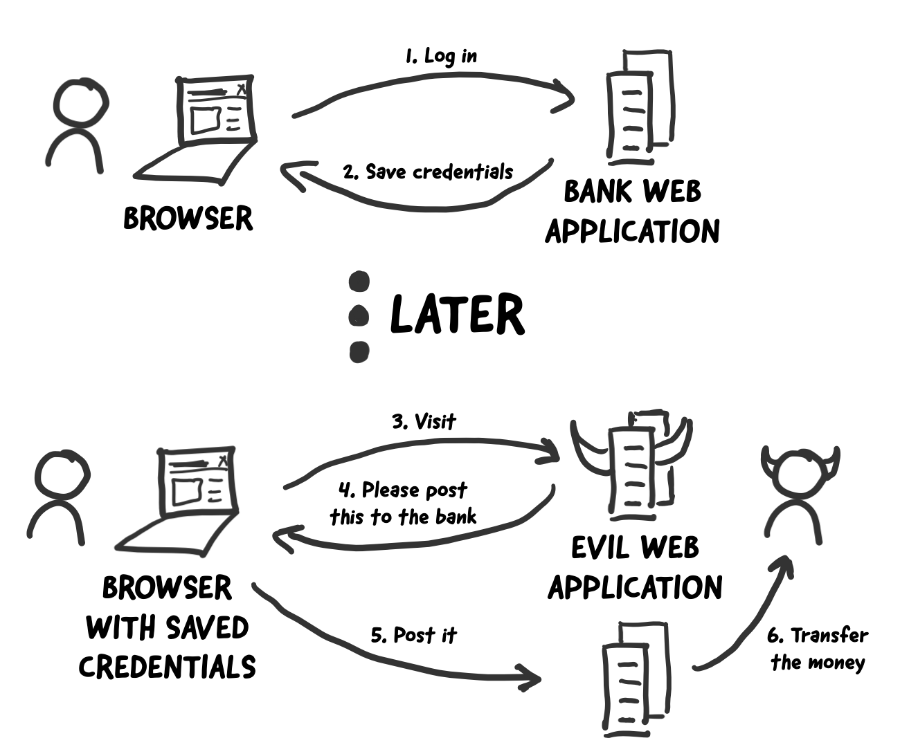
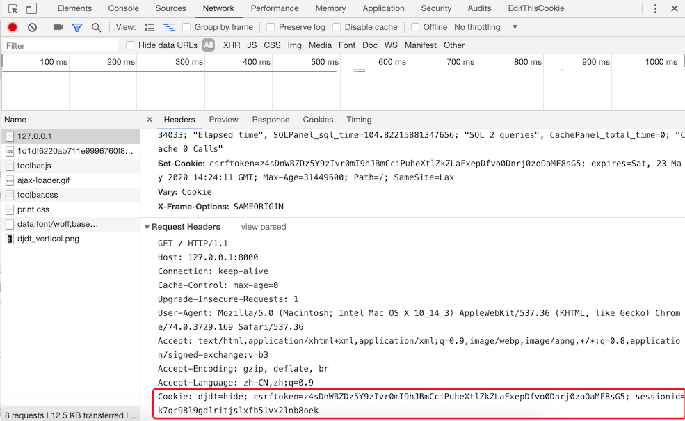
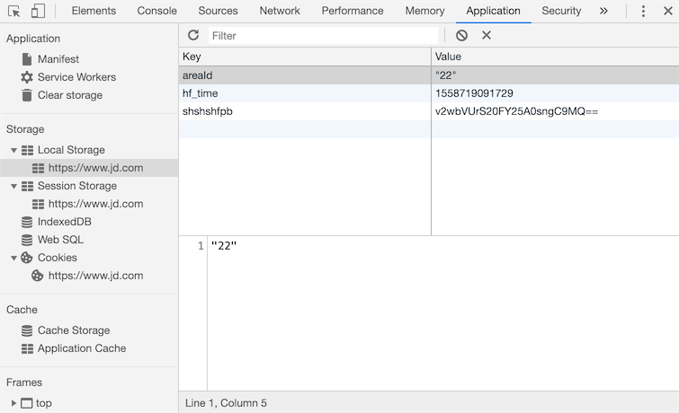

##Cookies and Sessions

Let's continue to complete the project in the previous chapter, implement the "user login" function, and restrict only logged in users to vote.

### Preparing for user login

Let's do some preparatory work to implement user login first.

1. Create a user model. Earlier we explained that if the conversion from a two-dimensional table to a model (reverse engineering) is achieved through Django's ORM, this time we try to turn the model into a two-dimensional table (forward engineering).

    ````Python
    class User(models.Model):
        """user"""
        no = models.AutoField(primary_key=True, verbose_name='number')
        username = models.CharField(max_length=20, unique=True, verbose_name='username')
        password = models.CharField(max_length=32, verbose_name='password')
        tel = models.CharField(max_length=20, verbose_name='phone number')
        reg_date = models.DateTimeField(auto_now_add=True, verbose_name='registration time')
        last_visit = models.DateTimeField(null=True, verbose_name='Last login time')
    
        class Meta:
            db_table = 'tb_user'
            verbose_name = 'user'
            verbose_name_plural = 'user'
    ````
    
2. Use the following command to generate the migration file and execute the migration, turning the `User` model directly into a two-dimensional table `tb_user` in the relational database.

    ````Bash
    python manage.py makemigrations polls
    python manage.py migrate polls
    ````

3. Use the following SQL statement to directly insert two pieces of test data. Usually, the user's password cannot be directly stored in the database, so we process the user's password into the corresponding MD5 digest. The MD5 message digest algorithm is a widely used cryptographic hash function (hash function) that can generate a 128-bit (bit) hash value (hash value) to ensure complete and consistent information transmission. When working with hash values, the hash value is usually represented as a hexadecimal string, so a 128-bit MD5 digest is usually represented as 32 hexadecimal symbols.

    ````SQL
    insert into `tb_user`
        (`username`, `password`, `tel`, `reg_date`)
    values
        ('wangdachui', '1c63129ae9db9c60c3e8aa94d3e00495', '13122334455', now()),
        ('hellokitty', 'c6f8cf68e5f68b0aa4680e089ee4742c', '13890006789', now());
    ````

    > **Description**: The passwords of the two users `wangdachui` and `hellokitty` created above are `1qaz2wsx` and `Abc123!!` respectively.

4. We add a module named `utils.py` under the application to save the utility functions that need to be used. The `hashlib` module in the Python standard library encapsulates commonly used hash algorithms, including: MD5, SHA1, SHA256, etc. Below is the function that uses the `md5` class in `hashlib` to process a string into an MD5 digest as shown below.

    ````Python
    import hashlib
    
    
    def gen_md5_digest(content):
        return hashlib.md5(content.encode()).hexdigest()
    ````

5. Write the view function and template page for user login.

    Add a view function that renders the login page:

    ````Python
    def login(request: HttpRequest) -> HttpResponse:
        hint = ''
        return render(request, 'login.html', {'hint': hint})
    ````

    Add `login.html` template page:
	

```HTML
    <!DOCTYPE html>
    <html lang="en">
    <head>
        <meta charset="UTF-8">
        <title>用户登录</title>
        <style>
            #container {
                width: 520px;
                margin: 10px auto;
            }
            .input {
                margin: 20px 0;
                width: 460px;
                height: 40px;
            }
            .input>label {
                display: inline-block;
                width: 140px;
                text-align: right;
            }
            .input>img {
                width: 150px;
                vertical-align: middle;
            }
            input[name=captcha] {
                vertical-align: middle;
            }
            form+div {
                margin-top: 20px;
            }
            form+div>a {
                text-decoration: none;
                color: darkcyan;
                font-size: 1.2em;
            }
            .button {
                width: 500px;
                text-align: center;
                margin-top: 20px;
            }
            .hint {
                color: red;
                font-size: 12px;
            }
        </style>
    </head>
    <body>
        <div id="container">
            <h1>用户登录</h1>
            <hr>
            <p class="hint">{{ hint }}</p>
            <form action="/login/" method="post">
                
                <fieldset>
                    <legend>用户信息</legend>
                    <div class="input">
                        <label>用户名：</label>
                        <input type="text" name="username">
                    </div>
                    <div class="input">
                        <label>密码：</label>
                        <input type="password" name="password">
                    </div>
                    <div class="input">
                        <label>验证码：</label>
                        <input type="text" name="captcha">
                        
                    </div>
                </fieldset>
                <div class="button">
                    <input type="submit" value="登录">
                    <input type="reset" value="重置">
                </div>
            </form>
            <div>
                <a href="/">返回首页</a>
                <a href="/register/">注册新用户</a>
            </div>
        </div>
    </body>
    </html>
    ```
	
Note that in the form above, we used the template directive `` to add a hidden field to the form (you can display the source code of the web page in your browser to see that the `type` attribute generated by this directive is The `input` tag of `hidden`), its role is to generate a random token (token) in the form to prevent [cross-site request forgery](<https://en.wikipedia.org/wiki/%E8% B7%A8%E7%AB%99%E8%AF%B7%E6%B1%82%E4%BC%AA%E9%80%A0>) (abbreviated as CSRF), which is also the rigidity of Django when submitting the form Require. If we don't have such a token in our form, the Django framework will produce a response with a status code `403` (Forbidden) when the form is submitted, unless we set an exempt CSRF token. The figure below is a simple and vivid example of CSRF.

    

Next, we can write view functions that provide verification codes and implement user login. Before that, let's talk about how a web application implements user tracking and the support provided by the Django framework for implementing user tracking. For a web application, after a user logs in successfully, the server must be able to remember that the user has logged in, so that the server can provide better services for the user, and the CSRF mentioned above is also a phishing website to get the user to log in. Information attack methods for malicious operations, these are based on user tracking technology. With this background in mind, it's clear what exactly a user needs to do when they log in.

### Implement user tracking

Today, if a website doesn't somehow remember who you are and what you've been doing on the website, what you lose is the usability and convenience of the website, which in turn is likely to cause the flow of website users, so remember a user (more technically called **user tracking**) is a required feature for most web applications.

On the server side, the easiest way to remember a user is to create an object, through which the user-related information can be saved. This object is what we often call a session (user session object). Then the problem comes, HTTP itself is a **connectionless** (in the process of each request and response, the server disconnects once the response to the client request is completed), **stateless** (client When the request to the server is initiated again, the server cannot know any previous information of the client) protocol, even if the server retains user data through the session object, it has to use some way to determine the current request and the previously saved one. A session is associated. I believe many people can think that we can assign a globally unique identifier to each session object to identify the session object. Find the corresponding session object, so as to remember the user's information between two requests, which is the user tracking we said earlier.

There are several ways to let the client remember and bring the sessionid with each request:

1. URL rewriting. The so-called URL rewriting is to carry the sessionid in the URL, for example: `http://www.example.com/index.html?sessionid=123456`, the server obtains the corresponding session object by obtaining the value of the sessionid parameter.

2. Hidden fields (implicit form fields). When submitting a form, additional data can be sent to the server by setting hidden fields in the form. For example: `<input type="hidden" name="sessionid" value="123456">`.

3. Local storage. Current browsers support a variety of local storage schemes, including: cookie, localStorage, sessionStorage, IndexedDB, etc. Among these solutions, cookie is the one with the longest history and the most criticized one, and it is also the one we will first explain to you next. Simply put, a cookie is a kind of data that is stored in the browser's temporary file in the form of a key-value pair. Every time a request is made, the request header will carry the cookie of the site to the server, so as long as the sessionid is written into the cookie, the following The server can obtain the sessionid by reading the cookie in the request header during the next request, as shown in the following figure.

   

   In the HTML5 era, in addition to cookies, you can also use the new local storage API to save data, that is, the technologies such as localStorage, sessionStorage, and IndexedDB just mentioned, as shown in the following figure.

   

**To sum up**, to achieve user tracking, the server can create a session object for each user session and write the ID of the session object into the browser's cookie; the next time the user requests the server, the browser will The HTTP request header carries the cookie information saved by the website, so that the server can find the ID of the session object from the cookie and obtain the previously created session object according to this ID; since the session object can save user data in the form of key-value pairs, In this way, all the information previously stored in the session object can be retrieved, and the server can also determine the user's identity and understand the user's preferences based on this information, so as to provide users with better personalized services.

### Django framework support for session

When creating a Django project, the default configuration file `settings.py` has activated a middleware named `SessionMiddleware` (we will explain the knowledge of middleware in detail in the following chapters, here you only need to know its Existence), because of the existence of this middleware, we can directly manipulate the session object through the `session` attribute of the request object. As we said earlier, the `session` attribute is a container object that can read and write data like a dictionary, so we can use "key-value pairs" to retain user data. At the same time, the `SessionMiddleware` middleware also encapsulates the operation of the cookie, and saves the sessionid in the cookie, which we have mentioned above.

By default, Django serializes session data and saves it in a relational database. In versions after Django 1.6, the default way to serialize data is JSON serialization, and Pickle serialization has been used until then. The difference between JSON serialization and Pickle serialization is that the former serializes objects into strings (character form), while the latter serializes objects into byte strings (binary form). For security reasons, JSON serialization has become the current Django The framework defaults to serializing data, which requires that the data we save in the session must be JSON serializable, otherwise an exception will be thrown. Another point to note is that using a relational database to save session data is not the best choice most of the time, because the database may be under huge pressure and become the bottleneck of system performance. In the following chapters, we will Tell everyone how to save the session to the cache service to improve the performance of the system.

### Implement user login authentication

First, we write the function `gen_random_code` to generate random verification code in the `polls/utils.py` file just now, as shown below.


````Python
import random

ALL_CHARS = '0123456789abcdefghijklmnopqrstuvwxyzABCDEFGHIJKLMNOPQRSTUVWXYZ'


def gen_random_code(length=4):
    return ''.join(random.choices(ALL_CHARS, k=length))
````

Write a class `Captcha` that generates a captcha image.

````Python
"""
Image verification code
"""
import os
import random
from io import BytesIO

from PIL import Image
from PIL import ImageFilter
from PIL.ImageDraw import Draw
from PIL.ImageFont import truetype


class Bezier:
    """Bezier curve"""

    def __init__(self):
        self.tsequence = tuple([t / 20.0 for t in range(21)])
        self.beziers = {}

    def make_bezier(self, n):
        """Draw a Bezier curve"""
        try:
            return self.beziers[n]
        except KeyError:
            combinations = pascal_row(n - 1)
            result = []
            for t in self.tsequence:
                tpowers = (t ** i for i in range(n))
                upowers = ((1 - t) ** i for i in range(n - 1, -1, -1))
                coefs = [c * a * b for c, a, b in zip(combinations,
                                                      tpowers, upowers)]
                result.append(coefs)
            self.beziers[n] = result
            return result
			
class Captcha:
    """验证码"""

    def __init__(self, width, height, fonts=None, color=None):
        self._image = None
        self._fonts = fonts if fonts else \
            [os.path.join(os.path.dirname(__file__), 'fonts', font)
             for font in ['Arial.ttf', 'Georgia.ttf', 'Action.ttf']]
        self._color = color if color else random_color(0, 200, random.randint(220, 255))
        self._width, self._height = width, height

    @classmethod
    def instance(cls, width=200, height=75):
        """用于获取Captcha对象的类方法"""
        prop_name = f'_instance_{width}_{height}'
        if not hasattr(cls, prop_name):
            setattr(cls, prop_name, cls(width, height))
        return getattr(cls, prop_name)

    def _background(self):
        """绘制背景"""
        Draw(self._image).rectangle([(0, 0), self._image.size],
                                    fill=random_color(230, 255))

    def _smooth(self):
        """平滑图像"""
        return self._image.filter(ImageFilter.SMOOTH)

    def _curve(self, width=4, number=6, color=None):
        """绘制曲线"""
        dx, height = self._image.size
        dx /= number
        path = [(dx * i, random.randint(0, height))
                for i in range(1, number)]
        bcoefs = Bezier().make_bezier(number - 1)
        points = []
        for coefs in bcoefs:
            points.append(tuple(sum([coef * p for coef, p in zip(coefs, ps)])
                                for ps in zip(*path)))
        Draw(self._image).line(points, fill=color if color else self._color, width=width)

    def _noise(self, number=50, level=2, color=None):
        """绘制扰码"""
        width, height = self._image.size
        dx, dy = width / 10, height / 10
        width, height = width - dx, height - dy
        draw = Draw(self._image)
        for i in range(number):
            x = int(random.uniform(dx, width))
            y = int(random.uniform(dy, height))
            draw.line(((x, y), (x + level, y)),
                      fill=color if color else self._color, width=level)

    def _text(self, captcha_text, fonts, font_sizes=None, drawings=None, squeeze_factor=0.75, color=None):
        """绘制文本"""
        color = color if color else self._color
        fonts = tuple([truetype(name, size)
                       for name in fonts
                       for size in font_sizes or (65, 70, 75)])
        draw = Draw(self._image)
        char_images = []
        for c in captcha_text:
            font = random.choice(fonts)
            c_width, c_height = draw.textsize(c, font=font)
            char_image = Image.new('RGB', (c_width, c_height), (0, 0, 0))
            char_draw = Draw(char_image)
            char_draw.text((0, 0), c, font=font, fill=color)
            char_image = char_image.crop(char_image.getbbox())
            for drawing in drawings:
                d = getattr(self, drawing)
                char_image = d(char_image)
            char_images.append(char_image)
        width, height = self._image.size
        offset = int((width - sum(int(i.size[0] * squeeze_factor)
                                  for i in char_images[:-1]) -
                      char_images[-1].size[0]) / 2)
        for char_image in char_images:
            c_width, c_height = char_image.size
            mask = char_image.convert('L').point(lambda i: i * 1.97)
            self._image.paste(char_image,
                              (offset, int((height - c_height) / 2)),
                              mask)
            offset += int(c_width * squeeze_factor)

    @staticmethod
    def _warp(image, dx_factor=0.3, dy_factor=0.3):
        """图像扭曲"""
        width, height = image.size
        dx = width * dx_factor
        dy = height * dy_factor
        x1 = int(random.uniform(-dx, dx))
        y1 = int(random.uniform(-dy, dy))
        x2 = int(random.uniform(-dx, dx))
        y2 = int(random.uniform(-dy, dy))
        warp_image = Image.new(
            'RGB',
            (width + abs(x1) + abs(x2), height + abs(y1) + abs(y2)))
        warp_image.paste(image, (abs(x1), abs(y1)))
        width2, height2 = warp_image.size
        return warp_image.transform(
            (width, height),
            Image.QUAD,
            (x1, y1, -x1, height2 - y2, width2 + x2, height2 + y2, width2 - x2, -y1))

    @staticmethod
    def _offset(image, dx_factor=0.1, dy_factor=0.2):
        """图像偏移"""
        width, height = image.size
        dx = int(random.random() * width * dx_factor)
        dy = int(random.random() * height * dy_factor)
        offset_image = Image.new('RGB', (width + dx, height + dy))
        offset_image.paste(image, (dx, dy))
        return offset_image
		
    @staticmethod
    def _rotate(image, angle=25):
        """Image rotation"""
        return image.rotate(random.uniform(-angle, angle),
                            Image.BILINEAR, expand=1)

    def generate(self, captcha_text='', fmt='PNG'):
        """Generate verification code (text and picture)
        :param captcha_text: Captcha text
        :param fmt: The format of the generated verification code image
        :return: The binary data of the captcha image
        """
        self._image = Image.new('RGB', (self._width, self._height), (255, 255, 255))
        self._background()
        self._text(captcha_text, self._fonts,
                   drawings=['_warp', '_rotate', '_offset'])
        self._curve()
        self._noise()
        self._smooth()
        image_bytes = BytesIO()
        self._image.save(image_bytes, format=fmt)
        return image_bytes.getvalue()


def pascal_row(n=0):
    """Generate Pythagorean triangle (Yang Hui triangle)"""
    result = [1]
    x, numerator = 1, n
    for denominator in range(1, n // 2 + 1):
        x *= numerator
        x /= denominator
        result.append(x)
        numerator -= 1
    if n & 1 == 0:
        result.extend(reversed(result[:-1]))
    else:
        result.extend(reversed(result))
    return result


def random_color(start=0, end=255, opacity=255):
    """Get random color"""
    red = random.randint(start, end)
    green = random.randint(start, end)
    blue = random.randint(start, end)
    if opacity is None:
        return red, green, blue
    return red, green, blue, opacity
````

> **Note**: The above code uses three font files. The font files are located in the `polls/fonts` directory. You can add font files by yourself, but you need to pay attention to the file name of the font file and the 45th of the above code. line remains the same.

Next, let's complete the view function that provides the captcha.

````Python
def get_captcha(request: HttpRequest) -> HttpResponse:
    """Verification code"""
    captcha_text = gen_random_code()
    request.session['captcha'] = captcha_text
    image_data = Captcha.instance().generate(captcha_text)
    return HttpResponse(image_data, content_type='image/png')
````

Pay attention to the 4th line in the above code, we save the randomly generated verification code string to the session. When the user logs in later, we need to compare the verification code string saved in the session with the verification code string input by the user. By comparison, if the user enters the correct verification code, the subsequent login process can be performed. The code is as follows.

````Python
def login(request: HttpRequest) -> HttpResponse:
    hint = ''
    if request.method == 'POST':
        username = request.POST.get('username')
        password = request.POST.get('password')
        if username and password:
            password = gen_md5_digest(password)
            user = User.objects.filter(username=username, password=password).first()
            if user:
                request.session['userid'] = user.no
                request.session['username'] = user.username
                return redirect('/')
            else:
                hint = 'Incorrect username or password'
        else:
            hint = 'Please enter a valid username and password'
    return render(request, 'login.html', {'hint': hint})
````

>**Note**: The above code does not verify the user name and password. In actual projects, it is recommended to use regular expressions to verify user input information, otherwise invalid data may be handed over to the database for processing or other security issues. hidden danger.

In the above code, we set the user ID (`userid`) and username (`username`) to be saved in the session after the login is successful, and the page will be redirected to the home page. Next, we can slightly adjust the code of the home page to display the user name of the logged in user in the upper right corner of the page. We wrote this code as a separate HTML file named header.html. The home page can include this page by adding `` to the `<body>` tag, the code is as follows shown.

````HTML
<div class="user">
    
    <span>{{ request.session.username }}</span>
    <a href="/logout">Logout</a>
    
    <a href="/login">Login</a>&nbsp;&nbsp;
    
    <a href="/register">Register</a>
</div>
````

If the user is not logged in, the page will display the hyperlinks for login and registration; after the user successfully logs in, the page will display the user name and the link to logout. The view function corresponding to the logout link is shown below, and the URL mapping is similar to what was mentioned before. ,No longer.

````Python
def logout(request):
    """Logout"""
    request.session.flush()
    return redirect('/')
````

The above code destroys the session through the `flush` method of the session object. On the one hand, the user data saved by the session object on the server is cleared, and on the other hand, the sessionid saved in the browser cookie is deleted. Later, we will discuss how to read and write cookies. operation is explained.

We can find all sessions through a table named `django_session` in the database used by the project. The structure of the table is as follows:

| session_key | session_data | expire_date |
| -------------------------------- | ---------------- --------------- | ------------------------- |
| c9g2gt5cxo0k2evykgpejhic5ae7bfpl | MmI4YzViYjJhOGMyMDJkY2M5Yzg3... | 2019-05-25 23:16:13.898522 |

Among them, the first column is the sessionid saved in the browser cookie; the second column is the data in the session encoded by BASE64. If you use Python's `base64` to decode it, the decoding process and results are as follows.

````Python
import base64

base64.b64decode('MmI4YzViYjJhOGMyMDJkY2M5Yzg3ZWIyZGViZmUzYmYxNzdlNDdmZjp7ImNhcHRjaGEiOiJzS3d0Iiwibm8iOjEsInVzZXJuYW1lIjoiamFja2ZydWVkIn0=')
````

The third column is the expiration time of the session. After the session expires, the sessionid in the cookie saved by the browser will be invalid, but the corresponding record in the database will still exist. If you want to clear the expired data, you can use the following command.

```Shell
python manage.py clearsessions
````

The default session expiration time of the Django framework is two weeks (1209600 seconds). If you want to modify this time, you can add the following code to the project configuration file.

````Python
# Configure the session timeout to 1 day (86400 seconds)
SESSION_COOKIE_AGE = 86400
````

There are many applications with high security requirements that must expire the session when the browser window is closed, and no longer retain any user information. If you want to expire the session when the browser window is closed (the sessionid in the cookie is invalid), The configuration shown below can be added.

````Python
# Set to True to expire the session when the browser window is closed
SESSION_EXPIRE_AT_BROWSER_CLOSE = True
````

If you do not want to save the session data in the database, you can put it in the cache. The corresponding configuration is as follows. The configuration and use of the cache will be explained later.

````Python
# Configure the session object to be stored in the cache
SESSION_ENGINE = 'django.contrib.sessions.backends.cache'
# Configure which set of caches to use to save sessions
SESSION_CACHE_ALIAS = 'default'
````

If you want to modify the default serialization method of session data, you can change the default `JSONSerializer` to `PickleSerializer`.

````Python
SESSION_SERIALIZER = 'django.contrib.sessions.serializers.PickleSerializer'
````

Next, we can restrict that only logged-in users can vote for the teacher. The modified `praise_or_criticize` function is shown below. We determine whether the user is logged in by obtaining the `userid` from `request.session`.

````Python
def praise_or_criticize(request: HttpRequest) -> HttpResponse:
    if request.session.get('userid'):
        try:
            tno = int(request.GET.get('tno'))
            teacher = Teacher.objects.get(no=tno)
            if request.path.startswith('/praise/'):
                teacher.good_count += 1
                count = teacher.good_count
            else:
                teacher.bad_count += 1
                count = teacher.bad_count
            teacher.save()
            data = {'code': 20000, 'mesg': 'vote successful', 'count': count}
        except (ValueError, Teacher.DoesNotExist):
            data = {'code': 20001, 'mesg': 'vote failed'}
    else:
        data = {'code': 20002, 'mesg': 'Please log in first'}
    return JsonResponse(data)
````

Of course, after modifying the view function, `teachers.html` also needs to be adjusted. If the user is not logged in, the user will be directed to the login page, and if the login is successful, it will return to the voting page, which will not be repeated here.

### Read and write cookies in view functions

Below we make a more detailed description of how to use cookies to help you make better use of this technology in your web projects. The `HttpRequest` and `HttpResponse` objects encapsulated by Django provide operations for reading and writing cookies, respectively.

Properties and methods encapsulated by HttpRequest:

1. `COOKIES` property - This property contains all cookies carried by the HTTP request.
2. `get_signed_cookie` method - Get a signed cookie. If the signature verification fails, a `BadSignature` exception will be generated.

HttpResponse encapsulated method:

1. `set_cookie` method - This method can set a set of key-value pairs and will eventually be written to the browser.
2. `set_signed_cookie` method - similar to the above method, but will sign the cookie to prevent tampering. Because if the data in the cookie is tampered with, without knowing the [key](<https://zh.wikipedia.org/wiki/%E5%AF%86%E9%92%A5>) and [salt](< https://zh.wikipedia.org/wiki/%E7%9B%90_(%E5%AF%86%E7%A0%81%E5%AD%A6)>), a valid signature cannot be generated. In this way, when the server reads the cookie, it will find that the data is inconsistent with the signature and generate a `BadSignature` exception. It should be noted that the key mentioned here is the `SECRET_KEY` specified in the Django project configuration file, and the salt is a string set in the program. You can set whatever you want, as long as it is a valid string.

The methods mentioned above, if you don't know their specific usage, you can check Django's [official documentation](<https://docs.djangoproject.com/en/2.1/ref/request-response/>), no What information can tell you how to use these methods more clearly than the official documentation.

As we said just now, after activating `SessionMiddleware`, each `HttpRequest` object will be bound with a session attribute, which is a dictionary-like object. In addition to saving user data, it also provides a method to detect whether the browser supports cookies ,include:

1. `set_test_cookie` method - sets the cookie for testing.
2. `test_cookie_worked` method - checks if the test cookie works.
3. `delete_test_cookie` method - deletes the cookie used for testing.
4. `set_expiry` method - sets the expiration time of the session.
5. `get_expire_age`/`get_expire_date` methods - get the expiration time of the session.
6. `clear_expired` method - clears expired sessions.

Below is the code to check if the browser supports cookies before performing the login. Usually, browsers enable cookie support by default, but for some reason, the user disables the browser's cookie function. In this case, we can provide a check function in the view function. If the user is detected The browser does not support cookies and can give corresponding prompts.

````Python
def login(request):
    if request.method == 'POST':
        if request.session.test_cookie_worked():
            request.session.delete_test_cookie()
            # Add your code to perform login process here
        else:
            return HttpResponse("Please enable cookies and try again.")
    request.session.set_test_cookie()
    return render_to_response('login.html')
````

### Cookie Alternatives

As we said before, the reputation of cookies has not been very good. Of course, in actual development, we will not save the user's sensitive information (such as the user's password, credit card account number, etc.) in the cookie, and save it in the cookie. The data will generally be encoded and signed well. For browsers that support HTML5, you can use localStorage and sessionStorage as an alternative to cookies. I believe you can hear the difference from the name. Data stored in `localStorage` can be retained for a long time; while stored in ` sessionStorage` data will be cleared when the browser is closed. Regarding the usage of these cookie alternatives, it is recommended that you refer to [MDN](<https://developer.mozilla.org/zh-CN/docs/Web>) to understand.