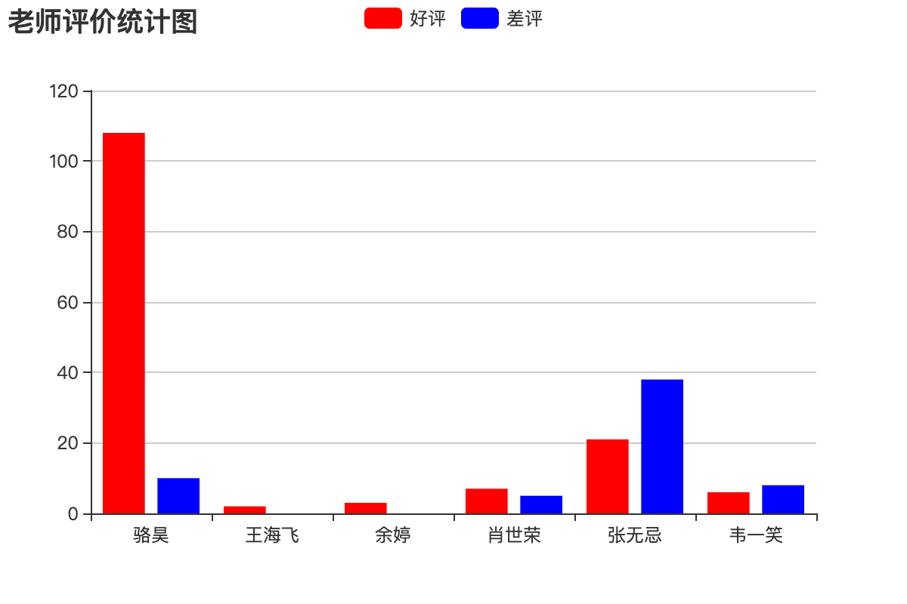

## make a report

### Export Excel report

Reports use tables, charts and other formats to dynamically display data, so some people use such formulas to describe reports:

````
Reports = various formats + dynamic data
````

There are many third-party libraries that support writing Excel files in Python programs, including [`xlwt`](<https://xlwt.readthedocs.io/en/latest/>), [`xlwings`](<https:// docs.xlwings.org/en/latest/quickstart.html>), [`openpyxl`](<https://openpyxl.readthedocs.io/en/latest/>), [`xlswriter`](<https:/ /xlsxwriter.readthedocs.io/>), etc., although xlwt only supports writing Excel files in xls format, its performance is still good. Let's take `xlwt` as an example to demonstrate how to export Excel reports in a Django project.

Install `xlwt`.

````Bash
pip install xlwt
````

A view function that exports an Excel sheet containing all teacher information.

````Python
def export_teachers_excel(request):
    # create workbook
    wb = xlwt.Workbook()
    # add worksheet
    sheet = wb.add_sheet('Teacher Information Sheet')
    # Query the information of all teachers
    queryset = Teacher.objects.all()
    # Write the header to the Excel sheet
    colnames = ('Name', 'Introduction', 'Number of good reviews', 'Number of bad reviews', 'Subject')
    for index, name in enumerate(colnames):
        sheet.write(0, index, name)
    # Write the teacher's data to the cell
    props = ('name', 'detail', 'good_count', 'bad_count', 'subject')
    for row, teacher in enumerate(queryset):
        for col, prop in enumerate(props):
            value = getattr(teacher, prop, '')
            if isinstance(value, Subject):
                value = value.name
            sheet.write(row + 1, col, value)
    # Save Excel
    buffer = BytesIO()
    wb.save(buffer)
    # Write binary data to the body of the response and set the MIME type
    resp = HttpResponse(buffer.getvalue(), content_type='application/vnd.ms-excel')
    # Chinese file names need to be processed into percent code
    filename = quote('teacher.xls')
    # Tell the browser to download the file and the corresponding file name through the response header
    resp['content-disposition'] = f'attachment; filename*=utf-8\'\'{filename}'
    return resp
````

Map URLs.

````Python
urlpatterns = [
    
    path('excel/', views.export_teachers_excel),
    
]
````

### Export PDF report

In the Django project, if you need to export a PDF report, you can use the third-party library `reportlab` to generate the content of the PDF file, then output the binary data of the file to the browser and specify the MIME type as `application/pdf`, the specific code is as follows shown.

````Python
def export_pdf(request: HttpRequest) -> HttpResponse:
    buffer = io.BytesIO()
    pdf = canvas.Canvas(buffer)
    pdf.setFont("Helvetica", 80)
    pdf.setFillColorRGB(0.2, 0.5, 0.3)
    pdf.drawString(100, 550, 'hello, world!')
    pdf.showPage()
    pdf.save()
    resp = HttpResponse(buffer.getvalue(), content_type='application/pdf')
    resp['content-disposition'] = 'inline; filename="demo.pdf"'
    return resp
````

For how to use `reportlab` to customize the content of PDF reports, you can refer to the [official document] of reportlab (https://www.reportlab.com/docs/reportlab-userguide.pdf).

### Generate front-end statistical charts

If you need to generate front-end statistical charts in your project, you can use Baidu's [ECharts](<https://echarts.baidu.com/>). The specific method is that the back-end returns the data required for the statistical chart by providing a data interface, and the front-end uses ECharts to render histograms, line charts, pie charts, scatter charts and other charts. For example, if we want to generate a report that counts the number of positive and negative comments from all teachers, we can do it in the following way.

````Python
def get_teachers_data(request):
    queryset = Teacher.objects.all()
    names = [teacher.name for teacher in queryset]
    good_counts = [teacher.good_count for teacher in queryset]
    bad_counts = [teacher.bad_count for teacher in queryset]
    return JsonResponse({'names': names, 'good': good_counts, 'bad': bad_counts})
````

Map URLs.

````Python
urlpatterns = [
    path('teachers_data/', views.get_teachers_data),
]
````

Use ECharts to generate histograms.

````HTML
<!DOCTYPE html>
<html lang="en">
<head>
    <meta charset="UTF-8">
    <title>Teacher Evaluation Statistics</title>
</head>
<body>
    <div id="main" style="width: 600px; height: 400px"></div>
    <p>
        <a href="/">Back to homepage</a>
    </p>
    <script src="https://cdn.bootcss.com/echarts/4.2.1-rc1/echarts.min.js"></script>
    <script>
        var myChart = echarts.init(document.querySelector('#main'))
        fetch('/teachers_data/')
            .then(resp => resp.json())
            .then(json => {
                var option = {
                    color: ['#f00', '#00f'],
                    title: {
                        text: 'Teacher Evaluation Statistics Chart'
                    },
                    tooltip: {},
                    legend: {
                        data:['good review', 'bad review']
                    },
                    xAxis: {
                        data: json.names
                    },
                    yAxis: {},
                    series: [
                        {
                            name: 'Praise',
                            type: 'bar',
                            data: json.good
                        },
                        {
                            name: 'bad review',
                            type: 'bar',
                            data: json.bad
                        }
                    ]
                }
                myChart.setOption(option)
            })
    </script>
</body>
</html>
````

The operation effect is shown in the figure below.

