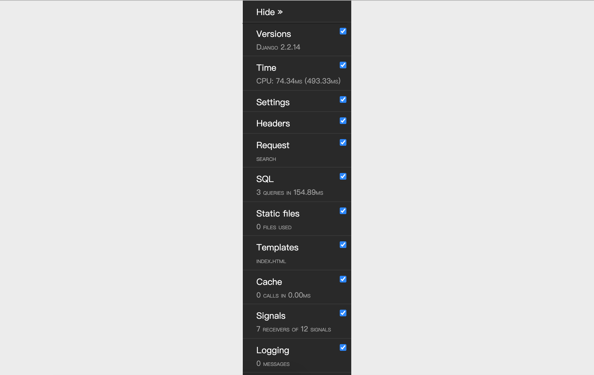

## log and debug toolbar

### configure log

In the project development stage, it is necessary to display enough debugging information to assist developers in debugging the code; after the project is launched, it is also very important to record the warnings, errors and other information that appear when the system is running so that the relevant personnel can understand the operating status of the system and maintain the code. Necessary. At the same time, the collection of log data also lays a foundation for the digital operation of the website. Through the analysis of the system operation log, we can monitor the website traffic and traffic distribution, and at the same time, we can also dig out the user's usage habits and behavior patterns.

Next, let's take a look at how to configure logging through Django's configuration file. Django's log configuration can basically be done by referring to the official documents and combined with the actual needs of the project. These contents can basically be copied from the official documents and then adjusted locally. Some reference configurations are given below.

````Python
LOGGING = {
    'version': 1,
    # Whether to disable the existing logger
    'disable_existing_loggers': False,
    # log formatter
    'formatters': {
        'simple': {
            'format': '%(asctime)s %(module)s.%(funcName)s: %(message)s',
            'datefmt': '%Y-%m-%d %H:%M:%S',
        },
        'verbose': {
            'format': '%(asctime)s %(levelname)s [%(process)d-%(threadName)s] '
                      '%(module)s.%(funcName)s line %(lineno)d: %(message)s',
            'datefmt': '%Y-%m-%d %H:%M:%S',
        }
    },
    # log filter
    'filters': {
        # Only works if DEBUG is True in the Django config file
        'require_debug_true': {
            '()': 'django.utils.log.RequireDebugTrue',
        },
    },
    # log handler
    'handlers': {
        # output to console
        'console': {
            'class': 'logging.StreamHandler',
            'level': 'DEBUG',
            'filters': ['require_debug_true'],
            'formatter': 'simple',
        },
        # output to file (cut once a week)
        'file1': {
            'class': 'logging.handlers.TimedRotatingFileHandler',
            'filename': 'access.log',
            'when': 'W0',
            'backupCount': 12,
            'formatter': 'simple',
            'level': 'INFO',
        },
        # output to file (cut once a day)
        'file2': {
            'class': 'logging.handlers.TimedRotatingFileHandler',
            'filename': 'error.log',
            'when': 'D',
            'backupCount': 31,
            'formatter': 'verbose',
            'level': 'WARNING',
        },
    },
    # logger recorder
    'loggers': {
        'django': {
            # Log processor to use
            'handlers': ['console', 'file1', 'file2'],
            # Whether to propagate log information up
            'propagate': True,
            # log level (not necessarily the final log level)
            'level': 'DEBUG',
        },
    }
}
````

You may have noticed that the `formatters` in the log configuration above are **log formatters**, which represent how to format the output log, where the format placeholders represent:

1. `%(name)s` - the name of the logger
2. `%(levelno)s` - Number of logging levels
3. `%(levelname)s` - the textual name of the logging level
4. `%(filename)s` - The filename of the source file that performed the logging call
5. `%(pathname)s` - The pathname of the source file where the logging call was performed
6. `%(funcName)s` - The name of the function that performs the logging call
7. `%(module)s` - The name of the module that performs the logging call
8. `%(lineno)s` - The line number on which the logging call was executed
9. `%(created)s` - time to perform logging
10. `%(asctime)s` - date and time
11. `%(msecs)s` - milliseconds part
12. `%(thread)d` - thread ID (integer)
13. `%(threadName)s` - thread name
14. `%(process)d` - Process ID (integer)

The handlers in the log configuration are used to specify the **log processor**. Simply put, it is to specify whether to output the log to the console or a file or a server on the network. The available processors include:

1. `logging.StreamHandler(stream=None)` - can output information to any file object like `sys.stdout` or `sys.stderr`
2. `logging.FileHandler(filename, mode='a', encoding=None, delay=False)` - write log messages to file
3. `logging.handlers.DatagramHandler(host, port)` - use UDP protocol to send log information to the network host of the specified host and port
4. `logging.handlers.HTTPHandler(host, url)` - upload log messages to an HTTP server using HTTP's GET or POST methods
5. `logging.handlers.RotatingFileHandler(filename, mode='a', maxBytes=0, backupCount=0, encoding=None, delay=False)` - write log messages to file if file size exceeds `maxBytes` specified value, then a file will be regenerated to record the log
6. `logging.handlers.SocketHandler(host, port)` - use the TCP protocol to send log information to the network host of the specified host and port
7. `logging.handlers.SMTPHandler(mailhost, fromaddr, toaddrs, subject, credentials=None, secure=None, timeout=1.0)` - output the log to the specified email address
8. `logging.MemoryHandler(capacity, flushLevel=ERROR, target=None, flushOnClose=True)` - output the log to the buffer specified in memory

Each of the above log handlers specifies an attribute named `level`, which represents the level of the log, and the different log levels reflect the severity of the information recorded in the log. Six levels of logs are defined in Python, in order from low to high: NOTSET, DEBUG, INFO, WARNING, ERROR, CRITICAL.

The **logger** configured at the end is used to actually output the log. The Django framework provides built-in loggers as follows:

1. `django` - Logger for all messages in the Django hierarchy
2. `django.request` - log messages related to request processing. 5xx responses are treated as error messages; 4xx responses are treated as warning messages
3. `django.server` - Log messages related to requests received by the server invoked via runserver. 5xx responses are treated as error messages; 4xx responses are logged as warning messages; everything else is logged as INFO
4. `django.template` - log messages related to template rendering
5. `django.db.backends` - There are log messages generated by interaction with the database. If you want to display the SQL statements executed by the ORM framework, you can use this logger.

The log level configured in the logger may not be the final log level, because the log level configured in the log processor is also referred to, and the higher level of the two is used as the final log level.

### Configure Django-Debug-Toolbar

If you want to debug your Django project, you must have an artifact called Django-Debug-Toolbar. It is an essential tool for auxiliary debugging and optimization in the project development phase. As long as it is configured, you can easily view the following table Project run information shown, which is critical to debugging the project and optimizing web application performance.

| Project | Description |
| ----------- | --------------------------------- |
| Versions | Django versions |
| Time | Show time spent in view |
| Settings | Values ​​set in the configuration file |
| Headers | Information about HTTP request headers and response headers |
| Request | Various variables related to the request and their information |
| StaticFiles | Static file loading |
| Templates | Information about templates |
| Cache | Cache usage |
| Signals | Django's built-in signal information |
| Logging | Logged information |
| SQL | The SQL statement sent to the database and its execution time |

1. Install Django-Debug-Toolbar.

   ```Shell
   pip install django-debug-toolbar
   ````

2. Configuration - Modify settings.py.

   ````Python
   INSTALLED_APPS = [
       'debug_toolbar',
   ]
   
   MIDDLEWARE = ​​[
       'debug_toolbar.middleware.DebugToolbarMiddleware',
   ]
   
   DEBUG_TOOLBAR_CONFIG = {
       # Import jQuery library
       'JQUERY_URL': 'https://cdn.bootcss.com/jquery/3.3.1/jquery.min.js',
       # Whether the toolbar is collapsed
       'SHOW_COLLAPSED': True,
       # Whether to show the toolbar
       'SHOW_TOOLBAR_CALLBACK': lambda x: True,
   }
   ````

3. Configuration - Modify urls.py.

   ````Python
   if settings.DEBUG:
   
       import debug_toolbar
   
       urlpatterns.insert(0, path('__debug__/', include(debug_toolbar.urls)))
   ````

4. After configuring Django-Debug-Toolbar, you will see a debugging toolbar on the right side of the page, as shown in the figure below, which includes various debugging information as described above, including execution time, project settings, and request headers , SQL, static resources, templates, caches, signals, etc., it is very convenient to view.

   

### Optimize ORM code

After configuring the log or Django-Debug-Toolbar, we can check the execution of the view function that previously exported the teacher data into an Excel report. Here we focus on what the SQL query generated by the ORM framework looks like. I believe here The results will surprise you. After executing `Teacher.objects.all()`, we can notice that the SQL seen in the console or output through Django-Debug-Toolbar is as follows:

````SQL
SELECT `tb_teacher`.`no`, `tb_teacher`.`name`, `tb_teacher`.`detail`, `tb_teacher`.`photo`, `tb_teacher`.`good_count`, `tb_teacher`.`bad_count`, ` tb_teacher`.`sno` FROM `tb_teacher`; args=()
SELECT `tb_subject`.`no`, `tb_subject`.`name`, `tb_subject`.`intro`, `tb_subject`.`create_date`, `tb_subject`.`is_hot` FROM `tb_subject` WHERE `tb_subject`.` no` = 101; args=(101,)
SELECT `tb_subject`.`no`, `tb_subject`.`name`, `tb_subject`.`intro`, `tb_subject`.`create_date`, `tb_subject`.`is_hot` FROM `tb_subject` WHERE `tb_subject`.` no` = 101; args=(101,)
SELECT `tb_subject`.`no`, `tb_subject`.`name`, `tb_subject`.`intro`, `tb_subject`.`create_date`, `tb_subject`.`is_hot` FROM `tb_subject` WHERE `tb_subject`.` no` = 101; args=(101,)
SELECT `tb_subject`.`no`, `tb_subject`.`name`, `tb_subject`.`intro`, `tb_subject`.`create_date`, `tb_subject`.`is_hot` FROM `tb_subject` WHERE `tb_subject`.` no` = 101; args=(101,)
SELECT `tb_subject`.`no`, `tb_subject`.`name`, `tb_subject`.`intro`, `tb_subject`.`create_date`, `tb_subject`.`is_hot` FROM `tb_subject` WHERE `tb_subject`.` no` = 103; args=(103,)
SELECT `tb_subject`.`no`, `tb_subject`.`name`, `tb_subject`.`intro`, `tb_subject`.`create_date`, `tb_subject`.`is_hot` FROM `tb_subject` WHERE `tb_subject`.` no` = 103; args=(103,)
````

The problem here is usually called "1+N query" (some places also call it "N+1 query"). Originally, only one SQL was needed to obtain the teacher's data, but because the teacher is associated with the subject, when we When `N` pieces of teacher data are queried, Django's ORM framework sends `N` pieces of SQL to the database to query the teacher's subject information. Each SQL execution will have a large overhead and will put pressure on the database server. It is definitely a better way to complete the query of teachers and subjects in one SQL. This is also very easy to do. I believe you have already thought of it. how to do it. Yes, we can query using joins, but how do we do this when using Django's ORM framework? For many-to-one relationships (such as teachers and subjects in voting applications), we can use the `select_related()` method of `QuerySet` to load related objects; for many-to-many relationships (such as orders and items), we can use the `prefetch_related()` method to load related objects.

In the view function that exports the teacher's Excel report, we can optimize the code as follows.

````Python
queryset = Teacher.objects.all().select_related('subject')
````

In fact, in the view function that uses ECharts to generate front-end reports, the operation of querying the teacher's positive and negative data can also be optimized, because in this example, we only need to obtain the teacher's name, the number of positive reviews and the number of negative reviews. , but by default the generated SQL will query all fields of the teacher table. You can use the `only()` method of `QuerySet` to specify the attributes that need to be queried, or you can use the `defer()` method of `QuerySet` to specify the attributes that do not need to be queried temporarily, so that the generated SQL will be generated through the projection operation. Specify the columns that need to be queried to improve query performance, the code is as follows:

````Python
queryset = Teacher.objects.all().only('name', 'good_count', 'bad_count')
````

Of course, if you want to count the average number of positive and negative comments from teachers in each subject, you can also use Django's ORM framework. The code is as follows:

````Python
queryset = Teacher.objects.values('subject').annotate(good=Avg('good_count'), bad=Avg('bad_count'))
````

The elements in the `QuerySet` obtained here are dictionary objects, and each dictionary has three sets of key-value pairs, `subject` representing the subject number, `good` representing the number of positive reviews, and `bad` representing the number of bad reviews. If you want to get the name of the discipline instead of the number, you can adjust the code as follows:

````Python
queryset = Teacher.objects.values('subject__name').annotate(good=Avg('good_count'), bad=Avg('bad_count'))
````

It can be seen that Django's ORM framework allows us to complete grouping and aggregation queries in relational databases in an object-oriented manner.