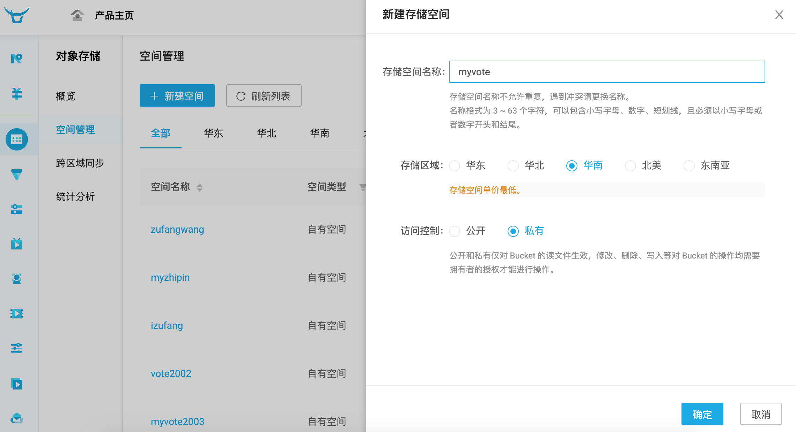

## Access to the third-party platform

In the development process of Web applications, there are some tasks that we cannot complete by ourselves. For example, we need to do real-name authentication of individuals or enterprises in our web project. Obviously, we are not able to judge the authenticity of the authentication information provided by users. At this time, we need to use the services provided by the third-party platform to complete this operation. For another example, our project needs to provide online payment function. This kind of business is usually completed by means of payment gateways instead of being implemented by ourselves. We only need to access tripartite platforms such as WeChat, Alipay, and UnionPay.

There are basically two ways to access the third-party platform in the project: API access and SDK access.

1. API access refers to completing operations or obtaining data by accessing the URL provided by the third party. There are many such platforms in China that provide a large number of commonly used services. For example, [Aggregated Data] (https://www.juhe.cn/) provides various services such as life services, financial technology, transportation geography, recharge and payment, etc. types of APIs. We can initiate network requests through Python programs and obtain data by accessing URLs. These API interfaces are the same as the data interfaces provided in our project, but the APIs in our project are for our own use, and such third-party platforms provide API is open. Of course, openness does not mean free, and most APIs that can provide data with commercial value require payment to be used.
2. SDK access refers to the way to use the services provided by the third-party platform by installing the third-party library and using the classes and functions encapsulated by the third-party library. For example, to access Alipay we just mentioned, you need to install Alipay's SDK first, and then complete the call to the payment service through the classes and methods encapsulated by Alipay.

Below we use specific examples to explain how to access the third-party platform.

### Access SMS gateway

There are many places in a web project that can use SMS services, such as: mobile phone verification code login, important message reminders, product marketing SMS, etc. To achieve the function of sending short messages, you can achieve it by accessing the short message gateway. The well-known short message gateways in China include: Yunpian SMS, Netease Yunxin, Screwcap, SendCloud, etc. These short message gateways generally provide free trial functions. Let's take the [screw cap](https://luosimao.com/) platform as an example to explain how to access the SMS gateway in the project. The operations of other platforms are basically similar.

1. Register an account, new users can try it for free.

2. Log in to the management background and enter the SMS section.

3. Click "Trigger Send" to find your own API Key (identity).

    

4. Click "Signature Management" to add SMS signature. SMS must carry signature. For free trial SMS, the signature of "[Iron Shell Test]" should be added to the SMS, otherwise the SMS cannot be sent.

    

5. Click "IP Whitelist" to fill in the address of the server running the Django project (public network IP address, you can open the [xxx]() website to view your own public network IP address for local operation) into the whitelist, otherwise SMS will not be able to send.

    

6. If there are no remaining SMS messages, you can go to the "Recharge" page and select "SMS Service" to recharge.

    

Next, we can implement the function of sending SMS verification code by calling the screw cap SMS gateway, the code is as follows.

````Python
def send_mobile_code(tel, code):
    """Send SMS verification code"""
    resp = requests.post(
        url='http://sms-api.luosimao.com/v1/send.json',
        auth=('api', 'key- own APIKey'),
        data={
            'mobile': tel,
            'message': f'Your SMS verification code is {code}, you can't tell others even if you kill it. 【Python Small Lesson】'
        },
        verify=False
    )
    return resp.json()
````

To run the above code, you need to install the `requests` third-party library. This third-party library encapsulates the relevant functions of HTTP network requests. It is very simple to use. We also talked about this third-party library in the previous content. The `send_mobile_code` function has two parameters, the first parameter is the mobile phone number, and the second parameter is the content of the SMS verification code. The fifth line of code needs to provide its own API Key, which is the one viewed in step 2 above. API Key. The SMS gateway requesting the screw cap will return the data in JSON format. For the above code, if it returns `{'err': 0, 'msg': 'ok'}`, it means that the SMS is sent successfully, if the value of the `err` field If it is not `0` but other values, it means that the SMS sending failed. You can check the meaning of different values ​​on the official [Development Documentation](https://luosimao.com/docs/api/) page of the screw cap , for example: `-20` means insufficient balance, `-32` means lack of SMS signature.

The above function can be called in the view function to complete the function of sending SMS verification code, and we can combine this function with user registration later.

Functions that generate random verification codes and verify mobile phone numbers.

````Python
import random
import re

TEL_PATTERN = re.compile(r'1[3-9]\d{9}')


def check_tel(tel):
    """Check the phone number"""
    return TEL_PATTERN.fullmatch(tel) is not None


def random_code(length=6):
    """Generate random SMS verification code"""
    return ''.join(random.choices('0123456789', k=length))
````

View function to send SMS verification code.

````Python
@api_view(('GET', ))
def get_mobilecode(request, tel):
    """obtain SMS verification code"""
    if check_tel(tel):
        redis_cli = get_redis_connection()
        if redis_cli.exists(f'vote:block-mobile:{tel}'):
            data = {'code': 30001, 'message': 'Please do not send SMS verification code repeatedly within 60 seconds'}
        else:
            code = random_code()
            send_mobile_code(tel, code)
            # Prevent 60 seconds of content from repeatedly sending SMS verification codes through Redis
            redis_cli.set(f'vote:block-mobile:{tel}', 'x', ex=60)
            # Keep the verification code in Redis for 10 minutes (valid for 10 minutes)
            redis_cli.set(f'vote2:valid-mobile:{tel}', code, ex=600)
            data = {'code': 30000, 'message': 'SMS verification code has been sent, please pay attention to check'}
    else:
        data = {'code': 30002, 'message': 'Please enter a valid phone number'}
    return Response(data)
````

> **Description**: The above code uses Redis to implement two additional functions, one is to prevent the user from repeatedly sending SMS verification codes within 60 seconds, and the other is to keep the user's SMS verification code for 10 minutes, which means that this SMS The validity period of the verification code is only 10 minutes. We can ask the user to provide the verification code during registration to verify the authenticity of the user's mobile phone number.

### Access to cloud storage services

When we mention the word **cloud storage**, it usually refers to storing data in a virtual server environment provided by a third party. Simply put, it means hosting some data or resources through a third platform. Generally, companies that provide cloud storage services operate large-scale data centers, and individuals or organizations that need cloud storage services meet their data storage needs by purchasing or leasing storage space from them. When developing web applications, static resources, especially static resources uploaded by users, can be directly placed in cloud storage services, and cloud storage usually provides corresponding URLs so that users can access the static resources. Well-known cloud storage services at home and abroad (such as Amazon's S3, Ali's OSS2, etc.) are generally of good quality and low price. Compared with setting up a static resource server by yourself, the cost of cloud storage is lower, and general cloud storage platforms provide CDN service is used to speed up access to static resources, so no matter from which point of view, using cloud storage to manage data and static resources of web applications is a very good choice, unless these resources involve personal or business privacy, otherwise can be hosted in cloud storage.

Let's take the connection of [Qiniu Cloud] (https://www.qiniu.com/) as an example to explain how to save the files uploaded by users to Qiniu cloud storage. Qiniuyun is a well-known cloud computing and data service provider in China. Qiniuyun has its own products in the fields of massive file storage, CDN, video on demand, interactive live broadcast, and intelligent analysis and processing of large-scale heterogeneous data. Non-paying users can also access for free and use the services it provides. The following is the process of accessing Qiniu Cloud:

1. Register an account and log in to the management console.

    

2. Select Object Storage in the left menu.

    

3. In the space management, select a new space (for example: myvote), if it prompts that the space name is already occupied, replace it and try again. Note that after the space is created, you will be prompted to bind a custom domain name. If you do not have your own domain name yet, you can use the temporary domain name provided by Qiniu Cloud, but the temporary domain name will be recycled after 30 days, so it is best to prepare your own domain name (domain name). It needs to be filed, if you are not sure how to operate, please check the relevant information yourself).

    

4. Click "Key Management" in the profile picture in the upper right corner of the webpage to view your own key. Later in the code, you need to use the AK (AccessKey) and SK (SecretKey) keys to authenticate the user's identity.

    

5. Click "Documents" in the menu at the top of the webpage, enter the [Qiniu Developer Center](https://developer.qiniu.com/), select "SDK&Tools" in the navigation menu and click the "Official SDK" subsection menu, find Python (server) and click "Documentation" to view the official documentation.

    

Next, as long as you install the examples provided by the official documentation, you can access Qiniu Cloud, use the cloud storage and other services provided by Qiniu Cloud. First, you can install the third-party library of Qiniuyun through the following command.

````Bash
pip install qiniu
````

Next, you can use the `put_file` and `put_stream` functions in the `qiniu` module to achieve file upload. The former can upload files with a specified path, and the latter can upload binary data in memory to Qiniuyun. The specific code As follows.

````Python
import qiniu

AUTH = qiniu.Auth('AccessKey in key management', 'SecretKey in key management')
BUCKET_NAME = 'myvote'


def upload_file_to_qiniu(key, file_path):
    """Upload the file of the specified path to Qiniu Cloud"""
    token = AUTH.upload_token(BUCKET_NAME, key)
    return qiniu.put_file(token, key, file_path)


def upload_stream_to_qiniu(key, stream, size):
    """Upload binary data stream to Qiniu Cloud"""
    token = AUTH.upload_token(BUCKET_NAME, key)
    return qiniu.put_stream(token, key, stream, None, size)
````

Below is a simple front-end page for file upload.

````HTML
<!DOCTYPE html>
<html lang="en">
<head>
    <meta charset="UTF-8">
    <title>Upload file</title>
</head>
<body>
    <form action="/upload/" method="post" enctype="multipart/form-data">
        <div>
            <input type="file" name="photo">
            <input type="submit" value="upload">
        </div>
    </form>
</body>
</html>
````

> **Note**: If the front-end uses a form to upload files, the method attribute of the form must be set to post, the enctype attribute needs to be set to multipart/form-data, and the input tag whose type attribute is file in the form is the file to upload the file. Selector.

The view function that implements the upload function is shown below.

````Python
from django.views.decorators.csrf import csrf_exempt


@csrf_exempt
def upload(request):
    # If the uploaded file is less than 2.5M, the type of the photo object is InMemoryUploadedFile, and the file is in memory
    # If the uploaded file exceeds 2.5M, the type of the photo object is TemporaryUploadedFile, and the file is in the temporary path
    photo = request.FILES.get('photo')
    _, ext = os.path.splitext(photo.name)
    # Generate a unique new filename based on the UUID and the extension of the original file
    filename = f'{uuid.uuid1().hex}{ext}'
    # For files in memory, you can use the above packaged function upload_stream_to_qiniu to upload files to Qiniu Cloud
    # If the file is saved in a temporary path, you can use upload_file_to_qiniu to upload the file
    upload_stream_to_qiniu(filename, photo.file, photo.size)
    return redirect('/static/html/upload.html')
````

> **Note**: The view function above uses the `csrf_exempt` decorator, which exempts the form from having to provide a CSRF token. Additionally, line 11 of the code uses the `uuid1` function of the `uuid` module to generate a globally unique identifier.

Run the project to try the file upload function. After the file upload is successful, you can click your own space in the "Space Management" of Qiniu Cloud and enter the "File Management" interface, where you can see the file we just uploaded successfully, and you can pass the seven Obtain the file from the domain name provided by Niuyun.

