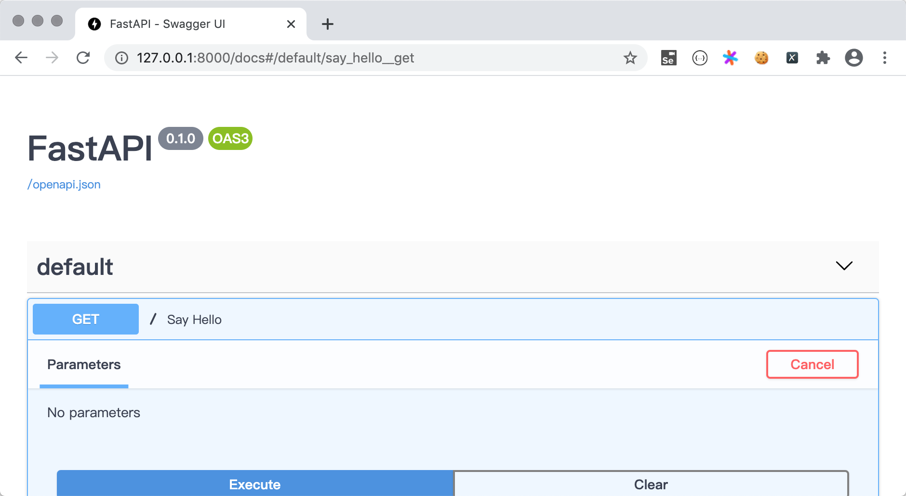

## Develop network data interface with FastAPI

FastAPI is a modern, high-performance web framework for building APIs (network data interfaces). Based on Python 3.6+, it uses type hints in Python for type checking, which is very suitable for engineering development and has a very good reputation in the industry. 's reputation. Below, we first use the code to tell you what FastAPI can do, and then explain all aspects of it.

###FastAPI five minutes to get started

1. Install dependency libraries and ASGI server (Python server that supports asynchronous I/O).

    ````Bash
    pip install fastapi
    pip install uvicorn
    ````

2. Write the code `main.py`.

    ````Python
    from fastapi import FastAPI
    
    app = FastAPI()
    
    
    @app.get('/')
    def say_hello():
        return {'code': 200, 'message': 'hello, world!'}
    ````

3. Run the service.

    ````Bash
    uvicorn main:app --reload
    ````

    > **Note**: The `--reload` parameter used when running uvicorn above will automatically reload the new content when the code changes. This parameter is very useful in the development phase.

4. Access Services.

  

5. Review the documentation.

    

    > **Note**: FastAPI will automatically generate corresponding documentation for the data interface based on [Swagger UI](https://swagger.io/tools/swagger-ui/).

### Requests and responses


### Access relational database

We can use the SQLAlchemy tripartite library to achieve access to relational databases. SQLAlchemy is an ORM (Object Relational Mapping) framework. The ORM framework can solve the problem that the object-oriented model of Python programs and the relational model of relational databases do not match, so that we can implement CRUD operations on data in an object-oriented way.

### Dependency Injection


### Middleware


### Asynchronous


### Virtualization Deployment (Docker)


### Project actual combat: vehicle violation query