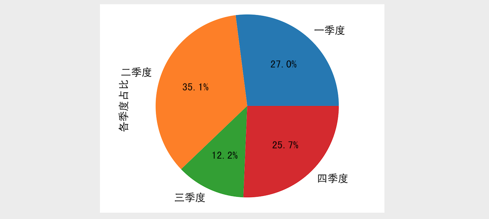

## Pandas application-1

Pandas is a powerful toolset for analyzing structured data developed by Wes McKinney in 2008. Pandas is based on NumPy (data representation and operation), provides functions and methods for data processing, and provides good support for data analysis and data mining; at the same time, Pandas can also be well integrated with the data visualization tool Matplotlib. Together, it is very easy and pleasant to realize the visual display of data.

The core data types of Pandas are `Series` (data series), `DataFrame` (data table/data frame), which are used to deal with one-dimensional and two-dimensional data, in addition to a type called `Index` and its subtypes, which provide indexing capabilities for `Series` and `DataFrame`. In daily work, `DataFrame` is the most widely used, because two-dimensional data is essentially a table with rows and columns (think two-dimensional tables in Excel spreadsheets and relational databases). The above types all provide a large number of methods for processing data, based on which data analysts can implement various routine processing of data.

### Series Application

The `Series` object in the Pandas library can be used to represent a one-dimensional data structure, very similar to an array, but with some additional functionality. The internal structure of `Series` contains two arrays, one of which is used to hold the data, and the other is used to hold the index of the data.

#### Create Series object

> **Tips**: Before executing the following code, please import `pandas` and related library files. For details, please refer to the previous chapter.

##### Method 1: Create a Series object from a list or array

Code:

````Python
# The data parameter represents the data, and the index parameter represents the index (label) of the data
# If the index attribute is not specified, the numerical index is used by default
ser1 = pd.Series(data=[320, 180, 300, 405], index=['Q1', 'Q2', 'Q3', 'Q4'])
ser1
````

output:

````
Q1 320
Q2 180
Q3 300
Fourth quarter 405
dtype: int64
````

##### Method 2: Create a Series object from a dictionary.

Code:

````Python
# The key in the dictionary is the index (label) of the data, and the value in the dictionary is the data
ser2 = pd.Series({'Q1': 320, 'Q2': 180, 'Q3': 300, 'Q4': 405})
ser2
````

output:

````
Q1 320
Q2 180
Q3 300
Fourth quarter 405
dtype: int64
````

#### Indexing and Slicing

Like arrays, Series objects can also perform indexing and slicing operations. The difference is that Series objects maintain an array of indexes internally, so in addition to using integer indexes to retrieve data by position, they can also be obtained through the index labels set by themselves. corresponding data.

##### Using integer indices

Code:

````Python
print(ser2[0], ser[1], ser[2], ser[3])
ser2[0], ser2[3] = 350, 360
print(ser2)
````

output:

````
320 180 300 405
Q1 350
Q2 180
Q3 300
Q4 360
dtype: int64
````

> **TIP**: If you want to use negative indexing, you must specify a non-numeric label through the `index` property when creating a `Series` object.

##### Use custom tag index

Code:

````Python
print(ser2['Q1'], ser2['Q3'])
ser2['Q1'] = 380
print(ser2)
````

output:

````
350 300
Q1 380
Q2 180
Q3 300
Q4 360
dtype: int64
````

##### Slicing operations

Code:

````Python
print(ser2[1:3])
print(ser2['Q2':'Q4'])
````

output:

````
Q2 180
Q3 300
dtype: int64
Q2 500
3rd quarter 500
Fourth quarter 520
dtype: int64
````

Code:

````Python
ser2[1:3] = 400, 500
ser2
````

output:

````
Q1 380
Q2 400
3rd quarter 500
Q4 360
dtype: int64
````

##### fancy index

Code:

````Python
print(ser2[['second quarter', 'fourth quarter']])
ser2[['Q2', 'Q4']] = 500, 520
print(ser2)
````

output:

````
Q2 400
Q4 360
dtype: int64
Q1 380
Q2 500
3rd quarter 500
Fourth quarter 520
dtype: int64
````

##### boolean index

Code:

````Python
ser2[ser2 >= 500]
````

output:

````
Q2 500
3rd quarter 500
Fourth quarter 520
dtype: int64
````

####Properties and Methods

The common properties of the Series object are shown in the following table.

| Properties | Description |
| ------------------------- | ----------------------- ---------------- |
| `dtype` / `dtypes` | Returns the data type of the `Series` object |
| `hasnans` | Determine if there are null values ​​in the `Series` object |
| `at` / `iat` | Access a single value in a `Series` object by index |
| `loc` / `iloc` | access a set of values ​​in a `Series` object by a set of indices |
| `index` | Returns the index of the `Series` object |
| `is_monotonic` | Determine if the data in the `Series` object is monotonic |
| `is_monotonic_increasing` | Determine whether the data in the `Series` object is monotonically increasing |
| `is_monotonic_deceasing` | Determine whether the data in the `Series` object is monotonically decreasing |
| `is_unique` | Determine whether the data in the `Series` object is unique |
| `size` | Returns the number of elements in the `Series` object |
| `values` | Returns the values ​​in a `Series` object as an `ndarray` |

There are many methods of the `Series` object. We will introduce some commonly used methods through the following code.

##### Statistics related methods

The `Series` object supports various methods for obtaining descriptive statistics.

Code:

````Python
# sum
print(ser2.sum())
# find the mean
print(ser2.mean())
# find the maximum
print(ser2.max())
# find the smallest
print(ser2.min())
# count
print(ser2.count())
# find the standard deviation
print(ser2.std())
# find variance
print(ser2.var())
# find the median
print(ser2.median())
````

The `Series` object also has a method called `describe()` that can get all the above descriptive statistics, as shown below.

Code:

````Python
ser2.describe()
````

output:

````
count 4.000000
mean 475.000000
std 64.031242
min 380.000000
25% 470.000000
50% 500.000000
75% 505.000000
max 520.000000
dtype: float64
````

> **Tip**: Since `describe()` returns a `Series` object, you can also use `ser2.describe()['mean']` to get the mean.

If the `Series` object has duplicate values, we can use the `unique()` method to get the `Series` object after deduplication; you can use the `nunique()` method to count the number of unique values; if you want to count each The number of times a value is repeated, you can use the `value_counts()` method, which returns a `Series` object whose index is the value in the original `Series` object, and the number of occurrences of each value is the returned `Series` `The data in the object, by default, will be sorted in descending order according to the number of occurrences.


Code:

````Python
ser3 = pd.Series(data=['apple', 'banana', 'apple', 'pitaya', 'apple', 'pitaya', 'durian'])
ser3.value_counts()
````

output:

````
apple 3
pitaya 2
durian 1
banana 1
dtype: int64
````

Code:

````Python
ser3.nunique()
````

output:

````
4
````

##### Data processing methods

The `isnull()` and `notnull()` methods of the `Series` object can be used to determine the null value. The code is as follows.

Code:

````Python
ser4 = pd.Series(data=[10, 20, np.NaN, 30, np.NaN])
ser4.isnull()
````

output:

````
0 False
1 False
2 True
3 False
4 True
dtype: bool
````

Code:

````Python
ser4.notnull()
````

output:

````
0 True
1 True
2 False
3 True
4 False
dtype: bool
````

The `dropna()` and `fillna()` methods of the `Series` object are used to remove and fill empty values ​​respectively. The specific usage is as follows.

Code:

````Python
ser4.dropna()
````

output:

````
0 10.0
1 20.0
3 30.0
dtype: float64
````

Code:

````Python
# fill empty values ​​with 40
ser4.fillna(value=40)
````

output:

````
0 10.0
1 20.0
2 40.0
3 30.0
4 40.0
dtype: float64
````

Code:

````Python
# backfill or bfill means to fill the empty value with the value of the next element
# ffill or pad means to fill the empty value with the value of the previous element
ser4.fillna(method='ffill')
````

output:

````
0 10.0
1 20.0
2 20.0
3 30.0
4 30.0
dtype: float64
````


It should be reminded that the `dropna()` and `fillna()` methods have a parameter called `inplace`, and its default value is `False`, which means that deleting or filling empty values ​​will not be modified The original `Series` object, but a new `Series` object is returned to represent the data series after removing or filling empty values. If the value of the `inplace` parameter is changed to `True`, then the deletion or filling of empty values ​​will result in In-place operation, directly modifying the original `Series` object, then the return value of the method is `None`. Many methods we will come into contact with later, including many methods of the `DataFrame` object, will have this parameter, and their meanings are the same as here.

The `mask()` and `where()` methods of the `Series` object can replace values ​​that satisfy or do not satisfy the condition, as shown below.

Code:

````Python
ser5 = pd.Series(range(5))
ser5.where(ser5 > 0)
````

output:

````
0 NaN
1 1.0
2 2.0
3 3.0
4 4.0
dtype: float64
````

Code:

````Python
ser5.where(ser5 > 1, 10)
````

output:

````
0 10
1 10
twenty two
3 3
4 4
dtype: int64
````

Code:

````Python
ser5.mask(ser5 > 1, 10)
````

output:

````
0 0
1 1
2 10
3 10
4 10
dtype: int64
````

The `duplicated()` method of the `Series` object can help us find duplicate data, and the `drop_duplicates()` method can help us remove duplicate data.

Code:

````Python
ser3.duplicated()
````

output:

````
0 False
1 False
2 True
3 False
4 True
5 True
6 False
dtype: bool
````

Code:

````Python
ser3.drop_duplicates()
````

output:

````
0 apple
1 banana
3 pitaya
6 durian
dtype: object
````


The `apply()` and `map()` methods of the `Series` object are very important, they can be used for data processing, mapping or transforming the data into the way we expect, this operation is very important in the data preparation phase of data analysis.

Code:

````Python
ser6 = pd.Series(['cat', 'dog', np.nan, 'rabbit'])
ser6
````

output:

````
0 cat
1 dog
2 NaN
3 rabbits
dtype: object
````

Code:

````Python
ser6.map({'cat': 'kitten', 'dog': 'puppy'})
````

output:

````
0 kitten
1 puppy
2 NaN
3 NaN
dtype: object
````

Code:

````Python
ser6.map('I am a {}'.format, na_action='ignore')
````

output:

````
0 I am a cat
1 I am a dog
2 NaN
3 I am a rabbit
dtype: object
````

Code:

````Python
ser7 = pd.Series([20, 21, 12], index=['London', 'New York', 'Helsinki'])
ser7
````

output:

````
London 20
New York 21
Helsinki 12
dtype: int64
````

Code:

````Python
ser7.apply(np.square)
````

output:

````
London 400
New York 441
Helsinki 144
dtype: int64
````

Code:

````Python
ser7.apply(lambda x, value: x - value, args=(5, ))
````

output:

````
London 15
New York 16
Helsinki 7
dtype: int64
````

##### Sorting and taking header values

The `sort_index()` and `sort_values()` methods of the `Series` object can be used to sort the index and data. The sort method has a boolean type parameter named `ascending`, which is used to control the result of the sorting. Ascending or descending order; the parameter named `kind` is used to control the algorithm used for sorting, `quicksort` is used by default, and `mergesort` or `heapsort` can also be selected; if there is a null value, `na_position` can be used Whether the null value of the parameter is placed first or last, the default is `last`, the code is as follows.

Code:

````Python
ser8 = pd.Series(
    data=[35, 96, 12, 57, 25, 89],
index=['grape', 'banana', 'pitaya', 'apple', 'peach', 'orange']
)
# Sort by value from smallest to largest
ser8.sort_values()
````

output:

````
pitaya 12
peach 25
grape 35
apple 57
orange 89
banana 96
dtype: int64
````


Code:

````Python
# Sort by index from largest to smallest
ser8.sort_index(ascending=False)
````

output:

````
pitaya 12
peach 25
orange 89
grape 35
banana 96
apple 57
dtype: int64
````

If you want to find the largest or smallest "Top-N" of elements in a `Series` object, you don't actually need to sort all the values, you can use the `nlargest()` and `nsmallest()` methods to Done as shown below.

Code:

````Python
# The 3 largest values
ser8.nlargest(3)
````

output:

````
banana 96
orange 89
apple 57
dtype: int64
````

Code:

````Python
# The 2 with the smallest value
ser8.nsmallest(2)
````

output:

````
pitaya 12
peach 25
dtype: int64
````

#### draw the graph

The Series object has a method called `plot` that can be used to generate charts. If you choose to generate a line chart, pie chart, column chart, etc., the index of the Series object will be used as the abscissa by default, and the data of the Series object will be used as the ordinate.

First import the `pyplot` module in `matplotlib` and make the necessary configuration.

````Python
import matplotlib.pyplot as plt

# Configure a sans serif font that supports Chinese (the default font cannot display Chinese)
plt.rcParams['font.sans-serif'] = ['SimHei', ]
# When using the specified Chinese font, the following configuration is required to avoid the negative sign from being displayed
plt.rcParams['axes.unicode_minus'] = False
````

Create a `Series` object and draw the corresponding histogram.

````Python
ser9 = pd.Series({'Q1': 400, 'Q2': 520, 'Q3': 180, 'Q4': 380})
# Drawing through the plot method of the Series object (kind='bar' means drawing a histogram)
ser9.plot(kind='bar', color=['r', 'g', 'b', 'y'])
# The coordinates of the x-axis are rotated to 0 degrees (Chinese horizontal display)
plt.xticks(rotation=0)
# draw numbers on the bars of the histogram
for i in range(4):
    plt.text(i, ser9[i] + 5, ser9[i], ha='center')
# display image
plt.show()
````


Draw a pie chart that reflects the proportion of each quarter.

````Python
# The autopct parameter can be configured to display the proportion of each pie on the pie chart
ser9.plot(kind='pie', autopct='%.1f%%')
# Set the label for the y-axis (text to display on the left side of the pie chart)
plt.ylabel('The proportion of each quarter')
plt.show()
````

