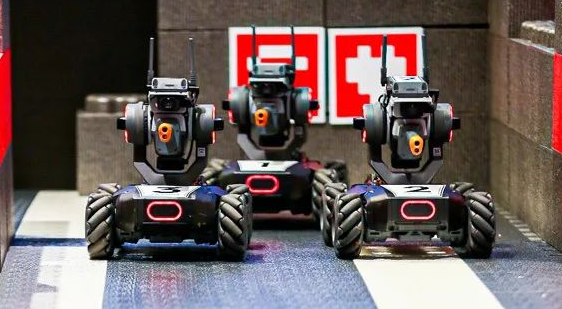

## Artificial Intelligence and Machine Learning Overview

The so-called "artificial intelligence" usually refers to the technology that enables machines to have human-like intelligence, and its purpose is to allow machines to perceive, think and solve problems like humans; data, and realize the update and progress of cognition. Obviously, machine learning is one way to achieve artificial intelligence, and that's what our course will discuss. Nowadays, "machine learning" and "big data" can be said to be the two most fashionable terms, and in the stage of weak artificial intelligence, the ultimate problem to be solved by "machine learning" and "big data" is essentially the same , is to let the computer process the complex data into useful information, so that the meaning brought by the data and the laws hidden behind the data can be discovered. Simply put, it is to use the existing data to make predictions and judge.

Before discussing machine learning related content, let's first classify the problems solved by computers according to the "input" and "output" of the problem, as follows:

1. The input information is accurate, and the optimal solution is required to be output.
2. The input information is accurate, and the optimal solution cannot be found, only a satisfactory solution can be obtained.
3. The input information is fuzzy, and the optimal solution is required to be output.
4. The input information is fuzzy, and the optimal solution cannot be found, only a satisfactory solution can be obtained.

Among the above four types of problems, the first type of problem is the one that computers are best at solving. This type of problem is actually the problem of "numerical calculation" and "logical reasoning", and artificial intelligence in the traditional sense is the use of logical reasoning. to solve problems (such as the early "man-machine game"). We have always been accustomed to calling computers "computers", and "computers" based on the "von Neumann" architecture actually only realize the functions of the rational thinking part of the "human brain", and at this point The performance of "computer" is usually better than that of "human brain"; however, the powerful processing power of "human brain" in processing fuzzy input information is difficult for "computer" to match in many scenarios. Therefore, we study the algorithm of machine learning to solve the problem of letting the computer give a satisfactory solution or even an optimal solution when inputting fuzzy information.

Humans learn through both memory and induction, where individual facts can be accumulated, and induction can be used to deduce new facts from old facts. Therefore, machine learning is actually a kind of training, through which the computer can learn the ability to make reasonable inferences based on the implicit patterns of the data. The basic process is as follows:

1. Observe a set of instances, often called training data, that can represent incomplete information about a statistical phenomenon;
2. Extend observed instances and use inference techniques to model the expansion process;
3. Use the model to make predictions on unknown instances.

### basic concept

#### Supervised and Unsupervised Learning

Supervised learning is to learn a function from a given training data set. When new data arrives, the result can be predicted according to this function. The training set of supervised learning includes input and output, which can also be said to be features and targets. The goal of supervised learning is to be labeled by humans, while the data of unsupervised learning has no category information, and the training set does not have human labeling results. Through unsupervised learning, the dimension of data features can be reduced, so that we can use two-dimensional or three-dimensional graphics. Visually present the information in the data.

#### Eigenvectors and feature engineering

#### distance metric

1. Euclidean distance

$$
d = \sqrt{\sum_{k=1}^n(x_{1k}-x_{2k})^2}
$$

2. Manhattan Distance

$$
d = \sum_{k=1}^n \mid {x_{1k}-x_{2k}} \mid
$$

3. Chebyshev distance

$$
d = max(\mid x_{1k}-x_{2k} \mid)
$$

4. Minkowski distance
    - When $p=1$, it is the Manhattan distance
    - When $p=2$, it is the Euclidean distance
    - when $p \to \infty$ is the Chebyshev distance

$$
d = \sqrt[p]{\sum_{k=1}^n \mid x_{1k}-x_{2k} \mid ^p}
$$

5. Cosine distance
    $$
    cos(\theta) = \frac{\sum_{k=1}^n x_{1k}x_{2k}}{\sqrt{\sum_{k=1}^n x_{1k}^2} \sqrt{ \sum_{k=1}^n x_{2k}^2}}
    $$

### Definition and application areas of machine learning

According to the above discussion, we can give a formal definition of "machine learning": **Machine learning is a specialized study of how computers simulate or realize human learning behavior, in order to acquire new knowledge or skills, reorganize existing A subject whose knowledge structure enables it to continuously improve its performance**. Even if you are not so familiar with the concept of machine learning, the results of machine learning have widely penetrated into all fields of production and life. The following scenarios must be familiar to you.

Scenario 1: The search engine will optimize the results of the next search based on search and usage habits.

Scenario 2: E-commerce websites will automatically recommend products you may be interested in based on your visit history.

Scenario 3: Financial products will comprehensively evaluate your loan application based on your recent financial activity information.

Scenario 4: Video and live broadcast platforms will automatically identify whether there is dissonant content in pictures and videos.

Scenario 5: Smart home appliances and smart cars will act accordingly according to your voice commands.

To briefly summarize, machine learning can be applied to but not limited to the following areas:

1. Computer Vision. Computer vision refers to the ability of machines to perceive the environment. Currently, the two fields of [**object detection**](https://pjreddie.com/darknet/yolo/) and **face recognition** are very mature and A large number of applications have been generated.

    - face payment

        

    - [Graffiti Recognition](https://quickdraw.withgoogle.com/)

        

2. Natural Language Processing (NLP). Natural language processing is a very popular branch of machine learning at present, and it can be divided into three types of application scenarios. Among them, text mining is mainly to classify text, including syntax analysis, sentiment analysis and spam detection, etc.; and machine translation and speech recognition are believed to be clear to everyone without too much explanation.

    - Text mining
    - machine translation

    - Speech Recognition

        

3. Robots. Robots can be divided into two categories: stationary robots and mobile robots. Stationary robots are often used in industrial production, for example in assembly lines. Common mobile robotics applications are cargo robots, aerial robots, and autonomous vehicles. Robots need the cooperation of software and hardware to achieve optimal operations. The hardware includes sensors, reactors, and controllers, while software mainly realizes perception capabilities, including positioning, mapping, target detection and recognition.

    - Mecha Master

        

    - Sweeping robot

        

### Machine Learning Implementation Steps

General steps to implement machine learning:

1. Data collection
2. Data Preparation
3. Data Analysis
4. Training the algorithm
5. Test the algorithm
6. Apply Algorithms

### Introduction to Scikit-learn

Scikit-learn originated from the Google Summer of Code project and was initiated by David Cournapeau in 2007. It provides tools that may be used in machine learning, including data preprocessing, supervised learning (classification, regression), and unsupervised learning (clustering) , model selection, dimensionality reduction, etc.

Official website address: <https://scikit-learn.org/stable/index.html>

Installation method: `pip install scikit-learn`