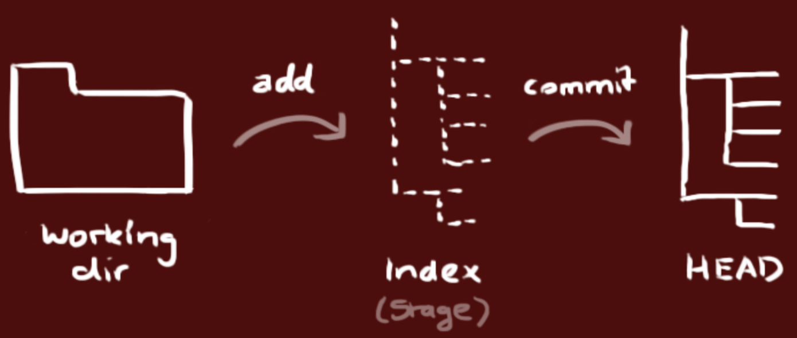
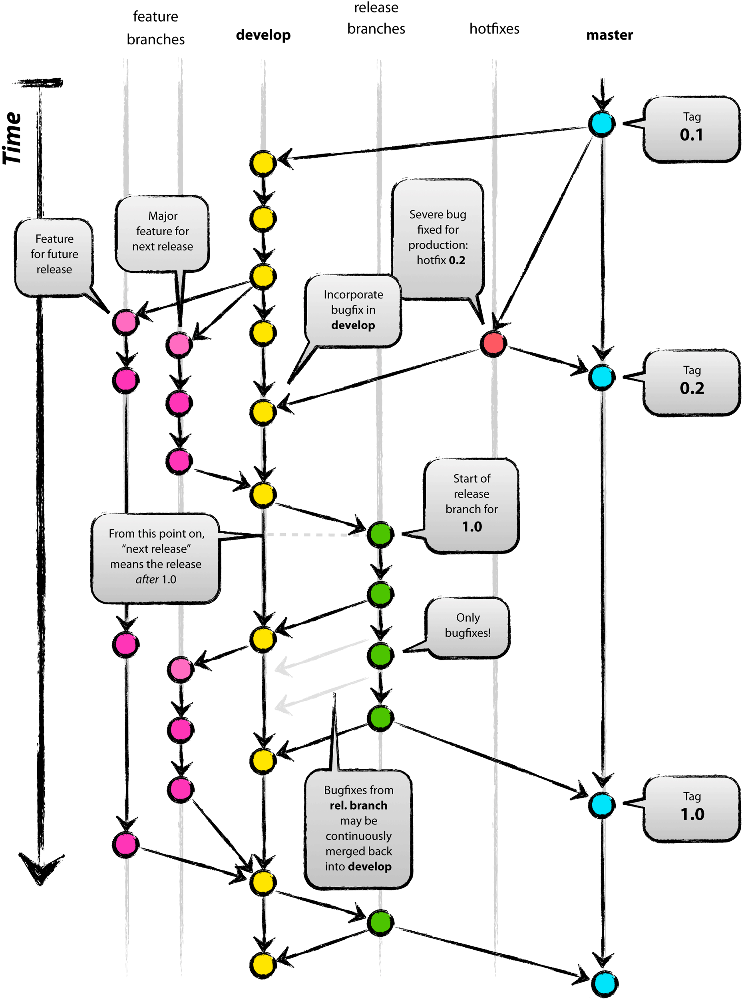

## Team project development problems and solutions

The terms individual development and team development are probably familiar to everyone. The so-called individual development means that one person controls all the content of the product; while the team development means that multiple people form a group and complete the development of the product. To implement team development the following points are indispensable:

1. Manage and share various events in the development process (eg, who completed what and when).
2. Share various work results and new knowledge and skills within the team.
3. Manage the changes of work results, not only to prevent the results from being destroyed, but also to ensure that each member uses the existing results to work in parallel.
4. Prove that the software developed by the team is functional at all times.
5. Use automated workflows to allow team members to properly implement development, testing, and deployment.

### Team project development FAQ

Compared with individual development, team development is prone to encounter the following problems.

#### Problem 1: Traditional communication methods cannot prioritize processing

For example, if you use emails to communicate, there may be too many emails, which may cause important emails to be buried, unable to manage the status, and do not know which problems have been solved and which problems have not been solved.

Solution: Use a defect management tool.

#### Problem 2: There is no environment that can be used for authentication

For example, it takes a long time to restore the official environment after receiving a failure report in the project's formal environment.

The solution: Implement continuous delivery.

#### Problem 3: Manage project branches with alias directories

Workaround: Implement version control.

#### Problem 4: Remaking the database is very difficult

For example, the database table structure in the formal environment and the development environment are inconsistent or the order of a table column is inconsistent.

Workaround: Implement version control.

#### Problem 5: The problem cannot be detected without running the system

For example: solving a bug may introduce other bugs or cause system degradation, incorrect use of the version system overwrites other people's modifications, and the modified content interferes with each other. If the problem cannot be found as soon as possible, then wait for the past few months. It is very troublesome to trace the problem.

Solution: Implement continuous integration, building and testing the work of team members frequently and continuously.

#### Issue 6: Overrides code fixed by other members

Workaround: Implement version control.

#### Problem 7: Unable to implement code refactoring

For example: Degeneracy may arise when implementing code refactorings (adjustments to constructs inside the code without affecting the results produced by the code).

Solution: Lots of reusable tests and implement continuous integration.

#### Issue 8: Unable to track regression without knowing bug fix date

Solution: Interaction between version control systems, defect management systems, and continuous integration is required, preferably integrated with automated deployment tools.

#### Problem 9: The publishing process is too complicated

The solution: Implement continuous delivery.

Based on the elaboration and analysis of the above issues, we can basically draw the following conclusions. Version control, defect management and continuous integration are all very important and indispensable in team development.

### version control

In response to the series of problems mentioned above, we can draw a simple conclusion that version control is the primary prerequisite for implementing team development, and various information generated during product development must be managed through version control, including:

1. Code.
2. Documentation of requirements and designs.
3. Database schema and initial data.
4. Configuration files.
5. Library dependency definition.

#### Introduction to Git


Git is an open source distributed version control system born in 2005. It was originally a version control software developed by Linus Torvalds (the father of Linux) to help manage the development of the Linux kernel. Git is different from the commonly used version control tools such as Subversion. It adopts a distributed version control method and can implement version control in an environment without the support of a central server.

For those who have experience with Subversion (hereafter referred to as SVN), what Git and SVN have in common is the abandonment of traditional version control based on locked mode (early CVS and VSS used locked mode, when a developer edits a file will be locked, other developers cannot edit the file during this time), using more efficient version control based on merge mode, and the difference between the two is:

1. Git is distributed, SVN is centralized, and SVN needs the support of a central server to work.
2. Git stores content by metadata, while SVN is by file, that is, the metadata of the file is hidden in a .svn folder.
3. Git branches are different from SVN branches, and SVN's handling of branches is quite "bloody".
4. Git does not have a global version number, but it can maintain a version tag itself.
5. Git's content integrity is better than SVN, and Git's content storage uses the SHA-1 hash algorithm. This ensures the integrity of the code content and ensures less damage to the repository in the event of disk failures and network problems.

All in all, **Git is really good! ! ! **

#### Install Git

You can find the Git download link suitable for your system on the [Git official website](http://git-scm.com/) and install it. It is very easy to install Git under macOS and Windows platforms. If you want to install the latest official version under Linux version, it is recommended to build and install through the official Git source code. The steps are as follows (take CentOS as an example).

Download the Git source code zip file.

```Shell
wget https://mirrors.edge.kernel.org/pub/software/scm/git/git-2.23.0.tar.xz
````

Unzip and unarchive.

```Shell
xz -d git-2.23.0.tar.xz
tar -xvf git-2.23.0.tar
````

Install the underlying dependencies.

```Shell
yum -y install libcurl-devel
````

> Description: Without this dependency library, git's network functions will not be able to execute.

Configuration before installation.

```Shell
cd git-2.23.0
./configure --prefix=/usr/local
````

Build and install.

```Shell
make && make install
````

After the installation is successful, you can check your Git version by typing the following command in the terminal.

```Shell
git --version
````

If you have never been exposed to Git before, you can first read ["git - Simple Guide"](http://www.bootcss.com/p/git-guide/) to have a general understanding of Git.

#### Git local operation

A folder can be turned into a Git repository using the following command.
```Shell
git init
````

When you have completed the above operations, the local directory will look like the following. The left side of the figure below is your workspace (the working directory in operation), while the right side is your local warehouse, and the middle is the difference between the workspace and the local warehouse. staging area (also known as the buffer area) in between.



> **Tips**: Use `ls -la` to view all files and you will find that after executing the above command, there is a hidden folder named `.git` under the folder, which is the local Git version repository .

With `git add`, you can add the specified file or all files to the staging area.

```Shell
git add <file>
git add .
````

At this time, use the following command to view the status of the workspace, staging area and local warehouse.

```Shell
git status
````

> **Tip**: If you do not want to add the file to the staging area, you can follow the prompts and use the `git rm --cached <file>` command to put the file from the staging area back to the working area.

If the files in the workspace are modified at this time, so that the contents of the workspace and the staging area are different, execute `git status` again to see which file or files have been modified. To restore the content of the workspace, use the following command.

```Shell
git restore <file>
git restore .
````

> **Note**: The above command is still experimental, the corresponding command in older versions of Git is `git checkout -- <file>`. Since the `git checkout` command can also be used to switch branches, which is easy to cause confusion, in the latest version of Git, the two functions of this command are assigned to two new commands, one is the above `git restore`, and the other is `git switch`.

If you are using Git for the first time, you need to configure a username and email address before submitting code to the repository.

```Shell
git config --global user.name "jackfrued"
git config --global user.email "jackfrued@126.com"
````

> **Tip**: You can use `git config --list` to view Git configuration information.

The contents of the staging area can be included in the local warehouse by the following command,

```Shell
git commit -m 'Description of this commit'
````

You can view the log corresponding to each commit through `git log`.

```Shell
git log
git log --graph --oneline --abbrev-commit
````

#### Git server overview

Unlike SVN, Git does not necessarily require a central server to work. The version control operations we demonstrated above are all performed locally, but for scenarios such as multi-person collaboration in enterprise development, the support of a central server is still required. Usually, enterprises can choose to use a code hosting platform (such as [GitHub](https://github.com)) or build a private Git server to build a central server (version repository), of course, most enterprises prefer the latter . Founded in April 2008, Github is currently the world's largest code hosting platform, supporting corporate users (you can create private repositories, and the contents of private repositories are not open to the outside world) and ordinary users (restricted use of private repositories, unrestricted use) Public warehouse, public warehouse content is visible to others). The amazing growth rate of the code base on Github proved that it was very successful, and it was acquired by Microsoft for a sky-high price of 7.5 billion US dollars in June 2018.

There are also many code hosting platforms similar to Github in China. The most famous ones are [Code Cloud](https://gitee.com/) and [CODING](https://coding.net/). Currently, Code Cloud and CODING Provides limited access to private repositories for registered users, supports **Pull Request** (a dialogue mechanism that allows relevant people or teams to notice when submitting your work), and also It provides support for **defect management**, **Webhook** and other functions, which make the version control system also have the ability of defect management and continuous integration. Of course, many companies are reluctant to host their commercial code on other people's platforms. Such companies can use [Gitlab](<https://about.gitlab.com/>) to build their internal Git private server. The method is introduced in the next chapter.


Here we directly take the code cloud as an example to illustrate some precautions for using the Git server. First of all, you need to register an account on the code cloud. Of course, you can also use a third-party login (github account, WeChat account, Sina Weibo account, CSDN account, etc.). , without further elaboration, we only explain a few places.

1. When creating a project, it is not recommended to check these options as shown in the figure below. The programming language can be temporarily selected, and the `.gitignore` template can also be written by yourself or through more professional tools (such as: <http:/ /gitignore.io/> website) is automatically generated.

   

2. Add project members. After creating a project, you can find the "Member Management" function in the "Settings" or "Administration" of the project, so that other developers can be set as members of the project team, project members are usually divided into "owners", "managers" ", "regular member" and "restricted member" roles.

   

3. A branch of the project. After the project is created, the project has only one default **master** branch, which should be set as a "protected branch" to prevent members other than the project manager from modifying this branch (not directly committing). Of course, we can also create new code branches online if needed.

4. Set the public key to achieve password-free access. In the "Settings" or "Management" of the project, we can also find the option of "Deployment Public Key Management". By adding the deployment public key, you can access the server through SSH (secure remote connection) without entering the username and password each time. . A key pair can be created using the `ssh-keygen` command.

   ```Shell
   ssh-keygen -t rsa -b 2048 -C "your_email@example.com"
   ````

   > **Note**: The key pair generated by the above command is in the `~/.ssh` directory. The default name of the public key file is `id_rsa.pub`. You can view your own public key through `cat id_rsa.pub` key. Windows users can enter the above commands through **Git Bash** after installing the Git tool.

#### Git remote operation

After we have a Git server, we can push our own work to the server's repository through Git's remote operation, and we can also update the work of others from the server repository to the local. Let's take the warehouse just created on the code cloud (the warehouse name is `python`) as an example to illustrate how to perform remote operations. You can find the address (URL) of the warehouse on the page shown below. If SSH Key is configured, use SSH to access the warehouse, otherwise use HTTPS, which requires a username and password when performing remote operations. .


1. Add a remote repository (Git server).

   ```Shell
   git remote add origin git@gitee.com:jackfrued/python.git
   ````

   Where `git@gitee.com:jackfrued/python.git` is the URL of the warehouse shown in the figure above, and the preceding `origin` is the string that replaces this lengthy URL. Simply put, `origin` is the warehouse on the server (if there are multiple Git servers, there will be multiple of this short name). You can use `git remote -v` to view the specified Git service, or use `git remote remove` to delete the specified Git server.

2. Push the local code (work product) to the remote repository.

   ```Shell
   git push -u origin master:master
   ````

   Among them, `-u` is the abbreviation of `--set-upstream`, which is used to specify the server warehouse to push, the `origin` behind is the short alias just given to the warehouse, the `master` before the colon is the local branch name , the `master` after the colon is the name of the remote branch. If the local branch `master` has been associated with the remote branch `master`, the colon and the following parts can be omitted.

3. Retrieve the code from the remote repository.

   ```Shell
   git pull origin master
   ````

#### Git branch operations

1. **Create** and **Switch** branches. The following command creates a branch named `dev` and switches to it.

   ```Shell
   git branch <branch-name>
   git switch <branch-name>
   ````

   or

   ```Shell
   git switch -c <branch-name>
   ````

   > **Note**: In previous versions of Git, the `git checkout <branch-name>` command was used to switch branches, or `git checkout -b <branch-name>` to create and switch branches. The `git switch` command is still experimental, but it is clear that this command expresses more clearly what it does.

2. **Associate the remote** branch. For example: if the current branch is not yet associated with the remote branch, you can use the following command to associate them.

   ```Shell
   git branch --set-upstream-to origin/develop
   ````

   If you need to associate a remote branch with a specified branch, you can do the following.

   ```Shell
   git branch --set-upstream-to origin/develop <branch-name>
   ````

   > Tip: The above operation assumes that a branch named `develop` exists on the Git server, `--set-upstream-to` can be abbreviated as `-u`.

   Of course, when creating a branch, if the `--track` parameter is used, you can also directly specify the remote branch associated with the local branch, as shown below.

   ```Shell
   git branch --track <branch-name> origin/develop
   ````

   If you need to disassociate the local branch from the remote branch, you can use the following command.

   ```Shell
   git branch --unset-upstream <branch-name>
   ````

3. Branch **merge**. For example, after completing the development task on the `dev` branch, if you want to merge the results on the `dev` branch to `master`, you can first switch back to the `master` branch and then use `git merge` to merge the branches. The result is shown in the upper right of the figure below.

   ```Shell
   git switch master
   git merge --no-ff dev
   ````
   

When merging branches using `git merge`, `Fast Forward` is used by default, which means that if you delete a branch, all information on the branch will be lost. If you want to keep the historical version on the branch, you can use `-- no-ff` parameter to disable `Fast Forward`.

   When merging branches, Git will automatically merge the parts without conflicts. If there is a conflict (for example, the same file is modified on the `dev` and `master` branches), you will see `CONFLICT (content): Merge conflict in <filename>. Automatic merge failed; fix conflicts and then commit the result ` (automatic merge failed, submit again after fixing the conflict), at this time we can use `git diff` to view the content of the conflict. Conflict resolution usually requires face-to-face communication between the parties before deciding whose version to keep. After the conflict is resolved, the code needs to be resubmitted.

4. Branch **rebase**. The branch merge operation can finally merge the work results of multiple branches into one branch, but after multiple merge operations, the branch may become very confusing and complicated. To solve this problem, you can use the `git rebase` operation to implement branch rebasing. As shown in the figure below, when we want to unify the work on `master` and `dev`, we can also use the rebase operation.

   

   ```Shell
   git rebase master
   git switch master
   git merge dev
   ````

   When we execute the `git rebase` command on the `dev` branch, the difference between the `dev` branch and the `master` branch is calculated first, then the difference is applied to the `dev` branch, and finally we switch back to `master` Branch and perform an operational merge, so you see a clean branch as shown in the bottom right of the image above.

5. **Delete** the branch. To delete a branch, you can use `git branch` with the `-d` parameter. If the work on the branch has not been merged, you will see `error: The branch '<branch-name>' is not fully merged when deleting the branch. .`Such an error message. If you want to forcibly delete a branch, you can use the `-D` parameter. The operation to delete a branch is as follows.

   ```Shell
   git branch -d <branch-name>
   error: The branch '<branch-name>' is not fully merged.
   If you are sure you want to delete it, run 'git branch -D <branch-name>'.
   git branch -D <branch-name>
   ````

   If you want to delete a remote branch, you can use the following command, but please do so with caution.

   ```Shell
   git branch -r -d origin/develop
   git push origin :develop
   ````

   or

   ```Shell
   git push origin --delete develop
   ````

#### Git other operations

1. `git fetch`: Download all the changes in the remote warehouse. You can download the remote warehouse to a temporary branch, and then merge as needed. The `git fetch` command and the `git merge` command can be regarded as the previous ones. Split action for the `git pull` command.

   ```Shell
   git fetch origin master:temp
   git merge temp
   ````

2. `git diff`: It is often used to compare the workspace and the warehouse, the staging area and the warehouse, and what is the difference between the two branches.

3. `git stash`: Put the changes in the current workspace and the staging area into a temporary area to make the workspace clean. This command is suitable for scenarios where the work at hand has not yet been submitted, but suddenly there is a more urgent task (such as an online bug that needs to be fixed) that needs to be dealt with.

   ```Shell
   git stash
   git stash list
   git stash pop
   ````

4. `git reset`: Go back to the specified version. The command has three main parameters, as shown in the following figure.

   

5. `git cherry-pick`: Pick a single commit of a branch and bring it into your current branch as a new commit.

6. `git revert`: Reverse the commit message.

7. `git tag`: Often used to view or add a tag.

#### Git workflow (branch management strategy)

Since Git is an essential tool for team development, there must be a standardized workflow for team collaboration, so that the team can work efficiently and the project can progress smoothly. Otherwise, no matter how powerful the tool is, the team members will fight independently. Conflict is everywhere, and collaboration is even more impossible. We still use the `python` project created on the code cloud just now as an example to illustrate Git's branch management strategy.

##### Github-flow

1. Clone the code on the server to the local.

   ```Shell
   git clone git@gitee.com:jackfrued/python.git
   ````

2. Create and switch to your own branch.

   ```Shell
   git switch -c <branch-name>
   ````

   or

   ```Shell
   git checkout -b <branch-name>
   ````

3. Develop on your own branch and do version control locally.

4. Push your own branch (work product) to the server.

   ```Shell
   git push origin <branch-name>
   ````
   
5. Initiate a merge request online (usually called **Pull Request**, in some places called **Merge Request**), request to merge your own work into the `master` branch, you can delete the merge after the merge. branch.

   

The above branch management strategy is called **github-flow** or **PR** process, it is very simple and easy to understand, just pay attention to the following points:

1. The contents of `master` are all content that can be published (cannot be modified directly on `master`).
2. When developing, a new branch should be created based on `master` (daily development tasks are carried out on your own branch).
3. The branch first implements version control locally, and then regularly pushes the server with the same name branch.
4. Send a merge request to `master` after development tasks are completed.
5. After the merge request has passed the review, it is merged into `master` and released from `master` to the production environment.

Of course, the shortcomings of github-flow are also obvious. The `master` branch is the current online code by default, but sometimes the work results are merged into the `master` branch, which does not mean that it can be released immediately, which will lead to online The previous version is behind the `master` branch.

##### Git-flow

In addition to the above-mentioned github-flow branch management strategy, there is also a branch management strategy called git-flow, which is also a set of processes that most companies are willing to use. Git-flow draws on the strengths of centralized version control systems, and provides a unified method for establishing, merging and closing branches within the team, as shown in the following figure.



In this mode, the project has two long-term branches, `master` and `develop`, and the others are temporary auxiliary branches, including `feature` (a branch that develops specific features, and merges into `develop` after development is completed. `), `release` (a branch separated from `develop` in preparation for release, and merged into `master` and `develop` after the release), and `hotfix` (a branch created urgently when a problem occurs after the product is released, Directly separate from `master`, merge into `master` after the problem is fixed and tag it, and also merge into `develop` to avoid missing this fix in future versions, if there is a `release` branch that is being released at this time , and also merge into the `release` branch). The specific implementation process is as follows:


1. In the beginning, there were only `master` and `develop` branches, as shown on the left side of the above figure.

2. Create a `feature` branch from the `develop` branch (top right in the above picture), and merge the work results into the `develop` branch (middle right in the above picture) after the work is completed.

   Create the `feature` branch:

   ```Shell
   git switch -c feature/user develop
   ````

   or

   ```Shell
   git checkout -b feature/user develop
   ````

   The next step is to develop and implement version control on the `feature` branch. We will not go into details on how to operate this section. When the work is done, merge the `feature` branch into the `develop` branch:

   ```Shell
   git checkout develop
   git merge --no-ff feature/user
   git branch -d feature/user
   git push origin develop
   ````

3. Create a `release` branch from the `develop` branch, and merge back into the `master` and `develop` branches after the release.

   Create the `release` branch:

   ```Shell
   git checkout -b release-0.1 develop
   git push -u origin release-0.1
   ... ...
   git pull
   git commit -a -m "............"
   ````

   Merge the `release` branch back into the `master` and `develop` branches:

   ```Shell
   git checkout master
   git merge --no-ff release-0.1
   git push
   
   git checkout develop
   git merge --no-ff release-0.1
   git push
   
   git branch -d release-0.1
   git push --delete release-0.1
   git tag v0.1 master
   git push --tags
   ````

4. Create the `hotfix` branch from the `master` branch and merge into the `develop` and `master` branches after fixing the bug (bottom right of the above image).

   Create the `hotfix` branch:

   ```Shell
   git checkout -b hotfix-0.1.1 master
   git push -u origin hotfix-0.1.1
   ... ...
   git pull
   git commit -a -m "............"
   ````

   Merge the `hotfix` branch back into the `develop` and `master` branches.

   ```Shell
   git checkout master
   git merge --no-ff hotfix-0.1.1
   git push
   
   git checkout develop
   git merge --no-ff hotfix-0.1.1
   git push
   
   git branch -d hotfix-0.1.1
   git push --delete hotfix-0.1.1
   git tag v0.1.1 master
   git push --tags
   ````

The Git-flow process is easier to control the status of each branch, but it is much more complicated to use github-flow, so in actual use, a command-line tool named `gitflow` is usually installed (Git in the Windows environment comes with this tools) or use graphical Git tools (such as SmartGit, SourceTree, etc.) to simplify operations, for details, please refer to ["The Workflow of git-flow"](<https://www.git-tower.com/learn /git/ebook/cn/command-line/advanced-topics/git-flow>) article, because this article is already well written, this article will not repeat it.

### Defect Management

Without a good team management tool, it will inevitably lead to poor project progress and difficult task management. The introduction of a defect management system can solve these problems. Usually, a defect management system includes the following functions:

1. Task management (including what must be done, who will do it, when it will be done, what state it is in now, etc.).
2. Intuitive and retrievable past problems.
3. Ability to manage and share information in a unified manner.
4. Can generate various reports.
5. Can be associated with other systems, with scalability.

#### Zen Way

[Zen Tao] (<https://www.zentao.net/>) is a domestic professional project management software, it is not only a defect management tool, it provides a complete software life cycle management function, supports [Scrum agile development] (<http://www.scrumcn.com/agile/scrum-knowledge-library/scrum.html>), can realize a series of functions such as requirements management, defect management, task management, etc., and has a powerful extension mechanism and rich function plugin. Zentao can be downloaded from the [download link](<https://www.zentao.net/download.html>) provided by Zentao's official website. It is recommended to use the one-click installation package.

The following still takes CentOS Linux as an example to explain how to use the official one-click installation package to install ZenTao.

```Shell
cd /opt
wget http://dl.cnezsoft.com/zentao/pro8.5.2/ZenTaoPMS.pro8.5.2.zbox_64.tar.gz
gunzip ZenTaoPMS.pro8.5.2.zbox_64.tar.gz
tar -xvf ZenTaoPMS.pro8.5.2.zbox_64.tar
````

We downloaded the archived compressed file of Zen Tao in the `/opt` directory (the official recommended directory), and decompressed and unarchived the operation. After completing the above steps, you will see a folder named `zbox` . The one-click installation package has built-in Apache, MySQL, PHP and other applications, which means that these do not need to be installed and deployed separately. Next, we use the following command to start ZenTao.

```Shell
/opt/zbox/zbox -ap 8080 -mp 3307
/opt/zbox/zbox start
````

> Description: The `zbox` command in the `zbox` folder is used above, where `-ap` is used to specify the port used by the Apache server, `-mp` is used to specify the port used by the MySQL database, and port 3307 is used here for the purpose of Avoid port 3306 of MySQL services that may already exist on the server; `start` means to start the service, and `stop` can be used to stop the service. In addition, you need to open the firewall port 8080 to access ZenTao. Note that the port of the database must not be exposed to the public network.

Open the browser and enter the public IP address of the server to access ZenTao. If you want, you can also bind a domain name through DNS resolution to access. ZenTao's homepage is shown in the figure below. The default administrator is `admin` , the password is `123456`.


When using Zen Tao for the first time, it is recommended to quickly learn Zen Tao by clicking on your username and then going through "Tutorial for Beginners" in the "Help" menu. The [video tutorial](<https://www.zentao.net/video/c1454.html>) is provided in the documentation link of the official website, and beginners can also get started through the video tutorial.


If you are not familiar with agile development and agile closed-loop tools, you can refer to the article ["Project Management of Scrum Agile Development Based on JIRA"](<https://blog.51cto.com/newthink/1775427>).

#### GitLab

The commonly used code hosting platform and the aforementioned Git private service Gitlab both provide defect management functions. When we want to report a bug, we can create a new issue ticket on the interface shown in the figure below. The contents to be filled in include:

1. **[Required]** The software version number of the problem, the specific use environment (such as operating system) and other related information.
2. **[Required]** Relevant steps to reproduce the problem stably.
3. **[Required]** Describe the expected and actual behavior here.
4. **[OPTIONAL]** Your opinion on this bug (what is the reason for the bug).


As shown in the figure above, when we create a problem ticket, we also need to assign the problem to the person who handles the problem. If it is not clear who should fix the bug, we will assign it to the project manager. In addition, we must also specify the problem Priority (very urgent, urgent, normal, not urgent, etc.), label of the problem (functional defect, new feature, improvement enhancement, forward-looking research, etc.), milestone (through milestones, issues can be associated with some specific project nodes, Afterwards, you can view the progress of each milestone, you can build milestones based on the software version number, or you can build milestones based on iteration cycles) and information such as the point in time that needs to be fixed.

Some agile teams use issue tickets to manage product requirements, which is called "issue-driven development" (TiDD), which means that the development of new features is driven by creating issue tickets. Responsible, develop, commit, push to the codebase. To create an issue ticket related to a requirement, the following should be filled out:

1. **[Required]** Briefly describe the requirement and use it as the title.
2. **[Required]** What problem does this requirement solve?
3. **[Required]** What impact will this requirement have on the existing functions of the software.
4. **[Required]** What kind of function should this requirement implement.
5. **[Required]** Whether this requirement depends on other modules to provide related support.
6. **[Optional]** What are the ways to implement this requirement.
7. **[OPTIONAL]** What are the advantages and disadvantages of these optional implementations.

#### other products

In addition to Zen Tao and GitLab, [JIRA](<https://www.atlassian.com/zh/software/jira>), [Redmine](<https://www.redmine.org/>), Backlog etc. is also a good defect management system. At present, most of these systems not only provide the function of defect management, but more often they can be used as agile closed-loop tools. For the topic of agile closed-loop tools, please refer to ["Project Management of Scrum Agile Development Based on JIRA"] (<https://blog.51cto.com/newthink/1775427>) article.


### Continuous Integration

In order to quickly produce high-quality software, continuous integration (CI) is a very important link in team development. The so-called CI is a method that allows the computer to automatically and repeatedly compile, test, report, etc., through CI can help developers find problems early and reduce the risk of various human errors to the project. According to the classic software process model (waterfall model), the integration work generally does not start until all the development work is completed, but if a problem is found at this time, the cost of fixing the problem is very specific. Basically, the later the integration is implemented and the larger the amount of code, the harder it is to solve the problem. Continuous integration brings together version control, automated builds, and code testing to make these tasks automated and collaborative. Because it frequently repeats the entire development process (pulling the source code and running the test code multiple times within a specified time), it can help developers find problems early.

Among all the CI tools, Jenkins and [TravisCI](<https://www.travis-ci.org/>) are the most representative, the former is a Java-based open source CI tool, and the latter is a newcomer Online CI tool, the picture below is the job panel of Jenkins.


Continuous integration is more meaningful for compiled languages. For interpreted languages ​​like Python, it is more often used to connect to version control systems to trigger automated tests and generate corresponding reports. Similar functions can also be configured by **Webhook* *To be done. If you want to package and deploy projects through virtualized containers such as Docker or manage containers through K8S, you can install corresponding plug-ins on the continuous integration platform to support these functions. Code Cloud can even directly connect to the [DingTalk Open Platform](<https://ding-doc.dingtalk.com/>) to use the DingTalk robot to send instant messages to project-related personnel. GitLab also provides support for CI and CD (continuous delivery). For details, please refer to ["GitLab CI/CD Basic Tutorial"](<https://blog.stdioa.com/2018/06/gitlab-cicd-fundmental />).

> **Description**:
>
> 1. For the related content of agile development, interested readers can read the article ["This is agile development"](<https://zhuanlan.zhihu.com/p/33472102>) on Zhihu.
>
> 2. Some of the illustrations in this chapter are from NetEase Cloud Classroom ["Everyone Can Use Git"](<https://study.163.com/course/introduction/1003268008.htm>) course (free), in Thanks for this.