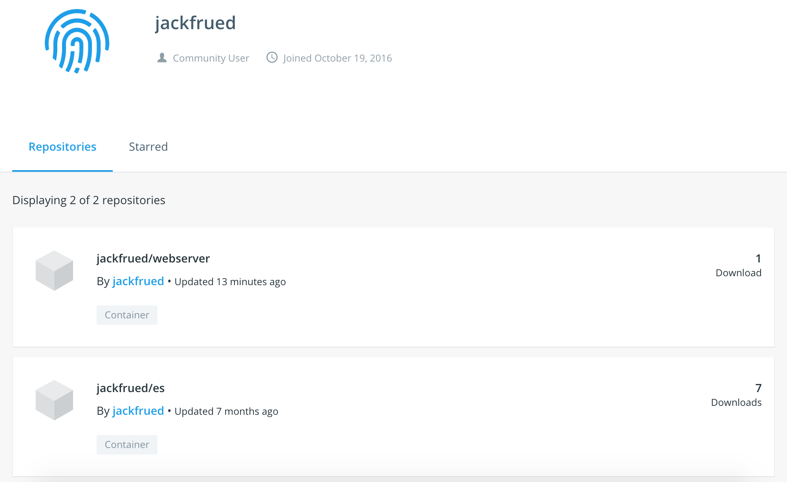

## Docker container technology detailed

Docker is an open source application container engine developed based on the Go language. It complies with the Apache Licence 2.0 protocol. It allows developers to package applications and their dependencies into a portable container, and then publish them to various distributions of Linux systems.

### Introduction to Docker

Probably the most troublesome thing in software development is configuring the environment. Due to the diversity of operating systems used by users, even using cross-platform development languages ​​(such as Java and Python) cannot guarantee that the code can run normally on various platforms, and the software we install in different environments requires Dependent packages are also different.

So the question is, when we install the software, can we install the environment in which the software runs? Can we copy the original environment exactly as it is?

Virtual machine (virtual machine) is a solution with environment installation, which can run another operating system in one operating system, such as running Linux system in Windows system, running Windows on macOS, and applications to No perception of this. Anyone who has used a virtual machine knows that the virtual machine is exactly the same as the real system, and for the host system of the virtual machine, the virtual machine is an ordinary file, which can be deleted if it is not needed. No effect. However, virtual machines usually occupy a lot of system resources, and the startup and shutdown are also very slow. In short, the user experience is not as good as expected.

Docker is a package of Linux container technology (LXC) (using Linux namespace and cgroup technology), which provides an easy-to-use container interface and is currently the most popular Linux container solution. Docker packages the application and the program's dependencies in a file, and running this file will generate a virtual container. Programs run in this virtual container as if they were running on a real physical machine. The figure below is a comparison of virtual machines and containers, with traditional virtual machines on the left and Docker on the right.


At present, Docker is mainly used for several aspects:

1. Provide a one-off environment.
2. Provide elastic cloud services (it is easy to expand and contract using Docker).
3. Practice microservice architecture (run multiple services in containers in isolation from the real environment).

### Install Docker

The following takes CentOS as an example to explain how to install Docker, using [Ubuntu](https://docs.docker.com/install/linux/docker-ce/ubuntu/), [macOS](https://docs.docker.com /docker-for-mac/install/) or [Windows](https://docs.docker.com/docker-for-windows/install/) users can click the corresponding link to learn how to install on these platforms.

1. Determine the operating system kernel version (CentOS 7 requires 64-bit, kernel version 3.10+; CentOS 6 requires 64-bit, kernel version 2.6+).

   ````Bash
   uname -r
   ````

2. Update the underlying library files of the system (it is recommended to execute them, otherwise inexplicable problems may occur when using Docker).

   ````Bash
   yum update
   ````

3. Remove any old Docker versions that may exist.

   ````Bash
   yum list installed | grep docker
   yum erase -y docker docker-common docker-engine
   ````

4. Install the yum toolkit and dependencies.

   ````Bash
   yum install -y yum-utils device-mapper-persistent-data lvm2
   ````

5. Add the yum source (the source for installing Docker-ce) through the yum toolkit.

   ````Bash
   yum-config-manager --add-repo https://download.docker.com/linux/centos/docker-ce.repo
   ````

6. Use yum to install Docker-ce under CentOS and start it.

   ````Bash
   yum -y install docker-ce
   systemctl start docker
   ````

7. View Docker information and version.

   ```Shell
   docker version
   docker info
   ````

The next step is to download the image and create the container to see if Docker is up and running. The image file named hello-world can be downloaded from the Docker image repository using the following command.

 ```Shell
docker pull hello-world
 ````

View all image files.

```Shell
docker images
````

````
REPOSITORY TAG IMAGE ID CREATED SIZE
docker.io/hello-world latest fce289e99eb9 7 months ago 1.84 kB
````

Create and run containers from image files.

```Shell
docker container run --name mycontainer hello-world
````

> Description: where `mycontainer` is the name we gave the container, followed by the `--name` parameter; `hello-world` is the image file we just downloaded.

````
Hello from Docker!
This message shows that your installation appears to be working correctly.


To generate this message, Docker took the following steps:
 1. The Docker client contacted the Docker daemon.
 2. The Docker daemon pulled the "hello-world" image from the Docker Hub.
    (amd64)
 3. The Docker daemon created a new container from that image which runs the
    executable that produces the output you are currently reading.
 4. The Docker daemon streamed that output to the Docker client, which sent it
    to your terminal.

To try something more ambitious, you can run an Ubuntu container with:
 $ docker run -it ubuntu bash

Share images, automate workflows, and more with a free Docker ID:
 https://hub.docker.com/

For more examples and ideas, visit:
 https://docs.docker.com/get-started/
```

If you want to delete this container, you can use the following command.

```Shell
docker container rm mycontainer
````

After deleting the container, we can also delete the image file we just downloaded.

```Shell
docker rmi hello-world
````

> Instructions: If you want to install and start Docker under Ubuntu (kernel version 3.10+), you can follow the steps below.
>
> ```Shell
> apt update
> apt install docker-ce
> service docker start
> ````
>
> Domestic users can improve the download speed by changing the Ubuntu software download source. For details, please refer to ["Ubuntu Mirror Usage Help"](<https://mirrors.tuna.tsinghua.edu.cn/ help/ubuntu/>).

After installing Docker, since it will be very slow to download the image directly by visiting [dockerhub](https://hub.docker.com/), it is recommended to replace the server with a domestic image. You can modify the `/etc/docker/daemon.json` file to do it. The general cloud server will have its own image, so there is no need to modify it manually.

````JavaScript
{
"registry-mirrors": [
        "http://hub-mirror.c.163.com",
        "https://registry.docker-cn.com"
    ]
}
````

### Using Docker

If you want to play with Docker, the easiest way is to use Docker to create some containers that you need to use in your own study and work. Let's take everyone to create these containers.

#### Running Nginx

Nginx is a high-performance web server and a good choice for reverse proxy servers. Using Docker, it is very simple to create a container running Nginx, the command is as follows.

```Shell
docker container run -d -p 80:80 --rm --name mynginx nginx
````

> Description: The above parameter `-d` indicates that the container runs in the background (does not generate output to the shell) and displays the ID of the container; `-p` is used to map the port of the container to the port of the host, and the colon is preceded by the host The port used inside the container after the colon; `--rm` indicates that the container is automatically deleted after the container is stopped. For example, after executing the command `docker container stop mynginx`, the container no longer exists; after `--name` mynginx is a custom container name; in the process of creating a container, the image file of nginx needs to be used, and the download of the image file is completed automatically. If the version number is not specified, the default is the latest version (latest).

If you need to deploy your own web project (page) to Nginx, you can use the container copy command to copy all files and folders in the specified path to the specified directory of the container.

```Shell
docker container cp /root/web/index.html mynginx:/usr/share/nginx/html
````

If you do not want to copy files, you can also map the specified folder to a directory of the container through the data volume operation `--volume` when creating the container, for example, map the folder of the Web project directly to `/usr/share/ nginx/html` directory. Let's stop the container we just created by running the following command.

```Shell
docker container stop mynginx
````

Then recreate the container with the command below.

```Shell
docker container run -d -p 80:80 --rm --name mynginx --volume /root/docker/nginx/html:/usr/share/nginx/html nginx
````

> Note: In the above commands for creating containers and copying files, `container` can be omitted, that is to say, `docker container run` and `docker run` are the same, while `docker container cp` and `docker cp` are the same. Additionally, `--volume` in a command can also be abbreviated to `-v`, just as `-d` is short for `--detach` and `-p` is short for `--publish`. `$PWD` represents the current folder of the host system, which should be easy to understand for those who have used Unix or Linux systems.

To see a running container, you can use the following command.

```Shell
docker ps
````

````
CONTAINER ID IMAGE COMMAND CREATED STATUS PORTS NAMES
3c38d2476384 nginx "nginx -g 'daemon ..." 4 seconds ago Up 4 seconds 0.0.0.0:80->80/tcp mynginx
````

To start and stop the container, you can use the following commands.

```Shell
docker start mynginx
docker stop mynginx
````

Since the `--rm` option is used when creating the container, the container will be removed when it is stopped. When we use the following command to view all containers, we should not see the `mynginx` container just now.

```Shell
docker container ls -a
````

If the `--rm` option was not specified when creating the container, the following command can also be used to delete the container.

```Shell
docker rm mynginx
````

To remove a running container, use the `-f` option.

```Shell
docker rm -f mynginx
````

#### Running MySQL

Let's try to install a MySQL server with Docker. First, you can check whether there is a MySQL image file.

```Shell
docker search mysql
````

````
INDEX NAME DESCRIPTION STARS OFFICIAL AUTOMATED
docker.io docker.io/mysql MySQL is a ... 8486 [OK]
...
````

> Description: The columns of the query results above represent the index, image name, image description, user evaluation, official image or not, and automatic build.

Download the MySQL image and specify the version number of the image.

```Shell
docker pull mysql:5.7
````

If you need to view the downloaded image file, you can use the following command.

```Shell
docker images
````

````
REPOSITORY TAG IMAGE ID CREATED SIZE
docker.io/nginx latest e445ab08b2be 2 weeks ago 126 MB
docker.io/mysql 5.7 f6509bac4980 3 weeks ago 373 MB
````

Create and run a MySQL container.

```Shell
docker run -d -p 3306:3306 --name mysql57 -v /root/docker/mysql/conf:/etc/mysql/mysql.conf.d -v /root/docker/mysql/data:/var/lib/ mysql -e MYSQL_ROOT_PASSWORD=123456 mysql:5.7
````

> **Note**: When creating the container above, we used the data volume operation again, that is because the container is usually created and deleted at any time, but the data in the database needs to be preserved.

One of the above two data volume operations is to map the folder where the MySQL configuration file is located, and the other is to map the folder where the MySQL data is located. These two data volume operations are very important. We can put the MySQL configuration file in the `$PWD/mysql/conf` directory. The specific content of the configuration file is as follows:

````INI
[mysqld]
pid-file=/var/run/mysqld/mysqld.pid
socket=/var/run/mysqld/mysqld.sock
datadir=/var/lib/mysql
log-error=/var/log/mysql/error.log
server-id=1
log-bin=/var/log/mysql/mysql-bin.log
expire_logs_days=30
max_binlog_size=256M
symbolic-links=0
````

If MySQL 8.x version (the latest version at present) is installed, you may encounter `error 2059: Authentication plugin 'caching_sha2_password' cannot be loaded` when connecting to the server using the client tool, this is because MySQL 8.x By default, a mechanism called "caching_sha2_password" is used to better protect user passwords, but if the client tool does not support the new authentication method, the connection will fail. There are two ways to solve this problem: one is to upgrade the client tool to support the authentication method of MySQL 8.x; the other is to enter the container and modify the user password authentication method of MySQL. The following are the specific steps. We first use the `docker exec` command to enter the interactive environment of the container, assuming that the name of the container running MySQL 8.x is `mysql8x`.

```Shell
docker exec -it mysql8x /bin/bash
````

After entering the interactive shell of the container, you can first use the MySQL client tool to connect to the MySQL server.

```Shell
mysql -u root -p
Enter password:
Your MySQL connection id is 16
Server version: 8.0.12 MySQL Community Server - GPL
Copyright (c) 2000, 2018, Oracle and/or its affiliates. All rights reserved.
Oracle is a registered trademark of Oracle Corporation and/or its
affiliates. Other names may be trademarks of their respective
owners.
Type 'help;' or '\h' for help. Type '\c' to clear the current input statement.
mysql>
````


Next, you can modify the user password through SQL.

````SQL
alter user 'root'@'%' identified with mysql_native_password by '123456' password expire never;
````

Of course, if you want, you can also check the user table to check whether the modification is successful.

````SQL
use mysql;
select user, host, plugin, authentication_string from user where user='root';
+------+------------+-------------+------ -------------------------------------+
| user | host | plugin | authentication_string |
+------+------------+-------------+------ -------------------------------------+
| root | % | mysql_native_password | *6BB4837EB74329105EE4568DDA7DC67ED2CA2AD9 |
| root | localhost | mysql_native_password | *6BB4837EB74329105EE4568DDA7DC67ED2CA2AD9 |
+------+------------+-------------+------ -------------------------------------+
2 rows in set (0.00 sec)
````

After completing the above steps, it is now possible to connect to MySQL 8.x without updating the client tools.

#### Running Redis

Next, let's try running multiple containers and let multiple containers communicate over the network. We create four Redis containers to implement a master-slave replication structure with one master and three slaves.

```Shell
docker run -d -p 6379:6379 --name redis-master redis
docker run -d -p 6380:6379 --name redis-slave-1 --link redis-master:redis-master redis redis-server --replicaof redis-master 6379
docker run -d -p 6381:6379 --name redis-slave-2 --link redis-master:redis-master redis redis-server --replicaof redis-master 6379
docker run -d -p 6382:6379 --name redis-slave-3 --link redis-master:redis-master redis redis-server --replicaof redis-master 6379
````

In the above command, the `--link` parameter is used to create a network alias for the container, because the three slaves (slave) need to connect to their own host (master) through the network. Although, we can view the IP address of the container through the `docker inspect --format '{{ .NetworkSettings.IPAddress }}' <container-ID>` command, but due to the ready-to-use of the container, the IP address of the container There may be changes. If the IP address is used directly, after the container is restarted, the slave machine may not be able to connect to the host due to the change of the IP address. The purpose of creating a network alias with the `--link` parameter is to use this alias instead of the IP address after the `--replicaof` parameter after `redis-server` when starting the Redis server.

Next, we enter the container named `redis-master` to see if the configuration of master-slave replication is successful.

```Shell
docker exec -it redis-master /bin/bash
````

Start the command line tool via `redis-cli`.

```Shell
redis-cli
127.0.0.1:6379>info replication
# Replication
role:master
connected_slaves: 3
slave0:ip=172.17.0.4,port=6379,state=online,offset=1988,lag=0
slave1:ip=172.17.0.5,port=6379,state=online,offset=1988,lag=1
slave2:ip=172.17.0.6,port=6379,state=online,offset=1988,lag=1
master_replid: 94703cfa03c3ddc7dcc74ca5b8dd13cb8b113ea
master_replid2: 0000000000000000000000000000000000000000
master_repl_offset: 1988
second_repl_offset: -1
repl_backlog_active:1
repl_backlog_size: 1048576
repl_backlog_first_byte_offset:1
repl_backlog_histlen:1988
````

#### Running GitLab

GitLab is a Git warehouse management tool developed by GitLab Inc. It has a series of functions such as wiki, issue tracking, continuous integration, etc. It is divided into community edition and enterprise edition. Through the virtualized container provided by Docker, we can install the community version of Docker. Because GitLab needs to use the SSH protocol for secure connection, we need to expose the 22 port of the container, so you can first change the 22 port of the host SSH connection to another port (such as: 12345), and then perform subsequent operations.

```Shell
vim /etc/ssh/sshd_config
````

Uncomment the line where the port is defined and change the port to 12345.

````
Port 12345
````

Restart the `sshd` service.

```Shell
systemctl restart sshd
````

> **Tips**: After modifying the port, make sure that the corresponding port is also opened on the firewall, otherwise, you cannot use SSH to connect to the Linux server.

Create the folders needed for data volume mapping operations.

```Shell
mkdir -p /root/gitlab/{config,logs,data}
````

Create a container based on the `gitlab/gitlab-ce` image and expose port 80 (HTTP connection) and port 22 (SSH connection).

```Shell
docker run -d -p 80:80 -p 22:22 --name gitlab -v /root/gitlab/config:/etc/gitlab -v /root/gitlab/logs:/var/log/gitlab -v /root /gitlab/data:/var/opt/gitlab gitlab/gitlab-ce
````

> Note: The startup of GitLab is relatively slow, and it may take a while for the container to be accessed through the browser after the container is created.

Entering the GitLab access interface for the first time will prompt us to change the administrator password. After setting the administrator password, you can enter the username `root` and the password you just set in the login interface to log in to the administrator console. It is very simple and user-friendly in use. transformed.


### Build image

Through the above explanation, we have mastered how to create a container through the official image. Of course, if we want, we can also use the configured container to generate the image. In short, the **Docker image is superimposed by the file system. The bottom layer of the system is the bootfs, which is equivalent to the boot file system of the Linux kernel; the second layer is the rootfs, which can be a kind of Or multiple operating systems (such as Debian or Ubuntu file systems), the rootfs in Docker is read-only; Docker uses the joint mounting technology to stack each layer of file systems together, and the final file system will contain the underlying files and Directory, such a file system is a mirror**.

Before we talked about how to find, list and pull (download) images, let's look at two ways to build images:

1. Use the `docker commit` command. (Not recommended)
2. Use the `docker build` command and the Dockerfile.

#### Build the image using the commit command

To demonstrate how to build the image, let's first use the Ubuntu image to customize a container, the command is as follows.

```Shell
docker run --name myubuntu -it ubuntu /bin/bash
````

Execute the following commands in the container to install the Apache server and exit the container.

```Shell
apt -y upgrade
apt -y install apache2
exit
````

We save this container as a custom web server, and when such a web server is needed, there is no need to recreate the container and install Apache.

First we check the ID of the container with the following command.

```Shell
docker container ls -a
````

````
docker container ls -a
CONTAINER ID IMAGE COMMAND CREATED STATUS PORTS NAMES
014bdb321612 ubuntu "/bin/bash" 5 minutes ago Exited (0) myubuntu
````

Submit a custom container.

```Shell
docker commit 014bdb321612 jackfrued/mywebserver
````

View image files.

```Shell
docker images
````

````
REPOSITORY TAG IMAGE ID CREATED SIZE
jackfrued/mywebserver latest 795b294d265a 14 seconds ago 189 MB
````

After generating the image file, you can use the image file just created to create a new container later.

#### Build the image using the Dockerfile

Dockerfile uses DSL (Domain Specific Language) to build a Docker image. As long as the Dockerfile is edited, you can use the `docker build` command to build a new image.

We start by creating a folder called myapp to hold the project code and the Dockerfile as follows:

```Shell
[ECS-root temp]# tree myapp
myapp
├── api
│ ├── app.py
│ ├── requirements.txt
│ └── start.sh
└── Dockerfile
````

The api is the folder of the Flask project, which includes the project code, dependencies, and startup scripts. The specific content is as follows:

`app.py` file:

````Python
from flask import Flask
from flask_restful import Resource, Api
from flask_cors import CORS

app = Flask(__name__)
CORS(app, resources={r'/api/*': {'origins': '*'}})
api = Api(app)


class Product(Resource):

    def get(self):
        products = ['Ice Cream', 'Chocolate', 'Coca Cola', 'Hamburger']
        return {'products': products}


api.add_resource(Product, '/api/products')
````

`requirements.txt` file:

````INI
flask
flask-restful
flask-cors
gunicorn
````

`start.sh` file:

```Shell
#!/bin/bash
exec gunicorn -w 4 -b 0.0.0.0:8000 app:app
```

> **TIP**: You need to give the start.sh file execute permission, which can be done using the `chmod 755 start.sh` command.

Dockerfile:

```Dockerfile
# Specify the base image
FROM python:3.7
# Specify the maintainer of the mirror
MAINTAINER jackfrued "jackfrued@126.com"
# Add the specified file to the specified location in the container
ADD api/* /root/api/
# set working directory
WORKDIR /root/api
# Execute the command (install the dependencies of the Flask project)
RUN pip install -r requirements.txt -i https://pypi.doubanio.com/simple/
# The command to execute when the container starts
ENTRYPOINT ["./start.sh"]
# expose the port
EXPOSE 8000
````

Let's explain the Dockerfile above. The Dockerfile uses special instructions to specify the base image (FROM instruction), the command that needs to be specified after the container is created (RUN instruction), and the port to be exposed (EXPOSE) and other information. We will introduce the instructions in these Dockfiles for you later.

Next we can use the `docker build` command to create the image as shown below.

```Shell
docker build -t "jackfrued/myapp" .
````

> Tip: Do not miss the `.` at the end of the above command, it means to search for Dockerfile from the current path.

The created image can be viewed by the following command.

```Shell
docker images
````

````
REPOSITORY TAG IMAGE ID CREATED SIZE
jackfrued/myapp latest 6d6f026a7896 5 seconds ago 930 MB
````

If you want to know how the image file is created, you can use the following command.

```Shell
docker history jackfrued/myapp
````

````
IMAGE CREATED CREATED BY SIZE COMMENT
6d6f026a7896 31 seconds ago /bin/sh -c #(nop) EXPOSE 8000/tcp 0 B
3f7739173a79 31 seconds ago /bin/sh -c #(nop) ENTRYPOINT ["./start.sh"] 0 B
321e6bf09bf1 32 seconds ago /bin/sh -c pip install -r requirements.txt... 13 MB
2f9bf2c89ac7 37 seconds ago /bin/sh -c #(nop) WORKDIR /root/api 0 B
86119afbe1f8 37 seconds ago /bin/sh -c #(nop) ADD multi:4b76f9c9dfaee8... 870 B
08d465e90d4d 3 hours ago /bin/sh -c #(nop) MAINTAINER jackfrued "j... 0 B
fbf9f709ca9f 12 days ago /bin/sh -c #(nop) CMD ["python3"] 0 B
````

Use this image to create a container to run the web server.

```Shell
docker run -d -p 8000:8000 --name myapp jackfrued/myapp
````

If you want to put the image file created above into the dockerhub repository, you can follow the steps shown below.

Log in to dockerhub with the command below.

```Shell
docker login
````

Enter your username and password to log in.

````
Login with your Docker ID to push and pull images from Docker Hub. If you don't have a Docker ID, head over to https://hub.docker.com to create one.
Username: jackfrued
Password:
Login Succeeded
````


Push the image to the repository with the command below.

```Shell
docker push jackfrued/webserver
````



#### Dockerfile instructions

If you want to know the instructions of Dockerfile, you can check the official [Reference Manual](<https://docs.docker.com/engine/reference/builder/>). Here we introduce some commonly used instructions.

1. **FROM**: Set the base image, which must be the first instruction in the Dockerfile.

   ```Dockerfile
   FROM <image name> [AS <alias>]
   ````

   or

   ```Dockerfile
   FROM <image name>[:<label>] [AS <alias>]
   ````

2. **RUN**: Specifies the command to be executed when building the image.

   ```Dockerfile
   RUN <command> [parameter 1], [parameter 2], ...
   ````

   or

   ```Dockerfile
   RUN ["executable", "parameter1", "parameter2", ...]
   ````

3. **CMD**: Specifies the command to be executed after building the image.

   ```Dockerfile
   CMD <command> [parameter1], [parameter2], ...
   ````

   or

   ```Dockerfile
   CMD ["executable", "parameter1", "parameter2", ...]
   ````

   > Note: Docker is different from a virtual machine. The container itself is a process, and the application in the container should run in the foreground. The CMD command is equivalent to specifying the main process of the container (the program to be executed in the foreground after the container is created). If the main process ends, the container will stop running. So to start Nginx in a container, you can't use `service nginx start` or `systemctl start nginx` but let it run in the foreground through `CMD ["nginx", "-g", "daemon off;"]`.

4. **ENTRYPOINT**: Similar to CMD, you can also execute commands, but any parameters specified in the `docker run` command line will be passed as parameters to the command in the ENTRYPOINT command again, which allows us to build an image , which can either run a default command or specify overridable parameter options for the command via the `docker run` command line.

   ```Dockerfile
   ENTRYPOINT <command> [parameter 1], [parameter 2], ...
   ````

   or

   ```Dockerfile
   ENTRYPOINT ["executable", "parameter1", "parameter2", ...]
   ````

5. **WORKDIR**: When creating a new container through an image, a working directory is created inside the container, and the programs specified by ENTRYPOINT and CMD will be executed in this directory. The working directory specified by WORKDIR can be overridden with the `-w` parameter when using the `docker run` command. E.g:

   ```Dockerfile
   WORKDIR /opt/webapp
   ````

   ```Shell
   docker run -w /usr/share/webapp ...
   ````

6. **ENVPN: Set the environment variable when creating the image. When using the `docker run` command, you can use the `-e` parameter to modify the settings of environment variables. E.g:

   ```Dockerfile
   ENV DEFAULT_PORT=8080
   ````

   ```Shell
   docker run -e "DEFAULT_PORT=8000" ...
   ````

7. **USER**: Specify what user the image will run as. E.g:

   ```Dockerfile
   USER nginx
   ````

8. **VOLUME**: Add a data volume mount point when creating a container. The data volume operation can realize the sharing and reuse of data between containers, and the changes made to the volume can take effect immediately without restarting the container. We used the `--volume` parameter when creating the container before to realize the mapping operation of the data volume.

   ```Dockerfile
   VOLUME ["/path1", "/path2/subpath2.1/", ...]
   ````

9. **ADD**: Copy the files and folders in the build directory to the image. If they are compressed files and archived files, the ADD command will decompress and unarchive these files.

   ```Dockerfile
   ADD [--chown=<user>:<usergroup>] <source file> <destination file>
   ````

10. **COPY**: Very similar to ADD, but does not actively extract files.

11. **LABEL**: Add some metadata to the Docker image, which will be seen when using the `docker inspect` command.

    ```Dockerfile
    LABEL version="1.0.0" location="Chengdu"
    ````

12. **ONBUILD**: Add triggers to mirrors. When one mirror is used as the base mirror for other mirrors, the trigger will be executed. E.g:

    ```Dockerfile
    ONBUILD ADD ./app/src
    ONBUILD RUN cd /app/src && make
    ````

### Multi-container management

Our project may use multiple containers, and the work of managing containers will become troublesome when there are more containers. If you want to automatically configure multiple containers so that the containers can cooperate with each other and even achieve complex scheduling, this requires container orchestration. Docker's native support for container orchestration is very weak, but container orchestration can be implemented through community-provided tools.

#### Docker Compose

YAML file-based container orchestration can be achieved by installing the Docker Compose tool. The YAML file defines a series of containers and the properties of the container runtime. Docker Compose manages the containers according to these configurations.

1. Install Docker Compose.

   ```Shell
   curl -L "https://github.com/docker/compose/releases/download/1.25.4/docker-compose-$(uname -s)-$(uname -m)" -o /usr/local/bin /docker-compose
   chmod +x /usr/local/bin/docker-compose
   ````

   > Note: If there is no curl tool, under CentOS, you can first install curl through the package management tool yum and then execute the above command.

   Of course, we can also use Python's package management tool pip to install Docker Compose, the command is as follows.

   ```Shell
   pip3 install -U docker-compose
   ````

2. Use Docker Compose.

   We introduced the cache in the Flask project just now, and then used the data interface provided by Flask to provide data for the front-end page, use Vue.js to render the page, and deploy the static page on the Nginx server. The project folder structure looks like this:

   ```Shell
   [ECS-root ~]# tree temp
   temp
   ├── docker-compose.yml
   ├── html
   │ └── index.html
   └── myapp
       ├── api
       │ ├── app.py
       │ ├── requirements.txt
       │ └── start.sh
       └── Dockerfile
   ````

   The modified app.py file code is as follows:

   ````Python
   from pickle import dumps, loads
   
   from flask import Flask
   from flask_restful import Resource, Api
   from flask_cors import CORS
   from redis import Redis
   
   app = Flask(__name__)
   CORS(app, resources={r'/api/*': {'origins': '*'}})
   api = Api(app)
   redis = Redis(host='redis-master', port=6379)
   
   
   class Product(Resource):
   
       def get(self):
           data = redis.get('products')
           if data:
               products = loads(data)
           else:
               products = ['Ice Cream', 'Chocolate', 'Coca Cola', 'Hamburger']
               redis.set('products', dumps(products))
           return {'products': products}
   
   
   api.add_resource(Product, '/api/products')
   ````

   The html folder is used to store static pages, and later we will serve static pages to the browser through a container running Nginx. The content of the index.html file looks like this:

````HTML
   <!DOCTYPE html>
   <html lang="en">
   <head>
       <meta charset="utf-8">
       <title>Home</title>
   </head>
   <body>
       <div id="app">
           <h2>Product List</h2>
           <ul>
               <li v-for="product in products">{{ product }}</li>
           </ul>
       </div>
       <script src="https://cdn.bootcss.com/vue/2.6.10/vue.min.js"></script>
       <script>
           new Vue({
               el: '#app',
               data: {
                   products: []
               },
               created() {
                   fetch('http://1.2.3.4:8000/api/products')
                       .then(resp => resp.json())
                       .then(json => {this.products = json.products})
               }
           })
       </script>
   </body>
   </html>
   ````

   Next, we need to create three containers through the docker-compose.yml file and specify the dependencies between the containers.

   ````YAML
   version: '3'
   services:
     api-server:
       build: ./myapp
       ports:
         - '8000:8000'
       links:
         - redis-master
     web-server:
       image: nginx
       ports:
         - '80:80'
       volumes:
         - ./html:/usr/share/nginx/html
     redis-master:
       image: redis
       expose:
         - '6379'
   ````

   With this YAML file in hand, we can use the `docker-compose` command to create a container-running project as follows:

   ```Shell
   [ECS-root temp]# docker-compose up
   Creating network "temp_default" with the default driver
   Creating temp_web-server_1 ... done
   Creating temp_redis-master_1 ... done
   Creating temp_api-server_1 ... done
   Attaching to temp_redis-master_1, temp_web-server_1, temp_api-server_1
   redis-master_1 | 1:C 05 Dec 2019 11:57:26.828 # oO0OoO0OoO0Oo Redis is starting oO0OoO0OoO0Oo
   redis-master_1 | 1:C 05 Dec 2019 11:57:26.828 # Redis version=5.0.6, bits=64, commit=00000000, modified=0, pid=1, just started
   redis-master_1 | 1:C 05 Dec 2019 11:57:26.828 # Warning: no config file specified, using the default config. In order to specify a config file use redis-server /path/to/redis.conf
   redis-master_1 | 1:M 05 Dec 2019 11:57:26.830 * Running mode=standalone, port=6379.
   redis-master_1 | 1:M 05 Dec 2019 11:57:26.831 # WARNING: The TCP backlog setting of 511 cannot be enforced because /proc/sys/net/core/somaxconn is set to the lower value of 128.
   redis-master_1 | 1:M 05 Dec 2019 11:57:26.831 # Server initialized
   redis-master_1 | 1:M 05 Dec 2019 11:57:26.831 # WARNING overcommit_memory is set to 0! Background save may fail under low memory condition. To fix this issue add 'vm.overcommit_memory = 1' to /etc/sysctl. conf and then reboot or run the command 'sysctl vm.overcommit_memory=1' for this to take effect.
   redis-master_1 | 1:M 05 Dec 2019 11:57:26.831 # WARNING you have Transparent Huge Pages (THP) support enabled in your kernel. This will create latency and memory usage issues with Redis. To fix this issue run the command ' echo never > /sys/kernel/mm/transparent_hugepage/enabled' as root, and add it to your /etc/rc.local in order to retain the setting after a reboot. Redis must be restarted after THP is disabled.
   redis-master_1 | 1:M 05 Dec 2019 11:57:26.831 * Ready to accept connections
   api-server_1 | [2019-12-05 11:57:27 +0000] [1] [INFO] Starting gunicorn 20.0.4
   api-server_1 | [2019-12-05 11:57:27 +0000] [1] [INFO] Listening at: http://0.0.0.0:8000 (1)
   api-server_1 | [2019-12-05 11:57:27 +0000] [1] [INFO] Using worker: sync
   api-server_1 | [2019-12-05 11:57:27 +0000] [8] [INFO] Booting worker with pid: 8
   api-server_1 | [2019-12-05 11:57:27 +0000] [9] [INFO] Booting worker with pid: 9
   api-server_1 | [2019-12-05 11:57:27 +0000] [10] [INFO] Booting worker with pid: 10
   api-server_1 | [2019-12-05 11:57:27 +0000] [11] [INFO] Booting worker with pid: 11
   ````

    To stop the container from running, you can use the following command.

   ```Shell
   docker-compose down
   ````

#### Kubernetes (K8S)

In the actual production environment, it is often necessary to deploy and manage multiple containers that work together. Docker compose solves the problem of multi-container creation and management, but in actual projects, we also need Kubernetes (hereinafter referred to as K8S) to provide a cross-host A container scheduling platform for clusters. K8S can automate the deployment, scaling and operation of containers, thus providing a container-centric infrastructure. This project is a project launched by Google in 2014. It is based on Google's more than ten years of operation and maintenance experience, and Google's own applications also run on containers.

