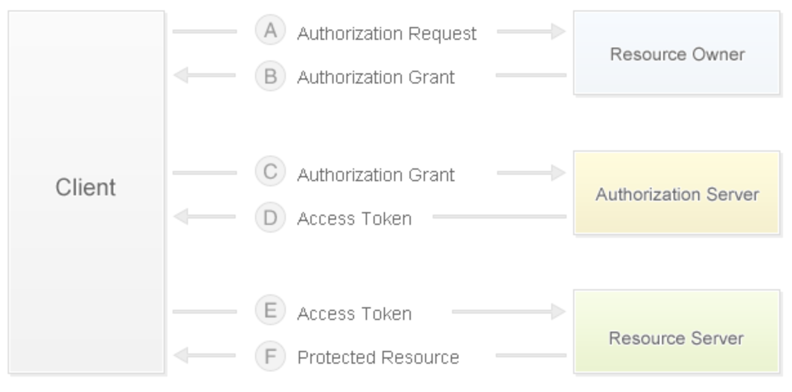

## Analysis of technical points of e-commerce website

### business model

1. B2B - business-to-business, both parties to the transaction are businesses (businesses), the most typical case being Alibaba.
2. C2C - person-to-person, eg: Taobao, Renrenche.
3. B2C - business-to-person, for example: Vipshop, Jumeiyoupin.
4. C2B - For individuals to merchants, consumers first put forward demands, and then merchants organize production according to their needs, for example: Shangpin Home Delivery.
5. O2O - Online to offline, combining offline business opportunities with the Internet, making the Internet a platform for offline transactions, such as: Meituan Takeaway, Ele.me.
6. B2B2C - business-to-business-to-person, for example: Tmall, JD.com.

### Requirements

1. Client
   - Home page (product classification, ad rotation, scrolling alert, waterfall loading, recommendation, discount, hot sale, …)

   - User (login (third-party login), registration, logout, self-service (personal information, browsing history, shipping address, ...))

   - Products (categories, lists, details, searches, popular searches, search history, add to cart, favorites, following, comments, ...)
   - Shopping cart (view, edit (modify quantity, delete item, clear))
   - Orders (submit order (payment), order history, order details, order evaluation, ...)
2. Management terminal
   - CRUD for core business entities
   - Scheduled tasks (periodic and aperiodic, such as processing unpaid orders, collecting data and alerting abnormal events, ...)
   - Report function (import and export Excel, PDF, etc. and front-end ECharts statistical chart display)
   - Permission control (RBAC, whitelist, blacklist, ...)
   - Business flow (such as initiating a refund process, common process engines are: Activity, Airflow, Spiff, etc.)
   - Three-party services (access map, SMS, logistics, payment, real-name authentication, weather, monitoring, cloud storage, ...)

### Physical Model Design

First of all, we must figure out two concepts: SPU (Standard Product Unit) and SKU (Stock Keeping Unit).

- SPU: iPhone 6s
- SKU: iPhone 6s 64G Local Gold


### worth mentioning

Third-party login refers to using the account of a third-party website (usually a well-known social networking site) for login verification (mainly to obtain user-related information through a well-known third-party website), such as domestic QQ, Weibo, foreign Google, Facebook, etc. . Third-party logins are mostly done using the [OAuth](<https://en.wikipedia.org/wiki/OAuth>) protocol, which is an open web standard for authorization (** the owner of the data tells the system, agreeing Authorize third-party applications to enter the system and obtain these data. The system thus generates a short-term access token, which is used to replace the password for third-party applications to use**), which has been widely used, and currently version 2.0 is usually used. For the basic knowledge of OAuth, you can read Mr. Ruan Yifeng's ["Understanding OAuth 2.0"](http://www.ruanyifeng.com/blog/2014/05/oauth_2_0.html). Regarding the difference between **token** and **password**, we can briefly summarize the following three differences:

1. The token is short-term, it will automatically expire when it expires, and the user cannot modify it by himself. The password is generally valid for a long time and will not change if the user does not modify it.
2. The token can be revoked by the data owner and will expire immediately. In the above example, the homeowner can cancel the courier's token at any time. Passwords are generally not allowed to be revoked by others.
3. The token has a scope of authority, for example, it can only enter the second door of the community. For web services, read-only tokens are more secure than read-write tokens. Passwords are generally full permissions.

Therefore, through the token, the third-party application can obtain permission, and at the same time, it can be controlled at any time, and the system security will not be endangered. This is the advantage of the OAuth protocol.

#### OAuth 2.0 authorization flow

1. After the user opens the client, the client asks the user (resource owner) for authorization.
2. The user (resource owner) agrees to grant the client authorization.
3. The client uses the authorization obtained in the previous step to apply for an access token from the authentication server.
4. After the authentication server authenticates the client, it issues an access token.
5. The client uses the access token to apply to the resource server for resources.
6. The resource server confirms that the access token is correct and agrees to open the resource to the client.



If you use Weibo login to access, the specific steps can refer to the ["Weibo login access"](http://open.weibo.com/wiki/Connect/login) document on the Weibo open platform. To access using QQ login, you need to first register as a QQ Internet developer and pass the audit. For specific steps, please refer to the ["Access Guide"](http://wiki.connect.qq.com/) on QQ Internet. For specific steps, please refer to ["Website Development Process"](http://wiki.connect.qq.com/%E5%87%86%E5%A4%87%E5%B7%A5%E4%BD%9C_oauth2- 0).

> Hint: There is a book called ["Django Blog Introduction"](https://shenxgan.gitbooks.io/django/content/publish/2015-08-10-django-oauth-login.html) on Gitbook Taking Github as an example to introduce third-party account login, you can read it yourself if you are interested.

Usually, when an e-commerce website uses a third-party login, it will be required to bind with the website account or automatically complete the account binding according to the obtained third-party account information (such as mobile phone number).

### Cache warmup and query cache

#### Cache warmup

The so-called cache warm-up refers to loading data into the cache in advance when the server is started. For this, you can write a subclass of `AppConfig` in the `apps.py` module of the Django application and override the `ready()` method, The code is shown below.

````Python
import pymysql

from django.apps import AppConfig
from django.core.cache import cache

SELECT_PROVINCE_SQL = 'select distid, name from tb_district where pid is null'


class CommonConfig(AppConfig):
    name = 'common'

    def ready(self):
        conn = pymysql.connect(host='1.2.3.4', port=3306,
                               user='root', password='pass',
                               database='db', charset='utf8',
                               cursorclass=pymysql.cursors.DictCursor)
        try:
            with conn.cursor() as cursor:
                cursor.execute(SELECT_PROVINCE_SQL)
                provinces = cursor.fetchall() provinces
                cache.set('provinces', provinces)
        finally:
            conn.close()
````

Next, you also need to write the following code in the application's `__init__.py`.

````Python
default_app_config = 'common.apps.CommonConfig'
````

Or register the application in the project's `settings.py` file.

````Python
INSTALLED_APPS = [
    ...
    'common.apps.CommonConfig',
    ...
]
````

#### query cache

A custom decorator implements caching of query results.

````Python
from pickle import dumps, loads

from django.core.cache import caches

MODEL_CACHE_KEY = 'project:modelcache:%s'


def my_model_cache(key, section='default', timeout=None):
    """A decorator that implements model caching"""

    def wrapper1(func):

        def wrapper2(*args, **kwargs):
            real_key = '%s:%s' % (MODEL_CACHE_KEY % key, ':'.join(map(str, args)))
            serialized_data = caches[section].get(real_key)
            if serialized_data:
                data = loads(serialized_data)
            else:
                data = func(*args, **kwargs)
                cache.set(real_key, dumps(data), timeout=timeout)
            return data

        return wrapper2

    return wrapper1
````

````Python
@my_model_cache(key='provinces')
def get_all_provinces():
    return list(Province.objects.all())
````

### Shopping cart implementation

Question 1: Where is the shopping cart of the logged in user? Where are the shopping carts of non-logged in users?

````Python
class CartItem(object):
    """Items in cart"""

    def __init__(self, sku, amount=1, selected=False):
        self.sku = sku
        self.amount = amount
        self.selected = selected

    @property
    def total(self):
        return self.sku.price * self.amount


class ShoppingCart(object):
    """shopping cart"""

    def __init__(self):
        self.items = {}
        self.index = 0

    def add_item(self, item):
        if item.sku.id in self.items:
            self.items[item.sku.id].amount += item.amount
        else:
            self.items[item.sku.id] = item

    def remove_item(self, sku_id):
        if sku_id in self.items:
            self.items.remove(sku_id)

    def clear_all_items(self):
        self.items.clear()

    @property
    def cart_items(self):
        return self.items.values()

    @property
    def cart_total(self):
        total = 0
        for item in self.items.values():
            total += item.total
        return total
````

The shopping carts of logged-in users can be placed in the database (which can be cached in Redis first); the shopping carts of non-logged-in users can be stored in cookies, localStorage or sessionStorage (reducing server-side memory overhead).

````JSON
{
    '1001': {sku: {...}, 'amount': 1, 'selected': True},
    '1002': {sku: {...}, 'amount': 2, 'selected': False},
    '1003': {sku: {...}, 'amount': 3, 'selected': True},
}
````

````Python
request.get_signed_cookie('cart')

cart_base64 = base64.base64encode(pickle.dumps(cart))
response.set_signed_cookie('cart', cart_base64)
````

Question 2: After the user logs in, how to merge the shopping cart? (At present, almost all shopping carts in e-commerce applications are persistent, mainly to facilitate data sharing among multiple terminals)

### Integrated payment function

Question 1: How to persist payment information? (Must ensure that every transaction is recorded)

Question 2: How to access Alipay? (Access to other platforms is basically similar)

1. [Ant Financial Open Platform](https://open.alipay.com/platform/home.htm).
2. [Entering the platform](https://open.alipay.com/platform/homeRoleSelection.htm).
3. [Developer Center](https://openhome.alipay.com/platform/appManage.htm#/apps).
4. [Documentation Center](https://docs.open.alipay.com/270/105899/).
5. [SDK integration](https://docs.open.alipay.com/54/103419) - [PYPI link](https://pypi.org/project/alipay-sdk-python/).
6. [API list](https://docs.open.alipay.com/270/105900/).


Configuration file:

````Python
ALIPAY_APPID = '...'
ALIPAY_URL = 'https://openapi.alipaydev.com/gateway.do'
ALIPAY_DEBUG = False
````

Get payment link (initiate payment):

````Python
# Create an object that calls Alipay
alipay = AliPay(
    # ID assigned when creating the app online
    appid=settings.ALIPAY_APPID,
    app_notify_url=None,
    # Private key of your own application
    app_private_key_path=os.path.join(
        os.path.dirname(os.path.abspath(__file__)),
        'keys/app_private_key.pem'),
    # Alipay's public key
    alipay_public_key_path=os.path.join(
        os.path.dirname(os.path.abspath(__file__)),
        'keys/alipay_public_key.pem'),
    sign_type='RSA2',
    debug=settings.ALIPAY_DEBUG
)
# Call the get payment page operation
order_info = alipay.api_alipay_trade_page_pay(
    out_trade_no='...',
    total_amount='...',
    subject='...',
    return_url='http://...'
)
# Generate full payment page URL
alipay_url = settings.ALIPAY_URL + '?' + order_info
return JsonResponse({'alipay_url': alipay_url})
````

You can enter the payment page through the link returned above. After the payment is completed, it will automatically jump back to the item page set in the above code. On this page, you can get the order number (out_trade_no), payment serial number (trade_no), transaction amount ( total_amount) and the corresponding signature (sign) and request the backend to verify and save the transaction result, the code is as follows:

````Python
# Create an object that calls Alipay
alipay = AliPay(
    # ID assigned when creating the app online
    appid=settings.ALIPAY_APPID,
    app_notify_url=None,
    # Private key of your own application
    app_private_key_path=os.path.join(
        os.path.dirname(os.path.abspath(__file__)),
        'keys/app_private_key.pem'),
    # Alipay's public key
    alipay_public_key_path=os.path.join(
        os.path.dirname(os.path.abspath(__file__)),
        'keys/alipay_public_key.pem'),
    sign_type='RSA2',
    debug=settings.ALIPAY_DEBUG
)
# Request parameters (assuming it is a POST request) include order number, payment serial number, transaction amount and signature
params = request.POST.dict()
# call the validation operation
if alipay.verify(params, params.pop('sign')):
    # Persist the transaction
````

Alipay's payment API also provides a series of interfaces such as transaction query, transaction settlement, refund, and refund query, which can be called according to business needs, and will not be repeated here.

### Seckill and oversold

1. Seckill: Seckill usually means to deal with extremely high concurrency in a very short time, and the system needs to withstand more than 100 times the usual traffic in a short period of time. Therefore, the seckill architecture is a relatively complex problem. The core idea is flow control and Performance optimization requires cooperation from the front-end (counting down through JavaScript, avoiding repeated submissions and limiting frequent refreshes) to the back-end. Traffic control is mainly to restrict only a small part of the traffic from entering the backend of the service (after all, only a small number of users can succeed in seconds), and at the same time use the cache on the physical architecture (on the one hand, because there are more read operations and less write operations; on the other hand, the inventory can be stored in In Redis, the DECR primitive is used to reduce inventory; at the same time, Redis can also be used to limit the current, the reason is the same as restricting the frequent sending of mobile phone verification codes) and message queues (the most important role of message queues is "peak cutting" and "" Decoupling of upstream and downstream nodes”) to optimize; in addition, a stateless service design should be adopted, which is convenient for horizontal expansion (by adding equipment to expand the system).
2. Oversold phenomenon: For example, the inventory of a certain product is 1. At this time, user 1 and user 2 purchase the product concurrently. After user 1 submits the order, the inventory of the product is changed to 0, but user 2 does not know the situation at this time. Place an order and the inventory of the item is modified to -1 again, which is an oversold phenomenon. There are three common approaches to addressing oversold conditions:
   - Pessimistic lock control: use `select ... for update` to lock the data when querying the quantity of goods, so that when user 1 queries the inventory, user 2 is blocked because it cannot read the inventory quantity until user 1 submits or returns The oversold problem is solved by rolling over the update inventory operation before continuing. However, this approach is too bad for commodities with high concurrent access. In actual development, it is possible to consider locking when the inventory is less than a certain value, but in general, this approach is not desirable.
   - Optimistic lock control: There is no need to lock when querying the number of commodities. When updating the inventory, the number of commodities must be the same as the previous query quantity before updating. Otherwise, it means that other transactions have already updated the inventory, and the request must be reissued.
   - Try to reduce inventory: combine the above query (`select`) and update (`update`) operations into one SQL operation, when updating the stock, add `inventory>=purchase quantity` or `where` filter condition `Inventory-purchase quantity>=0` condition, this practice requires the transaction isolation level to be read committed (read committed).

> Tip: If you are interested, you can check the discussion on this kind of issue on Zhihu.

### Static resource management

For the management of static resources, you can set up a file server or distributed file server (FastDFS) by yourself, but this is not necessary in general projects and the effect may not be the best. We recommend using cloud storage services to manage the static resources of the website, both at home and abroad. cloud service providers such as [Amazon](<https://amazonaws-china.com/cn/>), [Alibaba Cloud](<https://www.aliyun.com/product/oss>), [7 Niu](<https://www.qiniu.com/products/kodo>), [LeanCloud](<https://leancloud.cn/storage/>), [Bmob](<https://www.bmob .cn/cloud>), etc. all provide very high-quality cloud storage services, and the price is acceptable to general companies. For specific operations, please refer to official documents, such as Alibaba Cloud's [Object Storage OSS Developer Guide] (https: //www.alibabacloud.com/en/support/developer-resources).

### Full Text Search

####  plan selection

1. Use the fuzzy query function of the database - low efficiency, requires a full table scan every time, and does not support word segmentation.
2. Use the full-text search function of the database - MySQL 5.6 was only applicable to the MyISAM engine before. The search operation and other DML operations are coupled in the database, which may cause the search operation to be very slow, the data volume reaches millions, and the performance is significantly reduced, and the query time is very short. long.
3. Use an open source search engine - separate index data and raw data. You can use ElasticSearch or Solr to provide external indexing services. If high-concurrency full-text retrieval requirements are not considered, pure Python Whoosh can also be considered.

#### ElasticSearch

ElasticSearch is both a distributed document database and a highly scalable open source full-text search and analysis engine that allows storing, searching and analyzing large amounts of data in near real-time. It is often used as the underlying engine and technology to power complex search functions and requirements. The well-known Wikipedia, Stack-Overflow, and Github all use ElasticSearch.

The bottom layer of ElasticSearch is the open source search engine [Lucene] (https://lucene.apache.org/), but using Lucene directly will be very troublesome, you must write your own code to call its interface and only support the Java language. ElasticSearch is equivalent to a comprehensive encapsulation of Lucene, provides a REST-style API interface, and shields the differences in programming languages ​​through HTTP-based access. ElasticSearch will build an [inverted index] for the data (https://zh.wikipedia.org/zh-hans/%E5%80%92%E6%8E%92%E7%B4%A2%E5%BC%95) , but the built-in tokenizer of ElasticSearch has almost zero support for Chinese word segmentation, so it is necessary to provide Chinese word segmentation service by installing the elasticsearch-analysis-ik plugin.

For the installation and configuration of ElasticSearch, please refer to ["Docker Installation of ElasticSearch"](https://blog.csdn.net/jinyidong/article/details/80475320). In addition to ElasticSearch, Solr, Whoosh, etc. can also be used to provide search engine services. Basically, the following solutions can be considered in the Django project:

- haystack (django-haystack/drf-haystack) + whoosh + Jieba
- haystack (django-haystack/drf-haystack) + elasticsearch
-requests + elasticsearch
- django-elasticsearch-dsl

####Install and use ElasticSearch

1. Install ElasticSearch using Docker.

   ```Shell
   docker pull elasticsearch:7.6.0
   docker run -d -p 9200:9200 -p 9300:9300 -e "discovery.type=single-node" -e ES_JAVA_OPTS="-Xms512m -Xmx512m" --name es elasticsearch:7.6.0
   ````

   > Description: When creating the container above, the `-e` parameter specifies the use of stand-alone mode and the minimum and maximum available heap space of the Java virtual machine. The size of the heap space can be determined according to the actual memory size that the server can provide to ElasticSearch. The default is 2G .

2. Create the database.

   Request: PUT - `http://1.2.3.4:9200/demo/`

   response:

    ````JSON
   {
       "acknowledged": true,
       "shards_acknowledged": true,
       "index": "demo"
   }
    ````

3. View the created database.

   Request: GET - `http://1.2.3.4:9200/demo/`

   response:

   ````JSON
   {
       "demo": {
           "aliases": {},
           "mappings": {},
           "settings": {
               "index": {
                   "creation_date": "1552213970199",
                   "number_of_shards": "5",
                   "number_of_replicas": "1",
                   "uuid": "ny3rCn10SAmCsqW6xPP1gw",
                   "version": {
                       "created": "6050399"
                   },
                   "provided_name": "demo"
               }
           }
       }
   }
   ````

4. Insert the data.

   Request: POST - `http://1.2.3.4:9200/demo/goods/1/`

   Request header: Content-Type: application/json

   parameter:

   ````JSON
   {
       "no": "5089253",
       "title": "Apple iPhone X (A1865) 64GB Space Gray Mobile Unicom Telecom 4G Phone",
       "brand": "Apple",
       "name": "Apple iPhone X",
       "product": "Mainland China",
       "resolution": "2436 x 1125",
       "intro": "Apple has always had a vision in mind to create an iPhone that would have a full screen that would allow you to completely immerse yourself in using it, as if you had forgotten it existed. It is It's so smart that even the slightest glance can get it a coherent response. And this vision has finally become a reality with the arrival of the iPhone X. Now, let's meet the future."
   }
   ````

response:

   ````JSON
   {
       "_index": "demo",
       "_type": "goods",
       "_id": "1",
       "_version": 4,
       "result": "created",
       "_shards": {
           "total": 2,
           "successful": 1,
           "failed": 0
       },
       "_seq_no": 3,
       "_primary_term": 1
   }
   ````

5. Delete the data.

   Request: DELETE - `http://1.2.3.4:9200/demo/goods/1/`

   response:

   ````JSON
   {
       "_index": "demo",
       "_type": "goods",
       "_id": "1",
       "_version": 2,
       "result": "deleted",
       "_shards": {
           "total": 2,
           "successful": 1,
           "failed": 0
       },
       "_seq_no": 1,
       "_primary_term": 1
   }
   ````

6. Update the data.

   Request: PUT - `http://1.2.3.4:9200/demo/goods/1/_update`

   Request header: Content-Type: application/json

   parameter:

   ````JSON
   {
   "doc": {
   "no": "5089253",
       "title": "Apple iPhone X (A1865) 64GB Space Gray Mobile Unicom Telecom 4G Phone",
       "brand": "Apple",
       "name": "Apple iPhone X",
       "product": "United States",
       "resolution": "2436 x 1125",
       "intro": "Apple has always had a vision in mind to create an iPhone that would have a full screen that would allow you to completely immerse yourself in using it, as if you had forgotten it existed. It is It's so smart that even the slightest glance can get it a coherent response. And this vision has finally become a reality with the arrival of the iPhone X. Now, let's meet the future."
       }
   }
   ````

   response:

   ````JSON
   {
       "_index": "demo",
       "_type": "goods",
       "_id": "1",
       "_version": 10,
       "result": "updated",
       "_shards": {
           "total": 2,
           "successful": 1,
           "failed": 0
       },
       "_seq_no": 9,
       "_primary_term": 1
   }
   ````

7. Query data.

   Request: GET - `http://1.2.3.4:9200/demo/goods/1/`

   response:

   ````JSON
   {
       "_index": "demo",
       "_type": "goods",
       "_id": "1",
       "_version": 10,
       "found": true,
       "_source": {
           "doc": {
               "no": "5089253",
               "title": "Apple iPhone X (A1865) 64GB Space Gray Mobile Unicom Telecom 4G Phone",
               "brand": "Apple",
               "name": "Apple iPhone X",
               "product": "United States",
               "resolution": "2436 x 1125",
               "intro": "Apple has always had a vision in mind to create an iPhone that would have a full screen that would allow you to completely immerse yourself in using it, as if you had forgotten it existed. It is It's so smart that even the slightest glance can get it a coherent response. And this vision has finally become a reality with the arrival of the iPhone X. Now, let's meet the future."
           }
       }
   }
   ````

#### Configure Chinese word segmentation and pinyin plugin

1. Go to the plugins directory of the Docker container.

   ```Shell
   docker exec -it es /bin/bash
   ````

2. Download the [ik](https://github.com/medcl/elasticsearch-analysis-ik) and [pinyin](https://github.com/medcl/elasticsearch-analysis-pinyin) plugins corresponding to the ElasticSearch version .

   ```Shell
   yum install -y wget
   cd plugins/
   mkdir ik
   cd ik
   wget https://github.com/medcl/elasticsearch-analysis-ik/releases/download/v7.6.0/elasticsearch-analysis-ik-7.6.0.zip
   unzip elasticsearch-analysis-ik-7.6.0.zip
   rm -f elasticsearch-analysis-ik-7.6.0.zip
   cd..
   mkdir pinyin
   cd pinyin
   wget https://github.com/medcl/elasticsearch-analysis-pinyin/releases/download/v7.6.0/elasticsearch-analysis-pinyin-7.6.0.zip
   unzip elasticsearch-analysis-pinyin-7.6.0.zip
   rm -f elasticsearch-analysis-pinyin-7.6.0.zip
   ````

3. Exit the container and restart ElasticSearch.

   ```Shell
   docker restart es
   ````

4. Test the effect of Chinese word segmentation.

   Request: POST - `http://1.2.3.4:9200/_analyze`

   Request header: Content-Type: application/json

   parameter:

   ````JSON
   {
     "analyzer": "ik_smart",
     "text": "Chinese men's football team wins last place in group in Qatar 2022 World Cup qualifiers"
   }
   ````

   response:

   ````JSON
   {
       "tokens": [
           {
               "token": "China",
               "start_offset": 0,
               "end_offset": 2,
               "type": "CN_WORD",
               "position": 0
           },
           {
               "token": "Men's Football",
               "start_offset": 2,
               "end_offset": 4,
               "type": "CN_WORD",
               "position": 1
           },
           {
               "token": "at",
               "start_offset": 4,
               "end_offset": 5,
               "type": "CN_CHAR",
               "position": 2
           },
           {
               "token": "2022",
               "start_offset": 5,
               "end_offset": 10,
               "type": "TYPE_CQUAN",
               "position": 3
           },
           {
               "token": "Qatar",
               "start_offset": 10,
               "end_offset": 13,
               "type": "CN_WORD",
               "position": 4
           },
           {
               "token": "World Cup",
               "start_offset": 13,
               "end_offset": 16,
               "type": "CN_WORD",
               "position": 5
           },
           {
               "token": "Qualifiers",
               "start_offset": 16,
               "end_offset": 19,
               "type": "CN_WORD",
               "position": 6
           },
           {
               "token": "Medium",
               "start_offset": 19,
               "end_offset": 20,
               "type": "CN_CHAR",
               "position": 7
           },
           {
               "token": "Win",
               "start_offset": 20,
               "end_offset": 22,
               "type": "CN_WORD",
               "position": 8
           },
           {
               "token": "Team",
               "start_offset": 22,
               "end_offset": 24,
               "type": "CN_WORD",
               "position": 9
           },
           {
               "token": "last",
               "start_offset": 24,
               "end_offset": 26,
               "type": "CN_WORD",
               "position": 10
           },
           {
               "token": "One",
               "start_offset": 26,
               "end_offset": 28,
               "type": "CN_WORD",
               "position": 11
           }
       ]
   }
   ````

5. Test the effect of pinyin word segmentation.

   Request: POST - `http://1.2.3.4:9200/_analyze`

   Request header: Content-Type: application/json

   parameter:

   ````JSON
   {
     "analyzer": "pinyin",
     "text": "Zhang Xueyou"
   }
   ````

   response:

   ````JSON
   {
       "tokens": [
           {
               "token": "zhang",
               "start_offset": 0,
               "end_offset": 0,
               "type": "word",
               "position": 0
           },
           {
               "token": "zxy",
               "start_offset": 0,
               "end_offset": 0,
               "type": "word",
               "position": 0
           },
           {
               "token": "xue",
               "start_offset": 0,
               "end_offset": 0,
               "type": "word",
               "position": 1
           },
           {
               "token": "you",
               "start_offset": 0,
               "end_offset": 0,
               "type": "word",
               "position": 2
           }
       ]
   }
   ````

#### Full text search function

Searches can be done via GET or POST requests, and the following demonstrates searching for items with the "future" keyword.

1. GET - `http://120.77.222.217:9200/demo/goods/_search?q=future`

   > Note: Chinese characters in the URL should be processed as percent-encoded.

   ````JSON
   {
       "took": 19,
       "timed_out": false,
       "_shards": {
           "total": 5,
           "successful": 5,
           "skipped": 0,
           "failed": 0
       },
       "hits": {
           "total": 2,
           "max_score": 0.73975396,
           "hits": [
               {
                   "_index": "demo",
                   "_type": "goods",
                   "_id": "1",
                   "_score": 0.73975396,
                   "_source": {
                       "doc": {
                           "no": "5089253",
                           "title": "Apple iPhone X (A1865) 64GB Space Gray Mobile Unicom Telecom 4G Phone",
                           "brand": "Apple",
                           "name": "Apple iPhone X",
                           "product": "United States",
                           "resolution": "2436*1125",
                           "intro": "Apple has always had a vision in mind to create an iPhone that would have a full screen that would allow you to completely immerse yourself in using it, as if you had forgotten it existed. It is It's so smart that even the slightest glance can get it a coherent response. And this vision has finally become a reality with the arrival of the iPhone X. Now, let's meet the future."
                       }
                   }
               },
               {
                   "_index": "demo",
                   "_type": "goods",
                   "_id": "3",
                   "_score": 0.68324494,
                   "_source": {
                       "no": "42417956432",
                       "title": "Xiaomi 9 Transparent Premium Edition Mobile Phone Transparent Premium Full Netcom (12GB + 256GB)",
                       "brand": "Xiaomi (MI)",
                       "name": "Xiaomi (MI) Xiaomi 9 Transparent",
                       "product": "Mainland China",
                       "resolution": "2340*1080",
                       "intro": "Completely transparent body, unique sci-fi mecha style, design from the future."
                   }
               }
           ]
       }
   }
   ````

The search parameters available in the URL are shown in the following table:

   | Parameters | Description |
   | ---------------- | -------------------------------- ----------------- |
   | q | query string |
   | analyzer | Tokenizer used to analyze query strings |
   | analyze_wildcard | Whether wildcard or prefix queries are analyzed, the default is false |
   | default_operator | The relationship between multiple conditions, the default is OR, can be modified to AND |
   | explain | Include an explanation of the scoring mechanism in the returned results |
   | fields | Returns only the columns specified in the index, multiple columns are separated by commas |
   | sort | Sort reference field, you can use :asc and :desc to specify ascending and descending order |
   | timeout | timeout period |
   | from | The starting value of the matching result, the default is 0 |
   | size | The number of matching results, the default is 10 |

2. POST - `http://120.77.222.217:9200/demo/goods/_search`

   Request header: Content-Type: application/json

   parameter:

   ````JSON
   {
       "query": {
           "term": {
               "type": ""
           }
       }
   }
   ````

   POST searches are DSL based.


#### Django docking ElasticSearch

The third-party library for Python to connect to ElasticSearch is HayStack. You can use django-haystack in the Django project. Through HayStack, you can connect to various search engine services without modifying the code.

```shell
pip install django-haystack elasticsearch
````

Configuration file:

````Python
INSTALLED_APPS = [
    ...
    'haystack',
    ...
]

HAYSTACK_CONNECTIONS = {
    'default': {
        # engine configuration
        'ENGINE': 'haystack.backends.elasticsearch_backend.ElasticsearchSearchEngine',
        # The URL of the search engine service
        'URL': 'http://1.2.3.4:9200',
        # The name of the index library
        'INDEX_NAME': 'goods',
    },
}

# Automatically generate indexes when adding/deleting/updating data
HAYSTACK_SIGNAL_PROCESSOR = 'haystack.signals.RealtimeSignalProcessor'
````

Index class:

````Python
from haystack import indexes


class GoodsIndex(indexes.SearchIndex, indexes.Indexable):
    text = indexes.CharField(document=True, use_template=True)

    def get_model(self):
        return Goods

    def index_queryset(self, using=None):
        return self.get_model().objects.all()
````

Edit the template of the text field (need to be placed in templates/search/indexes/demo/goods_text.txt):

````
{{object.title}}
{{object.intro}}
````

Configuration URL:

````Python
urlpatterns = [
    # ...
    url('search/', include('haystack.urls')),
]
````

Generate initial index:

```Shell
python manage.py rebuild_index
````

> Note: You can refer to ["Django Haystack Full-Text Search and Keyword Highlighting"](https://www.zmrenwu.com/post/45/) for a more in-depth understanding of Haystack-based full-text search operations.

