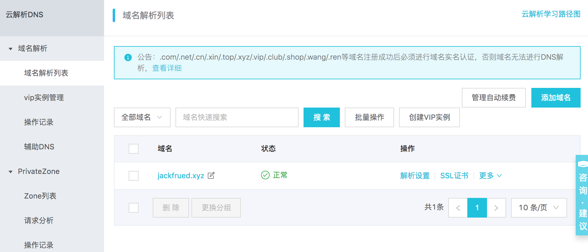

## Project Deployment Online Guide

### Ready to go live

1. Inspection work before going live.

   ```Shell
   python manage.py check --deploy
   ````

2. Set DEBUG to False and configure ALLOWED_HOSTS.

   ````Python
   DEBUG=False
   ALLOWED_HOSTS = ['*']
   ````

3. Security related configuration.

   ````Python
   # How long to keep the HTTPS connection
   SECURE_HSTS_SECONDS = 3600
   SECURE_HSTS_INCLUDE_SUBDOMAINS=True
   SECURE_HSTS_PRELOAD = True
   
   # Automatically redirect to secure connection
   SECURE_SSL_REDIRECT=True
   
   # Avoid browser inferring content type
   SECURE_CONTENT_TYPE_NOSNIFF = True
   
   # Avoid cross-site scripting attacks
   SECURE_BROWSER_XSS_FILTER = True
   
   # Cookie can only be transmitted over HTTPS
   SESSION_COOKIE_SECURE = True
   CSRF_COOKIE_SECURE = True
   
   # Prevent clickjacking attacks - modify HTTP protocol response headers
   # The current website is not allowed to use the <iframe> tag to load
   X_FRAME_OPTIONS = 'DENY'
   ````

4. Sensitive information is placed in environment variables or files.

   ````Python
   SECRET_KEY = os.environ['SECRET_KEY']
   
   DB_USER = os.environ['DB_USER']
   DB_PASS = os.environ['DB_PASS']
   
   REDIS_AUTH = os.environ['REDIS_AUTH']
   ````

### Update server Python environment to 3.x

> Note: If you need to clear the previous installation, just delete the corresponding files and folders

1. Install the underlying dependency library.

   ```Shell
   yum -y install zlib-devel bzip2-devel openssl-devel ncurses-devel sqlite-devel readline-devel tk-devel gdbm-devel libdb4-devel libpcap-devel xz-devel libffi-devel libxml2
   ````

2. Download the Python source code.

   ```Shell
   wget https://www.python.org/ftp/python/3.7.6/Python-3.7.6.tar.xz
   ````

3. Verify the downloaded file.

   ````Bash
   md5sum Python-3.7.6.tar.xz
   ````

4. Unzip and unarchive.

   ```Shell
   xz -d Python-3.7.6.tar.xz
   tar -xvf Python-3.7.6.tar
   ````

5. Perform pre-installation configuration (generate Makefile).

   ```Shell
   cd Python-3.7.6
   ./configure --prefix=/usr/local/python37 --enable-optimizations
   ````

6. Build and install.

   ```Shell
   make && make install
   ````

7. Configure the PATH environment variable (user or system environment variable) and activate it.

   ```Shell
   vim ~/.bash_profile
   vim /etc/profile
   ````

   ````INI
   ... the above code is omitted here...
   
   export PATH=$PATH:/usr/local/python37/bin
   
   ... the following code is omitted here...
   ````

    ```Shell
   source ~/.bash_profile
   source /etc/profile
    ````

8. Register soft links (symbolic links) - this step is not required, but is often useful.

   ```Shell
   ln -s /usr/local/python37/bin/python3 /usr/bin/python3
   ````

9. Test whether the Python environment is updated successfully (installing Python 3 must not destroy the original Python 2).

   ```Shell
   python3 --version
   python --version
   ````

### Project directory structure

Assuming that the project folder is `project`, the following five subdirectories are: `code`, `conf`, `logs`, `stat` and `venv` are used to save the project code, configuration files, log files, Static resources and virtual environments. Among them, the subdirectory `cert` in the `conf` directory saves the certificates and keys needed to configure HTTPS; the project code in the `code` directory can be checked out from the code repository through the version control tool; the virtual environment can be checked through Tools (such as: venv, virtualenv, pyenv, etc.) to create.

````
project
├── code
│ └── fangtx
│ ├── api
│ ├── common
│ ├── fangtx
│ ├── forum
│ ├── rent
│ ├── user
│ ├── manage.py
│ ├── README.md
│ ├── static
│ └── templates
├── conf
│ ├── cert
│ │ ├── 214915882850706.key
│ │ └── 214915882850706.pem
│ ├── nginx.conf
│ └── uwsgi.ini
├── logs
│ ├── access.log
│ ├── error.log
│ └── uwsgi.log
├── stat
│ └── css
│ └── images
│ └── js
└── venv
    ├── bin
    │ ├── activate
    │ ├── activate.csh
    │ ├── activate.fish
    │ ├── celery
    │ ├── celerybeat
    │ ├── celeryd
    │ ├── celeryd-multi
    │ ├── coverage
    │ ├── coverage3
    │ ├── coverage-3.7
    │ ├── django-admin
    │ ├── django-admin.py
    │ ├── easy_install
    │ ├── easy_install-3.7
    │ ├── pip
    │ ├── pip3
    │ ├── pip3.7
    │ ├── __pycache__
    │ ├── pyrsa-decrypt
    │ ├── pyrsa-decrypt-bigfile
    │ ├── pyrsa-encrypt
    │ ├── pyrsa-encrypt-bigfile
    │ ├── pyrsa-keygen
    │ ├── pyrsa-priv2pub
    │ ├── pyrsa-sign
    │ ├── pyrsa-verify
    │ ├── python -> python3
    │ ├── python3 -> /usr/bin/python3
    │ └── uwsgi
    ├── include
    ├── lib
    │ └── python3.7
    ├── lib64 -> lib
    ├── pip-selfcheck.json
    └── pyvenv.cfg
````

The following takes Alibaba Cloud as an example to briefly explain how to register a domain name for the project, resolve the domain name, and purchase a certificate issued by an authoritative organization.

1. [Register domain name](https://wanwang.aliyun.com/domain/).

   

2. [Domain Name Registration](https://beian.aliyun.com/).

   

3. [Domain Name Resolution](https://dns.console.aliyun.com/#/dns/domainList).

   

   

4. [Purchase Certificate](https://www.aliyun.com/product/cas).

   

The certificate can be uploaded to the `conf/cert` directory using a tool similar to sftp, and then the project code can be cloned using git to the `code` directory.

```Shell
cd code
git clone <url>
````

Go back to the project directory, create and activate the virtual environment.

```Shell
python3 -m venv venv
source venv/bin/activate
````

Rebuild project dependencies.

```Shell
pip install -r code/teamproject/requirements.txt
````

### uWSGI configuration

1. Install uWSGI.

   ```Shell
   pip install uwsgi
   ````

2. Modify the uWSGI configuration file (`/root/project/conf/uwsgi.ini`).

   ````INI
   [uwsgi]
   # configure the leading path
   base=/root/project
   # Configure the project name
   name=teamproject
   # daemon
   master=true
   # number of processes
   processes=4
   # virtual environment
   pythonhome=%(base)/venv
   # project address
   chdir=%(base)/code/%(name)
   # Specify the python interpreter
   pythonpath=%(pythonhome)/bin/python
   # Specify the uwsgi file
   module=%(name).wsgi
   # Address and port of communication (IP address and port of own server)
   socket=172.18.61.250:8000
   # log file address
   logto=%(base)/logs/uwsgi.log
   ````

   > Note: You can first change the "address and port of communication" equals sign to http for testing. If there is no problem, change it back to socket, and then use Nginx to achieve "dynamic and static separation" of the project (static resources are handed over to Nginx processing, the dynamic content is handed over to uWSGI for processing). The uWSGI server can be started as follows.

5. Start the server.

   ```Shell
   nohup uwsgi --ini conf/uwsgi.ini &
   ````

### Nginx configuration

1. Install Nginx.

    ```Shell
    yum -y install nginx
    ````

2. Modify the global configuration file (`/etc/nginx/nginx.conf`).

    ```` Nginx
    # configure user
    user nginx;
    # Number of worker processes (recommended to be consistent with the number of CPU cores)
    worker_processes auto;
    # error log
    error_log /var/log/nginx/error.log;
    # process file
    pid /run/nginx.pid;
    # Include other configuration
    include /usr/share/nginx/modules/*.conf;
    # Working mode (multiplexing IO multiplexing method) and connection upper limit
    events {
        use epoll;
        worker_connections 1024;
    }
    # HTTP server related configuration
    http {
        # log format
        log_format main '$remote_addr - $remote_user [$time_local] "$request" '
                          '$status $body_bytes_sent "$http_referer" '
                          '"$http_user_agent" "$http_x_forwarded_for"';
        # access log
        access_log /var/log/nginx/access.log main;
        # Enable efficient file transfer mode
        sendfile on;
        # Useful to improve performance when transferring files with sendfile
        tcp_nopush on;
        # Disable Nagle to fix interactivity issues
        tcp_nodelay on;
        # Client keep-alive time
        keepalive_timeout 30;
        types_hash_max_size 2048;
        # Configuration containing MIME types
        include /etc/nginx/mime.types;
        # By default use binary stream format
        default_type application/octet-stream;
        # include other configuration files
        include /etc/nginx/conf.d/*.conf;
        # Contains the Nginx configuration file for the project
        include /root/project/conf/*.conf;
    }
    ````

3. Edit the local configuration file (`/root/project/conf/nginx.conf`).

    ```` Nginx
    server {
        listen 80;
        server_name _;
        access_log /root/project/logs/access.log;
        error_log /root/project/logs/error.log;
        location / {
            include uwsgi_params;
            uwsgi_pass 172.18.61.250:8000;
        }
        location /static/ {
            alias /root/project/stat/;
            expires 30d;
        }
    }
    server {
        listen 443;
        server_name _;
        ssl on;
        access_log /root/project/logs/access.log;
        error_log /root/project/logs/error.log;
        ssl_certificate /root/project/conf/cert/214915882850706.pem;
        ssl_certificate_key /root/project/conf/cert/214915882850706.key;
        ssl_session_timeout 5m;
        ssl_ciphers ECDHE-RSA-AES128-GCM-SHA256:ECDHE:ECDH:AES:HIGH:!NULL:!aNULL:!MD5:!ADH:!RC4;
        ssl_protocols TLSv1 TLSv1.1 TLSv1.2;
        ssl_prefer_server_ciphers on;
        location / {
            include uwsgi_params;
            uwsgi_pass 172.18.61.250:8000;
        }
        location /static/ {
            alias /root/project/static/;
            expires 30d;
        }
    }
    ````

    So far, we can start Nginx to access our application, both HTTP and HTTPS are no problem, if Nginx is already running, after modifying the configuration file, we can restart Nginx with the following command.

4. Restart the Nginx server.

    ```Shell
    nginx -s reload
    ````

    or

    ```Shell
    systemctl restart nginx
    ````

> Description: You can use the `python manage.py collectstatic` command for Django projects to collect static resources into the specified directory. To do this, you only need to add the `STATIC_ROOT` configuration to the project's configuration file `settings.py` .

#### load balancing configuration

In the following configuration, we use Nginx to achieve load balancing and provide reverse proxy services for the other three Nginx servers (created through Docker).

```Shell
docker run -d -p 801:80 --name nginx1 nginx:latest
docker run -d -p 802:80 --name nginx2 nginx:latest
docker run -d -p 803:80 --name nginx3 nginx:latest
````

```Nginx
user root;
worker_processes auto;
error_log /var/log/nginx/error.log;
pid /run/nginx.pid;

include /usr/share/nginx/modules/*.conf;

events {
    worker_connections 1024;
}

# 为HTTP服务配置负载均衡
http {
	upstream xx {
		server 192.168.1.100 weight=2;
		server 192.168.1.101 weight=1;
		server 192.168.1.102 weight=1;
    }

	server {
		listen       80 default_server;
		listen       [::]:80 default_server;
		listen       443 ssl;
		listen       [::]:443 ssl;

        ssl on;
		access_log /root/project/logs/access.log;
		error_log /root/project/logs/error.log;
		ssl_certificate /root/project/conf/cert/214915882850706.pem;
		ssl_certificate_key /root/project/conf/cert/214915882850706.key;
		ssl_session_timeout 5m;
		ssl_ciphers ECDHE-RSA-AES128-GCM-SHA256:ECDHE:ECDH:AES:HIGH:!NULL:!aNULL:!MD5:!ADH:!RC4;
		ssl_protocols TLSv1 TLSv1.1 TLSv1.2;
		ssl_prefer_server_ciphers on;

		location / {
			proxy_set_header Host $host;
			proxy_set_header X-Forwarded-For $remote_addr;
			# proxy_set_header X-Real-IP $remote_addr;
			# proxy_set_header X-Forwarded-For $proxy_add_x_forwarded_for;
			proxy_buffering off;
			proxy_pass http://fangtx;
		}
	}
}
```

> 说明：Nginx在配置负载均衡时，默认使用WRR（加权轮询算法），除此之外还支持ip_hash、fair（需要安装upstream_fair模块）和url_hash算法。此外，在配置upstream模块时可以指定服务器的状态值，包括：backup（备份机器，其他服务器不可用时才将请求分配到该机器）、down、fail_timeout（请求失败达到max_fails后的暂停服务时间）、max_fails（允许请求失败的次数）和weight（轮询的权重）。

### Keepalived

当使用Nginx进行负载均衡配置时，要考虑负载均衡服务器宕机的情况。为此可以使用Keepalived来实现负载均衡主机和备机的热切换，从而保证系统的高可用性。Keepalived的配置还是比较复杂，通常由专门做运维的人进行配置，一个基本的配置可以参照[《Keepalived的配置和使用》](https://www.jianshu.com/p/dd93bc6d45f5)。

### MySQL主从复制

下面还是基于Docker来演示如何配置MySQL主从复制。我们事先准备好MySQL的配置文件以及保存MySQL数据和运行日志的目录，然后通过Docker的数据卷映射来指定容器的配置、数据和日志文件的位置。

```Shell
root
└── mysql
    ├── master
    │   ├── conf
    |	└── data
    └── slave-1
    |	├── conf
    |	└── data
    └── slave-2
    |	├── conf
    |	└── data
    └── slave-3
    	├── conf
    	└── data
```

1. MySQL的配置文件（master和slave的配置文件需要不同的server-id）。
   ```
   [mysqld]
   pid-file=/var/run/mysqld/mysqld.pid
   socket=/var/run/mysqld/mysqld.sock
   datadir=/var/lib/mysql
   log-error=/var/log/mysql/error.log
   server-id=1
   log-bin=/var/log/mysql/mysql-bin.log
   expire_logs_days=30
   max_binlog_size=256M
   symbolic-links=0
   # slow_query_log=ON
   # slow_query_log_file=/var/log/mysql/slow.log
   # long_query_time=1
   ```

2. 创建和配置master。

   ```Shell
   docker run -d -p 3306:3306 --name mysql-master \
   -v /root/mysql/master/conf:/etc/mysql/mysql.conf.d \
   -v /root/mysql/master/data:/var/lib/mysql \
   -e MYSQL_ROOT_PASSWORD=123456 mysql:5.7
   
   docker exec -it mysql-master /bin/bash
   ```

```Shell
   mysql -u root -p
   Enter password:
   Welcome to the MySQL monitor.  Commands end with ; or \g.
   Your MySQL connection id is 1
   Server version: 5.7.23-log MySQL Community Server (GPL)
   Copyright (c) 2000, 2018, Oracle and/or its affiliates. All rights reserved.
   Oracle is a registered trademark of Oracle Corporation and/or its
   affiliates. Other names may be trademarks of their respective
   owners.
   Type 'help;' or '\h' for help. Type '\c' to clear the current input statement.
   
   mysql> grant replication slave on *.* to 'slave'@'%' identified by 'iamslave';
   Query OK, 0 rows affected, 1 warning (0.00 sec)
   
   mysql> flush privileges;
   Query OK, 0 rows affected (0.00 sec)
   
   mysql> show master status;
   +------------------+----------+--------------+------------------+-------------------+
   | File             | Position | Binlog_Do_DB | Binlog_Ignore_DB | Executed_Gtid_Set |
   +------------------+----------+--------------+------------------+-------------------+
   | mysql-bin.000003 |      590 |              |                  |                   |
   +------------------+----------+--------------+------------------+-------------------+
   1 row in set (0.00 sec)
   
   mysql> quit
   Bye
   exit
   ```

   上面创建Docker容器时使用的`-v`参数（`--volume`）表示映射数据卷，冒号前是宿主机的目录，冒号后是容器中的目录，这样相当于将宿主机中的目录挂载到了容器中。

3. 备份主表中的数据（如果需要的话）。

   ```SQL
   mysql> flush table with read lock;
   ```

   ```Bash
   mysqldump -u root -p 123456 -A -B > /root/backup/mysql/mybak$(date +"%Y%m%d%H%M%S").sql
   ```

   ```SQL
   mysql> unlock table;
   ```

4. 创建和配置slave。

   ```Shell
   docker run -d -p 3308:3306 --name mysql-slave-1 \
   -v /root/mysql/slave-1/conf:/etc/mysql/mysql.conf.d \
   -v /root/mysql/slave-1/data:/var/lib/mysql \
   -e MYSQL_ROOT_PASSWORD=123456 \
   --link mysql-master:mysql-master mysql:5.7
   
   docker run -d -p 3309:3306 --name mysql-slave-2 \
   -v /root/mysql/slave-2/conf:/etc/mysql/mysql.conf.d \
   -v /root/mysql/slave-2/data:/var/lib/mysql \
   -e MYSQL_ROOT_PASSWORD=123456 \
   --link mysql-master:mysql-master mysql:5.7
   
   docker run -d -p 3310:3306 --name mysql-slave-3 \
   -v /root/mysql/slave-3/conf:/etc/mysql/mysql.conf.d \
   -v /root/mysql/slave-3/data:/var/lib/mysql \
   -e MYSQL_ROOT_PASSWORD=123456 \
   --link mysql-master:mysql-master mysql:5.7
   
   docker exec -it mysql-slave-1 /bin/bash
   ```

   ```Shell
   mysql -u root -p
   Enter password:
   Welcome to the MySQL monitor.  Commands end with ; or \g.
   Your MySQL connection id is 2
   Server version: 5.7.23-log MySQL Community Server (GPL)
   Copyright (c) 2000, 2018, Oracle and/or its affiliates. All rights reserved.
   Oracle is a registered trademark of Oracle Corporation and/or its
   affiliates. Other names may be trademarks of their respective
   owners.
   Type 'help;' or '\h' for help. Type '\c' to clear the current input statement.
   
   mysql> reset slave;
   Query OK, 0 rows affected (0.02 sec)
   
   mysql> change master to master_host='mysql-master', master_user='slave', master_password='iamslave', master_log_file='mysql-bin.000003', master_log_pos=590;
   Query OK, 0 rows affected, 2 warnings (0.03 sec)
   
   mysql> start slave;
   Query OK, 0 rows affected (0.01 sec)
   
mysql> show slave status\G
   *************************** 1. row ***************************
                  Slave_IO_State: Waiting for master to send event
                     Master_Host: mysql57
                     Master_User: slave
                     Master_Port: 3306
                   Connect_Retry: 60
                 Master_Log_File: mysql-bin.000001
             Read_Master_Log_Pos: 590
                  Relay_Log_File: f352f05eb9d0-relay-bin.000002
                   Relay_Log_Pos: 320
           Relay_Master_Log_File: mysql-bin.000001
                Slave_IO_Running: Yes
               Slave_SQL_Running: Yes
                Replicate_Do_DB:
             Replicate_Ignore_DB:
              Replicate_Do_Table:
          Replicate_Ignore_Table:
         Replicate_Wild_Do_Table:
     Replicate_Wild_Ignore_Table:
                      Last_Errno: 0
                      Last_Error:
                    Skip_Counter: 0
             Exec_Master_Log_Pos: 590
                 Relay_Log_Space: 534
                 Until_Condition: None
                  Until_Log_File:
                   Until_Log_Pos: 0
              Master_SSL_Allowed: No
              Master_SSL_CA_File:
              Master_SSL_CA_Path:
                 Master_SSL_Cert:
               Master_SSL_Cipher:
                  Master_SSL_Key:
           Seconds_Behind_Master: 0
   Master_SSL_Verify_Server_Cert: No
                   Last_IO_Errno: 0
                   Last_IO_Error:
                  Last_SQL_Errno: 0
                  Last_SQL_Error:
     Replicate_Ignore_Server_Ids:
                Master_Server_Id: 1
                     Master_UUID: 30c38043-ada1-11e8-8fa1-0242ac110002
                Master_Info_File: /var/lib/mysql/master.info
                       SQL_Delay: 0
             SQL_Remaining_Delay: NULL
         Slave_SQL_Running_State: Slave has read all relay log; waiting for more updates
              Master_Retry_Count: 86400
                     Master_Bind:
         Last_IO_Error_Timestamp:
        Last_SQL_Error_Timestamp:
                  Master_SSL_Crl:
              Master_SSL_Crlpath:
              Retrieved_Gtid_Set:
               Executed_Gtid_Set:
                   Auto_Position: 0
            Replicate_Rewrite_DB:
                    Channel_Name:
              Master_TLS_Version:
   1 row in set (0.00 sec)
   
   mysql> quit
   Bye
   exit
   ```

   接下来可以如法炮制配置出slave2和slave3，这样就可以搭建起一个“一主带三从”的主从复制环境。上面创建创建容器时使用的`--link`参数用来配置容器在网络上的主机名（网络地址别名）。

配置好主从复制后，写数据的操作应该master上执行，而读数据的操作应该在slave上完成。为此，在Django项目中需要配置DATABASE_ROUTERS并通过自定义的主从复制路由类来实现读写分离操作，如下所示：

```Python
DATABASE_ROUTERS = [
    # 此处省略其他配置
    'common.routers.MasterSlaveRouter',
]
```

```Python
class MasterSlaveRouter(object):
    """主从复制路由"""

    @staticmethod
    def db_for_read(model, **hints):
        """
        Attempts to read auth models go to auth_db.
        """
        return random.choice(('slave1', 'slave2', 'slave3'))

    @staticmethod
    def db_for_write(model, **hints):
        """
        Attempts to write auth models go to auth_db.
        """
        return 'default'

    @staticmethod
    def allow_relation(obj1, obj2, **hints):
        """
        Allow relations if a model in the auth app is involved.
        """
        return None

    @staticmethod
    def allow_migrate(db, app_label, model_name=None, **hints):
        """
        Make sure the auth app only appears in the 'auth_db'
        database.
        """
        return True
```

The above content refers to the [DATABASE_ROUTERS configuration] (https://docs.djangoproject.com/en/2.1/topics/db/multi-db/#topics-db-multi-db-routing) of the official Django documentation, for the code Appropriate adjustments were made.

### Docker

In fact, the most troublesome thing in the project launch is to configure the software running environment. The difference of the environment will bring a lot of trouble to the installation and deployment of the software, and Docker can solve this problem. We have already introduced about Docker in the previous documents, and then we will make some necessary additions to the knowledge of Docker.

1. Create an image file.

   Save the container as an image:

   ```Shell
   docker commit -m "..." -a "jackfrued" <container-name> jackfrued/<image-name>
   ````

   Build the image using the Dockerfile:

   ```Dockerfile
   # Specify the base image file
   FROM centos:latest
   
   # Specify maintainer information
   MAINTAINER jackfrued
   
   # Excuting an order
   RUN yum -y install gcc
   RUN cd ~
   RUN mkdir -p project/code
   RUN mkdir -p project/logs
   
   # copy file
   COPY...
   
   # expose the port
   EXPOSE...
   
   # Execute the command when the container starts
   CMD ~/init.sh
   ````

   ```Shell
   docker build -t jackfrued/<image-name> .
   ````

2. Import and export of images.

   ```Shell
   docker save -o <file-name>.tar <image-name>:<version>
   docker load -i <file-name>.tar
   ````

3. Push to the DockerHub server.

   ```Shell
   docker tag <image-name>:<version> jackfrued/<name>
   docker login
   docker push jackfrued/<name>
   ````

4. Communication between containers.

   ```Shell
   docker run --link <container-name>:<alias-name>
   ````


If we can complete the deployment of the project in Docker, and package the entire deployed container into an image file for distribution and installation, we can solve the problems that may be encountered when the project is deployed on multiple nodes, and the entire deployment can be completed in a very short time.

### Supervisor

[Supervisor](https://github.com/Supervisor/supervisor) is a process management tool written in Python, which can be easily used to start, restart (automatically restart programs) and close processes under Unix-like systems. Supervisor has not yet provided support for Python 3. You can install and run Supervisor through Python 2, and then manage Python 3 programs through Supervisor.

> **TIP**: There is a similar tool to Supervisor called Circus, which supports Python 3.

1. Install Supervisor.

   ```Shell
   virtualenv -p /usr/bin/python venv
   source venv/bin/activate
   pip install supervisor
   ````
   
2. View the Supervisor's configuration file.

    ```Shell
    vim /etc/supervisord.conf
    ````

    ````INI
    ; omit the above code here
    ; The [include] section can just contain the "files" setting. This
    ; setting can list multiple files (separated by whitespace or
    ; newlines). It can also contain wildcards. The filenames are
    ; interpreted as relative to this file. Included files *cannot*
    ; include files themselves.
    [include]
    files = supervisord.d/*.ini
    ````

    It can be seen that the custom management configuration code can be placed in the `/etc/supervisord.d` directory, and the file name can be suffixed with `ini`.


3. 编写自己的配置文件`fangtx.ini`并放在`/etc/supervisord.d`目录中。

   ```INI
   [program:project]
   command=uwsgi --ini /root/project/conf/uwsgi.ini
   stopsignal=QUIT
   autostart=true
   autorestart=true
   redirect_stderr=true
   
   [program:celery]
   ; Set full path to celery program if using virtualenv
   command=/root/project/venv/bin/celery -A fangtx worker
   user=root
   numprocs=1
   stdout_logfile=/var/log/supervisor/celery.log
   stderr_logfile=/var/log/supervisor/celery_error.log
   autostart=true
   autorestart=true
   startsecs=10
   
   ; Need to wait for currently executing tasks to finish at shutdown.
   ; Increase this if you have very long running tasks.
   ;stopwaitsecs = 600
   
   ; When resorting to send SIGKILL to the program to terminate it
   ; send SIGKILL to its whole process group instead,
   ; taking care of its children as well.
   killasgroup=true
   ; Set Celery priority higher than default (999)
   ; so, if rabbitmq is supervised, it will start first.
   priority=1000
   ```

4. 启动Supervisor。

   ```Shell
   supervisorctl -c /etc/supervisord.conf
   ```


### 其他服务

1. 常用开源软件。

   | 功能                | 开源方案                        |
   | ------------------- | ------------------------------- |
   | 版本控制工具        | Git、Mercurial、SVN             |
   | 缺陷管理            | Redmine、Mantis                 |
   | 负载均衡            | Nginx、LVS、HAProxy             |
   | 邮件服务            | Postfix、Sendmail               |
   | HTTP服务            | Nginx、Apache                   |
   | 消息队列            | RabbitMQ、ZeroMQ、Redis、Kafka  |
   | 文件系统            | FastDFS                         |
   | 基于位置服务（LBS） | MongoDB、Redis                  |
   | 监控服务            | Nagios、Zabbix                  |
   | 关系型数据库        | MySQL、PostgreSQL               |
   | 非关系型数据库      | MongoDB、Redis、Cassandra、TiDB |
   | 搜索引擎            | ElasticSearch、Solr             |
   | 缓存服务            | Mamcached、Redis                |

2. 常用云服务。

   | 功能           | 可用的云服务                           |
   | -------------- | -------------------------------------- |
   | 团队协作工具   | Teambition、钉钉                       |
   | 代码托管平台   | Github、Gitee、CODING                  |
   | 邮件服务       | SendCloud                              |
   | 云存储（CDN）  | 七牛、OSS、LeanCloud、Bmob、又拍云、S3 |
   | 移动端推送     | 极光、友盟、百度                       |
   | 即时通信       | 环信、融云                             |
   | 短信服务       | 云片、极光、Luosimao、又拍云           |
   | 第三方登录     | 友盟、ShareSDK                         |
   | 网站监控和统计 | 阿里云监控、监控宝、百度云观测、小鸟云 |
   