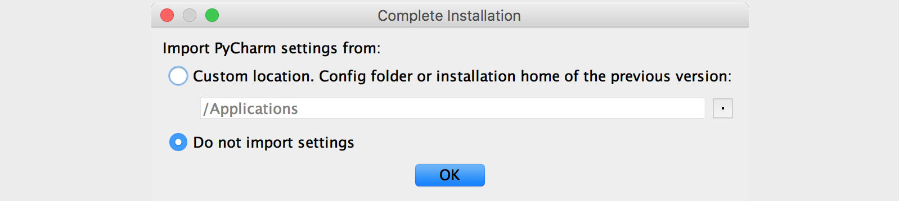
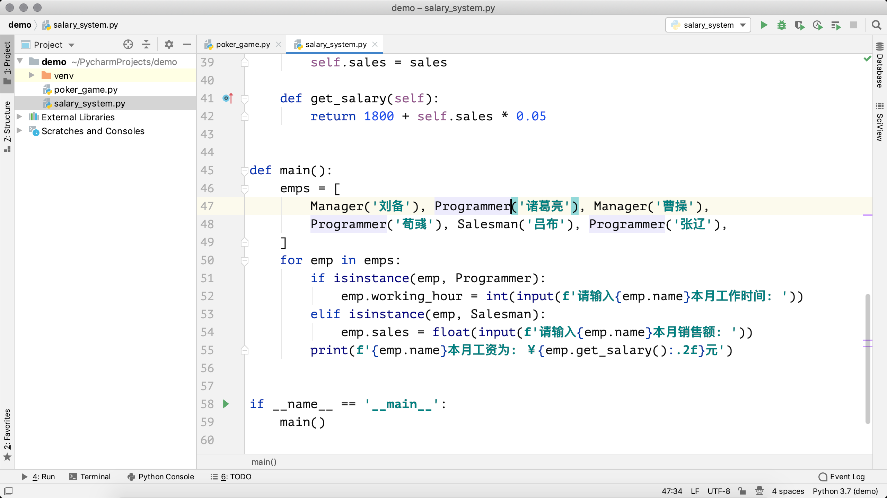

## Play with PyCharm

PyCharm is an integrated development environment developed by JetBrains for professional Python developers. Its biggest advantage is that it can greatly improve the work efficiency of Python developers, and integrates many functions that are very easy to use for developers, including code Debugging, syntax highlighting, code jumping, intellisense, autocompletion, unit testing, version control, and more. In addition, PyCharm also provides support for some advanced features, including support for web development based on the Django framework.

### PyCharm download and installation

The [download link](https://www.jetbrains.com/pycharm/download/) of PyCharm can be found at [JetBrains' official website](<https://www.jetbrains.com/>), there are two The versions available for download are the Community Edition (PyCharm CE) and the Professional Edition (PyCharm Professional). The community edition is released under the Apache license and can be used free of charge; the professional edition is released under a dedicated license and requires a purchase license to use, but new users can try it for 30 days. Obviously, the professional version provides more powerful functions and various support for enterprise-level development, but for beginners, the community version is powerful and easy to use. To install PyCharm, simply run the downloaded installer and click the "Next" button continuously. The following is a screenshot of my installation of PyCharm under Windows system. After the installation is complete, click the "Finish" button to close the installation wizard, and then you can run PyCharm by double-clicking the shortcut on the desktop.

### First-time use settings

When you use PyCharm for the first time, there will be a wizard for importing settings. If you have not used PyCharm before or have not saved the settings, just select "Do not import settings" and go to the next step. The following is my first step in the macOS system. Screenshots when using PyCharm.

The professional version of PyCharm needs to be activated. **It is strongly recommended that you pay the fee to support excellent products when conditions permit**. If you do not need to use it for commercial purposes or do not need to use the advanced functions of PyCharm, we can temporarily choose to try 30 days or use the community version of PyCharm. If you are a student and want to buy PyCharm to use, you can take a look at the [Official Application Guide for Educational Discounts](https://sales.jetbrains.com/hc/zh-cn/articles/207154369). As shown in the figure below, we need to click the "Evaluate" button to try out the professional version of PyCharm.

The next step is to choose a UI theme, which can be selected according to personal preferences. Dark themes are better for eye protection and light-colored themes have better contrast.

The next step is to create a startup script that can run PyCharm in the "Terminal" or "Command Line Prompt". Of course, you can also uncheck it and click the "Next: Featured plugins" button to go to the next link.

Then you can choose which plug-ins need to be installed, we can install nothing for the time being, and then decide when we need it.

Finally, click "Start using PyCharm" in the lower right corner of the above image to start your PyCharm journey.

### Create project with PyCharm

After starting PyCharm, you will come to a welcome page. On the welcome page, we can choose "Create New Project", "Open an existing project" (Open) and "Check out a project from the version control system" (Get from Version Control).

If "Create New Project" is selected to create a new project, a wizard page for creating a project will be displayed. The figure below shows the wizard page of the PyCharm Professional Edition to create a new project. It can be seen that the Professional Edition supports a lot of project types, while the Community Edition can only create pure Python projects (Pure Python), without this series of options.

Next, we need to create a dedicated virtual environment for the project. It is best for each Python project to run in its own dedicated virtual environment, because each project has different requirements for the Python interpreter and third-party libraries, and the virtual environment has different requirements for projects are isolated. In the interface shown in the figure above, we can choose to create a new virtual environment (New environment using Virtualenv), where "Virtualenv" is the tool that PyCharm chooses by default to create a virtual environment, we can just keep this default option.

After the project is created, you can start creating various files to write Python code, as shown in the following figure. On the left is the project browser, you can see the project folder just created and the virtual environment folder. We can right-click on the project, select "New", and select "Python File" to create a Python code file. In the following figure, we have created two Python files, `poker_game.py` and `salary_system.py` . Of course, if you want, you can also use copy and paste to copy the Python code files from other places to the project folder.

Click the right mouse button in the working window to find the "Run" option in the context menu. For example, to run the `salary_system.py` file, the right-click menu will display the "Run 'salary_system'" option. Click this option to run the Python code. The running result can be seen in the window at the bottom of the screen, as shown in the following figure.

### Common operations and shortcut keys

PyCharm provides automatic completion and syntax highlighting for writing Python code, which is also the basic function of PyCharm as an integrated development environment (IDE). The "File" menu of PyCharm has a "Settings" menu item (the "Preferences..." menu item in the "PyCharm" menu on macOS), this menu item will open the settings window, and you can set PyCharm here, as shown below shown.

There is a very useful "Code" menu in PyCharm's menu items. The menu provides options such as automatically generating code, auto-completing code, formatting code, and moving code. These functions are very useful for developers. Everyone You can try to use these menu items or remember their corresponding shortcut keys, for example, on macOS, the shortcut key for the Format Code menu item is `alt+command+L`. In addition to this, the "Refactor" menu is also very useful, it provides some options for refactoring the code. The so-called refactoring is to adjust the structure of the code without changing the result of the code execution, which is also an important skill for senior programmers. There is also a menu worth mentioning is "VCS", VCS is the abbreviation of "Version Control System" (version control system), this menu provides support for code version management. The knowledge of version control will be explained in other courses.

The following table lists some commonly used shortcut keys in PyCharm. Of course, if you want, you can also customize the shortcut keys through the "Keymap" menu item in the settings window. PyCharm itself also has shortcut keys for different operating systems and usage habits. grouping.

| Shortcut keys | Function |
| --------------------------------------------- | --- ----------------------------------- |
| `command + j` | Show available code templates |
| `command + b` | View definitions of functions, classes, and methods |
| `ctrl + space` | Universal code prompt shortcut key, press twice if you can't do it once |
| `command + alt + l` | ​​format code |
| `alt + enter` | Universal code fix shortcut |
| `ctrl + /` | Comment/uncomment code |
| `shift + shift` | Universal search shortcut |
| `command + d` / `command + y` | copy/delete a line of code |
| `command + shift + -` / `command + shift + +` | Collapse/expand all code |
| `F2` | Quickly locate the error code |
| `command+ alt + F7` | View where the specified function, class, method is used |

> **Note**: If you use the default settings of PyCharm under Windows system, you can replace the above `command` key with the `ctrl` key, the only exception is the shortcut key `ctrl + space`, because it is the same as the `ctrl` key. The shortcut keys for switching input methods in the Windows system are conflicting, so there is no corresponding shortcut key by default under the Windows system.