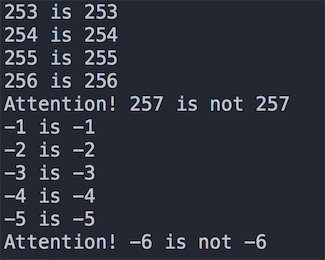
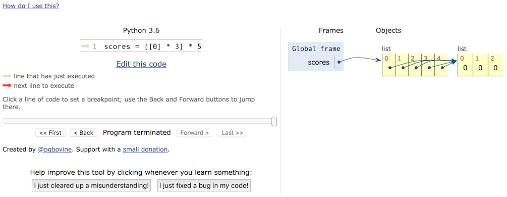
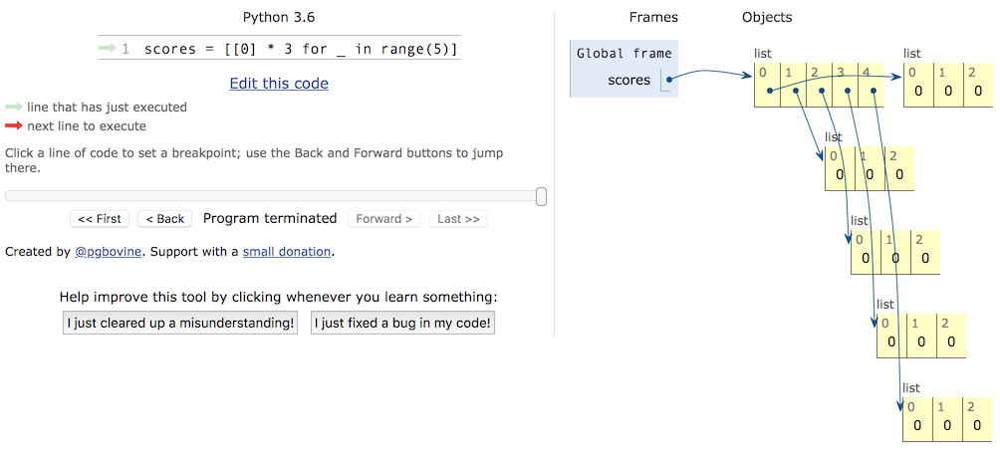

## Those pits we stepped on in those years

### pit 1 - pit for integer comparison

Everything is an object in Python, and integers are also objects. There are two operators `==` and `is` when comparing two integers. The difference between them is:

- `is` compares whether the id values ​​of two integer objects are equal, that is, whether the two references represent the same address in memory.
- `==` compares whether the contents of two integer objects are equal. When using `==`, the `__eq__()` method of the object is actually called.

After knowing the difference between `is` and `==`, we can take a look at the following code to understand the pits of integer comparison in Python. **Take the CPython interpreter as an example**, let's take a look at the following code first .

````Python
def main():
x = y = -1
while True:
x += 1
y += 1
if x is y:
print('%d is %d' % (x, y))
else:
print('Attention! %d is not %d' % (x, y))
break

x = y = 0
while True:
x -= 1
y -= 1
if x is y:
print('%d is %d' % (x, y))
else:
print('Attention! %d is not %d' % (x, y))
break


if __name__ == '__main__':
main()
````

Part of the result of running the above code is shown in the figure below. This result is because CPython caches frequently used integer objects in an object pool called `small_ints` for performance optimization. `small_ints` cached integer values ​​are set to the range `[-5, 256]`, that is, if you use the CPython interpreter, you don't need to recreate `int` objects wherever you refer to these integers, Instead, it refers directly to objects in the cache pool. If the integers are not in that range, two integers are different objects even if they have the same value.



Of course, this pit alone is not worth mentioning. If you understand the above rules, let's take a look at the following code.

````Python
a = 257


def main():
b = 257 # line 6
c = 257 # line 7
print(b is c) # True
print(a is b) # False
print(a is c) # False


if __name__ == "__main__":
main()
````

The execution result of the program has been written on the code with comments. Enough pit! It seems that the values ​​of `a`, `b` and `c` are the same, but the result of the `is` operation is not the same. Why such a result occurs, first let's talk about the code block in the Python program. The so-called code block is the smallest basic execution unit of a program. A single line of code in a module file, a function body, a class, and an interactive command is called a code block. The above code consists of two code blocks, `a = 257` is one code block and the `main` function is another code block. In order to further improve performance, the bottom layer of CPython also makes a setting: for integers whose values ​​are not within the `small_ints` cache range in the same code block, if there is already an integer object with the same value in the same code block, then directly Reference to this object, otherwise create a new `int` object. It should be noted that this rule applies to numeric types, but for strings, the length of the string needs to be considered, which can be proved by itself.
In order to verify the conclusion just now, we can borrow the `dis` module (listening to the name to know that it is the disassembly module) to look at this code from the perspective of bytecode. If you don't understand what bytecode is, you can first read the article ["Talking about the Operating Principles of Python Programs"]((http://www.cnblogs.com/restran/p/4903056.html)). You can first import the `dis` module with `import dis` and modify the code as shown below.

````Python
import dis

dis.dis(main)
````

The execution result of the code is shown in the following figure. It can be seen that lines 6 and 7 of the code, that is, 257 in the `main` function are loaded from the same location, so they are the same object; while the `a` in line 9 of the code is obviously from different places loaded, and therefore refer to a different object.


If you want to dig further into this issue, I recommend you read the article ["The Principle of Python Integer Object Implementation"](https://foofish.net/python_int_implement.html).

### Pit 2 - Pit for nested lists

There is a built-in data type in Python called a list, which is a container that can be used to carry other objects (to be precise, references to other objects). The objects in the list can be called elements of the list. Obviously, we can Treating lists as elements of a list is called a nested list. Nested lists can simulate real tables, matrices, maps for 2D games (such as the Garden of Plants vs. Zombies), chessboards (such as chess, reversi), and more. But be careful when using nested lists, otherwise you may encounter very embarrassing situations, here is a small example.

````Python
names = ['Guan Yu', 'Zhang Fei', 'Zhao Yun', 'Ma Chao', 'Huang Zhong']
subjs = ['Chinese', 'Math', 'English']
scores = [[0] * 3] * 5
for row, name in enumerate(names):
    print('Please enter the grade of %s' % name)
    for col, subj in enumerate(subjs):
        scores[row][col] = float(input(subj + ': '))
        print(scores)
````

We want to enter the grades of 5 students in 3 courses, so we define a list with 5 elements, and each element in the list is a list composed of 3 elements, so the list of a list is exactly the same as a table It is consistent, which is equivalent to 5 rows and 3 columns. Next, we input the grades of each student's 3 courses through a nested for-in loop. After the program is executed, we find that the grades of each student in the three courses are exactly the same, and they are the grades of the student who entered last.

To fill this hole, we must first distinguish the two concepts of object and object reference, and to distinguish these two concepts, we must first talk about the stack and heap in memory. We often hear people say the word "stack", but in fact "heap" and "stack" are two different concepts. As we all know, when a program runs, it needs to occupy some memory space to store data and code, so these memory can be further divided logically. Most programmers who know the underlying language (such as C language) know that the memory that can be used in the program can logically be divided into five parts, according to the address from high to low: stack (stack), heap (heap) , data segment (data segment), read-only data segment (static area) and code segment (code segment). Among them, the stack is used to store local and temporary variables, as well as the data needed to save the scene and restore the scene when the function is called. This part of the memory is automatically allocated when the code block starts to execute, and is automatically released when the code block execution ends, usually by the compiler. Automatic management; the size of the heap is not fixed and can be dynamically allocated and reclaimed, so if there is a large amount of data in the program that needs to be processed, these data are usually placed on the heap. If the heap space is not properly released, it will cause memory leaks. , while programming languages ​​such as Python and Java use garbage collection mechanisms to achieve automatic memory management (automatically reclaim heap space that is no longer used). So in the following code, the variable `a` is not a real object, it is a reference to the object, which is equivalent to recording the address of the object in the heap space, through which we can access the corresponding object; similarly, the variable `b ` is the reference of the list container, it refers to the list container on the heap space, and the list container does not store the real object, it only stores the reference of the object.

 ````Python
a = object()
b = ['apple', 'pitaya', 'grape']
 ````

Knowing this, we can look back at the program just now. When we perform the `[[0] * 3] * 5` operation on the list, we just change the address of the list `[0, 0, 0]` In order to copy, no new list object is created, so although there are 5 elements in the container, these 5 elements refer to the same list object, which can be checked by `id` function `scores[0]` and `scores The address of [1]` is confirmed. So the correct code should be modified as follows.

````Python
names = ['Guan Yu', 'Zhang Fei', 'Zhao Yun', 'Ma Chao', 'Huang Zhong']
subjs = ['Chinese', 'Math', 'English']
scores = [[]] * 5
for row, name in enumerate(names):
    print('Please enter the grade of %s' % name)
    scores[row] = [0] * 3
    for col, subj in enumerate(subjs):
        scores[row][col] = float(input(subj + ': '))
        print(scores)
````

or

````Python
names = ['Guan Yu', 'Zhang Fei', 'Zhao Yun', 'Ma Chao', 'Huang Zhong']
subjs = ['Chinese', 'Math', 'English']
scores = [[0] * 3 for _ in range(5)]
for row, name in enumerate(names):
    print('Please enter the grade of %s' % name)
    scores[row] = [0] * 3
    for col, subj in enumerate(subjs):
        scores[row][col] = float(input(subj + ': '))
        print(scores)
````

If you don't understand the use of memory very well, you can take a look at the code visual execution function provided on the [PythonTutor website](http://www.pythontutor.com/). Through visual execution, we can see how memory is allocated. This avoids the pitfalls you might encounter when using nested lists or copying objects.





### Pit 3 - Pit for access modifiers

Anyone who has done object-oriented programming in Python knows that Python classes provide two access control rights, one is public and the other is private (add a double underscore before the attribute or method). Those who are used to programming languages ​​such as Java or C# know that the properties (data abstraction) in the class are usually private, and the purpose is to protect the data; and the methods (behavioral abstraction) in the class are usually is public because methods are services that objects provide to the outside world. However, Python does not guarantee the privacy of private members from the syntactic level, because it only changes the name of the so-called private members in the class. If you know the naming rules, you can still directly access the private members, please see the following code.

````Python
class Student(object):

    def __init__(self, name, age):
        self.__name = name
        self.__age = age

    def __str__(self):
        return self.__name + ': ' + str(self.__age)


stu = Student('Luo Hao', 38)
print(stu._Student__name)
print(stu._Student__age)
````

Why does Python make such a setting? To paraphrase the well-known adage: "We are all consenting adults here". This sentence expresses a common view of many Python programmers, that is, open is better than closed, and we should be responsible for our own behavior instead of restricting access to data or methods at the language level.

So in Python we really don't need to assign attributes in classes or