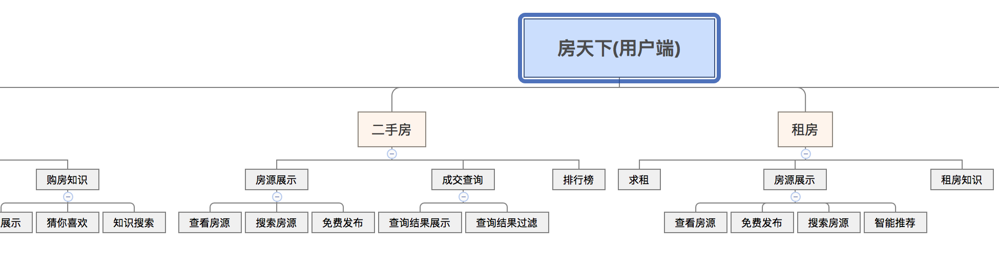

##Python - 100 days from novice to master


>
> **Description**: From the launch of the project to the time it got 8w+ stars, I have always received feedback that the basic part (the content of the first 15 days) is difficult for beginners, and it is recommended to have a supporting video to explain it. The content of the basic part was recently remade into a project called ["Python-Core-50-Courses"](<https://github.com/jackfrued/Python-Core-50-Courses>), **with This part of the content has been rewritten in a more simple and popular way with a video explanation**, and beginners can pay attention to this new project. If you need **Python basic video**, you can search for ["Quick Start with Python Zero Basics"] (https://www.bilibili.com/video/BV1FT4y1R7sz) on "Station B", this set of videos is when I lecture The recorded video quality is acceptable and the sound quality is average, but it should be helpful for beginners. You are welcome to leave a message, comment, and post a bullet screen. After learning, friends who feel that they have gained something can "one-click three connections" to support the UP master (Qianfeng Python). If domestic users are slow to access GitHub, they can follow my **zhihu account [Python-Jack](https://www.zhihu.com/people/jackfrued)**, the above ["Learn Python from scratch] ”](<https://zhuanlan.zhihu.com/c_1216656665569013760>) The column is more suitable for beginners, and other columns are also being continuously created and updated. You are welcome to pay attention and like and comment.

>
> Creation is not easy, thank you for your support, these money will not be used for personal consumption (for example: buying coffee), but will be donated to those in need through platforms such as Tencent Public Welfare, Meituan Public Welfare, Shuidichou ([Click]( ./changelog.md) for donations). If you need to join the QQ learning group, you can scan the QR code below, add one to the three groups, and do not enter the group repeatedly. The learning group will provide you with **learning resources** and **question answers**. If there are **Python experience classes** and **industry open classes**, you will be notified in advance in the group, and you are welcome to join.
>
> The "Day80~90" part of the project is still under creation, because the author usually can't squeeze too much time to write the document, so the update speed is relatively slow, thank you for your understanding。


### Python应用领域和职业发展分析

Simply put, Python is an "elegant", "clear" and "simple" programming language.

 - Low learning curve, even non-professionals can get started
 - Open source system with a strong ecosystem
 - Interpreted language, perfect platform portability
 - Dynamically typed language that supports object-oriented and functional programming
 - The code is standardized and highly readable

Python is useful in the following areas.

 - Backend Development - Python/Java/Go/PHP
 - DevOps - Python/Shell/Ruby
 - Data Acquisition - Python / C++ / Java
 - Quantitative Trading - Python / C++ / R
 - Data Science - Python/R/Julia/Matlab
 - Machine Learning - Python/R/C++/Julia
 - Automated Testing - Python/Shell

As a Python developer, depending on your personal preferences and career planning, you can choose from a lot of employment fields.

- Python back-end development engineer (server, cloud platform, data interface)
- Python operation and maintenance engineer (automated operation and maintenance, SRE, DevOps)
- Python data analyst (data analysis, business intelligence, digital operations)
- Python data mining engineer (machine learning, deep learning, algorithm expert)
- Python crawler engineer
- Python test engineer (automated testing, test development)

> **Note**: At present, **data analysis and data mining are very popular directions**, because both the Internet industry and traditional industries have accumulated a large amount of data, and all walks of life need data analysts to More business value is found in some data, so as to provide data support for enterprise decision-making, which is the so-called data-driven decision-making.

A few suggestions for beginners:

- Make English as your working language.
- Practice makes perfect.
- All experience comes from mistakes.
- Don't be one of the leeches.
- Either outstanding or out.

### Day01~15 - [Python Language Basics](./Day01-15)

#### Day01 - [Introduction to Python](./Day01-15/01.Introduction to Python.md)

- Introduction to Python - History of Python / Advantages and Disadvantages of Python / Application Areas of Python
- Build programming environment - Windows environment / Linux environment / MacOS environment
- Run Python program from terminal - Hello, world / `print` function / run program
- Using IDLE - Interactive Environment (REPL) / Writing Multiple Lines of Code / Running Programs / Exiting IDLE
- Comments - The role of comments / single-line comments / multi-line comments

#### Day02 - [language-element](./Day01-15/02.language-element.md)

- Programs and Bases - Instructions and Programs / Von Neumann Machines / Binary and Decimal / Octal and Hexadecimal
- Variables and Types - Naming of Variables / Use of Variables / `input` Function / Checking Variable Types / Type Conversion
- Numbers and Strings - Integer / Float / Complex / String / Basic String Operations / Character Encoding
- Operators - Mathematical Operators / Assignment Operators / Comparison Operators / Logical Operators / Identity Operators / Precedence of Operators
- Application case - Convert Fahrenheit to Celsius / Enter the radius of a circle to calculate the perimeter and area / Enter the year to determine whether it is a leap year
#### Day03 - [branch structure](./Day01-15/03.branch structure.md)

- Application scenarios of branch structure - conditional / indentation / code block / flowchart
- if statement - simple `if` / `if`-`else` structure / `if`-`elif`-`else` structure / nested `if`
- Application Cases - User Authentication / Swap between Imperial and Metric Units / Rolling Dice to Decide What to Do / Converting Percentiles to Grades / Evaluating Piecewise Functions / Entering the Lengths of Three Sides and Calculating Perimeter and Area if They Can Form a Triangle

#### Day04 - [loop structure](./Day01-15/04.loop structure.md)

- Application scenarios of loop structure - conditional / indentation / code block / flowchart
- while loop - basic structure / `break` statement / `continue` statement
- for loops - basic structure / `range` type / branch structure in loops / nested loops / early termination of the program
- Application Cases - 1~100 Summation / Judging Prime Numbers / Number Guessing Game / Printing Nine-Nine Tables / Printing Triangle Patterns / Monkeys Eat Peach / Hundred Money Hundred Chickens

#### Day05 - [Constructor Logic](./Day01-15/05.ConstructorLogic.md)

- Classic case: Daffodil number / Hundred Money Hundred Chicken / Craps gambling game
- Exercise questions: Fibonacci sequence / perfect numbers / prime numbers

#### Day06 - [Use of Functions and Modules](./Day01-15/06. Use of Functions and Modules.md)

- The role of functions - Bad code smells / Wrapping function modules with functions
- define function - `def` keyword / function name / parameter list / `return` statement / call custom function
- Calling functions - Python built-in functions / importing modules and functions
- Arguments to functions - Default Arguments / Variable Arguments / Keyword Arguments / Named Keyword Arguments
- return value of function - no return value / return single value / return multiple values
- Scope Issues - Local Scope / Nested Scope / Global Scope / Built-in Scope / Scope Related Keywords
- Managing functions with modules - Concept of modules / Managing functions with custom modules / What happens when there is a naming conflict (same module and different modules)

#### Day07 - [Strings and Common Data Structures](./Day01-15/07. Strings and Common Data Structures.md)

- String usage - Length calculation / Subscript operation / Slicing / Common methods
- Basic usage of lists - Defining lists / Accessing elements with the following table / Subscript out of bounds / Adding elements / Deleting elements / Modifying elements / Slicing / Looping
- List common operations - join/copy (copy elements and copy arrays)/length/sort/reverse/find
- Generate lists - Use `range` to create lists of numbers / generate expressions / generators
- Use of tuples - Defining tuples / working with values ​​in tuples / modifying tuple variables / tuple and list conversions
- Basic usage of sets - difference between sets and lists / create a set / add elements / delete elements / clear
- Common set operations - Intersection / Union / Difference / Symmetric difference / Subset / Superset
- Basic usage of dictionary - Features of dictionary / create dictionary / add element / delete element / get value / clear
- Common dictionary operations - `keys` method / `values` method / `items` method / `setdefault` method
- Basic Exercises - Marquee Effect / Find the Maximum Element in a List / Average Score of Statistical Test Scores / Fibonacci Sequence / Yang Hui's Triangle
- Comprehensive case - two-color ball selection / tic-tac-toe

#### Day08 - [Object-Oriented Programming Fundamentals](./Day01-15/08.Object-Oriented Programming Fundamentals.md)

- Classes and Objects - What is a Class / What is an Object / Object Oriented Other Related Concepts
- Defining classes - basic structure / properties and methods / constructor / destructor / `__str__` method
- Working with Objects - Creating Objects / Sending Messages to Objects
- Four Pillars of Object Orientation - Abstraction / Encapsulation / Inheritance / Polymorphism
- Basic Exercises - Define Student Class / Define Clock Class / Define Graphics Class / Define Car Class

#### Day09 - [Object-Oriented Advancement](./Day01-15/09. Object-Oriented Advancement.md)

- Attributes - Class Attributes / Instance Attributes / Attribute Accessors / Attribute Modifiers / Attribute Deleters / Using `__slots__`
- methods in classes - instance methods / class methods / static methods
- Operator overloading - `__add__` / `__sub__` / `__or__` / `__getitem__` / `__setitem__` / `__len__` / `__repr__` / `__gt__` / `__lt__` / `__le__` / `__ge__` / `__eq__ ` / `__ne__` / `__contains__`
- Relationship between classes (objects) - Association / Inheritance / Dependency
- Inheritance and Polymorphism - What is Inheritance / Syntax of Inheritance / Calling Parent Class Methods / Method Overriding / Type Decision / Multiple Inheritance / Diamond Inheritance (Diamond Inheritance) and C3 Algorithm
- Comprehensive Case - Salary Settlement System / Book Automatic Discount System / Custom Score Class

#### Day10 - [GUI & Game Development](./Day01-15/10.GUI & Game Development.md)

- Develop GUI programs using `tkinter`
- Develop game applications using the `pygame` third-party library
- "Big Ball Eats Small Ball" game

#### Day11 - [Files and Exceptions](./Day01-15/11.Files and Exceptions.md)

- read file - read entire file / read line by line / file path
- write file - overwrite write / append write / text file / binary file
- Exception Handling - The Importance of Exception Mechanisms / `try`-`except` block / `else` block / `finally` block / Built-in exception types / Exception stack / `raise` statement
- Data Persistence - CSV File Overview / Application of `csv` Module / JSON Data Format / Application of `json` Module

#### Day12 - [string and regex](./Day01-15/12.string and regex.md)

- Advanced String Operations - Escape Characters / Raw Strings / Multi-Line Strings / `in` and `not in` Operators / `is_xxx` Methods / `join` and `split` Methods / `strip` Related Methods / `pyperclip` module / immutable and mutable strings / use of `StringIO`
- Getting Started with Regular Expressions - The Role of Regular Expressions / Metacharacters / Escapes / Quantifiers / Grouping / Zero Width Assertion / Greedy and Lazy Matching / Using the `re` module to implement regular expression operations (match, search, replace, capture)
- Using regular expressions - `re` module/ `compile` function/ `group` and `groups` methods/ `match` method/ `search` method/ `findall` and `finditer` methods/ `sub` and `subn `method/`split` method
- Use Case - Validating Input Strings Using Regular Expressions

#### Day13 - [Process and Thread](./Day01-15/13. Process and Thread.md)

- The concept of process and thread - what is a process / what is a thread / application scenarios of multi-threading
- Using processes - `fork` function / `multiprocessing` module / process pool / interprocess communication
- Using threads - `threading` module / `Thread` class / `RLock` class / `Condition` class / Thread pool

#### Day14 - [Introduction to Network Programming and Network Application Development](./Day01-15/14. Introduction to Network Programming and Network Application Development.md)

- Fundamentals of Computer Networks - History of Computer Networks / "TCP-IP" Model / IP Addresses / Ports / Protocols / Other Related Concepts
- Web Application Mode - "Client-Server" Mode / "Browser-Server" Mode
- Access network resources based on HTTP protocol - Network API overview / Access URL / `requests` tripartite library / Parse JSON format data
- Python network programming - concept of sockets / `socket` module / `socket` function / create a TCP server / create a TCP client / create a UDP server / create a UDP client
- Email - SMTP protocol / POP3 protocol / IMAP protocol / `smtplib` module / `poplib` module / `imaplib` module
- SMS Service - Invoke SMS Gateway

#### Day15 - [Image and Document Processing](./Day01-15/15.Image and Office Document Processing.md)

- Process images with Pillow - Image reading/writing/image synthesis/geometric transformation/color transformation/filter effect
- Read and write Word documents - Text content processing / paragraph / header and footer / style processing
- Read and write Excel files - `xlrd` / `xlwt` / `openpyxl`

### Day16~Day20 - [Advanced Python language](./Day16-20/16-20.Advanced Python language.md)

- Common data structures
- Advanced Usage of Functions - "First Class Citizens" / Higher Order Functions / Lambda Functions / Scope and Closures / Decorators
- Advanced Object-Oriented Knowledge - "Three Pillars" / Relationship Between Classes / Garbage Collection / Magic Properties and Methods / Mixins / Metaclasses / Object-Oriented Design Principles / GoF Design Patterns
- Iterators and Generators - Related Magic Methods / Two Ways to Create Generators /
- Concurrency and Asynchronous Programming - Multithreading / Multiprocessing / Asynchronous IO / `async` and `awai`t

### Day21~30 - [Introduction to Web Front End](./Day21-30/21-30.Web Front End Overview.md)

- Host page content with HTML tags
- Render the page with CSS
- Handle interactive behavior with JavaScript
- Getting started with jQuery and improving
- Getting Started with Vue.js
- Use of Elements
- Use of Bootstrap

### Day31~35 - [Play with Linux operating system](./Day31-35/31-35. Play with Linux operating system.md)

- Operating system development history and Linux overview
- Linux basic commands
- Utilities in Linux
- Linux file system
- Application of Vim editor
- Environment variables and Shell programming
- Software installation and service configuration
- Network access and management
- other related content

### Day36~40 - [Database Basic and Advanced](./Day36-40)

- Overview of relational databases
- MySQL installation and usage
- Use of SQL
- DDL - Data Definition Language - `create` / `drop` / `alter`
- DML - Data Manipulation Language - `insert` / `delete` / `update`
- DQL - Data Query Language - `select`
- DCL - Data Control Language - `grant` / `revoke`
- MySQL new features
- Application of window functions
- JSON data type
- related information
- Data integrity and consistency
- Views, functions, procedures, triggers
- Transactions and locks
- Execution plan and index
- Paradigm theory and anti-paradigm design
- Operate MySQL in Python

### Day41~55 - [Practical Django](./Day41-55)

#### Day41 - [Django Quick Start](./Day41-55/41.Django Quick Start.md)

- Web application working mechanism
- HTTP requests and responses
- Django framework overview
- Quick start in 5 minutes

#### Day42 - [deep-model](./Day41-55/42.deep-model.md)

- Relational database configuration
- Use ORM to complete CRUD operations on models
- Manage the use of the backend
- Django Model Best Practices
- Model Definition Reference

#### Day43 - [Static Resources and Ajax Requests](./Day41-55/43. Static Resources and Ajax Requests.md)

- Load static resources
- Ajax overview
- Implement voting function with Ajax

#### Day44 - [Cookie and Session](./Day41-55/44.Cookie and Session.md)

- Implement user tracking
- The relationship between cookies and sessions
- Django framework support for session
- cookie read and write operations in view functions

#### Day45 - [Reports and Logs](./Day41-55/45.Make Reports.md)

- Modify response headers via `HttpResponse`
- Use `StreamingHttpResponse` to handle large files
- Use `xlwt` to generate Excel reports
- Generate PDF reports using `reportlab`
- Generate front-end charts using ECharts

#### Day46 - [Log and Debug Toolbar](./Day41-55/46.Log and Debug Toolbar.md)

- Configuration log
- Configure Django-Debug-Toolbar
- Optimize ORM code

#### Day47 - [Application of Middleware](./Day41-55/47.Application of Middleware.md)

- what is middleware
- Middleware built into the Django framework
- Custom middleware and its application scenarios

#### Day48 - [Introduction to Front-end and Back-end Separation Development](./Day41-55/48. Front-end and Back-end Separation Development Introduction.md)

- Returns data in JSON format
- Render the page with Vue.js

#### Day49 - [Introduction to RESTful Architecture and DRF](./Day41-55/49.Introduction to RESTful Architecture and DRF.md)

#### Day50 - [RESTful Architecture and DRF Advancement](./Day41-55/50.RESTful Architecture and DRF Advancement.md)

#### Day51 - [use cache](./Day41-55/51.use cache.md)

- The first law of website optimization

- Use Redis to provide caching services in Django projects
- read and write cache in view function
- Implement page caching using decorators
- Provide caching service for data interface

#### Day52 - [Access to the third party platform](./Day41-55/52. Access to the third party platform.md)

- File upload form controls and image file preview
- How the server side handles uploaded files

#### Day53 - [Asynchronous tasks and scheduled tasks](./Day41-55/53. Asynchronous tasks and scheduled tasks.md)

- The Second Law of Website Optimization
- Configure the message queue service
- Use Celery to achieve task asynchrony in the project
- Use Celery to implement scheduled tasks in the project

#### Day54 - [unit test](./Day41-55/54.unittest.md)

#### Day55 - [Project Online](./Day41-55/55.Project Online.md)

- Unit testing in Python
- Django framework support for unit testing
- Use a version control system
- Configure and use uWSGI
- Dynamic and static separation and Nginx configuration
- Configure HTTPS
- Configure domain name resolution

### Day56~60 - [Develop data interface with FastAPI](./Day56-60/56-60.Develop data interface with FastAPI.md)

- Get started with FastAPI in five minutes
- request and response
- Access relational database
- Dependency Injection
- Middleware
- Asynchronous
- Virtualized deployment (Docker)
- Project actual combat: vehicle violation inquiry project

### Day61~65 - [Crawler Development](./Day61-65)

#### Day61 - [Overview of Network Data Collection](./Day61-65/61.Overview of Network Data Collection.md)

- The concept of web crawler and its application areas
- Discussion on the legality of web crawlers
- Development of related tools for web crawlers
- The composition of a crawler

#### Day62 - Data scraping and parsing

- [Use the `requests` tripartite library to achieve data capture](./Day61-65/62. Get network resources with Python-1.md)
- [Three ways of page parsing](./Day61-65/62. Parsing HTML pages with Python-2.md)
    - Regular expression parsing
    - XPath parsing
    - CSS selector parsing


#### Day63 - Concurrent Programming in Python

- [Multithreading](./Day61-65/63.Concurrent Programming in Python-1.md)
- [Multiprocessing](./Day61-65/63.Concurrent Programming in Python-2.md)
- [Asynchronous I/O](./Day61-65/63.Concurrent Programming in Python-3.md)

#### Day64 - [Use Selenium to crawl web dynamic content](./Day61-65/64. Use Selenium to crawl webpage dynamic content.md)

#### Day65 - [Introduction to Crawler Framework Scrapy](./Day61-65/65. Introduction to Crawler Framework Scrapy.md)

### Day66~80 - [Data Analysis](./Day66-80)

#### Day66 - [Data Analysis Overview](./Day66-80/66.Data Analysis Overview.md)

#### Day67 - [Environment Preparation](./Day66-80/67.Environment Preparation.md)

#### Day68 - [NumPy-Application-1](./Day66-80/68.NumPy-Application-1.md)

#### Day69 - [NumPy-Application-2](./Day66-80/69.NumPy-Application-2.md)

#### Day70 - [Pandas Application-1](./Day66-80/70.Pandas Application-1.md)

#### Day71 - [Pandas Application-2](./Day66-80/71.Pandas Application-2.md)

#### Day72 - [Pandas Application-3](./Day66-80/72.Pandas Application-3.md)

#### Day73 - [Pandas Application-4](./Day66-80/73.Pandas Application-4.md)

#### Day74 - [Pandas Application-5](./Day66-80/74.Pandas Application-5.md)

#### Day75 - [DataVisualization](./Day66-80/75.DataVisualization.md)

#### Day76 - [Probability Basics](./Day66-80/76.ProbabilityBasics.md)

#### Day77 - [correlation and regression](./Day66-80/77.correlation and regression.md)

#### Day78 - [ANOVA and Parameter Estimation](./Day66-80/78.ANOVA and Parameter Estimation.md)

#### Day79 - [Clustering and Dimensionality Reduction](./Day66-80/79.Clustering and Dimensionality Reduction.md)

#### Day80 - [Data Analysis Methodology](./Day66-80/80.Data Analysis Methodology.md)

### Day81~90 - [Machine Learning and Deep Learning](./Day81-90)

#### Day81 - [Machine Learning Fundamentals](./Day81-90/81.Machine Learning Fundamentals.md)

#### Day82 - [k nearest neighbor classification](./Day81-90/82.k nearest neighbor classification.md)

#### Day83 - [Decision Tree](./Day81-90/83.DecisionTree.md)

#### Day84 - [Bayesian Classification](./Day81-90/84.Bayesian Classification.md)

#### Day85 - [SVM](./Day81-90/85.SVM.md)

#### Day86 - [K-MeansClustering](./Day81-90/86.K-MeansClustering.md)

#### Day87 - [Regression Analysis](./Day81-90/87.Regression Analysis.md)

#### Day88 - [Introduction to Deep Learning](./Day81-90/88.Introduction to Deep Learning.md)

#### Day89 - [PyTorch Overview](./Day81-90/89.PyTorch Overview.md)

#### Day90 - [PyTorch combat](./Day81-90/90.PyTorch combat.md)

### Day91~100 - [Team Project Development](./Day91-100)

#### Day 91: [Problems and Solutions for Team Project Development](./Day91-100/91. Problems and Solutions for Team Project Development.md)

1. Software Process Model
   - Classical Process Model (Waterfall Model)
     - Feasibility analysis (do or not do research), output "Feasibility Analysis Report".
     - Requirement analysis (research what to do), output "Requirements Specification" and product interface prototype diagram.
     - Outline design and detailed design, output conceptual model diagram (ER diagram), physical model diagram, class diagram, sequence diagram, etc.
     - Coding/Testing.
     - Go live/maintenance.

     The biggest disadvantage of the waterfall model is that it cannot embrace changes in requirements. The product can only be seen after the entire process is completed, and team morale is low.
   - Agile Development (Scrum) - Product Owner, Scrum Master, Developer - Sprint
     - Backlog of the product (user stories, product prototypes).
     - Planning meeting (assessment and budget).
     - Daily development (standup meetings, Pomodoro Technique, pair programming, test first, code refactoring...).
     - Bug fixes (problem description, steps to reproduce, testers, assignees).
     - release version.
     - Review meeting (Showcase, users need to participate).
     - Retrospective meeting (a summary of the current iteration cycle).

> Supplement: Manifesto on Agile Software Development
     >
     > - **Individuals and Interactions** over Processes and Tools
     > - **working software** above well documented
     > - **Customer cooperation** over contract negotiation
     > - **responding to changes** higher than following a plan

     

     > Roles: product owner (who decides what to do, who can decide what needs to be done), team leader (solving various problems, focusing on how to work better, shielding external influences on the development team), development team (project executives) , specifically developers and testers).

     > Preparations: business case and funding, contracts, vision, initial product requirements, initial release plans, stakes, team building.

     > Agile teams are typically 8-10 people.

     > Workload estimation: Quantify the development tasks, including prototype, logo design, UI design, front-end development, etc., try to decompose each work into the minimum task volume. The minimum task volume standard is that the working time should not exceed two days, and then estimate the overall project time. Post each task on the board, which is divided into three parts: to do (to be completed), in progress (in progress) and done (completed).
2. Project team formation

   - Team composition and roles

     > Description: Thank you, Ms. Fu Xiangying, for helping me draw the following beautiful company organizational chart.

     

   - Programming specs and code reviews (`flake8`, `pylint`)

     

   - Some "conventions" in Python (please refer to ["Python Conventions - How to Write Pythonic Code"](Python Conventions.md))

   - Reasons affecting code readability:

     - Too few or no code comments
     - Code breaks language best practices
     - Anti-pattern programming (spaghetti code, copy-paste programming, conceited programming, …)

3. Introduction to team development tools
   - Version Control: Git, Mercury
   - Defect management: [Gitlab](https://about.gitlab.com/), [Redmine](http://www.redmine.org.cn/)
   - Agile closed-loop tools: [Zen Tao](https://www.zentao.net/), [JIRA](https://www.atlassian.com/software/jira/features)
   - Continuous Integration: [Jenkins](https://jenkins.io/), [Travis-CI](https://travis-ci.org/)

   Please refer to ["Problems and Solutions for Team Project Development"](Day91-100/91. Problems and Solutions for Team Project Development.md).

##### Project topic selection and business understanding

1. Topic selection range setting

   - CMS (Client): News aggregation website, Q&A/sharing community, movie review/book review website, etc.
   - MIS (user terminal + management terminal): KMS, KPI assessment system, HRS, CRM system, supply chain system, warehouse management system, etc.

   - App background (management terminal + data interface): second-hand transactions, newspapers and magazines, niche e-commerce, news, tourism, social networking, reading, etc.
   - Other types: own industry background and work experience, business is easy to understand and control.

2. Requirements understanding, module division and task assignment

   - Requirements Understanding: Brainstorming and Competitive Analysis.
   - Module division: draw a mind map (XMind), each module is a branch node, and each specific function is a leaf node (expressed by a verb), it is necessary to ensure that each leaf node cannot reproduce new nodes, and determine each The importance, priority and workload of leaf nodes.
   - Task Assignment: Assign tasks to each team member by the project leader based on the metrics above.

   
3. Develop project schedule (updated daily)

   | Module | Function | Person | Status | Complete | Work | Planned Start | Actual Start | Planned End | Actual End | Comments |
   | ---- | -------- | ------ | -------- | ---- | ---- | -------- | -------- | -------- | -------- | ---------------- |
   | Comments | Add Comments | King Sledgehammer | Ongoing | 50% | 4 | 2018/8/7 | | 2018/8/7 | | |
   | | Delete comments | Wang Dahui | Waiting | 0% | 2 | 2018/8/7 | | 2018/8/7 | | |
   | | View comments | Bai Yuanfang | Ongoing | 20% | 4 | 2018/8/7 | | 2018/8/7 | | Code review required |
   | | Comment voting | Bai Yuanfang | Waiting | 0% | 4 | 2018/8/8 | | 2018/8/8 | | |
4. OOAD and database design

  - UML (Unified Modeling Language) class diagram

    

  - Create a table through a model (forward engineering), for example, in a Django project, you can create a two-dimensional table with the following command.

    ```Shell
    python manage.py makemigrations app
    python manage.py migrate
    ````

  - Use PowerDesigner to draw physical model diagrams.

    

  - Create a model from a data table (reverse-engineering), for example, in a Django project, the model can be generated by the following command.

    ```Shell
    python manage.py inspectdb > app/models.py
    ````

#### Day 92: [Detailed explanation of Docker container](./Day91-100/92.Detailed explanation of Docker container.md)

1. Introduction to Docker
2. Install Docker
3. Use Docker to create containers (Nginx, MySQL, Redis, Gitlab, Jenkins)
4. Build Docker image (Dockerfile writing and related instructions)
5. Docker-compose
6. Cluster Management (Kubernetes)

#### Day 93: [MySQL performance optimization](./Day91-100/93.MySQL performance optimization.md)

#### Day 94: [Network API Interface Design](./Day91-100/94.Network API Interface Design.md)

#### Day 95: [Developing Commercial Projects with Django](./Day91-100/95.Developing Commercial Projects with Django.md)

##### Common issues in project development

1. Database configuration (multi-database, master-slave replication, database routing)
2. Cache configuration (partition cache, key settings, timeout settings, master-slave replication, failure recovery (sentry))
3. Log configuration
4. Analysis and debugging (Django-Debug-ToolBar)
5. Easy-to-use Python modules (date calculation, image processing, data encryption, third-party API)

##### REST API Design

1. RESTful architecture
   - [Understanding RESTful Architecture](http://www.ruanyifeng.com/blog/2011/09/restful.html)
   - [RESTful API Design Guide](http://www.ruanyifeng.com/blog/2014/05/restful_api.html)
   - [RESTful API Best Practices](http://www.ruanyifeng.com/blog/2018/10/restful-api-best-practices.html)
2. Writing API interface documentation
   - [RAP2](http://rap2.taobao.org/)
   - [YAPI](http://yapi.demo.qunar.com/)
3. Application of [django-REST-framework](https://www.django-rest-framework.org/)

##### Analysis of the key and difficult points in the project

1. Use cache to relieve database pressure - Redis
2. Use message queues for decoupling and peak clipping - Celery + RabbitMQ
#### Day 96: [Software Testing and Automation Testing](Day91-100/96.Software Testing and Automation Testing.md)

##### unit test

1. Types of tests
2. Writing unit tests (`unittest`, `pytest`, `nose2`, `tox`, `ddt`, …)
3. Test coverage (`coverage`)

##### Django project deployment

1. Preparations before deployment
   - key settings (SECRET_KEY / DEBUG / ALLOWED_HOSTS / cache / database)
   - HTTPS/CSRF_COOKIE_SECUR/SESSION_COOKIE_SECURE
   - Log related configuration
2. Review of common Linux commands
3. Installation and configuration of Linux common services
4. Use of uWSGI/Gunicorn and Nginx
   - Comparison of Gunicorn and uWSGI
     - For simple applications that don't require a lot of customization, Gunicorn is a good choice, uWSGI has a much steeper learning curve than Gunicorn, and Gunicorn's default parameters are already suitable for most applications.
     - uWSGI supports heterogeneous deployment.
     - Since Nginx itself supports uWSGI, Nginx and uWSGI are usually bundled and deployed online, and uWSGI is a fully functional and highly customized WSGI middleware.
     - In terms of performance, Gunicorn and uWSGI are actually equivalent.
5. Use virtualization technology (Docker) to deploy test environment and production environment

##### Performance Testing

1. Use of AB
2. Use of SQLslap
3. Use of sysbench

##### automated test

1. Automated Testing with Shell and Python
2. Use Selenium to implement automated testing
   -Selenium IDE
   -Selenium WebDriver
   -Selenium Remote Control
3. Test tool Robot Framework introduction

#### Day 97: [Analysis of technical points of e-commerce website] (./Day91-100/97. Analysis of technical points of e-commerce website.md)

#### Day 98: [Project deployment and performance tuning](./Day91-100/98.Project deployment and performance tuning.md)

1. MySQL database tuning
2. Web server performance optimization
   - Nginx load balancing configuration
   - Keepalived achieves high availability
3. Code performance tuning
   - Multithreading
   - Asynchronous
4. Static resource access optimization
   - Cloud storage
   - CDN

#### Day 99: [Common Questions in Interview](./Day91-100/99.Common Questions in Interview.md)

#### Day 100: [Python Interview Question Record](./Day91-100/100.Python Interview Question Record.md)

